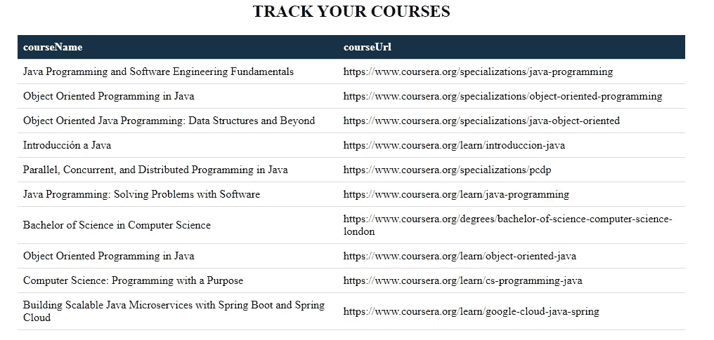

# 使用 Python 2020 的 Coursera 网络抓取课程

> 原文：<https://medium.com/analytics-vidhya/web-mining-courses-from-coursera-using-python-2020-12273d5409b6?source=collection_archive---------11----------------------->

你是 coursera 的固定用户吗？如果是，那么你可能会喜欢这个 python 程序。你可以在类似的课程网站上使用相同的程序，如 edx，alison，udemy 等。

那么，我们开始吧。如果你有一些使用 python 和 BeautifulSoup 的经验，那么你已经拥有了你需要的一切，所以自己动手吧。没有的，跟着走。

为您的操作系统安装 python。之后，安装请求和优化如下:

之后，让我们导入模块，并创建一个变量来存储 url:

> 来自 bs4 import beautiful group
> 的进口请求
> 
> base URL = " https://www . coursera . org "

现在，从 cli 输入或初始化它:

> skillset = input()。拆分(" ")

现在，我们将看到搜索输入的查询 url:

*例子:java*

图 1 .课程网站中的搜索栏

该 url 可能如下所示:

图 2 .检查 url 以查找模式

所以，重要的部分是“query=”部分之后的。因此，我们将在这里追加用户的输入。

> skillset= "%20 "。join(输入()。拆分(" ")
> 
> courseraUrl = "[https://www.coursera.org/search?query=](https://www.coursera.org/search?query=)"+技能组合

现在，我们将向一个 web 页面发出一个请求，之后我们将通过该模块运行 page.text 文档，为我们提供一个 BeautifulSoup 对象(*即来自这个解析页面的解析树)*，我们将通过在 html 上运行 Python 的内置 html.parser 来获得该对象。

> page = requests.get(courseraUrl)
> 
> soup = BeautifulSoup(page.text，' html.parser ')

图 3 .课程头 h2 标签的复制类

所以，我们将使用*beautiful soup . object . find _ all()*函数来获取所有的课程名称。以下课程的课程名称相同:

> found = soup.find("h2 "，{ ' class ':" color-primary-text card-title headline-1-text " })

你可以做类似的事情来获得课程的链接，就像这样:

图 4 .课程 url 标签的复制类

> foundU= soup.find_all("a "，{ ' class ':" RC-desktop search card anchor-wrapper " })

现在我们将使用一个循环并打印所有的名称和 URL:

> 对于 found_all 中的课程名称:
> print(courseName.text)
> 
> 对于 foundU_all 中的 course URLs:
> toUrl = course URLs . get(' href ')
> course URL = base URL+toUrl
> print(course URL)

查看输出:

图 5\. CLI 输出

它又丑又没用，对吗？嗯，我使用 python 中的 csv 模块将这个输出转移到一个 csv 文件中。

> 导入 csv
> 
> 使用 open('course.csv '，' w+'，newline= ' ')作为文件:
> 
> myFields = ['courseName '，' courseUrl']
> writer = csv。DictWriter(file，field names = my fields)
> writer . write header()
> 
> for I in range(len(found _ all)):
> 
> # for course URL
> toUrl = foundU _ all[I]。get(' href ')
> course URL = base URL+toUrl
> 
> #将其存储在字典课程名称->课程 Url 中
> 
> 过程[发现所有[我]。text] = courseUrl
> 
> writer . writerow({ ' course name ':found _ all[I])。text，' courseUrl': courseUrl})

输出将如下所示:

图 6 . course . CSV 文件的输出

然后我写了一个 html 文件来把它转换成 HTML 表格。

图 7 . html 文件的输出

我这个程序的 github 链接: [github](https://github.com/rahulbhatt1899/webMineCourses)

感谢阅读:)