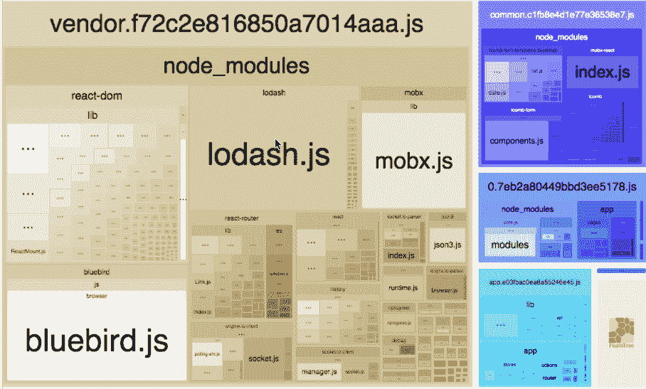
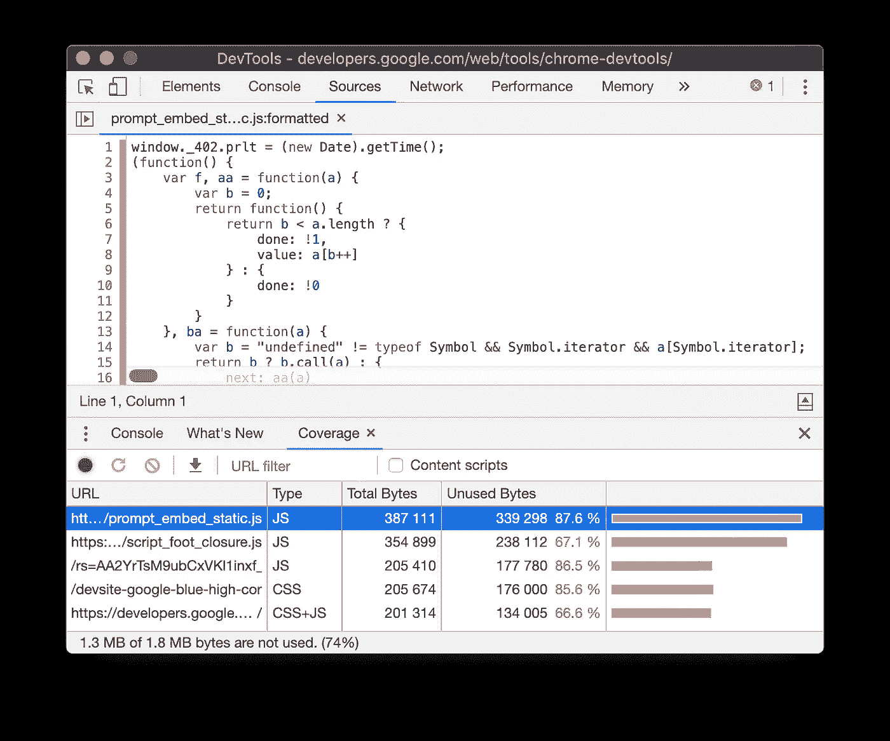
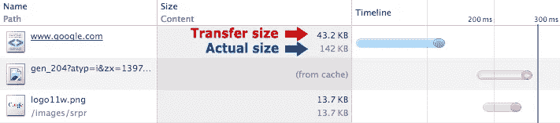
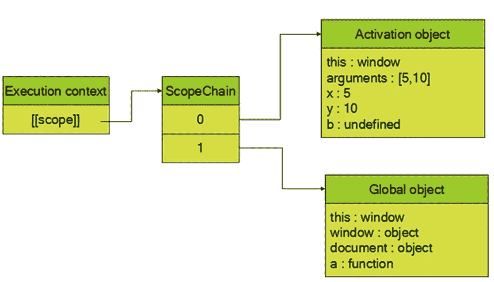

# 网络表现:一种慢性偏头痛

> 原文：<https://medium.com/analytics-vidhya/web-performance-a-chronic-migraine-f3afc703ad3f?source=collection_archive---------28----------------------->

如果不尽快解决，Web 性能是一个永无止境的问题。我是通过一次又一次的释放才知道的。尝试什么可行，什么不可行。这不是一次性的努力，需要定期监测。提高网站性能的过程需要大量的时间和精力。你需要关注最微小的细节。如果你是这方面的新手，可能会有困难。因此，这里有一个初学者指南来提高 web 应用程序的性能。

> 这里面的例子大多是 w.r.t to React 和 Webpack。但是概念将保持不变。

Web 性能取决于三个因素。

*   计算
*   翻译
*   建立工作关系网

# **计算**

这是你大部分精力不得不花费的地方。每当加载一个 web 应用程序时，它都需要被浏览器解析。这个过程非常重要，因为你的浏览器需要解析你的代码，分配内存，执行你的 javascript，构建 DOM，CSSOM，构建渲染树和绘画。在这一切发生之前，你是完全封闭的。所以处理这个问题的最好方法是理解你的浏览器是如何工作的。

这里有一些方法可以帮助你解决这个问题:

**遵循最佳实践:**这看起来很容易，但当你在网上工作时却非常困难。没有严格的规则，这使得在好的实践中妥协变得很容易。这只会堆积你的浏览器工作，因为它需要理解你写的东西，这是一个耗时的过程。因此，帮助它的最好方法是遵循这些规则，这样更容易理解，解析起来也更快:

**我)声明正确的 DOCTYPE**——这将告诉浏览器你用来正确呈现你的标记的标准。文档类型位于页面顶部的< html >标签之前。

**ii)总是关闭标签**——为了避免遇到验证错误，总是要记住为你创建的每个标签都有一个关闭标签。

iii)不要使用内嵌样式——内嵌样式使得更新和维护网站变得更加困难。

**iv)对图像使用 alt 属性** —不要求对图像使用 alt 属性，这也是大多数开发人员忽略它的原因。但是，出于验证和可访问性的原因，拥有一个有意义的 alt 属性是很重要的。alt 属性为屏幕阅读器提供上下文，因此它应该描述图像包含的内容。

**v)将外部样式表放在< head >标签**内——尽管外部样式表可以放在 HTML 文档中的任何位置，但最好将它们放在< head >标签内。这将使您的页面加载速度更快。

> 永远记住，无论你写什么，你的浏览器都需要先理解它，然后才能显示你的 web 应用。所以保持浏览器友好。

**代码拆分:**您的 web 应用程序在构建时一般会生成 3 个文件。一个 HTML，JS &的 CSS 文件。如果你的应用很小，这不会造成很大的不同。但是假设你有一个多页面的应用程序，并且它随着每个版本的发布而不断增长，那么它就变得令人头疼了。因此，第一种方法是将单个包分成多个更小的包，(但是按需加载)，以获得更好的缓存。下一步，只加载用户当前需要的内容，按需加载其余内容以获得更好的性能。

假设您有以下默认 webpack.config.js

**i)捆绑包拆分:**现在我们可以做的第一轮优化是将第三方脚本从主捆绑包中分离出来。这将为我们提供两个 js 包 main . bundle . js&vendor . bundle . js。这是因为第三方库几乎不会在每个版本中更新，因此将它们分开可以让我们利用浏览器缓存。还要留意 hash，contenthash & cunkhash。[这里的](/@sahilkkrazy/hash-vs-chunkhash-vs-contenthash-e94d38a32208)是一个很好的链接，让你了解它们之间的区别，并在你的应用中相应地使用它们。我更喜欢使用 contenthash，因为它会随着你的文件的变化而变化。

因此，一旦捆绑包拆分完成，下一个任务就是减少你的 vendor.js。这需要在你的供应商捆绑包膨胀时完成。不要粗心地将第三方库包含在您的项目中，这总是一个好方法。您可以使用 [bundlephobia](https://bundlephobia.com/) 来检查封装尺寸及其对您应用的影响。

> 如果您正在使用超过 80%的库功能，那么将它添加到您的项目中是有意义的

为了形象化您的包是如何形成的以及它们包含什么。您可以使用 [webpack-bundle-analyzer](https://www.npmjs.com/package/webpack-bundle-analyzer) 工具。



**ii)代码拆分:**一旦您的包拆分完成。是时候进行代码拆分了。对于这一点，可以用 React 懒人和悬疑。它使用起来非常简单

但是如果你的应用是服务器端渲染的，或者使用 preact 构建用于生产，那么上面的解决方案就不起作用了。为此，您可以使用[react-loaded](https://github.com/jamiebuilds/react-loadable)。您可以在提供的链接中找到它的用法。这个想法是，如果您在页面加载时不使用某个组件，可以将它拆分成单独块。此外，您可以将此放在路由级别。

现在运行您的包分析器，检查所形成的块和包。

**树摇动:**这是你遭遇自己创造的恐怖的地方。无用代码&不需要的导入。你可以使用 chrome 浏览器工具“coverage”来检查。自定义&控制开发工具>更多工具>覆盖范围。一旦你记录下来，它会提供关于文件的详细信息和加载的未使用代码的数量。



Webpack 提供了很少的树抖动工具，这些工具可以在构建时剥离这些未使用的代码。但我总是建议如果弄脏我们的手，我们自己做。

**移除阻碍渲染的脚本**:每当浏览器遇到任何脚本标签，它首先在一个单独的线程中下载它，一旦脚本准备好，就停止 DOM 解析并开始计算代码。如果有多个脚本标签，那么它们中的每一个都会旋转到一个单独的线程中，一旦它们准备好了，就会被执行。这阻止了要形成的 HTML 的基本 DOM 树，并且还编写了查询 HTML 元素的脚本。这就是为什么建议将脚本放在 HTML 文件的底部。这样，即使不是所有的大部分 DOM 树都会在 JS 文件开始执行时形成。一些改进的方法是在你的脚本标签中添加关键字“async&different”

**i) async** —这指示浏览器初始渲染不需要脚本。因此，在将它注入主线程之前，可以单独下载和解析它。

**ii) defer** —这指示浏览器脚本拥有最低优先级，因此浏览器等待 DOM 解析完成。然后下载文件并执行它。

**iii)注入** —这将以编程方式在 DOM 中添加脚本标签。但是请注意，如果它位于关键渲染路径中，它仍然会充当渲染阻止程序。使用此方法按需加载 js 文件。

**iv) xhr** —这是以编程方式下载内容并向 DOM 添加脚本标签。同上，如果它位于关键渲染路径中，它仍然充当渲染阻止程序。使用此方法按需加载 js 文件。

**v)字体** — 字体也会拖慢你的页面。这通常可以通过设置备用字体来解决，这意味着您不需要完全等待所有字体都下载完毕。参考这篇[文章](https://font-display.glitch.me/)，它解释了字体的工作原理。除此之外，我还将这些字体存储在我的 CDN 中。当我缩小&时，直接将字体 CSS 转储到<样式>标签内<标题>标签内。这样就避免了下载 CSS 的时间。浏览器直接解析 CSS，了解我设置了一个后备字体。同时，我的字体正在后台下载。当字体准备好了，它们就会被默认字体替换。

我知道人们会对我说 CSS 是在单独的线程中处理的。但是 javascript 执行被阻塞，直到 CSSOM 形成。这也是为什么要把它放在 HTML 页面顶部的原因之一。我通常把我的 CSS 分成两部分，第一部分是初始加载所需要的，第二部分是以后可以加载的 CSS 文件。我在 head 中创建了一个样式标签，并将 CSS 的第一部分缩小并转储到< head >标签中的<样式>标签中。从而避免了相同的联网时间。

**较小的条目文件:**你应该检查一下你第一次装载的是什么。如果初始渲染不需要任何东西，那么它可以等待。试着保持你的应用程序或索引文件干净整洁。

**启用压缩:**压缩是使用较少的比特对信息进行编码的过程。消除不必要的数据总是会产生最好的结果。有许多不同的压缩技术和算法。您将需要各种技术来实现最佳压缩。

GZIP 压缩技术——GZIP 在基于文本的资源上表现最佳:CSS、JavaScript、HTML。所有现代浏览器都支持 GZIP 压缩，并且会自动请求它。您的服务器必须配置为启用 GZIP 压缩。

**ii)用 Brotli 压缩** —用 Brotli 压缩的 Javascript 文件比 gzip 小 14%。HTML 文件比 gzip 小 21%。CSS 文件比 gzip 小 17%。

> 请注意避免用这些技术压缩图像，因为图像已经被压缩了。进一步压缩它们可能会产生相反的效果。



# **渲染:**

这取决于您如何编写代码和组织项目。为了利用高效的渲染，我们需要优化代码。浏览我们的水疗图书馆，想办法充分利用它。

**记忆化:**组件倾向于通过传递道具进行交互。一个好的组件只有在其道具或状态改变时才会重新渲染。但是，您最终往往会得到相互通信的聚合组件。在这种情况下，一个道具的变化会更新一些不相关的道具。在这种情况下，您需要重构代码以防止重新呈现。如果你的数据对象只有一个字段被更新了会怎么样？这就是**反应备忘录**的用武之地。记忆化组件执行其道具的浅层比较，并智能地防止不必要的重新渲染。除此之外，你可以使用 React 类的 React **PureComponents** 和 shouldComponentUpdate 来限制渲染。我经常发现人们遗漏了列表中的键。关键字有助于识别哪些项目已经更改、添加或删除。因此，对于一个条目，它应该总是被添加并保持唯一。

**数据访问:**数据存储的位置与代码执行期间检索数据的速度成正比。让我们来看看如何改进这一点。

**i)标识符成员解析** — JS 函数在执行期间在表示创建函数的作用域的对象上形成集合。这被称为范围链。标识符在执行上下文范围链中存在得越深，访问它就越慢。为什么我们不应该使用太多的全局变量？全局变量存在于作用域链中的最后一个变量对象中。因此访问速度最慢。局部变量读取最快&写入



首先要避免全局变量。如果你在你的函数作用域中不止一次的使用一个作用域外的变量，不要忘记做一个它的本地拷贝。这样可以减少对范围外对象(尤其是全局对象)的多次访问。

**ii)对象成员解析**—JS 引擎每次点击一个点(.) .例如:window.location.href 比 location.href 慢。与前面类似，如果你的函数不止一次使用一个对象的字段，那么就对它进行局部引用。

> 不要随意使用试抓块。如果你确定会发生 JS 错误，那么处理它是一个很好的模式，而不是在 try-catch 中移动它。注意:try-catch 会导致范围增大。

**延迟加载:**这是一个非常有用的模式。使用这个你可以保持你的渲染树很小。较小的树导致更快的执行。除此之外，延迟加载可以防止不必要的网络调用(针对图像、数据)。这个想法就是活在当下。你可以通过预取或预渲染项目来思考未来。但是经验法则是保持小的 DOM 树小。

# **联网:**

这里有一个无名英雄，它一直存在，但你从来没有注意到。

**减少 DNS 查找:**每当有网络请求时，首先发生的是 DNS 解析。这通常需要不到 100 毫秒。因此，如果您有与多个服务器交互的请求，那么每个请求都必须等待 DNS 解析。最好的方法是将所有必要的资源都放在一台服务器上，以达到最小化。虽然大多数时候这是不可能的，但是你可以用 **web 加载原语**让你的浏览器为这样的请求做好准备。

**i) DNS 预取** —这将解析特定 url 的 DNS，因此当您从该 URL 请求任何资源时。您不需要等待 DNS 解析。

```
<link rel=”dns-prefetch” href=”//example.com”>
```

**ii)预连接** —这解决了 DNS、TLS 协商和 TCP 握手，这意味着您需要做的只是发出请求并接收数据。

```
<link rel=”preconnect” href=”//example.com”>
<link rel=”preconnect” href=”//cdn.example.com” crossorigin>
```

**iii)预取** —这提示浏览器稍后可能需要这些资源，因此可以在后台下载并保存在浏览器缓存中。

```
<link rel=”prefetch” href=”//example.com/next-page.html” as=”document” crossorigin=”use-credentials”>
<link rel=”prefetch” href=”/library.js” as=”script”>
```

**iv)预加载** —这暗示浏览器这些资源具有最高优先级，需要立即下载。

**v) subresource** —这提示浏览器需要下载资源并保存在浏览器缓存中，稍后页面上可能会用到。

**vi) prerender** —这提示浏览器在后台呈现指定页面，如果用户导航到该页面，则加速页面加载。

```
<link rel=”prerender” href=”//example.com/next-page.html”>
```

**重用 TCP 连接:**建立连接的过程是一个耗时的过程。对于接下来的每一次，你的机器都有可能是理想的，等待连接的建立。问题是，如果您已经为以前的资源与服务器建立了连接，那么为什么不重用它呢？为了这一点，你可以利用“保活”

`**Keep-Alive**` general-header 允许发送者提示如何使用连接来设置超时和最大请求量。

具有保持活动状态的响应将如下所示:

```
HTTP/1.1 200 OK
**Connection: Keep-Alive**
Content-Encoding: gzip
Content-Type: text/html; charset=utf-8
Date: Thu, 11 Aug 2016 15:23:13 GMT
**Keep-Alive: timeout=5, max=1000**
Last-Modified: Mon, 25 Jul 2016 04:32:39 GMT
Server: Apache
```

**使用 cdn:**从地理上更靠近客户端的来源加载您的资源显著减少了网络延迟，提高了吞吐量。也可以使用 CDN 来传递你的静态内容。你的图片，js 库，字体& css。如果您的内容经常变化，那么请确保使用哈希技术来清除缓存，否则您将提供陈旧的数据。

**缓存资源:**利用浏览器缓存总是一个好习惯。这可以在您的响应头中完成。为所有可缓存资源指定 Expires 或 Cache-Control max-age 之一，以及 Last-Modified 或 ETag 之一是很重要的。指定 Expires 和 Cache-Control: max-age 或者指定 Last-Modified 和 ETag 是多余的。

```
Cache-Control: max-age=<seconds>
```

**优化资源:**永远记住，每次用户访问你的网络应用时，它都会被下载(如果没有被缓存😛).这意味着用户的设备必须至少下载一次所有这些资源。这引起了关注，因为我们需要在浏览器可以做任何事情之前向客户端设备提供一些资源(如果不是全部的话)。并最终提供一切来呈现应用程序。因此，我们需要保持这些文件尽可能的小，记住我们不会丢失相关的位。对于文本、脚本和 CSS 文件，您可以像前面讨论的那样启用压缩。对于图像，你可以使用像 jpeg 这样的渐进图像或者像 web-p 这样的下一代图像。此外，确保为设备提供正确的分辨率，避免不必要的字节下载到设备。例如:您不需要在移动设备上加载 1080x720 的图像背景，您可以在 400px 以下调整图像大小并节省一些字节。

> safari 尚不支持 Web-p 格式。请在使用任何功能前检查浏览器兼容性[此处](https://caniuse.com/)。

## 结论

有许多技巧和技术可以提高您的 web 应用程序的性能。我会在这里结束它。这些是我在改进我们网站性能时学到的一些东西。正如我在开头提到的。这只是一个初学者指南。除此之外，还有很多关于如何提高页面速度的内容。