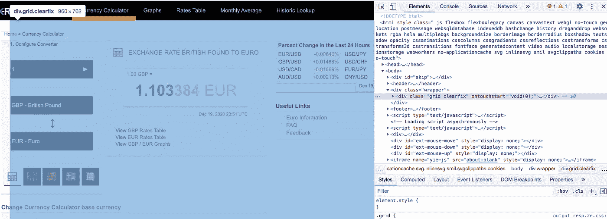
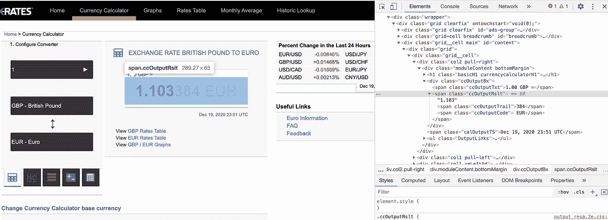
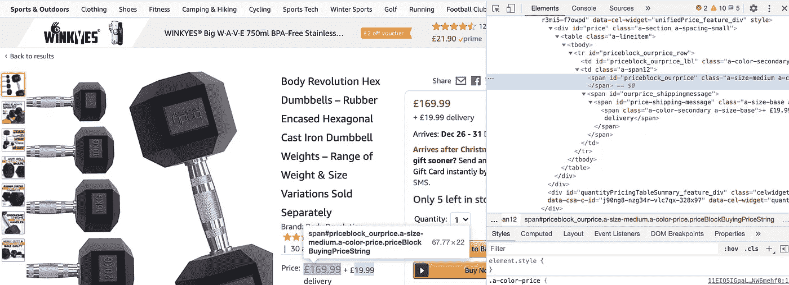
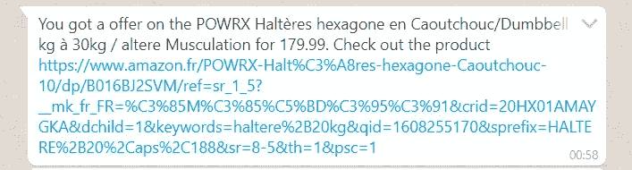

# 带有网络抓取和 whatsapp 通知的亚马逊价格调查

> 原文：<https://medium.com/analytics-vidhya/web-price-survey-currency-conversion-and-whatsapp-notification-1-2-27ff0d9a3db7?source=collection_archive---------16----------------------->

## 一个让网络成为你的数据库的美丽汤的实际案例


克里斯蒂安·威迪格在 [Unsplash](https://unsplash.com/s/photos/whatsapp-amazon?utm_source=unsplash&utm_medium=referral&utm_content=creditCopyText) 上拍摄的照片

我热爱运动，曾经练习过很多运动，跑步、游泳、举重等等。随着 2020 年 3 月的封锁，我想买一套哑铃，以便通过在家健身来保持身材。但是你猜怎么着？我不是唯一有这种想法的人！在缺货和涨价之间，不可能以合理的价格买到一对哑铃。

## 该项目

该项目的目的是创建一个工具，该工具将对英国亚马逊经销商为特定产品(一对 20 公斤的哑铃)所做的价格进行调查，使用实际的英镑到欧元汇率转换该价格，检查转换后的价格是否低于特定阈值，如果是，则接收 whatsapp 通知，其中包含金额和亚马逊 URL。

这个项目是第一个版本的 3 篇文章，我将提出不同的方法来报废网络使用美丽的汤库。这里最简单的方法是获取产品名称、价格、URL 和实际英镑对欧元的汇率。在下一篇文章中，我将在一个房地产网站上展示一个完整的循环搜索，在你最喜欢的城市找到最好的房子。

## 第一步:图书馆

Import Requests : Requests 是一个 python 库，允许您以一种简单的方式发送 HTTP 请求。如果你有兴趣，我把用户指南放在下面:

[](https://requests.readthedocs.io/en/master/) [## 请求:HTTP for Humans 请求 2.25.1 文档

### 版本 2.25.1 .(安装)Requests 是一个优雅而简单的 Python HTTP 库，是为人类而构建的…

requests.readthedocs.io](https://requests.readthedocs.io/en/master/) 

从 BS4 导入 BeautifulSoup: BeautifulSoup 是一个 Python 库，用于从 HTML 和 XML 文件中提取数据。我将在下面解释它是如何工作的，但是如果你对完整的用户指南感兴趣，我也把链接放在这里:

[](https://www.crummy.com/software/BeautifulSoup/bs4/doc/) [## 美丽的汤文档-美丽的汤 4.9.0 文档

### Beautiful Soup 是一个 Python 库，用于从 HTML 和 XML 文件中提取数据。它与您最喜欢的解析器一起工作…

www.crummy.com](https://www.crummy.com/software/BeautifulSoup/bs4/doc/) 

## 第二步:汇率

我们将从以下网站获取汇率:

 [## 英镑对欧元的汇率(货币计算器)-X-汇率

### 这个免费的货币汇率计算器可以帮助你将英镑转换成欧元。

www.x-rates.com](https://www.x-rates.com/calculator/?from=GBP&to=EUR&amount=1) 

你可以进入并使用你需要的货币。然后，让我们将它存储到一个变量“page”中，通过使用库请求来发出一个 HTTP 请求，询问我们是否可以进入该站点。

```
page = requests.get('[https://www.x-rates.com/calculator/?from=GBP&to=EUR&amount=1'](https://www.x-rates.com/calculator/?from=GBP&to=EUR&amount=1'))
```

您可以通过检查“页面”中的内容来轻松检查请求的结果。

```
print(page)
```

如果这行代码显示一个以 2 开头的答案(比如 200 ),这意味着你被授权进入这个网站。如果它以 3 开头，这意味着你被重定向到另一个页面。如果它以 4 开始(就像著名的错误 404 ),这意味着有一个错误，你不能访问。

然后，我们需要第二个变量“soup ”,它将把变量页面映射为我们的 BeautifulSoup 文件，我们将在该文件上读取 HTML 代码:

```
soup = BeautifulSoup(page.text, ‘html.parser’)
```

现在我们来谈谈 HTML。超文本标记语言是一种文本编辑语言，与级联样式表(CSS)等技术和 JavaScript 等编程语言一起使用，允许 web 开发人员创建您用来导航的所有漂亮网站。

HTML 使用标签工作。这意味着一个网站的每一个元素(标题，段落，图片等。)被存储到一个标签中，然后如果我们需要页面的一个元素，我们只需要调用这个特定的标签。“好吧……谢谢……那我对 HTML 毫无头绪怎么办？”没问题！大多数网络浏览器都有一个简单的方法来检查一个网站的 HTML 代码。

在页面的任何地方，点击右，然后点击“检查”

你会在右边看到完整的代码(在谷歌浏览器中，但在另一个浏览器中可能在底部)。通过浏览代码，你会看到页面的不同部分被突出显示。



作者图片

从这里开始，只是玩“捉迷藏”游戏的问题。我们只需找到我们感兴趣的页面部分的这一行(对我们来说是 1.103384 的汇率)，然后单击代码左侧的箭头以查看子代码，这样做直到找到与此信息相关的那一行。



作者图片

在这里。我们有这条线，标签是“span”。为了将这个标签与这个页面中潜在的其他“span”进行比较，我们还将在这一行中获得“class”信息。

```
price_box = soup.find('span',{'class':'ccOutputRslt'})
```

因此，我们在变量“price_box”中存储将“soup”转换为“page”的请求的结果:“请找到带有标签“span”和类“ccOutputRslt”的行。不管特定的外汇是 0.8 还是 1.3，因为我们存储了该信息的路径，所以我们将总是获得最后的汇率。

如果我们现在打印“price_box ”,我们将得到“1.103384 欧元”,因为我们以 1 英镑的欧元存储了等价的结果。要得到这个比率，我们只需要去掉“欧元”:

```
rate = price_box.text.replace("EUR", ' ')
```

以下是概要:

## 第三步:亚马逊的价格

如果我们使用 amazon URL 进行完全相同的操作，那么从第一步开始我们就会得到一个错误。可能是响应代码 503“服务不可用”。为什么？因为使用机器人访问网站不符合亚马逊的一般使用条件。这不违法，但也不道德。因此，我借此机会澄清一点。本教程的目的是教你合理使用网络抓取，这对你的数据科学/数据分析项目或个人公平项目很有用，但我不建议用它来垃圾邮件任何自动请求的网站，并始终尊重使用条件(即使我知道你不读它们！).

因此，在请求中，我们将添加一个参数来模拟浏览器发出的请求:

```
res = requests.get(url,headers=HEADERS)
```

变量头是:

```
HEADERS = ({'User-Agent':
            'Mozilla/5.0 (Windows NT 6.1) AppleWebKit/537.36 (KHTML, like Gecko) Chrome/41.0.2228.0 Safari/537.36',
            'Accept-Language': 'en-US, en;q=0.5'})
```

然后，我们对汇率进行同样的操作，但唯一的区别是使用特性“lxml”导航到 HTML 代码:

```
res = requests.get(url,headers=HEADERS)
soup = bs4.BeautifulSoup(res.content, features='lxml')
```

然后我们必须提取两个信息，标题和价格。为此，我们以同样的方式检查代码，并将结果存储到两个变量中:

对于标题，标签是“id ”,我们使用方法“get_text”来获取人类可读的文本，并使用“strip”来删除一些没有。

```
title = soup_bis.find(id="productTitle").get_text().strip()
```

对于金额标签也是一个“是”，我们使用相同的方法，此外，我们删除货币符号，对我来说，我必须用一个点来代替彗形分隔符。

```
amount = float(soup_bis.find(id='priceblock_ourprice').get_text().replace("£","").replace(",",".").strip())
```



作者图片

然后，我们只需将英镑金额乘以上一步计算的汇率:

```
amount_eur=amount*float(rate)
```

并做一个“如果”声明，以检查以欧元表示的价格是否低于我们将设置的阈值/

```
if amount_eur<=TrackingPrice(the trashold):
            offer.append("You got a offer on the {0} for {1}. Check out the product {2}".format(title,amount_eur,url))except:
        offer.append("Couldn't get details about product")
```

现在，我们可以将所有内容放入一个名为 tracker(url，TrackingPrice)的函数中，该函数有两个参数:url 作为 Amazon url 来获取价格，跟踪价格作为阈值。

这是全部功能

现在，您只需运行设置 URL 和阈值这两个变量:

并打印结果:

## 第四步:附加提示，whatsapp 通知

我们可以很容易地将结果存储到 cvs 或 Excel 文件中。但是当我开始这个项目的时候，我真的很想在我的手机里得到通知。我在不同的通知工具之间犹豫了一下，然后选择了 [Twilio](https://www.twilio.com/) whatsapp API。

Twilio messaging tool 将基本上为您提供一个 whatsapp 号码，该号码与一个特定的 ID 和 API 密钥相关联，允许您设置要发送的消息。这个过程真的很简单，所以我会把 Twilio 的官方文档放在这里，然后是我的代码，你可以在这里找到我的变量“offer”

 [## Twilio Python 助手库

### Twilio Python Helper 库使得从 Python 应用程序与 Twilio API 进行交互变得很容易。最…

www.twilio.com](https://www.twilio.com/docs/libraries/python) 

在发送信息之前，不要忘记“pip install twilio”。

这是 Whatsapp 的一面:



作者图片

## 完整代码:

## 结论:

我希望你喜欢这个教程。如果你使用本文中分享的方法之一，我会很高兴看到你的项目！不要犹豫，给我贴上标签，或者在 twitter、instagram 或 LinkedIn 上与我分享。如果您决定采用其他方式获得通知，请告诉我！