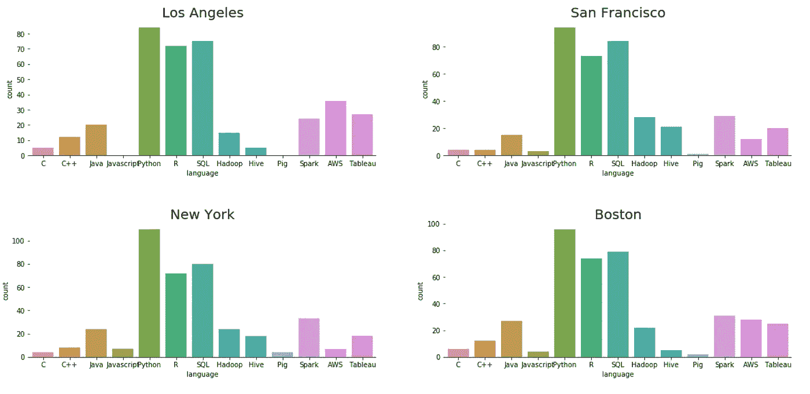
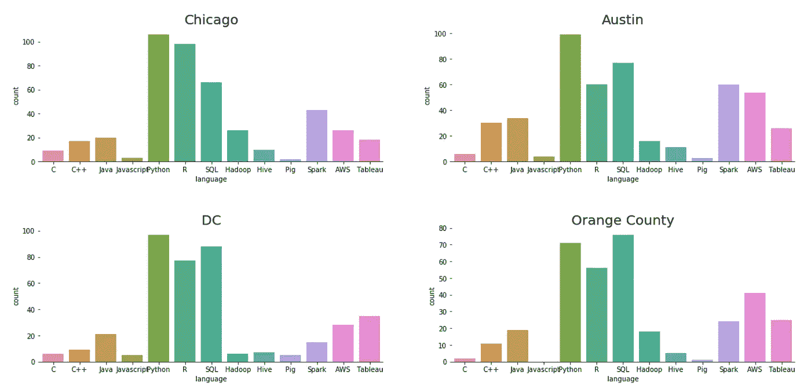
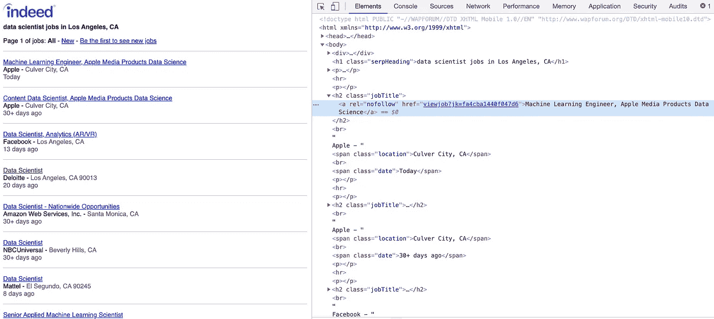

# 数据科学家工作的流行编程语言

> 原文：<https://medium.com/analytics-vidhya/web-scrape-indeed-for-popular-programming-languages-of-data-scientist-jobs-93b95083becf?source=collection_archive---------8----------------------->

# **简介**

在追求职业生涯的旅途中，我倾向于思考我应该关注的最重要的编程语言是什么。世界上有一百多种编程语言，选择学习哪种语言并专攻哪种语言可能会很困难，让人不知所措。在这篇文章中，我将展示我从网上搜集的前 100 名数据科学家工作的发现，并介绍这些步骤。

完整的代码可以在我的 github 中找到:【https://github.com/ailing123/Indeed-Web-Scraping 

# **工具**

使用 beautifulsoup 的 python

# **方法论**

1.  决定哪些编程语言和城市适合数据科学家的工作。

我选择 13 种语言:C、C++、Java、Javascript、Python、R、SQL、Hadoop、Hive、Pig、Spark、AWS 和 Tableau

我选择了 8 个地点:旧金山、洛杉矶、纽约、波士顿、芝加哥、奥斯丁、DC 和奥兰治县

2.确实刮网页

3.用正则表达式找出工作描述中的那些编程语言

4.将它们做成函数，以便轻松获取各个城市的链接

5.想象结果

# **调查结果**



1.  数据科学家工作的三大流行语言:Python、R、SQL

2.在大多数城市，Python 是最受欢迎的一种。尽管如此，orange county 的 SQL 比 python 出色

3.Tableau 的要求也很高。这是一个重要的可视化工具，我们一定要学会

## 步骤 1:加载必要的包

```
**from** **bs4** **import** BeautifulSoup
**import** **urllib**
**import** **re**
**import** **pandas** **as** **pd**
**import** **requests**
**from** **urllib.request** **import** urlopen
**import** **seaborn** **as** **sns**
**import** **matplotlib.pyplot** **as** **plt**
```

## 第二步:网络景观的确适合数据科学家的工作

在这里，我实际上是在抓取移动页面，因为它有一个更简单的页面布局，如下所示:



通过进入所有的工作链接，我们可以提取每个链接中每个工作的工作描述。这里的例子是在洛杉矶获得数据科学家的工作。

```
url = "[https://www.indeed.com/m/jobs?q=%22data+scientist%22&l=los+angeles&start=0](https://www.indeed.com/m/jobs?q=%22data+scientist%22&l=los+angeles&start=0)"
page = urlopen(url)
soup = BeautifulSoup(page, 'lxml')
all_matches = soup.findAll(attrs={'rel':['nofollow']})
**for** i **in** all_matches:
    jd_url = 'http://www.indeed.com/m/'+i['href']
    response = requests.get(jd_url)
    jd_page = response.text
    jd_soup = BeautifulSoup(jd_page, 'lxml')
    jd_desc = jd_soup.findAll('div',attrs={'id':['desc']})
```

## 第三步:使用正则表达式找出编程语言，并对它们进行计数

已将每种语言的计数初始化为零。之后用正则表达式找出职位描述中的那些编程语言。如果我们找到工作描述中提到的语言，我们会将其添加到计数中。在这里，我展示了如何获得 python 的计数。

```
sum_py = 0python = re.findall(r'[\/\b]?[Pp]ython[\s\/,]?', str(jd_desc))sum_py = sum_py + len(python)
```

## 步骤 4:将计数放入数据帧中

```
df=pd.DataFrame({'language':["C","C++","Java","Javascript","Python","R","SQL","Hadoop","Hive","Pig","Spark","AWS","Tableau"],
'count':[sum_C,sum_Cplus,sum_java,sum_javascript,sum_py,sum_r,sum_sql,sum_hadoop,sum_hive,sum_pig,sum_spark,sum_aws,sum_tableau]})
```

## 第五步:想象结果

我用 seaborn 来可视化数据帧。

```
f, axes = plt.subplots(4, 2, figsize=(20, 20))
sns.despine(left=**True**)

sns.barplot(x='language', y='count', data=df_losangeles,ax=axes[0, 0]).set_title('Los Angeles',fontsize=20)
sns.barplot(x='language', y='count', data=df_sanfrancisco,ax=axes[0, 1]).set_title('San Francisco',fontsize=20)
sns.barplot(x='language', y='count', data=df_newyork,ax=axes[1, 0]).set_title('New York',fontsize=20)
sns.barplot(x='language', y='count', data=df_boston,ax=axes[1, 1]).set_title('Boston',fontsize=20)
sns.barplot(x='language', y='count', data=df_chicago,ax=axes[2, 0]).set_title('Chicago',fontsize=20)
sns.barplot(x='language', y='count', data=df_austin,ax=axes[2, 1]).set_title('Austin',fontsize=20)
sns.barplot(x='language', y='count', data=df_dc,ax=axes[3, 0]).set_title('DC',fontsize=20)
sns.barplot(x='language', y='count', data=df_orange_county,ax=axes[3, 1]).set_title('Orange County',fontsize=20)
```

# 结论

综上所述，Python 和 SQL 似乎是现在数据科学家广泛使用的。不同编程语言的技能频率在不同的地方可能不同。知道你想在哪里工作，多关注那些顶级语言，肯定会给你更高的找到工作的机会。