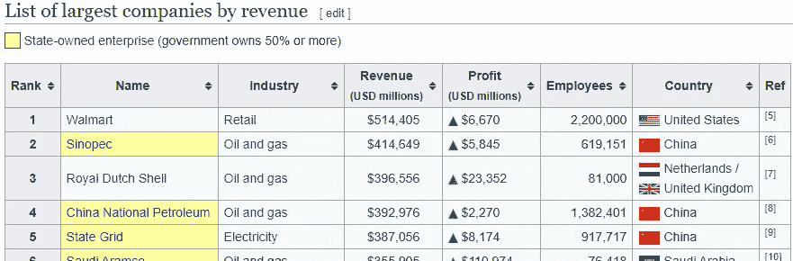
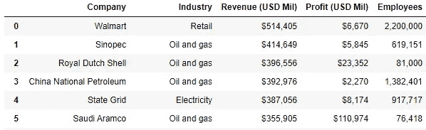
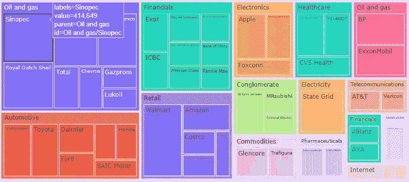

# 使用 Python 的网络抓取维基百科

> 原文：<https://medium.com/analytics-vidhya/web-scrape-wikipedia-using-python-ae68a1740859?source=collection_archive---------15----------------------->

维基百科有很多信息。幸运的是，大部分内容都以易于访问的表格形式呈现。在本文中，我将展示从维基百科页面抓取数据的 python 代码，然后我将在一个树形图中展示这些数据。

我在金融新闻上读到一篇文章，提到一家公司的收入是 280 亿美元。我想看看这个数字与其他公司相比如何，在维基百科上看到了这个可爱的表格[:](https://en.wikipedia.org/wiki/List_of_largest_companies_by_revenue)



显示“按收入排名的最大公司列表”页面上的前五家公司的代码片段

虽然如果您想做进一步的分析，您可以尝试复制并粘贴这些数据，但是有许多小的格式问题(合并单元格、超链接等)可能会使您出错。最好的方法之一是[使用网络搜集](https://simpleanalytical.com/how-to-web-scrape-wikipedia-python-urllib-beautiful-soup-pandas)。这将为您打开一个数据世界，而无需在每次想要访问数据时都访问页面。

按照上面链接的艾伦·海兰的例子:

```
import requests
website_url = requests.get('[https://en.wikipedia.org/wiki/List_of_largest_companies_by_revenue').text](https://en.wikipedia.org/wiki/List_of_largest_companies_by_revenue').text)from bs4 import BeautifulSoup
soup = BeautifulSoup(website_url,'lxml')
print(soup.prettify())
```

这将向您展示底层数据的一个格式良好的视图。您也可以使用浏览器查看源代码。另一个导航页面源代码的有用工具是 [Chrome 扩展 SelectorGadget](https://chrome.google.com/webstore/detail/selectorgadget/mhjhnkcfbdhnjickkkdbjoemdmbfginb?hl=en) 。

```
right_table=soup.find('table', class_='wikitable sortable')#see right_table to see how the for loop below works. 
#in this example I will pull Company,Industry,Revenue, Profit, and Employees.A=[]
B=[]
C=[]
D=[]
E=[]
F=[]
G=[]for row in right_table.findAll('tr'):
    cells=row.findAll('td')
    if len(cells)==7:
        A.append(cells[0].find(text=True))
        B.append(cells[1].find(text=True))
        C.append(cells[2].find(text=True))
        D.append(cells[3].find(text=True))
        E.append(cells[4].find(text=True))
        F.append(cells[5].find(text=True))import pandas as pd
df=pd.DataFrame(A,columns=['Company'])
df['Industry']=B
df['Revenue (USD Mil)']=C
df['Profit (USD Mil)']=D
df['Employees']=E
df
```

这将产生:



数据帧

例如，请注意，收入是用美元符号和逗号格式化的。当我对该列进行汇总统计时，我发现它是 dtype('O ')，所以我必须用

```
df[df.columns[2]].replace('[\$,]', '', regex=True).astype(int)
```

如果我想绘制收入、利润或员工，我就需要使用它。

这种数据最自然的视觉效果是使用一个树形图，其中公司按行业分组，并按收入大小排列。

```
import plotly.express as px
fig = px.treemap(df, width=1618, height=1000,
                 path=['Industry', 'Company'], 
                 values=df[df.columns[2]].replace('[\$,]', '', regex=True).astype(int))
fig.show()
```

这将产生下面的图形。我将展示一个片段，其中鼠标悬停在中石化公司上，以展示如何与视觉互动。查看 plotly 的页面，了解如何进一步定制您的图形。

