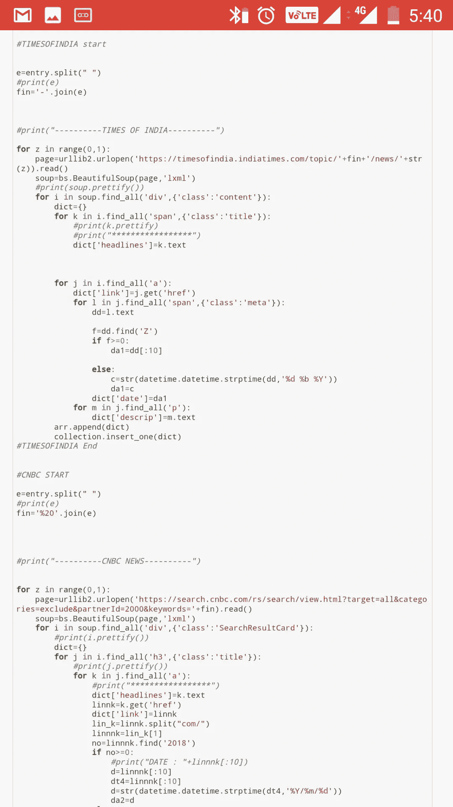

# 数据科学和网络搜集

> 原文：<https://medium.com/analytics-vidhya/web-scraping-2559f72c6c80?source=collection_archive---------20----------------------->

我使用 BeautifulSoup Library 从不同的新闻网站上搜集某个特定主题的新闻。

# 目的

互联网上的信息比任何人一生所能吸收的都多。我们不需要访问这些信息，而是需要一种可扩展的方式来收集、组织和分析这些信息。

网络抓取自动提取数据，并以一种我们容易理解的格式呈现。

# 工作

在 python 库 beautiful soup 的帮助下，我从不同的新闻网站上提取新闻。

BeautifulSoup 是一个 python 库，用于从 HTML 和 XML 文件中提取数据。它与我们最喜欢的解析器一起工作，提供导航、搜索、修改解析树的惯用方式。它通常为程序员节省数小时或数天的工作。

我浏览了以下网站:-

*   英国广播公司新闻
*   彭博资讯
*   纽约时报
*   印度时报
*   美国消费者新闻与商业频道

输入应该是我们想要的趋势新闻的任何话题，然后与新闻网站的所有网址连接。使用 for 循环，从每个网站的每条新闻中提取出“标题”、“描述”、“链接”和“日期”。

每条新闻的所有四个方面都存储在一个字典中，关键字为“标题”、“链接”、“日期”和“描述符”。

日期被更改为特定的格式“<yyyy-mm>”，以便以后在数据库中更容易排序。然后最终插入数据库。</yyyy-mm>

然后用命令 db.collection_name.find()。sort({"date":-})所有新闻按降序排列，存储在 mongodb 数据库中。

使用同一个图书馆，我从 AMAZON.COM 为另一个项目搜集了一系列机器学习书籍。

