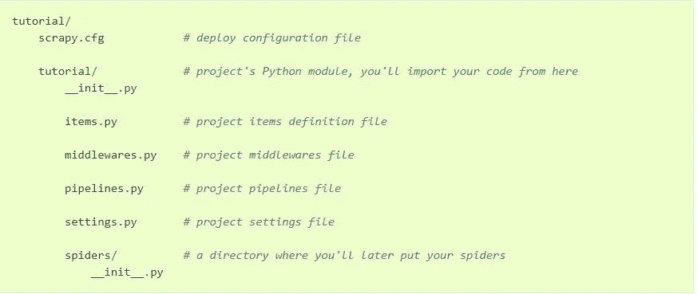
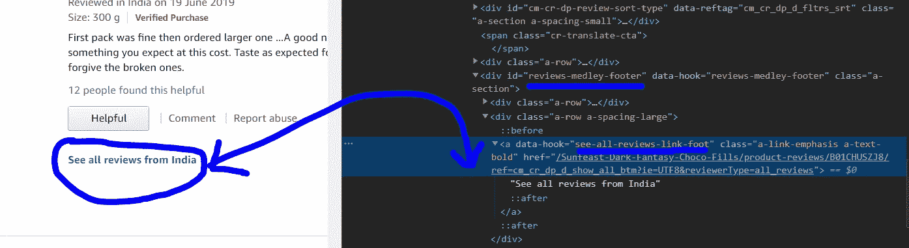

# 使用 Scrapy 从 A 到 Z 抓取亚马逊

> 原文：<https://medium.com/analytics-vidhya/web-scraping-a-to-z-using-scrapy-6ece8b303793?source=collection_archive---------0----------------------->


Pexels.com

> Scrapy 是一个用 Python 编写的快速、开源的 web 爬行框架，用于在基于 XPath 的选择器的帮助下从网页中提取数据。

在这篇文章中，我们将了解如何使用 Scrapy 来抓取所有的亚马逊产品评论，并在几秒钟内将所有抓取的数据自动存储到一个 JSON 文件中。

> 快速注释:报废的项目:

1.  *审核人姓名*
2.  *点评人简介链接*
3.  *审查评级*
4.  *复习题目*
5.  *文字回顾*
6.  *审查日期*
7.  *已验证的采购标签*
8.  *对复习有帮助的次数*

# 我们开始吧

> 设置项目

*   在此，我假设你已经运行了你的 pip，并且知道如何创建和激活一个 Python 虚拟环境，如果没有的话，查看一下这个[官方文档](https://packaging.python.org/guides/installing-using-pip-and-virtual-environments/)了解一下。
*   现在首先，进入你的终端，激活你的虚拟环境，如果你还没有安装 Scrapy，那么使用，

```
pip install scrapy
```

*   现在从您的终端进入您想要启动和运行项目的目录(注意:教程是我们正在创建的项目的名称)

```
scrapy startproject tutorial
```

*   在此之后，您的项目结构将如下所示，



*   现在在 spiders 目录中创建一个“amazon_scraping.py”文件

> 编写代码

打开您刚刚创建的“amazon_scraping.py”文件，让我们开始编码，

*   首先，导入这些基本库，

*   创建一个 python 类，定义我们想要抓取的所有变量

*   创建一个主类，Scrapy 将在这个主类上收集数据

*   在同一个类中定义一个函数，该函数将用于抓取你上面提到的链接，以获得亚马逊页面上“所有评论标签”的链接。



*   现在 Scrapy 在亚马逊的“所有评论页面”上，所以现在我们将编写一个函数，该函数将为所有上述项目抓取该页面，并将其存储在 JSON 文件中。

*   现在，我们已经得到了所有的项目，并已被追加到 JSON 文件，现在是时候告诉 Scrapy 去下一页，并重复上述过程。


> 运行代码

*   进入教程目录并在终端中运行以下命令，

```
scrapy crawl reviewspider -t json -o outputfile.json
```

*   在此之后，您应该会看到在教程文件夹中创建了一个文件名为<outputfile.json>的文件，其中包含了所有抓取的数据。</outputfile.json>
*   您可能会在终端**、**中得到 **503 服务不可用**这是因为我们可能会给服务器带来太多负载，要解决这个问题，请转到 tutorial/settings.py 并添加以下代码，然后尝试运行，

```
DOWNLOAD_TIMEOUT = 540
DOWNLOAD_DELAY = 5DEPTH_LIMIT = 10EXTENSIONS = {
    'scrapy.extensions.telnet.TelnetConsole': None,
    'scrapy.extensions.closespider.CloseSpider': 1
}
```

*   上面几行代码是为了确保我们不会给 amazon 服务器带来太多的负载，你可以随时调整上面的参数来让它运行。更多设置请查看[剪贴簿文档](https://docs.scrapy.org/en/latest/topics/settings.html)。

# 结论

*   因此，在短短几行代码中，我们编写了整个 Scrapy 项目，该项目将只使用产品 URL 来抓取每个页面上产品评论的所有细节。
*   欢迎在评论区提出你对这篇文章的疑问。
*   在 [LinkedIn](https://www.linkedin.com/in/rohan-goel-b0a6ab160/) 上与我联系。
*   在后续的[文章](/analytics-vidhya/integrating-scrapy-with-flask-8611debc4579)中，我已经解释了我们如何进一步将这个**碎片代码**与 **FLASK** 集成，并构建一个 web 表单，这样点击一个按钮，你就可以运行整个代码并获得碎片数据。