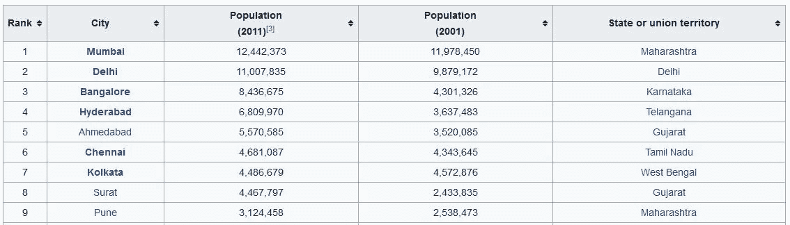
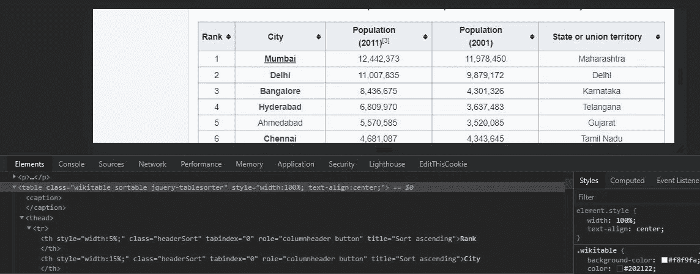
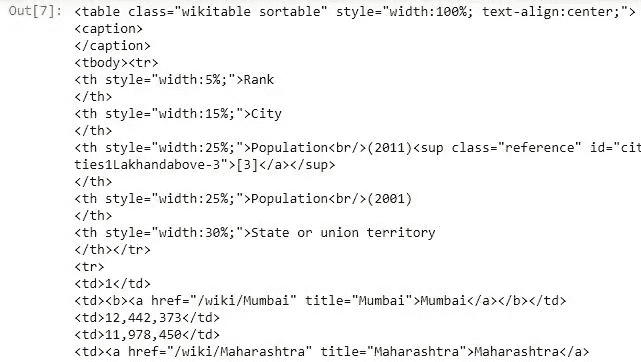
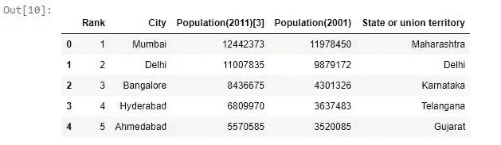
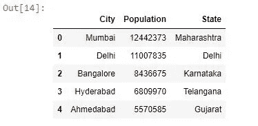

# 将维基百科表格抓取到数据帧中

> 原文：<https://medium.com/analytics-vidhya/web-scraping-a-wikipedia-table-into-a-dataframe-c52617e1f451?source=collection_archive---------0----------------------->

## 如何将维基百科表格转换成 Python 数据帧？


来源: [Unsplash](https://unsplash.com?utm_source=medium&utm_medium=referral)

## "没有数据就进行理论化是一个严重的错误。"—夏洛克·福尔摩斯

你们中的许多数据科学爱好者正在考虑开始一个新项目，无论是为了提高技能还是一个公司级别的项目，都需要使用 **"data"** 。感谢互联网，今天我们有数百个可用的数据源。你可以很容易找到数据的地方之一是维基百科。下面是一个数据源的例子:[https://en . Wikipedia . org/wiki/List _ of _ cities _ in _ India _ by _ population](https://en.wikipedia.org/wiki/List_of_cities_in_India_by_population)



印度城市及其人口表

我们有需要处理的数据。假设我需要印度城市的名称、它们的州和人口。现在有很多方法可以提取这些数据，比如将内容复制并粘贴到新的 excel 表格中，或者使用维基百科 API。但是，如果我告诉您，这个表可以直接转换成 Python 数据帧，以便更容易进行进一步的分析和处理，那会怎么样呢？很有趣，不是吗？

从网站提取数据的任务被称为**网络搜集**。这是与 API 一起从互联网上收集数据的最流行的方法之一。一些网站不提供 API 来收集他们的数据，所以我们使用数据抓取技术。一些最好的编程语言是 Node.js、C、C++、PHP 和 Python。

我们使用 Python 来完成这个特殊的任务。但是**为什么是 Python** ？

*   它是最流行的网络抓取语言。
*   **BeautifulSoup** 是基于 Python 的广泛使用的框架之一，它使得使用这种语言进行抓取变得如此容易。
*   这些高度发展的 web 抓取库使得 Python 成为 web 抓取的最佳语言。

你需要有一些 [**HTML**](https://www.w3schools.com/html/) 页面的基础知识才能理解网页抓取。我们还需要一些像[**beautiful soup**](https://www.crummy.com/software/BeautifulSoup/bs4/doc/)[**Requests**](https://requests.readthedocs.io/en/v0.8.2/)[**Pandas**](https://pandas.pydata.org/pandas-docs/version/0.25.3/)这样的 python 库。

以下是抓取维基百科表格并将其转换为 Python 数据帧的步骤。

1.  **安装 BeautifulSoup** : pip 安装 beautifulsoup4(到终端使用这个 pip 命令安装)
2.  **导入需要的库**:请求，熊猫，美瞳。

> **请求** *是一个 Python 模块，可以用来发送各种 HTTP 请求。这是一个易于使用的库，具有许多功能，从在 URL 中传递参数到发送自定义头和 SSL 验证。*
> 
> **Pandas** *是 python 编程语言的数据分析工具。我们使用 Pandas Dataframe，它是一个带有潜在不同类型列的二维标签数据结构。你可以把它想象成一个电子表格或 SQL 表，或者一系列对象的字典。它一般是最常用的熊猫* *对象。*

```
import pandas as pd # library for data analysis
import requests # library to handle requests
from bs4 import BeautifulSoup # library to parse HTML documents
```

3.**使用 URL 请求 HTML 响应**:我们向 Wikipedia URL 发送一个 GET 请求，该 URL 的表需要被抓取，并将 HTML 响应存储在一个变量中。抓取任何网站都是不合法的，所以我们检查状态码。200 显示你可以继续下载。

```
# get the response in the form of html
wikiurl="[https://en.wikipedia.org/wiki/List_of_cities_in_India_by_population](https://en.wikipedia.org/wiki/List_of_cities_in_India_by_population)"
table_class="wikitable sortable jquery-tablesorter"
response=requests.get(wikiurl)
print(response.status_code)
```

4.**检查页面**:为了从网站上抓取数据，我们把光标放在数据上，点击右键，进行检查。这为我们提供了 HTML 内容，通过它我们可以找到存储数据的标签。很明显，HTML 中的<表>标签中存储了一个表。



在 Chrome 中使用 Inspect

5.**解析来自 HTML** 的数据:接下来我们创建一个 BeautifulSoup 对象，并使用 find()方法提取相关信息，在我们的例子中是<表>标签。在一个 Wikipedia 页面中可以有许多表，所以为了指定表，我们还传递了“class”或<表>标签的“id”属性。

```
# parse data from the html into a beautifulsoup object
soup = BeautifulSoup(response.text, 'html.parser')
indiatable=soup.find('table',{'class':"wikitable"})
```

*输出:*



从维基百科页面抓取 HTML 代码

6.**将 Wikipedia 表转换成 Python Dataframe** :我们使用 read_html()将 HTML 表读入 Dataframe 对象列表。这将返回一个列表。接下来，我们将列表转换成数据帧。

```
df=pd.read_html(str(indiatable))
# convert list to dataframe
df=pd.DataFrame(df[0])
print(df.head())
```

*输出:*



维基百科表格到 Python 数据帧

7.**清理数据**:我们只需要这个数据框架中的城市名称、州和人口(2011)。因此，为了更好地理解，我们从数据帧中删除了其他列，并对这些列进行了重命名。

```
# drop the unwanted columns
data = df.drop(["Rank", "Population(2001)"], axis=1)
# rename columns for ease
data = data.rename(columns={"State or union territory": "State","Population(2011)[3]": "Population"})
print(data.head())
```

*输出:*



干净的数据

就是这样！！

你已经将维基百科表格转换成数据帧，现在可以用于进一步的数据分析和机器学习任务。这就是使用 Python 进行 web 抓取的好处。只需几行代码，您就可以立即获得数据。

[](https://www.buymeacoffee.com/nakullakhotia)

如果你喜欢读这篇文章，请支持我。点击上图。谢谢你

参考我的 [**GitHub 代号**](https://github.com/NakulLakhotia/Coursera_Capstone/blob/master/Wikipedia_table.ipynb)

***注*** *:本文中已经提到了你开始工作所需的所有资源及其链接。希望你好好利用:)*

我希望这篇文章能让你对尝试像网络抓取这样的新事物感兴趣，并帮助你增加知识。如果你喜欢读这篇文章，不要忘记点击下面的“拍手”图标。谢谢你的时间。