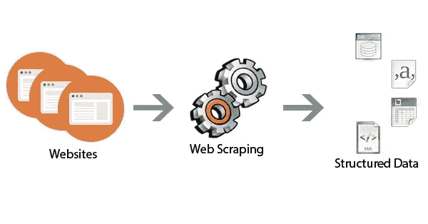
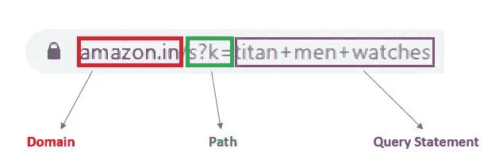
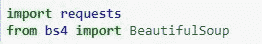
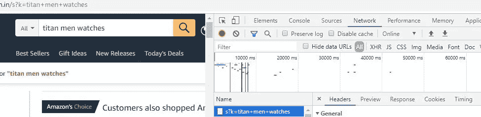

# 网络抓取——亚马逊客户评论

> 原文：<https://medium.com/analytics-vidhya/web-scraping-amazon-reviews-a36bdb38b257?source=collection_archive---------0----------------------->

我们在网上搜索很多东西。这些信息很容易获得，但不容易保存，因此我们可以在以后将其用于任何其他目的。

一种方法是手动复制数据，并将其保存在桌面上。然而，这是一项非常耗时的工作。在这种情况下，网络抓取很方便。

**什么是网页抓取？**

网络抓取是一种技术，用于从网站上提取大量数据，并将其存储在您的计算机中。这些数据可以在以后用于分析。

在这篇博客中，我将向你展示如何使用 python 从亚马逊网站上抓取特定产品的评论。

第一步，检查网站是否允许刮痧。这可以通过在网站链接后添加 **robots.txt** 来查看。

【https://www.amazon.in/robots.txt】T5[T6](https://www.amazon.in/robots.txt)

一个 URL 可以分成五个部分——**协议、域、路径、查询字符串&片段。**但是我们将主要关注 3 个部分——域、路径&查询字符串。

**步骤:**

1.  获取要废弃的页面的 URL。
2.  检查页面的元素并确定所需的标签。
3.  访问 URL。
4.  从所需的标记中获取元素。

让我们现在就开始编码吧！！

我们从导入上述两个库开始。**库*请求*库**用于从网页中获取内容。我们向 URL 发送请求，然后得到响应。响应将包含一个状态代码以及网页内容。*将页面内容转换成合适的格式。*

***标题和 cookie***

*通常，python 请求不需要头和 cookies。但是在某些情况下，当我们请求页面内容时，我们会得到一个状态代码 403 或 503。这意味着我们无法访问网页内容。在这种情况下，我们向 requests.get()函数的参数添加头和 cookies。*

*要找到你的邮件头和 cookies，去亚马逊网站搜索特定的产品。然后右击任意元素，选择**检查**(或使用快捷键 Ctrl+Shift+I)。在“网络”选项卡中，我们可以找到标题和 cookies。*

*永远不要和任何人分享你的饼干。*

**

*一个函数用于获取所需查询的页面内容和状态代码。需要状态代码 200 才能继续该过程。*

***刮削产品名称和 ASIN 编号***

*亚马逊的每件商品都有唯一的识别号。这个编号叫做***ASIN——亚马逊标准识别号*** 。使用 ASIN 号码，我们可以直接访问每一个产品。*

*上述函数可用于提取产品名称和 ASIN 编号。*

*findall()函数用于查找参数中提到的所需范围、属性和值的所有 html 标记。标签的这些参数对于所有产品页面中的所有产品名称和 asin 都是相同的。我们只是将内容中的数据部分添加到一个新的列表中。使用这个列表，我们可以访问单独的数据——如数字，从而访问它们各自的页面。*

***刮客户评论链接***

*客户评论将出现在产品的每一页。但这些只是少数。我们想要产品的所有顾客评论。所以，我们不得不刮掉***‘查看所有顾客评论’***这个环节。*

*为了做到这一点，我们首先定义一个函数，该函数将使用一个 ASIN 编号转到每个产品的页面。*

*现在我们做和 ASIN 数字一样的事情。我们使用相应的 html 标签提取每个产品的所有“查看所有客户评论”链接，并将 **href** 部分添加到新列表中。*

***取消所有客户评论***

*现在，我们已经获得了每个产品的所有链接。使用这些链接，我们可以收集每个产品的所有评论。因此，我们定义了一个函数(类似于前面的函数),它将提取所有产品的所有评论。*

*我们使用上面的函数提取所有的客户评论，并将其存储在一个列表中。*

*我们可以通过添加' &page=2 或 3 或 4 .. '来访问任意页数的产品详细信息搜索查询，并重复从废弃 ASIN 号码开始的步骤。*

***在 CSV 文件中保存评论***

*我们现在已经废弃了所有的评论，现在我们必须将它保存在一个文件中，以便执行进一步的分析。*

*我们将评论列表转换成字典。然后导入 **pandas** 库，用它把字典转换成数据框。然后使用 to_csv()函数将它转换成 csv 文件并存储在我们的计算机中。*

*取消亚马逊产品评论的完整代码可从以下网址获得:*

*[***https://github.com/vaisakhnambiar/Web-scraping***](https://github.com/vaisakhnambiar/Web-scraping)*