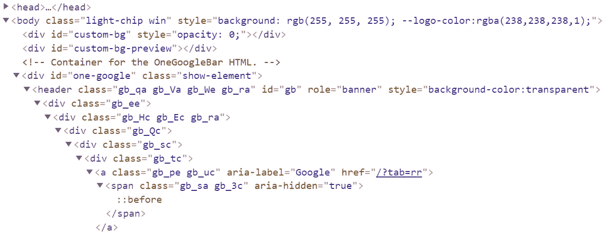
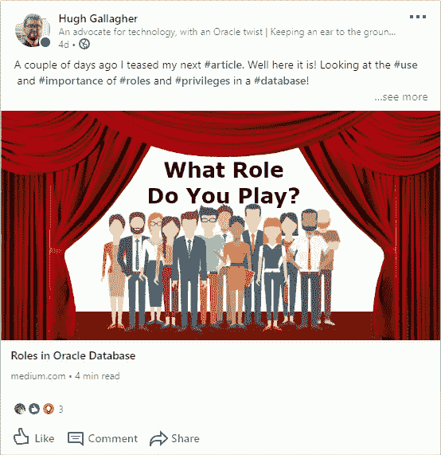

# 网络搜集—简介

> 原文：<https://medium.com/analytics-vidhya/web-scraping-an-introduction-1fccdfd039a3?source=collection_archive---------7----------------------->

Web 抓取通常是一个自动过程，包括扫描网页列表以查找数据，然后保存这些数据以备后用。这是可以手动完成的事情，但是当存在更容易的替代方案时，这是劳动密集型的并且是不必要的。


作为一个自动化抓取过程的工具，我将研究用于 python 的 Selenium 库。这是一个非常简单实用的库，它可以使用一系列不同的浏览器来自动化抓取过程。要开始一个脚本，你必须[创建一个“驱动”对象](https://selenium-python.readthedocs.io/getting-started.html)。您可以在这里选择要使用的浏览器。在这篇文章中，我将略读这一点，但在必要的地方，我将把它称为“驱动程序”。

很大一部分网页抓取是有一些 HTML 的基础知识；能够通读网页，找出你在搜索什么。我假设你至少知道一个基本的空白网页的结构，以及基本元素的名称。



来自 Google 的 HTML 片段

即使只看 Google.com 的 HTML 的前十几行(在左边)，也可以看出要遍历的级联和嵌套元素的数量增加得很快。我将解释如何在这些嵌套的元素中导航(以及一些页面的结构如何使它更容易)。

首先让我们举一个更简单的网页的例子，这样我们就可以讨论如何挑选出我们想要的数据。下面你会发现 HTML(带有一些内部 CSS)，它构成了一个简单的，但非常不吸引人的网页。我将以此为例。

```
<!DOCTYPE html>
<html>
<head>
 <style>
  .a_div {background-color: blue; padding: 10px;}
  .a_span {background-color: red; padding: 10px;}
  #the_only_span {border-color: white; border-width: 5px; border-style: solid;}
  #relevant_data {background-color: pink; padding: 10px;}
 </style>
 <title></title>
</head>
<body>
 <div class="a_div">
  <div class="a_div">
   <span class="a_span" id="the_only_span">
    <div id="relevant_data">
     Web Scraping is a useful tool.
    </div>
   </span>
  </div>
 </div>
</body>
</html>
```

id 为“relevant _ data”的 div 是我们想要访问的。有两种主要的方法可以做到这一点——都需要我们能够阅读 HTML 结构，其中一种还需要我们理解哪个元素嵌套在哪个元素中。

让我们从两者中较容易的开始。这个

有一个 *id* ，这是页面中的唯一标识符。这使得它非常容易辨认。因此，通过用 *id* 标识来查找保存在< div >中的文本，我们将使用:

```
driver.get([WEB-PAGE NAME HERE]) # TO NAVIGATE TO THE PAGErelevant_div = driver.find_element_by_id('relevant_data')print(relevant_div.get_attribute('innerHTML')) # PRINT TEXT
```

正如你所看到的，这是一个非常简单的过程，我希望更多的网站可以使用这样一个易于交互的结构。唉，大多数使用潜在不一致的类，而不是 *id* 的。然而，尽管使用笨拙命名的类，他们倾向于使用一致的嵌套系统。这将我们引向寻找所寻找元素的第二个主要方法。使用' **XPath** '。

现在让我们从感兴趣的元素中删除 id。我们该如何独特地描述它呢？鉴于示例页面的简单性，它不会太复杂。我会让它稍微复杂一点，但是去掉 CSS。

```
<!DOCTYPE html>
<html>
<head>
 <title></title>
</head>
<body>
 <div class="a_div">
  <div class="a_div">
   <span class="a_span" id="the_only_important_span">
    <div>
     Web Scraping is a useful tool.
    </div>
   </span>
  </div>
 </div>
 <div class="a_div">
  <span class="a_span">
   <span class="a_span" id="the_only_span">
    <div>
     Ignore me.
    </div>
   </span>
  </span>
 </div>
</body>
</html>
```

所以我在这里加倍了嵌套元素，但是你仍然可以看到我们正在寻找的重要的。从这里开始，我将展示同样的方法可以用来找到这个的两种方式。第一种是通过使用*“唯一重要的跨度”* *id* 来遍历跨度。

```
relevant_div = 
     driver.find_element_by_xpath(//span[@id=
     'the_only_important_span']/div[1])print(relevant_div.get_attribute('innerHTML')) # PRINT TEXT
```

所以让我们来看看这个 xpath 告诉我们什么。“//”表示从匹配后面的字符串的任何元素开始查找。由于我们有“// < span >”，我们将查看当前的 span 元素。但是我们对它做了进一步的限制，用'*@ id = " the _ only _ important _ span "*'。这意味着我们只查看带有那个 *id* 的任何< span >，碰巧只有一个。“/ < div > [1]”告诉我们选择出现在我们第一个选择的元素中的第一个< div >元素。在本例中，这正是我们要寻找的< div >！

> 顺便提一下: **xpath** 不是零索引的，也就是说计数从‘1’而不是‘0’开始。

现在让我们以稍微不同的方式使用 **xpath** ，同样的例子。这一次我们不会使用 id*id*，而是非常详细、具体地描述元素是如何嵌套的:

```
relevant_div = driver.find_element_by_xpath(//div/div/span/div[1])print(relevant_div.get_attribute('innerHTML')) # PRINT TEXT
```


根据上一个例子中的描述，我们再次考虑从 any ('//')

开始。在这个中，我们寻找一个，它包含一个。在那个中，我们寻找第一个。这再次以稍微不同的方式独特地描述了我们重要的。

在上面的两个例子中，可以省略“[1]”，因为只有一个

，但是明确说明任何变化是一个好的做法。

这涵盖了定位元素和检索它们包含的信息的主要方法。在很大程度上，web 抓取剩下的工作就是塑造你的搜索路径，存储你的数据，并决定如何处理它们！



你可能想知道为什么网络抓取？它有哪些应用？我现在的部分工作是记录我在 LinkedIn 上的帖子。通常是观点和反应(只是一个简单的数字，而不是对哪些反应的细分)。这是我期望通过 LinkedIn API 可以得到的东西。但遗憾的是，这是他们的版本 1 和版本 2 APIs 之间移除的许多特性之一。

所以我开始设置几个虚拟机来执行网络抓取。如果你想知道我是如何做到的，请看看我的下一篇文章！

与此同时，考虑注册一个 [Oracle 免费云试用](http://bit.ly/OCTrialLink)，看看你是否也可以用它做一些很酷的东西！

问题，评论？你可以在 LinkedIn 上找到我。

> *所有观点均为我个人观点，与甲骨文无关*