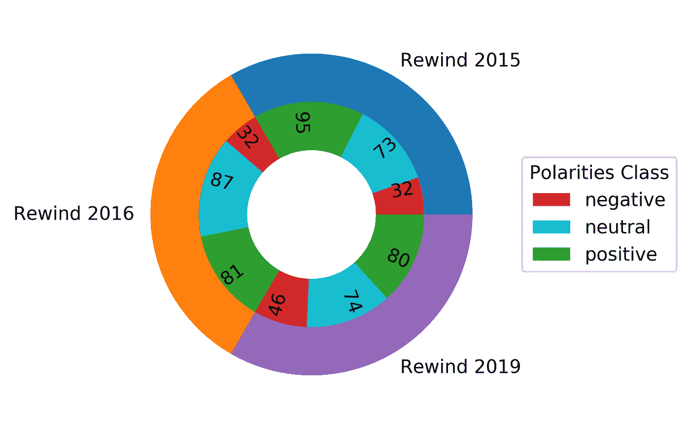
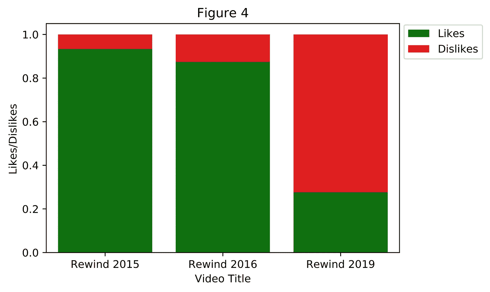

# 使用 Python 对提取的数据进行 Web 抓取和分析

> 原文：<https://medium.com/analytics-vidhya/web-scraping-and-analysis-of-extracted-data-fe4ee855da06?source=collection_archive---------10----------------------->

## 美丽的汤从三个不同的 Youtube 视频和这些视频的分析网页抓取。

在这个项目中，我从 youtube.com 的视频中提取了所需的数据(标题，喜欢，不喜欢，评论),并适当地重新排列，以分析这些视频，并从数据中获得一些洞察力。你可以在这个给定的链接 [*GitHub 库*](https://github.com/abhashpanwar/webscraping) *上到达与这个项目相关的 Python 脚本。*

> [**网页抓取**](https://en.wikipedia.org/wiki/Web_scraping) (或屏幕抓取或网页数据提取或网页采集)基本上就是使用一些脚本或自动机工具/软件从网站中提取数据的过程。Web 抓取，也称为 web 数据提取，是从网站检索或“抓取”数据的过程。

## 使用的工具:

1.  [*beautiful soup*](https://www.crummy.com/software/BeautifulSoup/bs4/doc/#):*beautiful soup*是一个用于从 HTML 和 XML 文件中提取数据的 Python 库。它与您喜欢的解析器一起工作，提供导航、搜索和修改解析树的惯用方式。

*BeautifulSoup* 解析你给它的任何东西，并为你完成树的遍历。你可以告诉它“查找所有链接”，或者“查找类外部链接的所有链接”，或者“查找所有 URL 匹配“foo.com”的链接，或者“查找有粗体文本的表格标题，然后给我那个文本”。"

2.[*text blob*](https://textblob.readthedocs.io/en/dev/):[text blob](https://pypi.org/project/textblob/)是一个用于处理文本数据的 Python (2 和 3)库。它提供了一个简单的 API，用于执行常见的[自然语言处理(NLP)](https://en.wikipedia.org/wiki/Natural_language_processing) 任务，如词性标注、名词短语提取、情感分析、分类、翻译等。

## 提取数据的基本步骤:

1.  输入 HTML 页面。
2.  将其转换为您最喜欢的解析器，以提供导航、搜索和修改解析树的惯用方式。
3.  确定所需的数据。
4.  找到数据。
5.  以特定的格式存储数据。

# 第 1 部分:Web 抓取

## 步骤 1:包含所需的库

## 步骤 2:定义 HTML 页面链接

我已经下载了 HTML 页面，在其他情况下，如果我们希望 HTML 页面在线，然后定义 URL。

## 步骤 3:我已经为每个任务创建了一个函数。

**第 3.1 步:convert number()**

这个函数将把文本数据转换成数字格式。

例如:“151，641，939 次浏览”变成“151641939”

从字符串中提取数字数据的函数

**步骤 3.2:生成数据()**

从 HTML 页面中提取数据主函数

这个函数将使用 BeautifulSoup 从 HTML 页面收集数据，并存储在 videoData 系列中。

**步骤 3.3:generated data frame()**

上述函数将创建一个数据框，将提取的数据分成行和列。

**步骤 3.4:生成极性()**

上述函数将生成每个评论的极性，即评论是好的、坏的或中性的。

**步骤 3.5:最后调用所有函数，生成最终输出/数据。**

将创建调用其他函数和每个 HTML 的最终输出的主代码

## 最终输出:

提取数据并连接所有 CSV 文件后的最终输出

# 第 2 部分:数据可视化/分析数据

注意:每个图形的代码都在 mainFile.ipynb 文件中

## 1)分析视图:

从上面的图表中，我们可以说《倒带 2016》在三个视频中获得了最大浏览量。

## 2)分析极性:

堆积条形图

饼图显示每个视频极性类别下的评论数量

从上面的图表中，

*   《倒带 2015》正面评价最大，另外两个视频正面评价几乎相等。
*   倒带 2016 有 max 中性评论。
*   《倒带 2019》负面评论最大。这个视频得到了更多的负面评价。

在这个项目中，我从 200 条评论中抽取了一个样本

《倒带 2015》获得更多正面评价，《倒带 2019》获得更多负面评价。

## 3)分析喜欢/不喜欢:

喜欢和不喜欢的条形图

堆积相对图

从上面的数字，我们可以说

*   “Rewind 2016”有 max 赞或用户喜欢这个视频，总体而言，所有三个视频的赞数几乎相等。
*   《倒带 2019》获得了大量的不喜欢，这意味着这个视频变得消极，或者视频的内容不受用户喜欢。

# 结论:

1.  与不喜欢相比，倒带 2015 和倒带 2016 更好。
2.  《倒带 2016》表现良好，因为它获得了良好的喜欢和积极的评价。
3.  《倒带 2019》表现不佳，因为它获得了大量的不喜欢和负面评论。