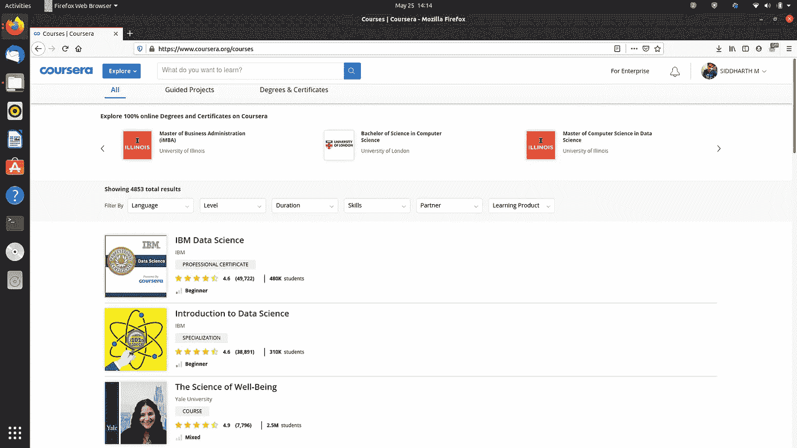

# 网络抓取和课程 a

> 原文：<https://medium.com/analytics-vidhya/web-scraping-and-coursera-8db6af45d83f?source=collection_archive---------5----------------------->

你好..在一次黑客马拉松中，我正在做一个课程推荐项目，必须为课程生成数据集。现在这种数据集的可用性非常低，因此唯一的选择就是网络抓取。


来自谷歌图片的网络废弃图片

> ***网页抓取*** *又称网页数据抽取，是从一个网站中检索或“抓取”数据的过程。与单调乏味、令人麻木的手动提取数据的过程不同，web 抓取使用智能自动化从看似无穷无尽的互联网前沿检索数百、数百万甚至数十亿个数据点。*

这只是一些随机的定义。就像上面的图片一样，你需要一些技术来滚动浏览 web 应用程序，并获取构建数据集的功能。

最好的开始方式是使用已经这样做的库。是的…这是正确的，我们为此包括美丽的汤库。你可以在这里得到文档:[https://pypi.org/project/beautifulsoup4/](https://pypi.org/project/beautifulsoup4/)

为了让我们了解它是如何工作的，让我们通过一个例子来废弃一个网站并为其生成数据集。我们将致力于抓取我们著名的学习网站 Coursera。在这里，我们有一个很好的机会来废弃这些数据，因为我们有一个 URL，其中包含了所有课程的详细信息，就像一张卡片:[https://www.coursera.org/courses](https://www.coursera.org/courses)



显示所有可用课程的网站。

首先，我们需要导入所需的库进行抓取。

```
from bs4 import BeautifulSoup                   
import requests
```

这里 BeautifulSoup 用于抓取目的，requests 库将帮助我们从 python 向网站发送 Http 请求以获取 web 内容。

```
response = requests.get("https://www.coursera.org/courses")
```

现在，我们需要使用 get 方法，在该方法中，我们传递要解析为 URL 的链接。requests . get(“…”)将帮助我们获取 web 的内容，我们可以将它保存到一个变量中，比如 response。

```
html_soup = BeautifulSoup(response.content, 'html.parser')
```

我们在这里做汤。所以我们有 BeautifulSoup 方法，它有两个参数，一个是我们想要的内容，另一个是我们想要用什么类型的解析器来解析我们的页面。我们在这里使用 html.parser。我们把它放到一个名为 html_soup 的变量中。我们可以看到，当我们查看界面时，课程被列为一个列表，比如一页中有多达 10 门课程，后面有多达 100 页。因此，我们不能简单地在一个页面上实现我们的 soup，因为我们需要获取所有的课程，因此我们需要使用两个循环，一个用于获取每个页面，另一个用于遍历每个列表。

```
url = "https://www.coursera.org/courses?page=" +str(i) + "&index=prod_all_products_term_optimization"
```

这是我们可以在每一页中找到的 url，只有 page=改变后的数字，因此在第一个循环中，我们可以通过使数字动态化来放置此代码以获得 url。

这有助于我们简单地通过传递标签、我们想要解析的内容和类来浏览整个课程。为了简单明了，让我们举个例子。


只看高亮的那个。这是相关的标题或课程名称。我们可以看到，与此相关的标签是“h2”，类是“颜色-主要-文本卡-标题标题-1-文本”，这是第一个和第三个参数。在第二个参数中，我们传递了一个空列表，我们希望在每个课程中添加这个列表。我们删除的内容保存在这里，稍后将成为数据帧的一整列。

你可以在函数中看到，我用了一个 for 循环得到了 100 页。这可能因人而异，我这样做只是为了获取一些课程数据作为演示。对于第二个循环，我从 0 到 9 遍历一页中的所有课程。如前所述，我们通过 BeautifulSoup(…)传递内容和解析器来获取数据。

```
x = soup.find_all(html_tag, class_ = tag_class)[j].get_text()
```

稍后，我们使用 soup 中的 find_all 方法来获取 scrapping 中引用的确切文本，并将其保存到变量 x 中。在每次迭代中，该文本都被追加到一个列表中，从而获得整个列数据集。

```
course_title = []               
course_organization = []                       course_Certificate_type = []           
course_rating = []                      
course_difficulty = []                       course_students_enrolled = []
```

为我们想从网站上删除的内容创建空列表。

```
auto_Scrapper_Class('h2',course_title,'color-primary-text card-title headline-1-text') 
                      auto_Scrapper_Class('span',course_organization,'partner-name m-b-1s')          
            auto_Scrapper_Class('div',course_Certificate_type,'_jen3vs _1d8rgfy3')  
                     auto_Scrapper_Class('span',course_rating,'ratings-text')       
                auto_Scrapper_Class('span',course_difficulty,'difficulty')     
                  auto_Scrapper_Class('span',course_students_enrolled,'enrollment-number')
```

现在，我们传递所有必需的参数，并等待函数完成它的工作。

然后，我们使用我们的基本 pandas 来制作一个名为 course_df 的数据帧，方法是将所有数据分成列，每个列都有一个索引。稍后，我们简单地根据标题对其进行排序，然后使用，

```
course_df.to_csv(UCoursera_Courses.csv)
```

我们将收集到的数据制作成一个新的 csv 文件。这有助于我们获得新的数据集，可以在以后用于数据分析和可视化。

示例输出如下所示:


简而言之，数据集示例。

> 如果你喜欢这篇文章，并且觉得它很有帮助，请继续关注。我很乐意与你合作，一起做项目。

***代码做刮:***

[](https://github.com/Siddharth1698/Coursera-Course-Dataset/blob/master/scrapping_coursera.py) [## 悉达多 1698/Coursera-课程-数据集

### 我试图通过 coursera 网站生成 Coursera 近 890 门课程的课程数据集。…

github.com](https://github.com/Siddharth1698/Coursera-Course-Dataset/blob/master/scrapping_coursera.py) 

***被抓取的数据集:***

[](https://www.kaggle.com/siddharthm1698/coursera-course-dataset) [## Coursera 课程数据集

### 课程数据集从 Coursera 网站废弃

www.kaggle.com](https://www.kaggle.com/siddharthm1698/coursera-course-dataset) 

再次感谢..并享受刮……:)