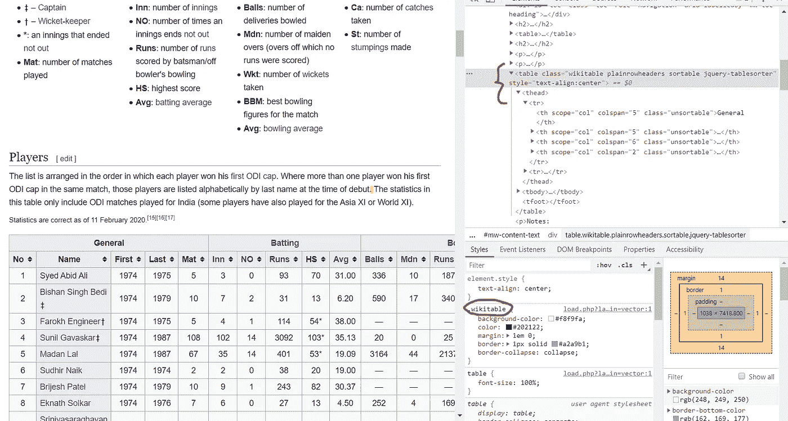
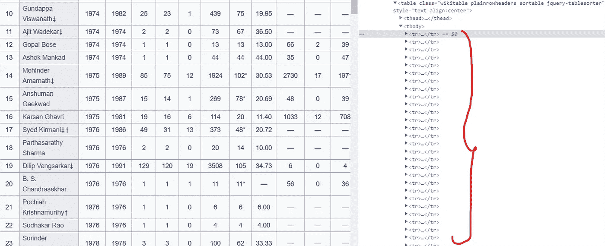
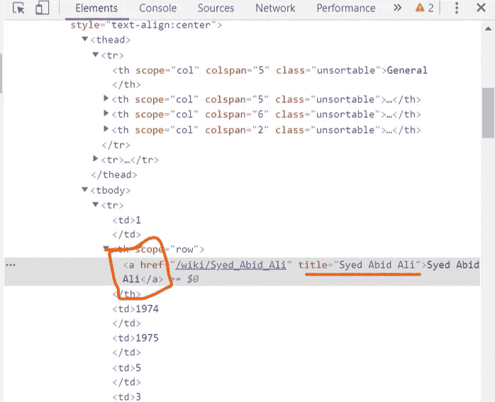

# 使用 BeautifulSoup 进行网页抓取

> 原文：<https://medium.com/analytics-vidhya/web-scraping-cricket-players-names-using-python-5e4318e94f9c?source=collection_archive---------7----------------------->

## 使用 request 和 BeautifulSoup 库快速学习 Web 抓取。


照片由费尔南多·埃尔南德斯拍摄，编辑为@Sarawritezz

W eb 搜集确实是数据科学中有趣的一部分。当我在开发的时候，我不得不从一个网站上收集蔬菜的价格，然后显示在一个 web 应用程序上。我在 Ruby 上做网页抓取。所以有时候开发者也需要了解/做网页抓取。事实上，我是在没有任何 web 抓取经验和知识的情况下开始这样做的。所以，做网络抓取是非常容易的。这里我们将使用一些库用 python 做一个简单的网络抓取。

## 什么是数据抓取？

你曾经从任何网站复制粘贴过任何东西吗？但是这样做是一件繁琐的工作，如果我们想从另一个来源得到的数据真的更多，对吗？所以，让我们用代码的形式让我们的机器来替我们做。这才是真正的网络抓取。很酷，对吧？(喘息！)

## 先决条件

先决条件非常简单，在您的机器上设置 python 环境。固定在任何 IDE 上根据您的选择进行编码。*美汤*和*请求*是这里做网页抓取需要的两个模块。我们将在后面的学习路径中看到这些模块的用途和安装过程。

## 我们要刮什么？

在这里，我们将从[维基百科](https://en.wikipedia.org/wiki/List_of_India_ODI_cricketers)中收集印度 ODI 板球运动员多年来为印度板球队效力的名字，并将名单以 CSV 格式保存在本地文件中。

## 我们可以开始了吗？

在开始之前，我假设您对 HTML 有所了解。如果没有，[点击此处](https://www.w3schools.com/html/)至少学习一下基本标签。首先，我把完整的代码放在这里。接下来，我用可理解的方式一点一点地解释代码。

```
**import requests
from bs4 import BeautifulSoup
import pandas as pd****page=requests.get("**[**https://en.wikipedia.org/wiki/List_of_India_ODI_cricketers**](https://en.wikipedia.org/wiki/List_of_India_ODI_cricketers)**").text
#page****soup=BeautifulSoup(page,"lxml")****print(soup.prettify())****table=soup.find("table",{"class":"wikitable"})****data_rows = table.findAll('tr')[2:]
#type(data_rows)****player_names=[]****for i in data_rows:
    names=i.findAll("a")
    for x in names:
        player_names.append(x.get("title"))****#print(player_names)
dataframe=pd.DataFrame()
dataframe['Players']= player_names
#dataframe.head()****dataframe.to_csv("Cricket_players.csv")**
```

简单代码！

让我们从安装依赖项开始。转到终端，并执行以下代码。(*如果已经安装了软件包，跳过*)

```
**pip install pandas****pip install requests beautifulsoup4**
```

好吧。您已经下载了所有需要的依赖项，现在这些模块占用了您 RAM 中的一些空间。好了，让我们开始将下载的模块导入到我们的工作文件中，并开始 web 抓取。等等，我们的工作文件在哪里？哦，我忘了创建一个工作文件。让我们先做那件事。我正在使用 Atom IDE 进行编码。为了方便起见，可以使用任何 IDE。用*创建文件后。py* 扩展(在我的例子中是*，Web_Scraping.py* )。您的文件已经准备好作为 python 代码文件。

让我们使用下面的代码开始导入所有必要的模块。

```
**import requests****from bs4 import BeautifulSoup****import pandas as pd**
```

我已经在这里导入了 pandas 模块，它将有助于将我们收集的数据转换成 CSV 文件，并保存在我们的本地路径中。正如我在前面的教程中已经说过的，模块就像仆人一样。如果你想让他们做你的工作，你应该每次都给他们打电话。这就是为什么我们一直在进口。好了，让我们进入真正的代码部分。准备好弄脏你的手。

首先，从口译模块开始。

```
**import requests**
```

**Requests** 模块用于对一个网页发出 GET HTTP 请求。GET 请求通常用于从指定的资源中检索和请求数据。

```
**from bs4 import BeautifulSoup**
```

**BeautifulSoup** 模块用于从 HTML、XML 和其他标记语言中获取数据。我们的源页面总是 HTML 格式。它通常充当一个解析器，帮助我们以一种简洁的方式提取我们想要的数据。

```
**import pandas as pd**
```

**Pandas** 模块在这里被用来从我们收集的数据中创建一个数据帧，并以期望的格式保存在我们的本地机器中。

好了，我们导入了所有必要的模块。现在你的模块从 RAM 到 rom 为你工作。

让我们开始刮削。

```
**page=requests.get("**[**https://en.wikipedia.org/wiki/List_of_India_ODI_cricketers**](https://en.wikipedia.org/wiki/List_of_India_ODI_cricketers)**")**
```

在上面的例子中，我们从 URL 页面请求 get 请求，我们在 GET 函数中传递这个请求( *get()是请求模块*的函数)。如果在终端中运行这段代码，输出将是，

```
**print(page)****OUTPUT: <Response [200]>**
```

如果你得到这个响应代码 200，**成功**。你现在可以从这个网页上抓取数据了。如果你想知道更多关于 HTTP 响应代码的信息，点击这里。简而言之，如果响应代码编号以数字**开头，则 2** 表示成功。但是它只抛出响应代码。但是我们希望整个网页抓取数据，对吗？

加上*就行了。在上述代码的末尾添加文本*。然后*页面*将以文本格式存储所有网页内容。

```
**page=requests.get("**[**https://en.wikipedia.org/wiki/List_of_India_ODI_cricketers**](https://en.wikipedia.org/wiki/List_of_India_ODI_cricketers)**").text**
```

我们也可以通过下面的代码获取内容。

```
**page.content**
```

但是上面的代码得到的是文本格式的页面，而且更可取。

现在，让我们使用模块 BeautifulSoup 解析我们在变量“*page”*中收集的整个 HTML 源代码。我们这样做，是因为源代码的笨拙和沉重。我们想要漂亮的源代码，对吗？按照嵌入的代码来做。

> BeautifulSoup 以 tag soup 命名。标签汤意味着一种结构不良的标记语言。BeautifulSoup 通过解析来美化 HTML 代码。

```
**soup=BeautifulSoup(page,"lxml")****print(soup.prettify())**
```

第一个解析代码，下一个做美化部分。我们在这里使用“lxml”解析器来解析 HTML 代码。现在输出看起来比以前更漂亮。现在“soup”变量收集了我们的全部代码。

我们有整个网页，但我们打算只把玩家的名字放在桌子上，对吗？要做到这一点，首先，我们应该有一张桌子。

现在做一些裁剪，使用类选择器选择页面上的特定表格。表的类名是“wikitable”，所以很容易在代码*(也可以根据需要使用 CSS 选择器)*中提到表的类名。我们开始吧。

```
**table=soup.find("table",{"class":"wikitable"})**
```

## 我怎么找到选择器的？

**第一步:**转到你抓取的网页。在我们的例子中， [URL](https://en.wikipedia.org/wiki/List_of_India_ODI_cricketers) 。

**第二步:**按 CTRL+Shift+I(或右键→检查元素)

**第三步:**按 CTRL+Shift+C(或选择上述选项中的第一个选项)

**第四步:**将光标移到要刮的桌子上。

然后，您各自的表格代码会出现在右侧。看看下面。



网页的 inspect 元素的屏幕截图

如果您是开发人员(更确切地说是前端人员)，您可能更熟悉 inspect 元素。现在这些浏览器多有用啊，不是吗？

There *find()* 是一个函数，它有助于使用我们在内部使用的选择器来查找元素。*汤*有我们的源代码。现在我们从源代码中刮出我们想要的表，并存储在*表*变量中。

我们有这张桌子，好的，但是现在仔细看这张桌子。我们需要前两行(*标题*)吗？把你的剪刀拿下来，我们来剪吧。

```
**data_rows = table.findAll('tr')[2:]**
```

我解释一下上面的代码，我们已经在*表的*变量中收集了表数据。我们正在使用 *findAll()* 函数查找表格行( *tr* )，使用*表格*变量中的切片操作排除前两行。我们最终将不带表头的表格存储在 *data_rows* 变量*中(现在不是二维的)。*

看看下面，你可以看到表格的所有行都写在了 *tr* 标签中。这是构建 HTML 代码的传统方式。



检查网页源代码的元素

哦，多少次呱呱坠地！

尽管如此，我们还是没有得到数据…

跑…跑…

在这个代码步骤之后，一件很棒的事情发生了。

我们所有的行都被转换成一个列表。正如我已经说过的，当我们从表中删除标题时，它不是一个二维结构。它只是一系列的元素。我们如何在单个变量中存储一系列项目？以**的形式列出**，对吗？事情就是这么发生的(*机做*)。

让我们用下面的代码检查一下。

```
**type(data_rows)****OUTPUT: <class 'list'>**
```

让我们做一些瑜伽，闭上你的眼睛…吸气…控制你的呼吸几秒钟…呼气…

回来学习。

我们快到目的地了，我们马上就要收集名字了。在这之前，有 231 个玩家名字，我们必须有一个容器来收集所有的名字。我们有吗？没有吗？让我们创建一个。

```
**player_names=[]**
```

现在我们已经创建了一个列表来存储这些名字。这在收集姓名后将所有姓名存储在单个变量下时非常有用。如果你现在不明白，那就更进一步。现在不要和它搅在一起。

在我们的 *data_rows* 变量中，我们拥有表中的所有行。但是我们想要的不仅仅是这些，对吗？这一次，我们将使用循环来选择需要的内容，因为它是以列表的形式出现的。让我用下面的截图解释一下我们应该进一步做些什么。



网页 HTML 代码的屏幕截图

让我们找到模式，如果你仔细观察，我们在锚标签下的所有名字( *< a > < /a >* )都存储在 *title* 变量中。所以，现在你知道我们应该做什么了。就像我们使用类选择器查找表一样，使用 findAll 函数( *findAll()* )查找锚标记，使用 *get* 函数( *get()* )获取变量 *title* 的值。我们开始吧。

```
**for i in data_rows:
    names=i.findAll("a")
    for x in names:
        player_names.append(x.get("title"))**
```

现在使用打印函数( *print(player_names)* )检查 player_name 中的值。我希望这个简单的嵌套循环不言自明。我们使用 append 函数将*标题*的值追加到 *player_names* 中。( *append()* )。

我们收集了玩家的名字，并成功地将其存储在一个列表中。

那么下一步是什么…？

使用 pandas 函数将它以我们想要的格式保存在本地。让我们用下面的代码来做这件事。

```
**dataframe=pd.DataFrame()
dataframe['Players']= player_names
#dataframe.head()****dataframe.to_csv("Cricket_players.csv")**
```

如果你不熟悉熊猫的功能，[点击这里](/@sarawritezz/import-pandas-as-pd-26344cd7235e?source=friends_link&sk=6938f9f48624571136e03ddfce733a18)。其中我讲述了熊猫的基本知识。之后，转到“开始”,使用您为文件指定的名称开始搜索文件。现在你可以看到你的文件和你的抓取数据保存在一起。使用熊猫功能来操作你的文件。现在你完成了你的网页抓取，伙计！

> 有很多方法可以做网络抓取，但没有特定的方法。这完全是关于你的技能和你在编码方面的知识。我刚刚解释了做网页抓取的简单方法。多练习，探索网页抓取的所有功能和技术。在从任何随机网站抓取任何数据之前，确保其合法性。请张贴您的疑问/看法作为回应。