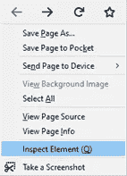
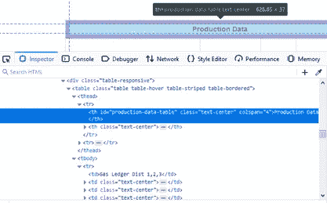
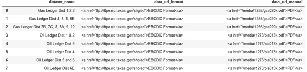
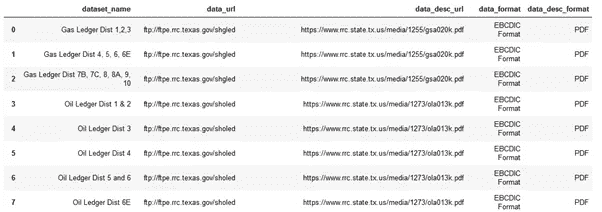
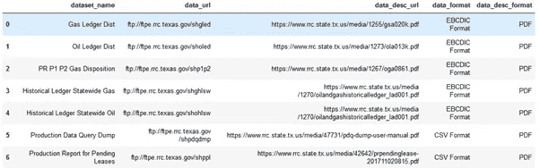
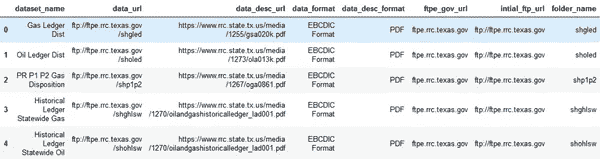
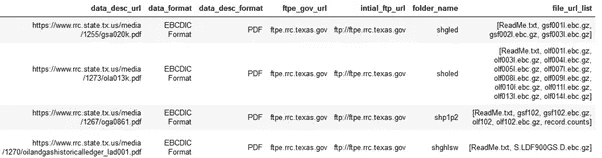
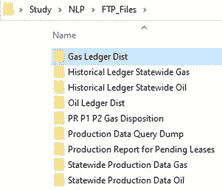
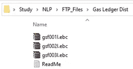

# 网页抓取，处理 FTP 服务器和其他事情——一切尽在其中

> 原文：<https://medium.com/analytics-vidhya/web-scraping-dealing-with-ftp-servers-and-other-things-all-in-one-a07b61421d14?source=collection_archive---------7----------------------->

# 介绍

在这篇文章中，我将介绍用于网页抓取的 Python 代码，如何处理网页中的表格以及如何从 FTP 服务器下载文件。

网络抓取是一种从网站提取数据并以逻辑格式存储在本地文件或云中的技术。Web 抓取的工作原理是遍历网站的 HTML 代码，并根据网站的各种标签从中提取数据。

我们将抓取德州铁路公司的网站,从那里的 FTP 服务器下载一些文件。这是一个相当复杂的网站，不同的数据集出现在多个表格中。每个表格有 5 列。我们对以下栏目感兴趣

1.  数据集名称和描述—数据集的名称
2.  下载—链接到可以下载文件的 FTP 服务器
3.  手动—下载列中文件的描述

# 假设

文章假设——

1.  你知道网页抓取的需求和使用案例——为什么需要等等。
2.  您对 HTML 及其各种标签有基本的了解

# 步骤 1 —检查网页

web 抓取的第一步**是检查网页，找到标签，从那里提取数据。数据通常深埋在嵌套标签中。因此，我们检查网页，看看我们想要抓取的数据嵌套在哪个标签下。要知道标签，右击元素并从菜单中选择*检查元素(Q)* 。**

右键菜单

在检查器框中，我们发现我们正在寻找的数据在带有`id = "production-data-table"`的表的主体`<tbody>`中。因此，要提取数据，首先我们必须定位表，然后定位它的 body 标签。

检查员箱

# 第二步——获取网页

**第二步**是获取网页。Python 中的`request`包用于获取 URL 的详细信息。

请求页面

# 步骤 3 —从网页中提取数据

第三步是从我们在第一步中确定的相关部分中提取数据。

在内存中获得页面后，我们总是检查状态代码以确保页面下载成功(`page.status_code == 200`)。为了遍历网页，我们将使用`BeautifulSoup` Python 包。soup 对象使我们能够轻松地浏览网页的各种标签。

从网站提取信息的这一步骤总是为手头的网站定制的，因为网页的结构、标签和 id 会因网站而异。所以下面的代码是为德州铁路公司网站定制的。

正如在步骤 1 中已经发现的，我们要提取的数据在生产数据表中。这方面的代码如下。

从页面提取数据

至此，我们已经将所有需要的数据提取到一个数据帧中。重命名列，以便于参考。

重命名列以便于处理

数据帧如下所示

带有网页表格数据的数据框

# 步骤 4 —清洁数据框

清理数据帧，轻松提取有意义的信息。创建了 4 个新列来存储 url 和格式。

清理数据帧以进行处理

更新后的数据帧如下所示

`data_url`和`data_desc_url` 列中的信息是重复的，意味着前 3 行的数据是相同的，即所有天然气分类帐分布和所有石油分类帐分布等的数据。是一样的。所有与天然气分类帐、石油分类帐等相关的数据。应该下载到不同的文件夹中。进一步清理数据帧以仅保留唯一的行。

在正则表达式处理后只保留唯一的行

上面的代码导致

唯一数据

# 步骤 5-从 FTP 服务器提取文件列表

【ftp://ftpe.rrc.texas.gov/shgled 中的 URL 是保存所有文件的目录的链接。要提取文件列表，我们必须将 FTP 基本 URL 和文件夹名称分开。

## 步骤 5A —使用 FTP 基本 URL 和文件夹创建列

使用 regex 为 FTP 基本 URL 和文件夹名称创建新列

使用 FTP 基本 URL 和文件夹名称创建新列

带有 FTP 基本 URL 和文件夹名称的数据帧

## 步骤 5B —提取文件列表

Python 包`ftplib`用于从 FTP 服务器提取信息。首先，我们必须登录到 FTP 服务器，改变工作目录，然后提取文件列表。

提取文件列表

执行上述操作后的数据帧为

具有新列的数据帧，包含 FTP 服务器中的文件列表

# 步骤 6-从 FTP 服务器下载文件

首先基于`dataset_name`列创建文件夹。创建文件夹后，根据`file_url_list`栏中的文件列表下载文件。从 FTP 和 HTTP 服务器下载文件是不一样的。从 FTP 服务器下载文件的步骤是不同的。下载文件的代码如下

从 FTP 服务器下载文件

执行上述代码后，将创建新的文件夹和文件。

创建的文件夹

# 结论

在这篇文章中，我详细描述了抓取网页、从网页表格中读取数据以及从 FTP 服务器下载文件所需的步骤。