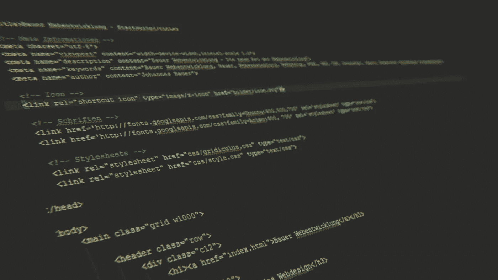

# 使用 BeautifulSoup 的 Python 抓取示例

> 原文：<https://medium.com/analytics-vidhya/web-scraping-example-in-python-using-beautifulsoup-ed7db83d690?source=collection_archive---------19----------------------->

有一次我正在开发一个 React 本地移动应用程序，我需要从“万维网”上获取大量数据，而我几乎没有时间去获取它们。(没有时间手写。)作为一个渴望学习新技术的人，我做了一些研究，发现了网络抓取的概念。经过更多的研究，我给了一个叫做 BeautifulSoup 的 Python Web 抓取库一个机会。

在这个故事中，我将以自己的代码为例，尝试解释如何使用 Python 和 BeautifulSoup 库来执行基本的 web 报废。

顺便说一句，如果你合乎道德地使用，网络废弃并不违法。如果你使用的数据已经对所有人公开，那就不应该，但是要注意所有的伦理方面。例如，由于太多的网络垃圾机器人导致网站带宽过载和流量中断，可能会产生一些非法后果。

我们先试着熟悉一下网页抓取的概念，好吗？为了使这个故事简短，我将引用维基百科，你可以在这里找到[的完整版本。](https://en.wikipedia.org/wiki/Web_scraping#:~:text=Web%20scraping%2C%20web%20harvesting%2C%20or,or%20through%20a%20web%20browser.)

> **网页抓取**、**网页抓取**或**网页数据提取**是用于从网站中提取数据的数据抓取。网络抓取软件可以使用超文本传输协议直接访问万维网，或者通过网络浏览器访问万维网。虽然 web 抓取可以由软件用户手动完成，但该术语通常指的是使用 bot 或 web crawler 实现的自动化过程。这是一种复制形式，从网络上收集并复制特定数据，通常复制到中央本地数据库或电子表格中，供以后检索或分析。

维基百科称术语“*虽然网络抓取可以由软件用户手动完成，但该术语通常指的是使用机器人或* ***网络爬虫*** *实现的自动化过程。这里写的是网络爬虫，但我认为我们也应该知道网络抓取和网络爬行的区别。*

简单来说，**网络搜集**就是以自动化的方式从网站中提取数据的行为。这是对网页的程序化分析，以便从中下载信息。例如:假设您想从一个电子商务网站中提取特定产品的价格。您编写了一个 web scraper，通过编程从电子商务网站获取 HTML。

另一方面，**网页抓取**往往是略有不同的技术。它基本上是一个系统地浏览(读取抓取)万维网的互联网机器人，通常用于 Web 索引。您将一个种子 URL 加载到一个 crawler，它会索引该 URL 的每个子域，并复制数据以供进一步分析。搜索引擎使用网络爬行来索引互联网上的所有内容。

在基本介绍之后，我们可以继续看编码示例。这个小应用程序是用 Python 开发的，使用 BeautifulSoup 库作为 web 抓取库。

首先要做的事。我们需要导入相关的库。

导入 **BeautifulSoup** 以便使用著名的 web scrapper 库。导入 **urllib.request** 以打开对特定 URL 的 HTTP 请求。更详细的解释:[https://docs.python.org/3/library/urllib.request.html](https://docs.python.org/3/library/urllib.request.html)。

此外，如果您需要解析来自 URL 的数据，请导入 **re** (用于正则表达式)或任何其他模块。

导入之后，要做的第一件事是获取主 URL 并打开到该 URL 的连接。我想将从连接中获得的数据存储在一个文本文件中，所以我也打开了一个文件连接。

我们目前没有做任何废弃，只是打开了一个到 URL 的连接，读取了所有的 HTML 数据并关闭了连接。现在，是时候解析 HTML 数据并从中提取一些有意义的信息了。

上面的代码行在我的经验中非常重要。大多数时候，BeautifulSoup 可以正确地计算出一个站点的字符编码，但有时情况并非如此。有时它不能得到正确的编码，这让我很头疼。所以，为了绝对安全，我用上面的代码告诉 BeautifulSoup 他需要如何解析来自 URL 的 HTML 数据。在大多数情况下，字符编码是 UTF-8，数据是 HTML 格式。

有很多不同的方法来识别你的目标 html 元素，比如元素标签名，id，类名，甚至是样式。我使用了其中一些方法来获得我需要的数据。我想从一个特定的表中获取所有的行，我使用它的元素 id 来访问表。之后，我只使用元素名访问了它的' *tbody'* ，并获得了所有使用' *tr* 标签的行。

所有行都有链接到网站子域地址的 URL。我的主要目标是遍历所有子域，并从这些子域的主表中获取所需的数据。

这并不总是可行的，但是在这里，我可以通过样式来区分它们，从而获得所需的表行。我想得到所有的表格行('*tr '【T1])，如果它们的'*风格'*属性不等于'*高度:46px '(这是表格标题的高度)。*然后，我继续从所需表格行的每个单元格中获取值。使用 *row.findAll('td')* 我得到了一个数组中的所有单元格。之后，我访问了' *a'* 标签，然后访问了它的' *href'* 标签，并将它们存储在一个名为 *allURLs* 的数组中。*

现在，我已经得到了所有子域的 URL。是时候遍历所有的 URL 并访问所需的表数据了。

在访问了表中所有的' *td* 之后，我通过检查一个特定列的文本值来忽略它。剩下的就是应用一些操作，只是为了从我搜集的数据中提取有意义的数据。最后，我关闭了文件阅读器，打印出了一条基本信息。

这是对使用 Python 的 BeautifulSoup 库进行 web 废弃的快速介绍。这个库本身还有更多的东西，但即使是这几行代码也帮助我在几分钟内获得了近 25 万行有意义的数据。Web 抓取是一种从 web 中提取数据的强有力的方法，在很多领域都非常有用。除了 BeautifulSoup，还有其他有用的库。我鼓励你去看看。

您可以在这里获得这个基本概念验证的完整源代码:[https://github.com/ismailgok33/UniversityInfo-WebScrapper](https://github.com/ismailgok33/UniversityInfo-WebScrapper)。我希望这非常有帮助。保持健康。