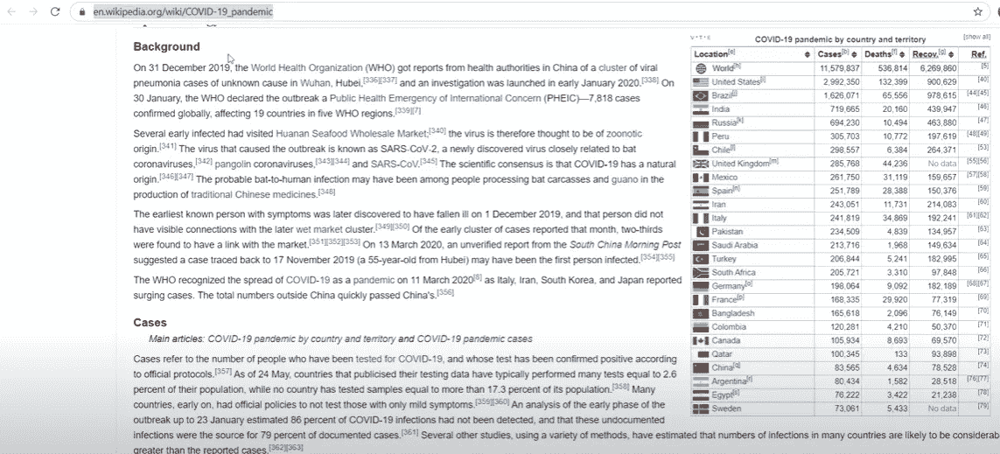
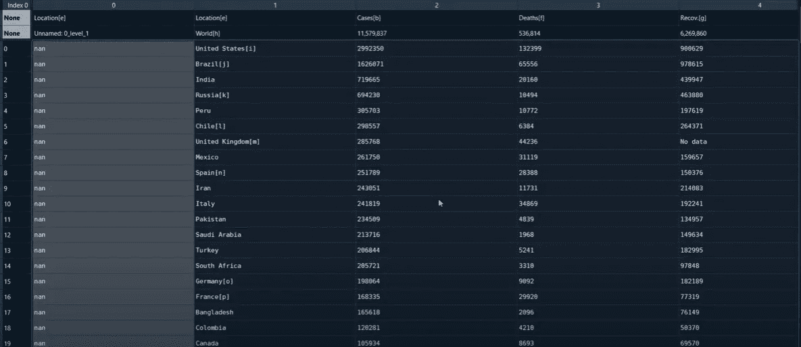
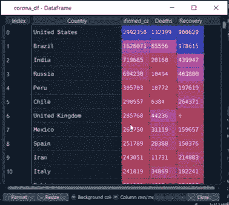
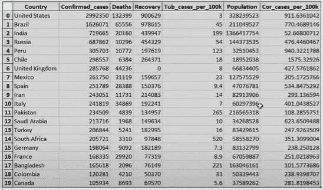
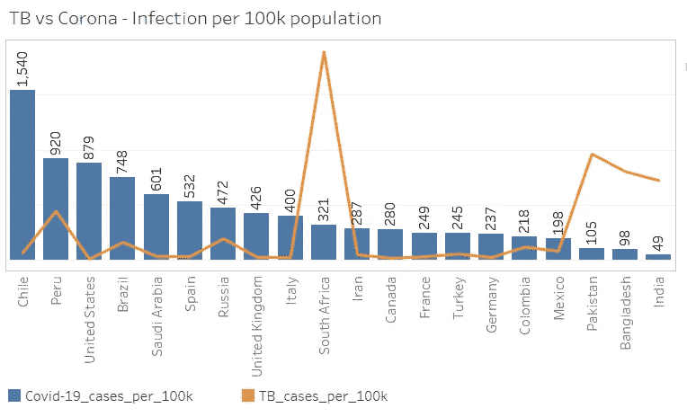

# Web 抓取:用 Python 提取、清理和组织数据

> 原文：<https://medium.com/analytics-vidhya/web-scraping-extracting-cleaning-and-organizing-data-with-python-d603bad1804?source=collection_archive---------7----------------------->


> 这是一个简短的数据准备项目，使用 Python 从 web 源中提取冠状病毒和结核病数据，并为分析做好准备

# **背景**

好奇心是一种在当今世界推动一个人或一个组织发展的特质。这也是我开始这个项目的原因。随着所有关于电晕病毒病例的讨论，以及世界如何努力解决它，在某个时间点上，恐惧变成了沮丧，我开始想知道其他主要感染，以及为什么我不记得世界被病毒影响到这种程度。可能是因为自己的意识有限，但后来还是决定用数据去验证一下。

这个想法是为了了解肺结核和冠状动脉疾病之间的相互比较。虽然网上有许多数据源提供了随时可用的冠状病毒数据集进行分析，但我更感兴趣的是弄脏我的手，从头开始获取一切，只是为了好玩。

# 数据源

维基百科和世界银行是我在项目中使用的两个网站。我使用维基百科获得冠状病毒数据，使用世界银行网站获得结核病和人口数据点。

以下是我们针对 web scrap 的数据如何放置在维基百科中的快照。

> 请注意，由于维基百科的数据和结构随着时间的推移不断变化，下面的方法可能需要改变一点，但总体概念将保持不变。



维基百科中的电晕病毒数据

世界银行网站上有我们正在寻找的 excel 附件形式的数据，可以下载，因此我们将使用的策略与我们为维基百科所做的略有不同，也简单得多。

# 网页抓取

我们将使用 pandas 和 python 中的请求库进行 web 废弃。

> Pandas 是一个强大的数据分析和操作库。它的关键数据结构称为数据框，用于将表格数据存储在观察数据行和变量列中。
> 
> 请求库用于使 HTTP 请求更简单、更人性化。

下面的代码将从 Wikipedia 链接中提取数据，并将其存储到名为 corona_df 的数据帧中。

```
##Step 1 Data extraction
url = ‘[https://en.wikipedia.org/wiki/COVID-19_pandemic'](https://en.wikipedia.org/wiki/COVID-19_pandemic')req = requests.get(url, timeout=10)
list1 = pd.read_html(req.text)
corona_df = list1[4]
```

由于上面的代码，corona_df 数据帧出现如下。



通过网页抓取提取的数据

如果我们查看从维基百科中提取的上述数据，我们将能够看到标题和列没有正确对齐。在我们使用这些数据进行消费之前，需要对其进行适当的清理。

下面这组代码将清除我们数据中的不一致。

```
## step 2 data cleansingcorona_df.columns = [‘0col’, ‘Country’, ‘Confirmed_cases’, ‘Deaths’, ‘Recovery’, ‘lastCol’]
corona_df.drop([‘0col’, ‘lastCol’], axis=1, inplace = True)### unused rows
corona_df.drop([corona_df.index[-1], (corona_df.index[-1])-1], inplace = True)### Country name cleaning
corona_df[‘Country’] = corona_df[‘Country’].str.replace(‘\[.*\]’,’’)
cols = [‘Confirmed_cases’, ‘Deaths’, ‘Recovery’]
corona_df[cols] = corona_df[cols].replace(‘No data’,0)### Data types
corona_df[‘Confirmed_cases’] = pd.to_numeric(corona_df[‘Confirmed_cases’])
corona_df[‘Deaths’] = pd.to_numeric(corona_df[‘Deaths’])
corona_df[‘Recovery’] = pd.to_numeric(corona_df[‘Recovery’])
```

清理完成后，数据框将看起来整洁干净，如下图所示。



数据清理后的数据帧

我们同样会从世界银行网站上提取数据，并根据需要清理数据。下面的代码从世界银行网站上提取结核病数据。

```
# Tuberculosis
## step 1 data extractiontub_df = pd.read_excel(‘[http://api.worldbank.org/v2/en/indicator/SH.TBS.INCD?downloadformat=excel'](http://api.worldbank.org/v2/en/indicator/SH.TBS.INCD?downloadformat=excel'))### columns and unused rows
tub_df.drop([tub_df.index[0], tub_df.index[0]+1], inplace = True)
tub_df.reset_index(inplace = True)### replacing header
header = tub_df.iloc[0]
tub_df_2 = tub_df[1:]
tub_df_2.columns = header### filter and rename column names
tub_df_2 = tub_df_2.filter([‘Country Name’,2018.0])
tub_df_2.rename(columns={2018.0:’Tub_cases_per_100k’}, inplace = True)### fill nan with zero and manage nomenclature
tub_df_2.fillna(0, inplace = True)
tub_df_2[‘Country Name’] = tub_df_2[‘Country Name’].replace({‘Iran, Islamic Rep.’ : ‘Iran’,
 ‘Russian Federation’ : ‘Russia’})### join
corona_tub_join = pd.merge(corona_df, tub_df_2, left_on=’Country’, right_on=’Country Name’, how=’left’)
```

> 请注意，我们从世界银行网站上提取的结核病数据是以“每 10 万人口中的结核病病例”为标准的。因此，我们必须使用人口数据点将冠状病毒病例也转换为“每 10 万人口的冠状病毒病例”。

为了从世界银行网站提取人口指标，并计算冠状病毒指标以与结核病进行比较，使用了以下代码。

```
# world population
## step 1 data extractionpop_df = pd.read_excel(‘[http://api.worldbank.org/v2/en/indicator/SP.POP.TOTL?downloadformat=excel'](http://api.worldbank.org/v2/en/indicator/SP.POP.TOTL?downloadformat=excel'))### columns and unused rows
pop_df.drop([pop_df.index[0], pop_df.index[0]+1], inplace=True)
pop_df.reset_index(inplace=True)### replacing header
header = pop_df.iloc[0]
pop_df_2 = pop_df[1:]
pop_df_2.columns = header### filter and rename column names
pop_df_2 = pop_df_2.filter([‘Country Name’, 2019.0])
pop_df_2.rename(columns={2019.0: ‘Population’}, inplace = True)### manage nomenclature
pop_df_2[‘Country Name’] = pop_df_2[‘Country Name’].replace({‘Iran, Islamic Rep.’ : ‘Iran’,
 ‘Russian Federation’ : ‘Russia’})### Final join
Final_data = pd.merge(corona_tub_join, pop_df_2, left_on=’Country’, right_on=’Country Name’, how=’left’)
Final_data.drop([‘Country Name_x’, ‘Country Name_y’], axis=1, inplace=True)### calculating corona cases per 100k population
Final_data[‘Cor_cases_per_100k’] = Final_data[‘Confirmed_cases’]/((Final_data[‘Population’]/100000))
```

> 请注意，来自不同来源的数据被整合成一个干净完整的数据源，我们可以使用它进行分析。为了限制整合期间的问题，我们将只考虑 corona 案例最多的 20 个国家进行分析。

下面的代码将只过滤我们将用于分析的前 20 个国家，并将其导出到 excel 文件中以供使用。

```
Final_data_Top_20 = Final_data[0:20]## Data for analysis
Final_data_Top_20.to_excel(‘Cor_Tub_Data_Test.xlsx’)
```

最后，正如我们在下面的快照中看到的，数据已准备好进行分析。



用于分析的最终数据

上述数据可用于执行分析和生成见解。我在 Tableau 中整理的一个简单视图(下面附上快照)展示了一些有趣的见解。我将留给你们去发现洞见并形成你们的理论。



电晕和肺结核的对比快照

# 结论

让我们的手接触数据和技术是提高我们的技能并迈向下一个层次的唯一途径。虽然上述所有活动都可以在 Excel 中以最小的复杂性完成，但我之所以要这么做，是为了掌握最终会在更复杂的场景中使用的技能，在这些场景中，手动工作方式根本不可行。

我希望这有助于激发你的好奇心！！！

我还制作了一个关于这个项目的 YouTube 视频(附后)，如果需要的话，会提供更多的细节和解释。