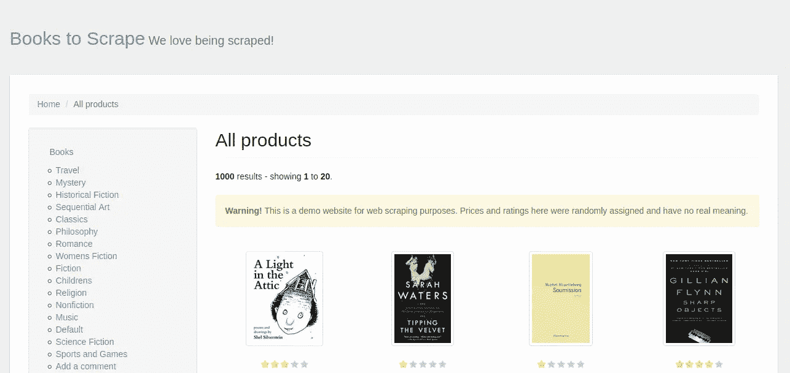
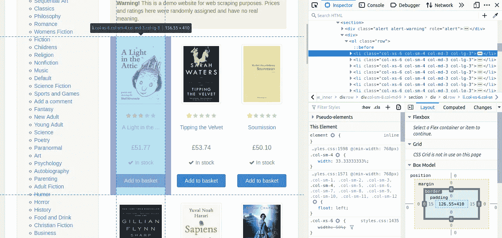
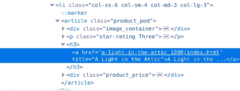
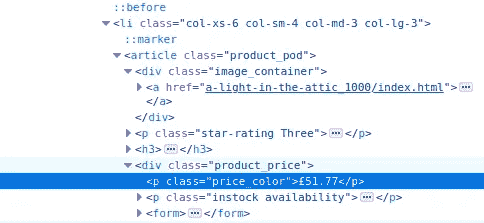
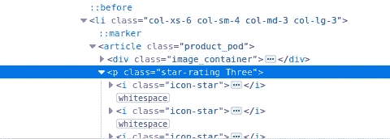
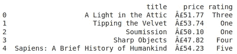
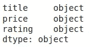
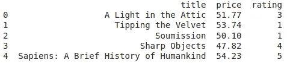
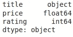

# 面向使用 Python 的初学者的 Web 抓取

> 原文：<https://medium.com/analytics-vidhya/web-scraping-for-beginners-using-python-73f0966d895f?source=collection_archive---------17----------------------->


这本终极指南将帮助你从头开始创建自己的数据集。它旨在检查网页上的 HTML 元素，理解网页的结构，数据构建，数据清洗和数据格式化。

# **什么是网页抓取？**

[网络抓取](https://en.wikipedia.org/wiki/Web_scraping)、网络采集或网络数据提取是用于从网站提取数据的数据抓取。网络抓取软件可以使用超文本传输协议直接访问万维网，或者通过网络浏览器访问万维网。这是一种复制形式，从网络上收集并复制特定数据，通常复制到中央本地数据库或电子表格中，供以后检索或分析。

# **你需要的东西**

1.  python 基础知识(别急，我一步一步指导你)。
2.  渴望学习:-)
3.  任何具有所需库的 python 解释器。我将使用谷歌可乐。

# 要刮的网站

由于这是一个初学者友好的指南，我们将刮一个网页，这是一个假的图书图书馆。这是一个[网站](http://books.toscrape.com/catalogue/page-1.html)的意思是要刮。



[http://books.toscrape.com/catalogue/page-1.html](http://books.toscrape.com/catalogue/page-1.html)

> **警告:**如果你试图从另一个网站抓取数据，请记住使用条款，通常在 robots.txt 文件中定义。所以做个好网民，负责任地刮刮吧。

# **所需工具**

*   [请求](https://requests.readthedocs.io/en/master/):允许你发送 HTTP 请求。
*   [beautiful soup](https://www.crummy.com/software/BeautifulSoup/bs4/doc/):**用于从 HTML 和 XML 文件中提取数据。**
*   **[熊猫](https://pandas.pydata.org/):用于`DataFrame`创作，数据清理和分析。**

# **让我们开始吧！**

## **导入库**

**首先，我们将这些库导入到我们的代码编辑器中。**

```
import requests
from requests import get
from bs4 import BeautifulSoup
```

## **提出请求**

**在这里，我们将定义`url`变量并获取所需 URL 的内容。**

```
url = 'http://books.toscrape.com/catalogue/page-1.html'
results = requests.get(url)
```

**`results`变量存储我们的`request.get`动作。**

## **使用 BeautifulSoup**

```
soup = BeautifulSoup(results.text, 'html.parser')
print(soup.prettify())
```

*   **通过 BeautifulSoup 运行`results.text` 文档会给我们一个存储在`soup`中的`BeautifulSoup`对象。**
*   **在打印`soup.prettify()`时，我们可以在合适的树状结构中查看数据。代码的一些输出如下:**

```
<!DOCTYPE html>
<!--[if lt IE 7]>      <html lang="en-us" class="no-js lt-ie9 lt-ie8 lt-ie7"> <![endif]-->
<!--[if IE 7]>         <html lang="en-us" class="no-js lt-ie9 lt-ie8"> <![endif]-->
<!--[if IE 8]>         <html lang="en-us" class="no-js lt-ie9"> <![endif]-->
<!--[if gt IE 8]><!-->
<html class="no-js" lang="en-us">
 <!--<![endif]-->
 <head>
  <title>
   All products | Books to Scrape - Sandbox
  </title>
  <meta content="text/html; charset=utf-8" http-equiv="content-type"/>
  <meta content="24th Jun 2016 09:30" name="created"/>
  <meta content="" name="description"/>
  <meta content="width=device-width" name="viewport"/>
  <meta content="NOARCHIVE,NOCACHE" name="robots"/>
  <!-- Le HTML5 shim, for IE6-8 support of HTML elements -->
  <!--[if lt IE 9]>
        <script src="//html5shim.googlecode.com/svn/trunk/html5.js"></script>
        <![endif]-->
  <link href="../static/oscar/favicon.ico" rel="shortcut icon"/>
  <link href="../static/oscar/css/styles.css" rel="stylesheet" type="text/css"/>
  <link href="../static/oscar/js/bootstrap-datetimepicker/bootstrap-datetimepicker.css" rel="stylesheet"/>
  <link href="../static/oscar/css/datetimepicker.css" rel="stylesheet" type="text/css"/>
 </head>etc...
```

## **数据结构**

**我们想要抓取书名、产品价格及其评级，因此定义这些列表来存储数据。**

```
book_title = []
product_price = []
star_rating = []
```

## **检查元件**

**现在我们需要找到我们想要的数据在哪里。右键单击并检查元素。您的屏幕应该是这样的:**

****

**显而易见，我们想要的数据位于`li`容器中。**

**`li`容器有一个`class`属性，该属性有四个值`col-xs-6`、`col-sm-4`、`col-md-3`和`col-lg-3`。**

****查找所有** `li` **容器****

```
book_div = soup.find_all('li', class_='col-xs-6 col-sm-4 col-md-3 col-lg-3')
print(book_div)
```

**`find_all()`帮助我们找到所有带有`li`标签且`class`属性具有值`col-xs-6`、`col-sm-4`、`col-md-3`和`col-lg-3`的容器，并将它们存储在`book_div`变量中。`book_div`是所有容器的列表，看起来像这样:**

```
<li class="col-xs-6 col-sm-4 col-md-3 col-lg-3">
<article class="product_pod">
<div class="image_container">
<a href="a-light-in-the-attic_1000/index.html"></a>
</div>
<p class="star-rating Three">
<i class="icon-star"></i>
<i class="icon-star"></i>
<i class="icon-star"></i>
<i class="icon-star"></i>
<i class="icon-star"></i>
</p>
<h3><a href="a-light-in-the-attic_1000/index.html" title="A Light in the Attic">A Light in the ...</a></h3>
<div class="product_price">
<p class="price_color">£51.77</p>
<p class="instock availability">
<i class="icon-ok"></i>

        In stock

</p>
<form>
<button class="btn btn-primary btn-block" data-loading-text="Adding..." type="submit">Add to basket</button>
</form>
</div>
</article>
</li>
```

## **创建一个循环**

**因为我们需要遍历所有需要的`li`容器来抓取数据，所以我们使用了一个`for`循环。**

```
for container in book_div:
```

## **获取书名**

****

**书籍`title`嵌入`a`，依次嵌入`h3`、`article`中的`h3`、`li`中的`article`。**

```
name = container.article.h3.a['title']
book_title.append(name)
```

*   **`name`变量现在包含了书名。**
*   **是我们的迭代器**
*   **`.article`、`.h3`和`.a`是属性符号，告诉 scraper 访问这些标签中的每一个。**
*   **`[‘title’]`告诉 scraper 获取存储在`a`标签的`text`属性中的字符串。**
*   **`name`被添加到`book_title`列表中。**

## **获取产品价格**

****

**类似于我们如何找到书名，产品价格被嵌入在`p`中，依次被嵌入在`div`、`article`中的`div`和`li`中的`article`。但是，`article`标签包含两个`div`标签，所以我们需要找到`div`标签，其`class`属性等于`product_price`。**

```
price = container.article.find('div',class_='product_price').p.text
product_price.append(price)
```

*   **`price`变量包含产品价格。**
*   **我们在`.article`属性上应用`find()`来获得具有特定属性的特定标签。**
*   **`.p`是否提取了所需`div`标签上应用的属性符号。**
*   **`.text`告诉刮刀抓取文字。**
*   **`price`被追加到`product_price`列表中。**

## **获得星级**

****

**星级位于`article`标签中的第一个`p`标签，所以我们可以很容易地去掉`class`属性中的最后一个字符串。**

```
rating = container.article.p['class'][-1]
star_rating.append(rating)
```

*   **评级变量包含星级。**
*   **`.article`和`.p`是属性符号，告诉 scraper 访问这些标签中的每一个。**
*   **`[‘class’][-1]` : [-1]表示最后一个元素。例如上图中的“三”。**
*   **`rating`被添加到`star_rating`列表中。**

**至此，我们已经完成了数据创建。**

# **创建数据框架**

**首先，导入 pandas 库来创建一个数据框架并清理数据。**

```
import pandas as pd
```

**我们将把所有的列表合并成一个字典，用于创建数据帧。**

```
col_dict = {'title':book_title, 'price':product_price, 'rating':star_rating}
```

**将此 col_dict 作为参数传递给 DataFrame 函数，如下所示:**

```
book_store = pd.DataFrame(col_dict)
```

**检查前五行和所有列的数据类型**

```
print(book_store.head())
print(book_store.dtypes)
```

****

**book_store.head()**

****

**book_store.dtypes**

# **数据清洗！**

**我们所有的列都是对象类型，和字符串类型一样。这是`title`列所需的类型，但不是`price`和`rating`列所需的类型。它们应该分别是浮点和整数数据类型。**

## **清洗价格**

**为此，我们需要忽略`price`列下每个字符串的前两个字符。然后，将剩余的包含数字的字符串类型转换为浮点数。**

```
book_store['price'] = book_store['price'].apply(lambda x: float(x[2:]))
```

*   **`book_store[‘price’]`是我们`DataFrame`中的价格数据。我们正在把新清理的数据分配给我们的`DataFrame`。**
*   **`apply()`用于对`price`列下的所有元素进行操作。**
*   **`lambda x`是一个单行函数，它以单行作为参数，并将参数类型转换为`float`。**

## **清洁等级**

**这是一个可选步骤。但是我感觉`rating`列应该是整数格式的。将字符串形式的数字映射到整数的最简单方法是为其创建一个映射字典。我们可以把字典定义为:**

```
number_mapping = {'One':1,'Two':2,'Three':3,'Four':4,'Five':5}
```

**我们将以整数格式将评级下的每个元素映射到其对应元素。**

```
book_store['rating'] = book_store.rating.apply(lambda x : number_mapping.get(x))
```

*   **`book_store[‘rating’]`是我们在`DataFrame`的评分数据。我们正在将我们新清理的数据分配给我们的`DataFrame`。**
*   **`apply()`用于对`rating`列下的所有元素进行操作。**
*   **`lambda x`是一个单行函数，以单行作为参数，返回对应的整数值。**

**我们将再次检查前五行和所有列的数据类型。**

```
print(book_store.head())
print(book_store.dtypes)
```

****

**book_store.head()**

****

**book_store.dtypes**

**这个现在看起来挺好的:-)的**

# **保存到 csv**

**我们可以将数据帧保存为 csv 文件以备将来使用。**

```
book_store.to_csv('book_store.csv')
```

**此处提供了整个代码的链接[。](https://github.com/kunalrustagi08/Python-Projects/blob/master/random/web_scrapping_for_beginners.py)**

# **结论**

**干得好。我们成功地抓取了一个网页，并在 pandas 中创建了一个数据框架。我们修订了:**

*   **HTML 元素的检查。**
*   **网页抓取。**
*   **列表、字典和 lambda 函数。**
*   **数据创建和清理。**
*   **`csv`文件创建。**

# **下次**

**在第二部分中，我们将收集列表中的所有书籍，这将涉及到对我们这里的最终代码的一些修改。**

> **编辑:我的下一篇关于构建网络爬虫的文章的链接可以在这里找到。**

**敬请关注，继续编码！**

# **关于我**

**你好。库纳尔·鲁斯塔吉，我是:P**

**如果你想问我任何问题，报告任何错误，建议改进或给予反馈，请随时联系我。**

**[LinkedIn](https://www.linkedin.com/in/kunal-rustagi):【https://www.linkedin.com/in/kunal-rustagi **

**【https://www.twitter.com/kunalr01】推特 : [推特](https://twitter.com/kunalr01)**

**[Github](https://github.com/kunalrustagi08):[https://www.github.com/kunalrustagi08](https://github.com/kunalrustagi08)**