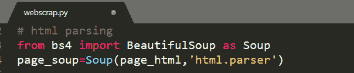

# 永久抓取网页

> 原文：<https://medium.com/analytics-vidhya/web-scraping-for-good-fd4aecb58b15?source=collection_archive---------19----------------------->

当我第一次听到刮网的时候，我的脑海里立刻浮现出刮菜器的画面！！！作为一名数据分析师，我想知道网页上的抓取器会是什么样子，因此我在这里记下了我学到的经验。

*先决条件*:

对 Python 和 HTML 标签的基本理解

**什么是网页抓取？**

网页抓取或数据抓取是从网页中检索信息并将其保存到可读文档中的过程。最简单的方法，即从互联网复制粘贴到我们的本地系统，也正在废弃。或许，网络抓取指的是将互联网上非结构化的、分散的数据以结构化的、人类可读的格式收集到一个地方。

**为什么网刮** **是** **最好的** **方法** **对于** **了解** **产品** **营销？**

在市场营销的世界里，分析网络数据以收集洞察力来制定你的营销策略总是必要的。由人类从网页中大量提取信息不仅是不可能的，而且使数据容易受到人为错误的影响。因此，为了克服这一点，网络抓取应运而生。

## 来刮刮现场吧！…但是怎么做呢？

将一只脚放在另一只脚的前面要容易得多——而不是恐惧地盯着整个徒步路线。因此，让我把网络报废任务分解成更容易实现的步骤:

在本文中，我从美国在线零售商 Newegg Inc .开始获取显卡的产品名称、品牌和运费。

在主页上，我们可以看到显卡的显示。

第一步:探索我们想要抓取的网页链接。我们需要理解 HTML 标签，使用 web 页面上的开发工具来检索信息。

*I* ***检查网页中的 HTML 元素***

在深入研究了网页内容之后，现在我们对 HTML 标签有了一个概念。(哦，这样一个令人惊叹的网站背后令人困惑的代码行，对！！)

**第二步**:使用***urllib . request***模块将网站的 HTML 代码加载到 Python 脚本中

**urllib** ，一个允许我们访问网站并与之交互的包。 **urllib.request，**用 **urlopen，**允许我们打开 URL。

**第三步:**“美汤”，使用 python 库对 HTML 结构化数据进行排序，从而能够与 python 脚本中的网页代码进行交互。现在，我们可以将所需的信息保存在本地文档中。

网页中的每个 HTML 元素都与“id”相关联，id 在页面上是唯一的。由于我们有兴趣获取图形卡的详细信息，让我们切换回页面的开发工具来定位包含所有*图形卡*名称的 HTML 对象。

我们可以看到，每个图形卡名称都包含在一个带有类' *item-container* '的

元素中。

在这里，我们姑且称之为**。在一个名为 page_soup 的漂亮的 Soup 对象上查找 all()** ,它给出一个可迭代的结果，其中包含显示在网页上的 12 个图形卡。让我们检查第一个图形卡的 HTML 标签细节:

看完第一张图形卡的所有标签，我才意识到，我们已经潜入了 HTML 元素的海洋，而 HTML 标签都漂浮在我们周围。接下来呢！！沉还是刮？？

让我们找到一个方法:

我们有关于图形卡的产品形象、价格、品牌、评论、评级的所有信息。但是现在让我们只关注与品牌、产品名称和运输价格相关的数据。

看啊！看啊！我们已经熬过了美妙的汤。通过添加。对于一个漂亮的汤对象，我们可以只恢复产品名称的 HTML 元素文本内容。

我们可以在 shipping price 中使用 strip()去掉多余的空白，因为我们正在处理 Python 字符串。

好吧！！运行该脚本后，结果看起来好了很多，尽管它很简洁和精确。最重要的是，最终没有弄乱结果中的标签。
这么多的变通方法来获得简单和结构化的数据，不是吗？

***结果:***

相同的结果将保存在 CSV 文件中，如下所示:

尽管网络抓取看起来像光栅标签，但重要的是，数据在商业中的使用效率如何。它可能是为了分析、可视化、持续的数据流入你的系统、商业评论、利润空间的建立，但是网络抓取应该合乎道德。除非有人试图抓取非公开数据，否则网络抓取是合法的。