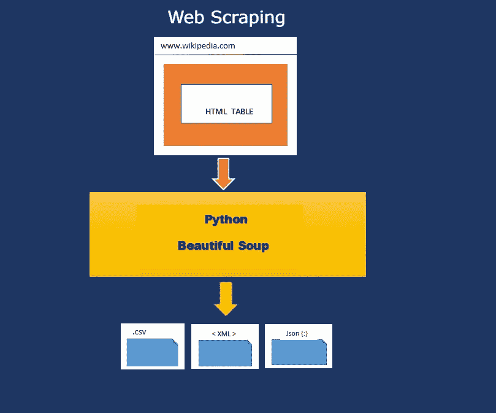
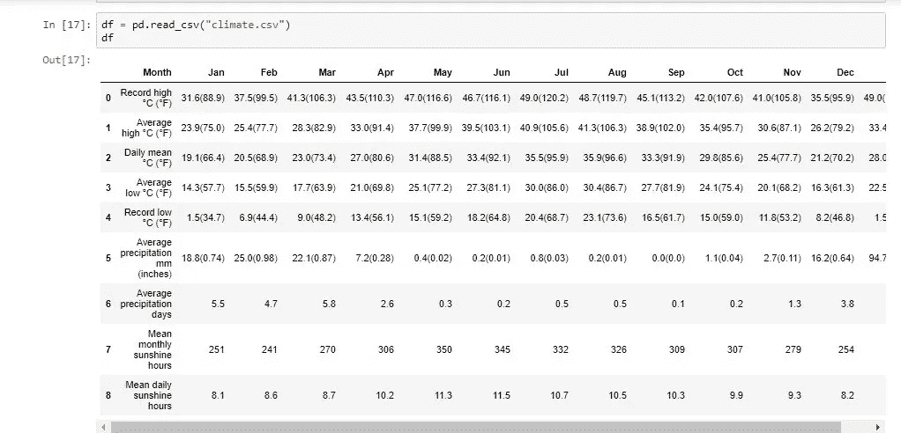

# 来自 Wiki 的 Web 抓取 html 表

> 原文：<https://medium.com/analytics-vidhya/web-scraping-html-table-from-wiki-9b18cf169359?source=collection_archive---------1----------------------->

## 用美汤从维基百科提取一个气候数据。



**网刮采用美汤。**

**“哪里有数据的硝烟，哪里就有生意的火。”—托马斯·莱德曼**互联网每天都充斥着海量数据。这个**数据**在应用之前是没有用的。数据科学家的工作包括收集大量难以处理的数据，并将其转换为更有用的格式。但是如何从毫无价值的垃圾中刮出有价值的数据呢？

接下来是 **BeautifulSoup，它是一个流行的 Python 库**，旨在快速从 html 垃圾中抓取有价值的数据。这种从网站下载大量信息的技术被称为“网络抓取”。 Beautiful Soup 位于流行的 Python 解析器之上，如**‘lxml’和‘html 5 lib**’。你所需要的只是对 HTML 的了解，你可以从 https://www.w3schools.com/那里学到这些。漂亮的 Soup library 解析数据，为你吐出树遍历的东西。因此，让我们看看如何从维基百科页面获取气候数据的 HTML 表格。

这个过程只有很少的基本步骤。只需几行代码，所需的数据就能以您想要的任何格式生成。csv、xml 和 json。

1.  **装美汤:** pip 装美汤 4
2.  **导入所需的库:urllib** 是一个标准的 Python 库，因此不需要安装任何额外的东西来运行这段代码，它包含了跨 web 请求数据、处理 cookies、甚至更改元数据(如标题和用户代理)的函数。

```
**import requests
import urllib.request
import pandas as pd
import csv
from bs4 import BeautifulSoup**
```

**3。获取您想要抓取的 URL:**本文将使用维基百科的 URL 来获取迪拜的气候数据，并使用下面的**请求库来访问它。在我们开始之前，请注意从任何网站收集数据并不总是合法的。我们需要在着陆前检查状态码。200 显示你可以继续下载。**

```
**url = 'https://en.wikipedia.org/wiki/Climate_of_Dubai'
response = requests.get(url)
print(response.status_code)
[out]: 200** 
```

**4。查看页面并详细检查:**从页面中找到想要解析的数据。右键单击数据并选择 inspect from chrome，查看数据中使用的所有 HTML 元素。下图显示了我们将使用 Beautiful Soup 处理的表格数据。


**迪拜的气候数据**

**5。**让我们开始使用**美汤**解析杂乱的 html 数据，以获得结构化数据。在本例中，BeautifulSoup 库中最常用的对象是 BeautifulSoup 对象“Soup”。为了缩短长度，我在这里避免了整个输出。但是输出显示了两个表，其中我们需要第二个表的类属性“**可折叠”。**

**soup = beautiful soup(response . text，" html.parser")
soup**

```
Out[3]:
<table class="**wikitable collapsible**" style="width:100%; text-align:center; line-height: 1.2em; margin:auto;">
<tbody><tr>
<th colspan="14">Climate data for Dubai
</th></tr>
<tr>
<th scope="row">Month
</th>
<th scope="col">Jan
</th>
<th scope="col">Feb
</th>
<th scope="col">Mar
</th>
<th scope="col">Apr
</th>
<th scope="col">May
</th>
<th scope="col">Jun
</th>
```

**5。提取表格的代码:**使用这个 BeautifulSoup 对象，我们可以使用 **findAll** 函数提取一个 Python 列表，该列表是通过只选择<类中的文本找到的:“collapsible”>。 **find** 方法用于从页面中获取第一个表格，而 **findAll** 方法获取所有表格。例: **findAll(标签，属性，递归，文本，限制，关键字)**

**find(标签，属性，递归，文本，关键字)。大多数时候，我们只需要标签和属性来获取数据。**

```
**table = soup.findAll('table',{"class":"collapsible"})[0]
values =[]
#There are 12 rows out of which we  need only rows from 1 to 11.
tr = table.findAll(['tr'])[1:11]**
```

**6。** **以所需格式存储数据:**我们需要以. csv 格式存储数据。所以使用< th >标签从表格中获取标题，使用< td >标签获取列中的数据。然后将获取的数据写入一个名为 climate.csv 的文件，并使用选项' wt '，newline = ' '用于避免两行之间出现任何换行符。如果文档没有指定编码，Beautiful Soup 检测不到编码，那么就给出编码。

```
**csvFile = open("climate.csv",'wt',newline='',encoding='utf-8')
writer = csv.writer(csvFile)  
try:   
        for cell in tr:
            th = cell.find_all('th')
            th_data = [col.text.strip('\n') for col in th]
            td = cell.find_all('td')
            row = [i.text.replace('\n','') for i in td]
            writer.writerow(th_data+row)      

finally:   
    csvFile.close()**
```

上述代码将输出一个 **climate.csv** 文件，如下所示:


**Climate.csv 文件**

我们还可以将 csv 文件进一步读入**熊猫**，如下图所示。



**将 climate.csv 读入熊猫**

这一切都是为了把谷物从谷壳中分离出来。这是完整的代码。

```
**#import libraries**
**import** requests
**import** pandas **as** pd
**import** csv
**import** urllib.request
**from** bs4 **import** BeautifulSoup**url = '**[**https://en.wikipedia.org/wiki/Climate_of_Dubai'**](https://en.wikipedia.org/wiki/Climate_of_Dubai') **response = requests.get(url)
print(response.status_code)
soup = BeautifulSoup(response.text,"html.parser")
table = soup.findAll('table',{"class":"collapsible"})[0]
tr = table.findAll(['tr'])[1:11]
csvFile = open("climate.csv",'wt',newline='', encoding='utf-8')
writer = csv.writer(csvFile)  
try:   
        for cell in tr:
            th = cell.find_all('th')
            th_data = [col.text.strip('\n') for col in th]
            td = cell.find_all('td')
            row = [i.text.replace('\n','') for i in td]
            writer.writerow(th_data+row)      

finally:   
    csvFile.close()**
```

不管你尝试过多少网页抓取代码，但是每次你做的时候，看到数据在 5 分钟内被轻松漂亮地抓取，程序员总是会兴奋不已，有点神奇；这就是美！现在继续尝试网页抓取和检查 Scrapy 和硒也。

我希望这篇文章内容丰富，增加了你的知识。如果你喜欢，请不要忘记点击下面的拍手图标。使用[https://github . com/Priya-Raja/Data-Science/blob/master/Web % 20 screwing . ipynb](https://github.com/Priya-raja/Data-Science/blob/master/Web%20Scrapping.ipynb)检查 github 中的代码