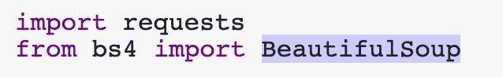
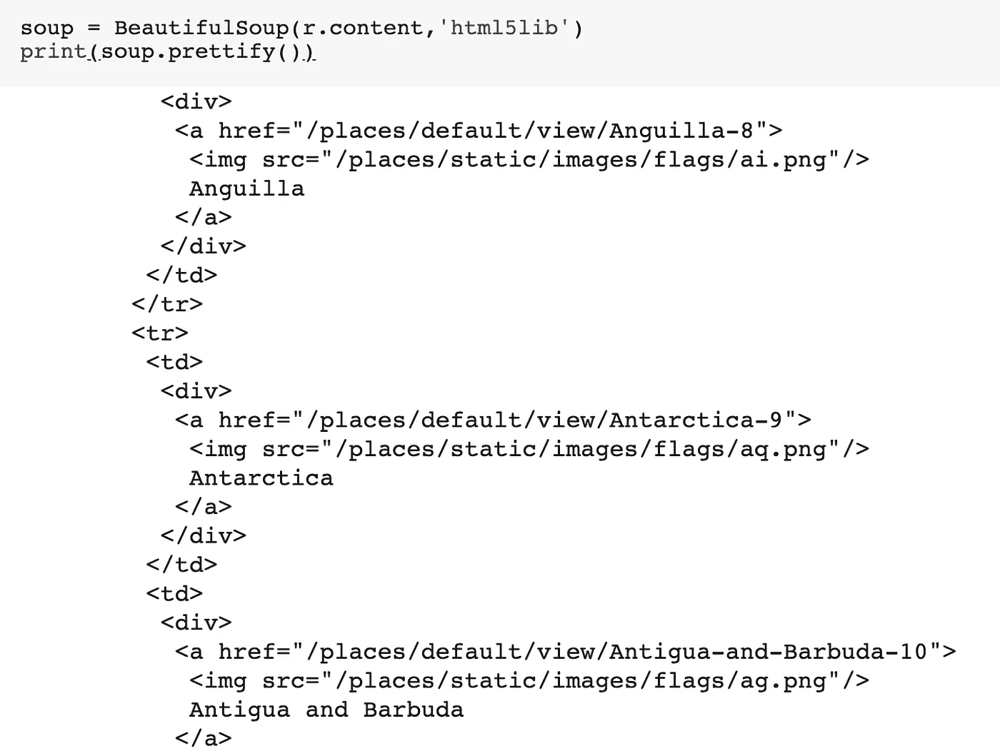
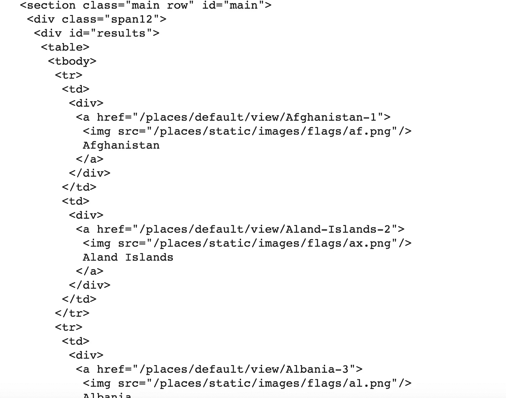
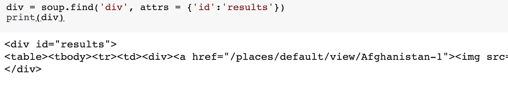
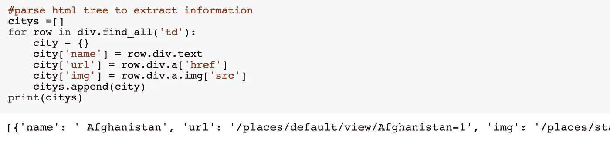
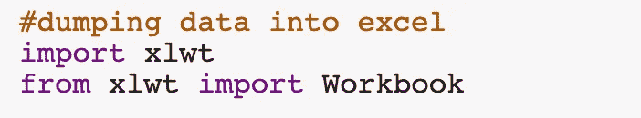
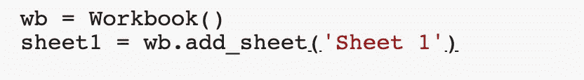
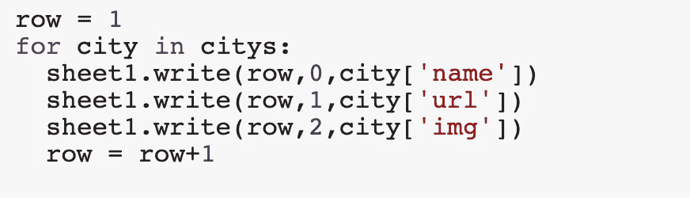
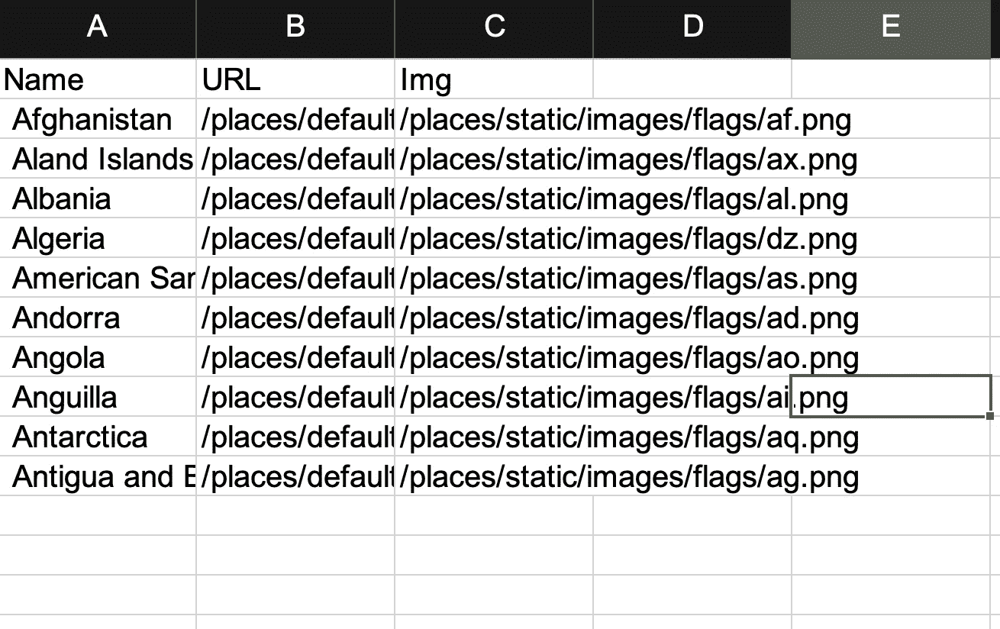

# Python 中的 Web 抓取

> 原文：<https://medium.com/analytics-vidhya/web-scraping-in-python-2b592dd48df?source=collection_archive---------11----------------------->


# **简介**

目前，世界正朝着数据科学和机器学习的方向发展。这些领域需要的燃料是数据，我们从以下两个主要来源获得数据:

> 1)使用 API:

这些 API 由允许检索数据的各种网站公开。示例:脸书图形 API

> 2)网页抓取:

在这种技术中，抓取网页以提取有用的信息。这种技术被称为网络抓取或网络采集或网络数据提取。

# **抓取网页的步骤:**

**第一步:**

安装所需的第三方库。这可以通过下面的命令来完成

```
pip install requestspip install html5libpip install bs4
```

**第二步:**

在 python 项目或您的笔记本中导入库



如果你想知道为什么我们需要这些库，我们在哪里使用它。别担心，我们会为您提供以下步骤:

**第三步:**

向您想要访问其数据的网页的 url 发送 HTTP 请求。在此步骤中，服务器将使用网页的 html 内容进行响应，该内容可用于提取数据。

使用请求库在 python 中发送 http 请求

让我们使用一个示例网站来看看如何做到这一点


**第四步:**

到目前为止，事情相当简单。现在让我们用 BeautifulSoup 来解析这个 html 响应，让它变得更有趣一些。这个库建立在各种库之上，如 html5lib、lxml、html.parser 等。

让我们在代码中使用它



这里，

> **r.content** :原始 HTML 内容。
> 
> **html5lib** :指定 html 解析器。
> 
> **soup . pretify():**它给出了从原始 HTML 内容创建的解析树的可视化表示。

**第五步:**

现在让我们搜索并解析我们在 soup 变量中得到的这棵树。如果你仔细观察，我们会对 id 为 的 ***div 的内容感兴趣***



我们可以用下面的行提取这个 div



**唷**！我们现在非常接近我们的数据。让我们在这个 div 上写一个循环，找到所有可以用来检索有用信息的 td。



在上面这段代码中，我们创建了一个字典来保存一行表中的所有信息。可以使用点符号来访问嵌套结构。为了访问 HTML 元素中的文本，我们使用了**。正文**

**第六步:**

**最后一步**！将这些数据转储到 excel 中。这包括几个子步骤:

1.  导入 excel writer(可使用 **pip install xlwt** 下载)



2.创建带有一个选项卡的 excel 工作簿



3.将标题信息写入此工作表 1


4.现在写下我们从网页上提取的信息



5.保存 excel


现在让我们看看我们的 excel 是什么样子的



**恭喜**！您已经成功抓取了一个网页，从中提取了有用的内容。同样，你也可以在其他网页上试试。

**我能抓取任何网站吗？？？**

你可以在几乎任何网站上进行抓取，大多数网站都倾向于实施屏蔽来防止他们的网站被抓取。您可以在 robots.txt 文件或服务条款中找到这些块。然而，这些规则决不是由法律强制执行的。