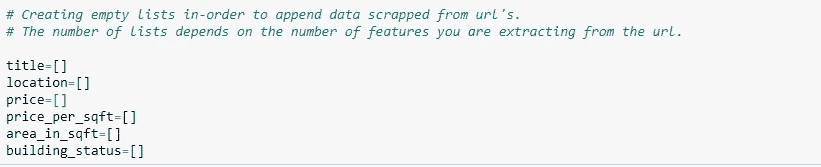
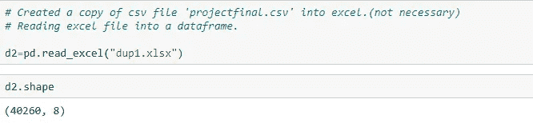
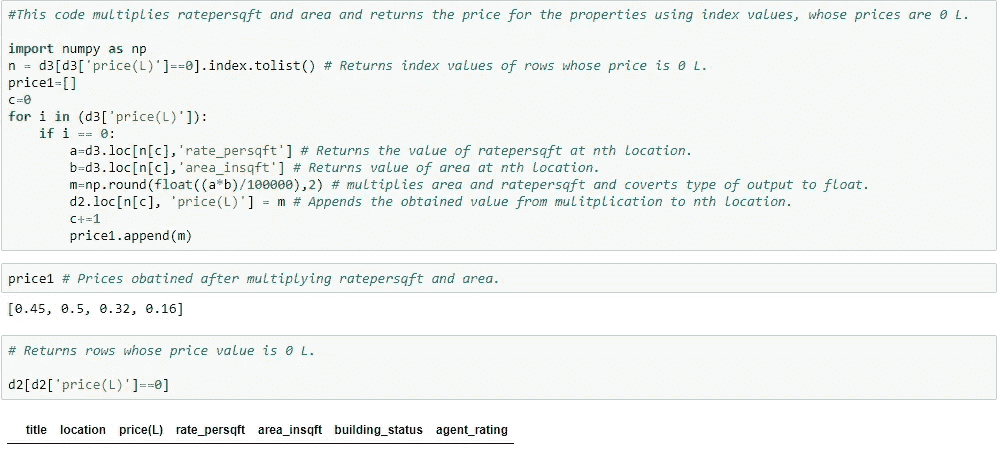

# Python 中用于数据提取和分析的 Web 抓取

> 原文：<https://medium.com/analytics-vidhya/web-scraping-in-python-for-data-analysis-6bf355e4fdc8?source=collection_archive---------4----------------------->

## 用于分析海德拉巴住宅物业的 web scraper。

再过两年，我父亲就要退休了，因此他想买一处住宅，以便退休后能在海德拉巴定居。了解到这一点后，我开始思考如何帮助他，然后决定利用这个机会提高我的 Python 技能。所以这个项目我需要两样东西:

1.  从最好的房地产网站之一收集并存储关于海德拉巴住宅物业的数据。
2.  对提取的数据进行 [EDA](https://en.wikipedia.org/wiki/Exploratory_data_analysis) (探索性数据分析)，获得所需的信息和数据洞察。

用来搭建平台的网站是 [makaan](https://www.makaan.com/hyderabad-residential-property/buy-property-in-hyderabad-city?budget=,&page=1) ，它是最好的房地产网站之一。所以这个 makaan 网站有关于不同类型的财产的所有细节，如公寓、住宅小区、别墅、个人住宅等。我们将提取所有属性的数据，然后从数据中获取所需的信息。

我们从导入必要的库开始。

美丽的汤将帮助我们阅读 Html 文件。它从响应中挑选文本，并以一种使我们更容易浏览其结构和获取其内容的方式解析信息。请求模块允许您使用 Python 发送 HTTP 请求。

HTTP 请求返回一个包含所有响应数据(内容、状态等)的响应对象。

以上是我们的网站，我们将从中提取数据。从网站上提供的数据中，我们选择所需的属性，并进一步提取这些属性的数据。现在要提取数据，右键单击任意属性并选择 inspect。

点击检查后，我们可以看到 Html 格式的源代码。现在选择你想从中提取属性数据的类。

假设我想提取资产的价格，现在我将选择包含资产价格的类。

现在，使用类名，我们可以提取如下数据，其中“持卡人”是包含所有属性数据的类。

考虑一个保存提取数据的列表。我们可以创建 n 个列表来存储 n 个属性的提取数据。

要一次从每个属性中提取每个属性的数据，需要大量的时间，因此我们将考虑一个 for 循环进行 n 次迭代，其中 n 是我们希望废弃的页数。

完整代码请点击 [Github](https://github.com/Bhargava-Sai-P/Residential-Property-Analysis/blob/master/1%20%26%202.%20Data%20Understanding%20%26%20Extraction%20.ipynb)

我们存储到列表中的提取数据现在存储在数据框中，如下所示。

从上面我们可以说，我们已经提取了 40260 行，即 40260 个具有 8 个特征/属性的行。

## 清理数据和检查缺失值的时间到了

检查[重复](https://365datascience.com/duplicate-records-sql/)，如果存在任何重复，则删除。

删除重复行后，我们剩下 25715 个数据点，其中几乎一半提取的数据点是重复的。这里，列的数量从 8 减少到 7，因为我们删除了不必要的具有索引值的列。现在，如果我们看看我们的最终数据，这是如何显示如下。

我们在数据集中的特征/属性是标题、位置、以 10 万卢比为单位的价格、rate_persqft、area_insqft、building_status、agent_rating。

*   **标题:**定义属性的标题名称，其数据类型为字符串
*   **location:** 定义属性的位置(区域)，其数据类型为字符串
*   **price(L):** 定义一个房产的价格，单位为 lakhs，数据类型为 float。
*   **rate_persqft:** 定义房产每平方英尺的费率，其数据类型为 int。
*   **area_insqft:** 定义属性的总面积，其数据类型为 int。
*   **building_status:** 定义建筑物的当前状态，数据类型为字符串
*   **agent_rating:** 定义客户对代理的评级，数据类型为 float。

检查是否有丢失的值，

在我们的数据集中，没有丢失的值:)我们甚至可以使用 IsNull [()](https://pandas.pydata.org/pandas-docs/version/0.17.0/generated/pandas.isnull.html) 函数来检查丢失的值。

让我们看看每一列中的最高值和最低值是什么。要获得这些数据，我们可以创建一个函数来返回列的最大值和最小值。

从上面我们可以看到，在价格一栏中，我们的最高价格为 7000 万卢比，最低价格为 0 万卢比。看到这里，我们有一个疑问，一个资产的价格怎么可能是 0。如果我们回到我们的提取代码，你可以发现，当一个属性的价格丢失时，我们用 0 替换它。所以我们可以得出结论，这里的 0 表示缺失数据。

我们可以使用插补以不同的方式处理缺失值，插补意味着用均值/中值/众数替换缺失值，或者删除行，这取决于您正在处理的数据。对于这种数据，我们不能用插补来代替数据，因为海得拉巴不同地点的房价会有所不同。

如果我们仔细观察我们的数据，我们可以理解，我们有一个物业的总面积和每平方英尺的价格。一个简单的解决方案是，我们可以将 area_in_sqft*rate_per_sqft 相乘，从而得出房产的价格。

我们可以看到没有价格值为 0 的行了。我们可以看到清理前和清理后的数据之间的差异，在平均值、中值、标准差等方面会有变化。

最后，我们可以将清理后的数据保存到新的 excel 或 CSV 或您希望的任何其他格式，以便您可以使用它进行进一步的分析。

我们可以看到，我们的最终数据由 25715 个数据点组成，即关于 25715 个属性和 7 个特征/属性的数据。

## 注意:

这篇关于 EDA 的文章有一个后续部分，是关于我们提取的这些数据的。你可以在我的故事中找到它，或者点击这里。

这个项目的完整代码，可以访问我的 Github。点击[此处](https://github.com/Bhargava-Sai-P/Residential-Property-Analysis/blob/master/1%20%26%202.%20Data%20Understanding%20%26%20Extraction%20.ipynb)或以下

 [## bhargava-Sai-P/住宅物业分析

### 此时您不能执行该操作。您已使用另一个标签页或窗口登录。您已在另一个选项卡中注销，或者…

github.com](https://github.com/Bhargava-Sai-P/Residential-Property-Analysis/blob/master/1%20%26%202.%20Data%20Understanding%20%26%20Extraction%20.ipynb) 

感谢阅读。