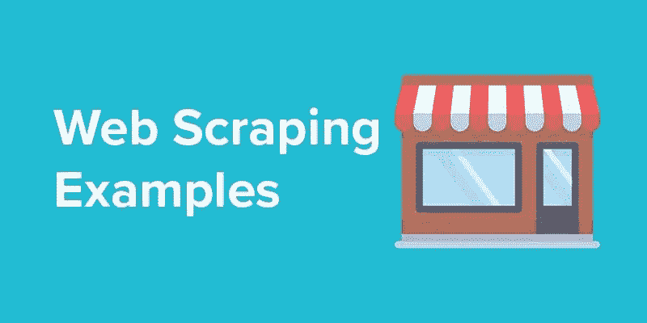

# 面向新手的 Python 网页抓取。

> 原文：<https://medium.com/analytics-vidhya/web-scraping-in-python-for-novice-58856d82e749?source=collection_archive---------13----------------------->

如果你是第一次做网络抓取，那你就来对地方了。我把我第一次做网络抓取时遇到问题的每一部分放在一起。如果你是第一次使用 Python，不确定语法，不要担心——冷静，不知道库——冷静。只要和我在一起，我们会一件一件地探索事物，让水果变得美味。

在这篇文章中，我们将使用 Jupyter 笔记本。如果你没有笔记本，你可以通过在命令行输入下面的代码很容易地得到。确保您的系统中安装了 python 如果没有，您可以点击 [**这里**](https://www.python.org/downloads/) 下载

以上命令将安装 Jupiter 笔记本，现在您可以在 Jupyter 笔记本中编写代码了。要打开笔记本，请在命令提示符下键入以下命令。

之后，你会在浏览器中看到一个打开的笔记本，如下图所示。

您可以在这里创建新的笔记本或打开以前的工作簿。现在，我们将按照以下步骤打开一个新笔记本。

点击右边的新建图标->选择 Python3 笔记本就这样，新的工作簿准备好了，我们可以开始编码了。

我们将从导入 web 抓取所需的库开始。我们需要请求，美女们。

现在，时候到了。选择你要废弃的网站，并准备好网址。在这里，我选择 **CBC** URL 来提取最新的政治新闻文章，并提取文章的标题和描述。

requests.get 将获取页面源，我们将输出存储在页面变量中。

接下来，我们将页面的 HTML 内容存储在 Soup 对象中。

现在我们将通过下面一行代码获取网页上的所有锚标签。使用“a”是因为锚标签用于源页面中的链接。

现在我们获取链接，并存储在一个名为 listofLinks 的列表中。

这里我们只关心提取政治新闻，所以我们过滤上面的结果，只提取与“政治”相关的链接，并再次存储在另一个名为 linksrequired 的列表中。

现在放松，我们擅长链接，我们需要从每个 URL 提取标题和描述。

成功提取数据后，下一步是将数据加载到 DataFrame 中，为此我们使用了 **pandas** 库**。**

因此，我们成功地完成了我们的任务，我们刮网站，提取标题，新闻文章的描述，并存储在熊猫数据帧。

到目前为止，我们很好，假设我们有一个场景，比如当我们抓取网站时，我们需要点击一些按钮，我们会怎么做？对于上面的例子，我们讨论了如果我们需要点击下面的 LOAD MORE 按钮来加载更多的文章。

在我的下一篇文章中，我将讨论 web 驱动程序，这样我们就可以点击网页上的按钮。

我希望你们都喜欢阅读这篇文章。如果有任何错误/疑问，请分享或评论。

谢谢你。

**# Python # web scraping # learning Python**