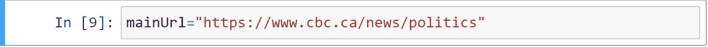

# Python 中的 Web 抓取第 2 部分——使用 Selenium Web 驱动程序

> 原文：<https://medium.com/analytics-vidhya/web-scraping-in-python-for-novice-part2-using-selenium-web-drivers-ef7e0a90490?source=collection_archive---------28----------------------->

在我们之前的文章中，我们讨论了如何为初学者做网页抓取，如果你还没有看到，那么 [**点击这里**](/@vinodnethichinna/web-scraping-in-python-for-novice-58856d82e749) 查看一下。我个人建议阅读我以前的文章，以便更好地理解第 2 部分。所以现在我们向前迈进一步，学习如何在抓取时点击网页上的按钮。这个场景的最佳用例是当我们抓取新闻网站时，你们都注意到我们有" ***【加载更多】*** 或" ***【点击此处获取更多文章】*** 按钮。

要点击这些按钮，我们需要安装网络驱动程序，在这篇文章中我更喜欢使用 Chrome 网络驱动程序，你可以在这里下载****。**请根据您机器上安装的 chrome 版本下载正确的版本。如果你不确定 chrome 版本，你可以通过以下步骤找到它。**

**打开谷歌浏览器->点击右上角的 3 个点->帮助->关于谷歌浏览器，你可以看到相应的版本并下载。**

**成功下载 Chrome Web 驱动程序后，将其解压缩到 Windows C 驱动器位置。创建一个名为 Webdrivers 的新文件夹，并将其解压缩到该文件夹中。现在我们需要将这条路径添加到环境变量中。如果您不确定如何做到这一点，请遵循以下步骤。**

1.  **复制 chrome 驱动程序的位置。**
2.  **点击这台电脑->属性->高级系统设置->环境变量**
3.  **选择路径->编辑->新建，你可以添加新的路径到列表中，并从步骤 1 复制 chrome 驱动程序的位置。**
4.  **点击 ok，你就可以开始了。**
5.  **现在打开命令提示符，键入 chromedriver，然后回车。**

****

**如果没有出错，您应该会看到与上面的截图相同的内容，请一步一步地操作。**

**我们将使用 Jupyter 笔记本和 selenium 库，您可以在 Jupyter 笔记本中运行以下命令来安装库。**

****

**安装 selenium 后，我们需要导入以下必需的依赖项。**

****

**下面一行代码将打开一个空的浏览器，由自动化软件控制。**

****

**提供目标站点的 URL，我们将使用它来演示 web 抓取时的点击按钮。**

****

**这里，我们将目标站点作为输入传递给驱动程序，在运行下面的命令后，我们可以看到我们的目标站点在 web 浏览器中打开了。**

****

**现在，我们需要找出需要单击哪个按钮来获取更多记录(例如 load more 按钮)，转到相应的按钮，右键单击以检查该元素，查看源代码、HTML、CSS、JS 和其他信息。获取我们的目标按钮的类名，并通过使用下面的代码找到它(除了类名之外，还有各种其他方法，如标记名、id 等，它们的语法略有不同)。单击方法单击按钮，通过执行下面的命令，按钮被自动单击，您还可以看到一条打印消息。此消息只是为了确保按钮已被点击，并用于测试目的。**

****

**现在，我们能够使用 Python 点击网页上的按钮。本文到此为止。我希望你们都喜欢读这篇文章。在我们的下一篇文章中，我们将讨论如何将数据转换成 pandas DataFrame 并将数据从 python 加载到数据库(即 Mongo DB)。**

**如果有任何错误/疑问，请分享或评论。**

**谢谢你。**

****# Python # web scraping # chrome drivers # Selenium # learning Python # BegineersGuide****