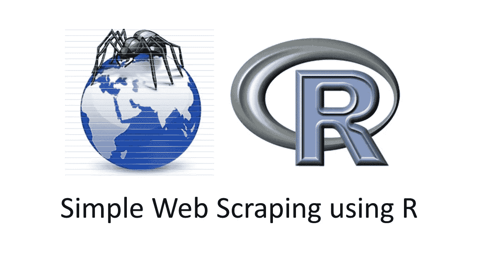
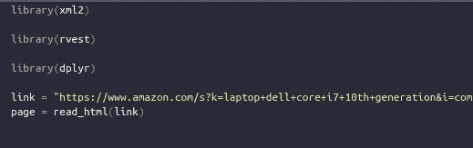
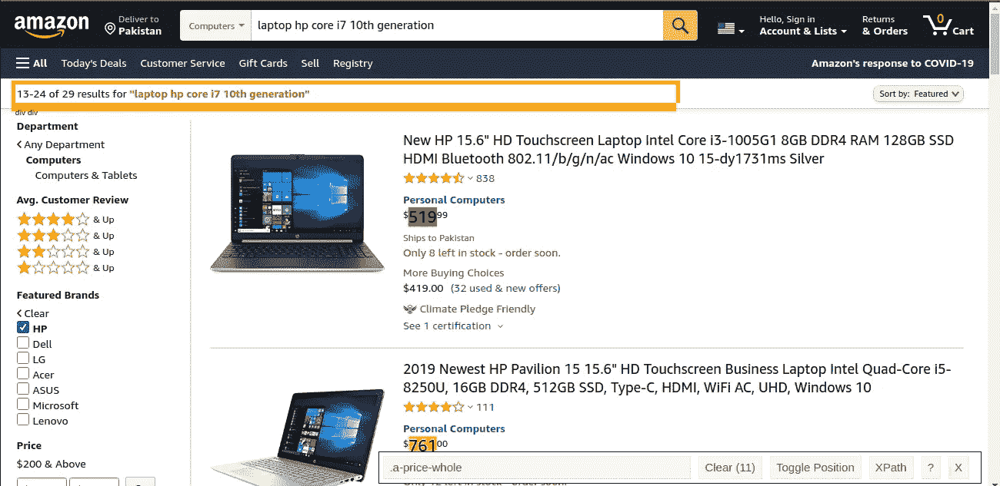
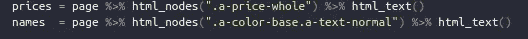
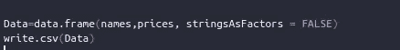
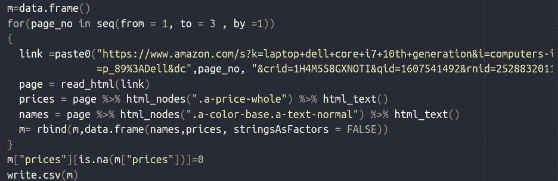
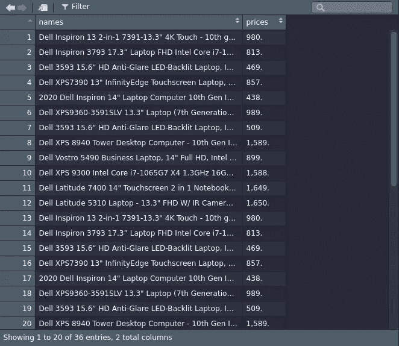
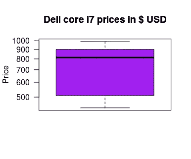
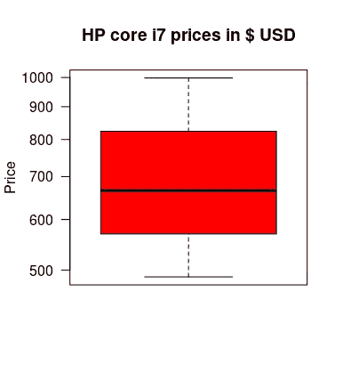

# R 中的网页抓取

> 原文：<https://medium.com/analytics-vidhya/web-scraping-in-r-cbb771cd0061?source=collection_archive---------13----------------------->

## **使用 rvest 和 dplyr 进行数据提取和数据分析**

> ***什么是网页抓取？***

刮基本上是指提取某物。因此，在计算机科学中，网络抓取意味着从网站中提取数据。收集这些数据，然后将其导出为对用户更有用的格式。



现在，我们将从亚马逊网站上抓取数据。我们将删除惠普和戴尔两家公司的笔记本电脑价格数据。因此，首先，加载一些将帮助我们抓取的库

```
library(xml2)
library(rvest)
library(dplyr)
```

如果您还没有安装这些软件包，那么您首先通过以下命令安装它们

```
install.packages("xml2")
install.packages("rvest")
install.packages("dplyr")
```

> ***xml2*** *库帮助我们读取 Html 文本，它从节点中提取各种组件。*
> 
> ***rvest*** *帮助我们从网页中抓取信息。*
> 
> ***dplyr*** *库帮助我们进行数据操作，如数据排序等。*

现在，转到您想要删除的页面。我使用了一个 chrome 扩展“SelectorGadget”来检查元素。不同的浏览器有不同的扩展名，例如 Mozilla Firefox 有一个名为“ScrapeMate Beta”的扩展名，其他浏览器有其他扩展名。因此，您可以添加这种类型的扩展，以便用浏览器在任何网页上选择数据。

# **第一步**

复制你想要废弃的网页的链接，并存储在任意变量中。然后，阅读这个 HTML 页面。



# 第二步

因为我想取消项目的价格和名称。因此，我将选择项目的价格和名称，您可以选择其中的任何一个，链接将由包含该页面上所有项目的价格和名称的扩展生成。将有两个单独的链接生成一个价格和另一个名称。



正如你所看到的，我有一个绿色项目的选定价格，所有价格都是自动选择的。链接也生成了，你可以在底部的右边看到它。
通过选择项目的名称，另一个链接将像这样生成。现在是写一些代码的时候了。



本代码中“%>%”含义与
x=c(8，99，78，88)
**x %>% plot()**
或
**plot(x)**
两者相同。我希望你已经明白了。所以，价格和名字存储在这些变量中，你可以在图中看到。

# **第三步**

创建数据框并将其转换为 CSV 文件。所以，我们可以用它来可视化。并且在 CSV 文件中，我们可以更好地了解这些信息。



这种技术只适用于一个网页。如果我们想抓取多页。

> ***一次刮多页***

如果你已经在一个页面上完成了抓取，那么对你来说这不是一个困难的任务。我们有同样的代码，只是有一些小的改动。首先，您需要查找链接，并找到当您单击“下一步”转到下一页时链接部分发生变化的位置。

例如，链接是[www.dummy.com/tittles/movie](http://www.dummy.com/tittles/ttyr)

现在，当点击“下一步”时，链接将会是这样的【www.dummy.com/titiles/moviespage=1 或链接中的任何其他类型的更改。



首先，我创建了一个 for 循环，这样我们可以很容易地转到下一页。在链接中，我放了一个**变量** name **page_no，**这样链接会随着循环的迭代而改变。如果我只创建一个数据框，那么该数据框将只包含最后一页的数据。因为它会自我更新并包含最新的值。所以，在这种情况下，rbind 帮助我们从这个问题中走出来。并且用 0 代替 NA(不是数字)是一个很好的做法。所以，将来当你想对数据进行一些操作时，你不会有任何问题。

这里你可以看到 CSV 文件。



对惠普笔记本电脑的价格和名称重复同样的过程。

> ***分析数据***

现在，我们有了包含两家公司(即戴尔和惠普)的笔记本电脑价格的数据。我们将通过绘制它们来分析它。因此，我们可以找到两家公司的酷睿 i7 笔记本电脑的平均价格。



戴尔笔记本电脑价格平均价格



惠普笔记本电脑平均价格

从图片中你可以很容易地了解两家公司的酷睿 i7 笔记本电脑的平均价格。黑线清楚地表明了价格的平均值。

在这篇博客中，我的目的不是告诉你今天笔记本电脑的平均价格是多少？。我只想告诉你，我们可以很容易地分析刮后的数据。所以，连一个普通人都懂。R 语言帮助我们做到了这一点。您可以使用 R 中的 boxplot 函数来绘制这种类型的数据。你也可以使用许多其他的图，如条形图、饼图、柱状图等。这完全取决于您正在处理的数据类型。

我希望这个博客能帮助你用 R 做抓取和分析数据。

在这里你可以找到完整的代码

[](https://github.com/Subhan-khaliq/Web-Scraping-with-R) [## subhan-khaliq/Web-Scraping-with-R

### 我收集了一些数据，找到亚马逊上笔记本电脑的价格和名称，然后我分析了这些数据。GitHub 是…

github.com](https://github.com/Subhan-khaliq/Web-Scraping-with-R)