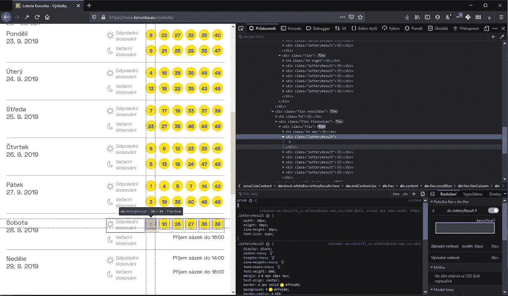

# cron 作业中使用 Python 的 Web 抓取彩票结果

> 原文：<https://medium.com/analytics-vidhya/web-scraping-lottery-results-with-python-in-a-cron-job-d47c6fee0fa1?source=collection_archive---------2----------------------->

## 目标

我的目标是获得最新的[捷克彩票号码](https://www.korunka.eu/vysledky)(每天更新两次)，并通过短信发送到一个 GSM 手机号码。我还想让这个任务每天自动执行两次，所以这就是 *cron* 的用武之地。所有这些都将在 Rasberry Pi 上运行。

## 安装必备组件