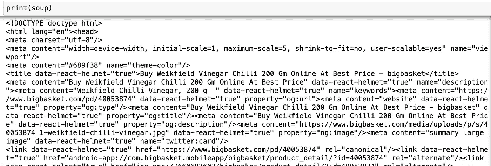
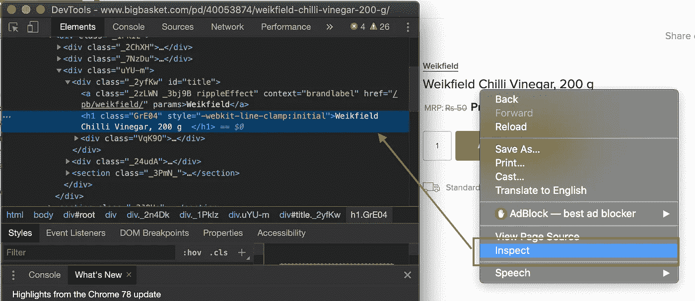
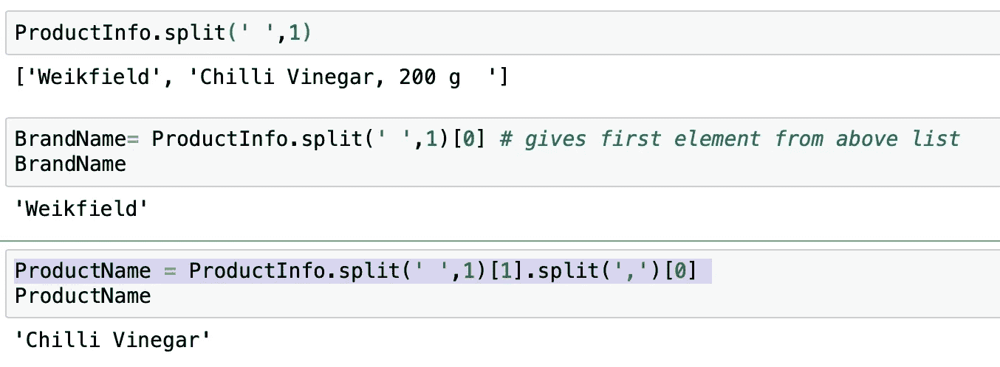
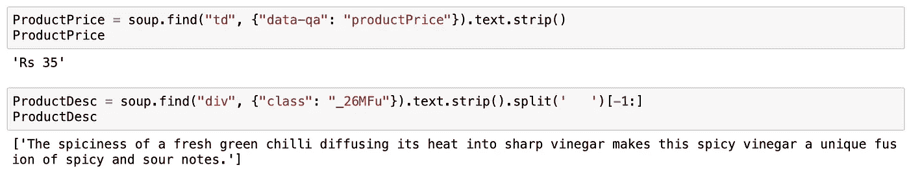

# 使用 Python 使 Web 抓取变得简单

> 原文：<https://medium.com/analytics-vidhya/web-scraping-made-easy-using-python-9f5f69ecff3c?source=collection_archive---------2----------------------->

> 在本文中，我们将学习 Web 抓取技术，它允许我们使用 python 的`*BeautifulSoup*`库从任何网站提取有用的数据。


## 什么是网页抓取？

> 网页抓取是一种从网页中收集大量数据并将数据存储为任何所需格式的机制，这进一步帮助我们对提取的数据进行分析。 **Beautifulsoup** — Python 用于解析 HTML 和 XML 文档的包，帮助我们轻松提取数据。

> ***下面是我们使用 python 提取数据的步骤:***

*   我们会先找网站网址来刮。
*   检查页面。
*   寻找我们想要提取的数据。
*   编写我们的 python 代码并运行代码。
*   以要求的格式存储数据。

eautifulSoup 是最先进的网页抓取库，可以解析任何网页的 HTML/XML 内容。*查看 BeautifulSoup 官方页面* [*此处*](https://pypi.org/project/beautifulsoup4/) *。*

在这个学习过程中，我们将浏览以下两个网页抓取部分，探索 BeautifulSoup 的更多功能:

1️.抓取一个零售网页( [Bigbasket 杂货网站](https://www.bigbasket.com/))提取产品信息，然后将数据保存到 CSV/JSON 文件中。

2️.从网站上抓取表格数据，并使用 pandas 将其制作成数据框架。

在继续之前，我想解释一下 HTML(网页组件)的基本概念以及如何手动检查网页。

> HTML 是一种用于构建网页的标记语言。它提供了列表标签
> 
> *   、分部标签、段落标签
>     
>     等。


检查网页:HTML 代码

## HTML 文档示例:


检查网页的步骤:

*   首先，我们将在浏览器中打开网站的 URL(在这个例子中是 Chrome)
*   右键单击页面，然后选择“检查”。
*   Chrome DevTools 的窗口在页面的一侧打开，我们可以在这里查看这个网页的 HTML 内容。


右键点击 Bigbasket 网站查看 HTML 内容

在我们的代码中，我们将使用 BeautifulSoup 从上述网站下载这个 HTML 内容，然后进行数据提取。

让我们开始吧！

1️.**刮大筐网站:**

在本节中，我将带您一步一步地使用 BeautifulSoup 从这个[网站](https://www.bigbasket.com/)中提取产品详细信息，如**产品名称、品牌名称、产品数量、价格和产品描述**，并最终以可读格式将数据存储到 CSV 文件中。

*注意:请注意，我已经收集了与杂货项目相对应的 EAN 代码(唯一代码),我们将在代码中使用这些代码来获取上述产品详细信息。*

**步骤 1:** 将所需的库安装并导入 Jupyter 笔记本。

`pip install BeautifulSoup`

`pip install requests`

```
**from bs4 import BeautifulSoup as bs** 
**import requests** *# importing requests module to open a URL*
```

**步骤 2:** 定义我们需要提取数据的 EAN 代码列表，并将其分配给一个名为‘eanCodeLists’的变量

```
eanCodeLists = [126906,40139631,40041188,40075201,40053874,1204742,40046735,40100963,40067874,40045943]
```

> 让我们首先检查一个 EAN 代码-40053874，以获得产品名称、品牌名称、产品数量、价格和产品描述，然后使用`*for loop*`来迭代上面的列表，以获得所有产品的详细信息。

**第三步:**使用`requests.get() method`打开 URL，向网页发出 HTTP 请求。

```
urlopen = requests.get('[https://www.bigbasket.com/pd/40053874').text](https://www.bigbasket.com/pd/40053874').text)
```

第四步:使用 BeautifulSoup 解析 HTML，并给它分配一个名为“Soup”的变量

```
soup = bs(urlopen,'html.parser')
```

输出:



HTML 代码中的几行

**第五步:**现在让我们在浏览器中打开网址([https://www.bigbasket.com/pd/40053874](https://www.bigbasket.com/pd/40053874').text))，右击我们需要的内容，得到相应的 HTML 标签。我们将在代码中使用这些标签来获取所需的数据。


在这里，让我们右键单击字段**“威克菲尔辣椒醋，200 克”**以获取标签名称。这将为我们提供品牌名称、产品名称和数量。*参考下图*



<**h1 class = " GRE 04**" style = "-WebKit-line-clamp:initial ">威克菲尔辣椒醋 200 克< /h1 >

现在让我们使用`beautifulsoup`来引用这些标签，并将其赋给一个变量‘product info’

```
ProductInfo = soup.find("h1", {"class": "GrE04"}).text  *# .text will give us the text underlying that HTML element*
```


**第六步:**现在，我们可以用`split()`的方法得到如下:



这里，`split(' ‘,1)[1]`给出**'辣椒醋，200 克'**，`split(',')[0]`用**，**分割，给出**'辣椒醋'**


strip()方法修剪空白

**第 7 步:**获取价格和产品描述


价格字段标签:<**TD data-QA = " product price**class = " iy lvo ">Rs<！— →35 < /td >

产品描述字段标签:**<**div class = " _ 26 mfu "**><样式…**

****

**因此我们现在有了，**

```
ProductName= Chilli Vinegar
BrandName= Weikfield
ProducQty = 200 g
ProductPrice= Rs 35
ProductDesc = The spiciness of a fresh green chilli diffusing its heat into sharp vinegar makes this spicy vinegar a unique fusion of spicy and sour notes.
```

****步骤 8:** 我们现在可以使用上面的代码和`for loop`得到所有 EAN 代码信息**

****

****步骤 9:** 使用 pandas 将数据存储到 Dataframe**

****

**数据帧数据**

****步骤 10:** 最后将数据保存到 CSV 和 JSON 文件(保存到我们的本地目录)**

********

**JSON 格式**

**2️.**刮取表格格式数据:****

**在本节中，我们将抓取网站([https://www.ssa.gov/OACT/babynames/decades/names2010s.html](https://www.ssa.gov/OACT/babynames/decades/names2010s.html))，其中有 2010 年至 2018 年期间在美国出生的男性和女性婴儿的**【200 个】流行名字**的表格格式数据。*(这是基于截至 2019 年 3 月的社保卡申请数据的样本数据)。***

****步骤 1:** 导入库并使用 BeautifulSoup 解析 HTML 内容**

```
import requests
from bs4 import BeautifulSoup as bsurl = requests.get('[https://www.ssa.gov/OACT/babynames/decades/names2010s.html').text](https://www.ssa.gov/OACT/babynames/decades/names2010s.html').text)
soup = bs(url,'html.parser')
```

****第二步:**让我们用**<table class = " t-stripe ">**提取表格数据**

****

```
table_content = soup.find('table',{'class':'t-stripe'})
```

****

**在这里，我们看到标记名“td”，它代表表格数据(数据单元)、“th”(表格标题)和“tr”(表格行)。我们现在将使用这个**‘table _ content**’中的‘tr’标记，它由‘TD’和‘th’组合而成**

```
data = table_content.findAll('tr')[0:202] #returns all 200 rows including header
```

****

****第三步:**现在让我们使用`for loop`迭代这 200 行，并将数据放入一个名为‘rows _ data’的‘list’变量中。**

**首先，让我们使用`len(data)`来检查“数据”的长度**

****

**这是代码…**

****

**现在让我们使用 pandas 将数据存储到 Dataframe 中**

****

**第五步:我们现在可以对这些数据执行一些操作，并获得一些见解**

**让我们检查一下姓名'**塞缪尔**'被使用了多少次。**

```
df[df['Male_Name'] == 'Samuel'][['Male_Name','Male_Number','Rank']]
```

****

## **结论**

**通过这种方式，我们可以使用 python 的 web 抓取来抓取任何网站，并提取一些有用的数据，这些数据可用于执行任何类型的分析。网页抓取的一些使用案例有:**

**☑天气预报
☑营销
☑商务/电子商务:市场分析、价格比较、竞争监控
☑媒体公司
☑从多个来源收集数据进行分析
☑获取最新新闻报道
☑旅游公司用于收集实时跟踪细节**

*****还有更多……*****

**感谢您的阅读和愉快的网页抓取！🙂**

**我期待你的评论，请随时在下面留言**