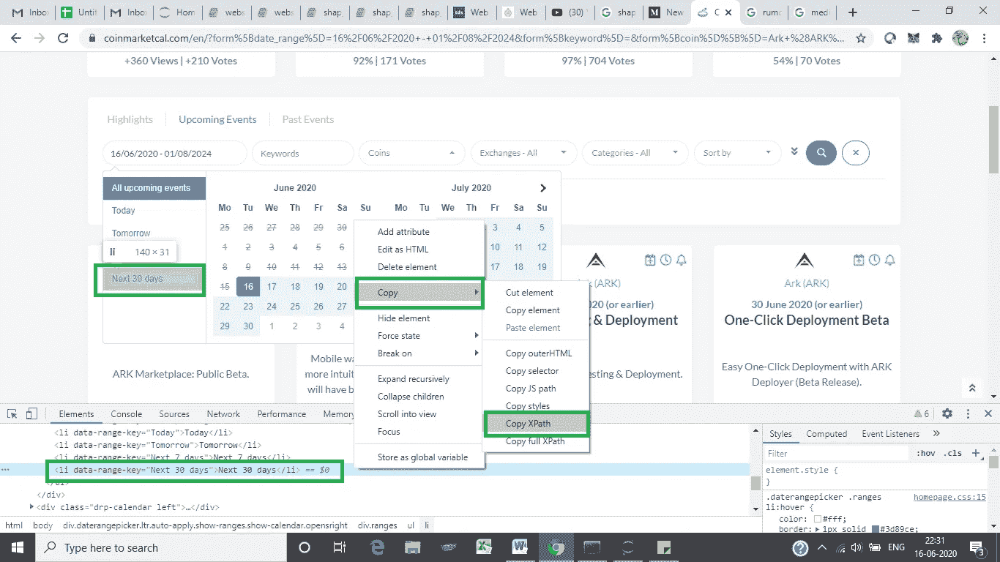

# 使用 Selenium Web 驱动程序和 Python 简化 Web 抓取—第 1 部分

> 原文：<https://medium.com/analytics-vidhya/web-scraping-made-simple-using-selenium-web-driver-and-python-part-1-6bfe44300cdb?source=collection_archive---------16----------------------->

“买入谣言，卖出消息”是股市中的一个流行说法，股票在一些重大消息的预期下上涨，然后在消息宣布后稳定或下跌——一个例子是苹果公司的股票分割。这在加密货币市场中甚至更为重要，在这里交易是如此的不稳定，以至于一个谣言或消息可以使其价值暴涨或暴跌 50%。

我一直密切关注加密货币市场，并观察到像 mainnet release、staking 和 token burn 这样的项目的发展使硬币泵显著增加。例如，如果一个硬币“X”被谣传从现在起三周内发布一些与他们的主网相关的消息，大多数鲸鱼会相信这个谣言，当官方消息到来时，他们会卖掉他们的袋子。

[](https://coinmarketcal.com/en/)**——这是一个列出各种硬币可能即将发生的事件的网站，它在一天内更新多次，因此跟踪各种项目变得很困难，我所做的是通过使用 Python 的 Selenium web driver 废弃内容，安排一个任务每 1 小时运行一次，如果有任何重要的事情，就给我发邮件提醒。**

****先决条件** —在这里**从 [**下载 chrome 驱动程序，确保你已经安装了谷歌 Chrome 浏览器和 selenium 包。**](https://chromedriver.storage.googleapis.com/index.html?path=2.42/)****

********

****目标是从日期框列表中选择“未来 30 天”文本，从“所有交易”下拉列表中选择所需的交易，单击搜索图标并放弃所有出现的事件。我将在两部分系列中讨论以下内容:****

****通过网络驱动程序启动网站****

****从下拉列表中选择选项****

****输入文本、清除文本并在搜索框中重新输入新文本****

****点击图标/按钮****

****。抓取所需的文本****

****浏览不同的页面****

****。静态等待、动态等待和异常处理****

****将抓取的数据存储在 csv 文件中****

****创建任务计划程序，每 1 小时运行一次脚本，并通过电子邮件发送 csv 文件****

******步骤 1:通过 web 驱动程序启动网站******

```
**! pip install seleniumimport time
from selenium import webdriver
from selenium.webdriver.support.ui import WebDriverWait
from selenium.webdriver.support import expected_conditions as EC
from selenium.webdriver.common.by import By
from selenium.common.exceptions import Timeout Exception
from selenium.webdriver.chrome.options import OptionsDRIVER_PATH = 'Your chrome driver path’
options = Options()
options.headless = False
options = webdriver.ChromeOptions()
options.add_argument("--start-maximized") driver = webdriver.Chrome(options=options, executable_path=DRIVER_PATH)driver.get('https://coinmarketcal.com/en/')**
```

****如果您设置了 **options.headless = True** ，浏览器将在后台运行。****

******注意:有时营销横幅会出现在页面的底部和顶部，我将在第 2 部分讨论如何处理它们，现在在继续之前先关闭它们。******

******第二步:从下拉列表中选择一个选项******

********

****一般来说，我们可以通过 ID、类名或 XPath 来访问或定位 web 页面中的大多数元素。每个元素的 ID 总是唯一的，类名不是唯一的:许多 web 元素可以有相同的类名。最常用的技术是通过 XPath 访问，XPath 遍历并获得确切的 DOM 结构。****

****为了得到日期框的位置，**右击日期框并点击 inspect** ，一个包含 DOM 结构的整洁的框打开了，因为我们有一个惟一的 ID(在图中突出显示)我们将使用它。****

```
**driver.find_element_by_id(‘form_date_range’).click()**
```

****执行上述代码相当于单击文本框，完成后我们会看到一个下拉列表，接下来我们要单击“未来 30 天”选项。****

********

****这一次我们将使用 XPath 来访问元素，右键单击“未来 30 天”文本并单击 inspect，然后右键单击 DOM 框中的元素并复制 XPath，如图所示。****

```
**driver.find_element_by_xpath(“/html/body/div[2]/div[1]/ul/li[5]”).click()**
```

****另一种访问方式是通过文本。当结构不断变化但文本保持不变时，这很有用。如果有多个元素具有相同的文本，我们必须小心。 **'find_elements_by_xpath'** 返回包含指定文本的所有 web 元素。****

```
**e = driver.find_elements_by_xpath(“//*[contains(text(), ‘Next 30 days’)]”)
e[0].click()**
```

****我们可以使用上面两种方法中的任何一种，第二种方法返回一个列表，并且必须额外注意必须使用列表中的哪个元素。如果没有出现这样的 web 元素，它将返回一个空列表。****

******静态和动态等待时间:******

****在页面重新加载、点击按钮或启动 URL 的过程中，web 元素不会立即出现，在 web 驱动程序找到它们之前会有一段延迟时间，为此我们使用静态或动态等待。****

******静态等待**时间等待我们指定的固定时间。****

```
**time.sleep(5)**
```

****上面的代码让驱动程序在继续之前等待 5 秒钟，这样做的缺点是它只等待指定的时间，如果时间太短，我们要搜索的 web 元素将不会出现，如果时间太长，我们会增加效率和空闲时间，为了克服这一点，我们使用了**动态等待**。****

```
**element_date_box = WebDriverWait(driver, 60).until(
        EC.presence_of_element_located((By.ID, "form_date_range")))**
```

****web 驱动程序最多等待 60 秒，但如果在此之前找到 ID 为“form_date_range”的 web 元素，它将继续执行。****

******步骤 3:输入文本，清除文本并在搜索框中重新输入新文本******

****在此步骤中，我们单击“所有交易”文本框，输入文本，从下拉列表中选择一个选项，清除文本，重新输入新文本，并从列表中选择另一个选项。****

```
**driver.find_element_by_xpath("//*[[@id](http://twitter.com/id)='incoming_form_filter']/div[4]/button/div/div/div").click()driver.find_element_by_xpath("//*[[@id](http://twitter.com/id)='incoming_form_filter']/div[4]/div/div[1]/input").send_keys('Binance')driver.find_element_by_id('bs-select-2-1').click()driver.find_element_by_xpath("//*[[@id](http://twitter.com/id)='incoming_form_filter']/div[4]/div/div[1]/input").clear()

driver.find_element_by_xpath("//*[[@id](http://twitter.com/id)='incoming_form_filter']/div[4]/div/div[1]/input").send_keys('Kucoin')

driver.find_element_by_id('bs-select-2-35').click()** 
```

****send_keys()函数执行相当于输入文本或字符的键盘操作，clear()函数模拟我们的退格键。****

******第四步:点击搜索图标/按钮******

```
**driver.find_element_by_id('form_submit').click()**
```

****在我们的例子中，搜索图标有一个惟一的 ID，我们将利用它来单击并等待页面重新加载。****

******第五步:抓取所需文本******

********

****现在有趣的部分来了，我们想要删除的实际内容。图像中突出显示的部分属于**类名“链接-细节”**，使用**“查找 _ 元素 _ 按 _ 类名”**和**“文本”**方法，我们可以访问该类名下的所有元素及其相应的内容。****

```
**a = driver.find_elements_by_class_name('link-detail')
print(len(a))
print("########################################")
print(a[4].text)
print(a[5].text)
print("########################################")
print(a[6].text)
print(a[7].text)**Output:**
36
########################################
Stellar (XLM)
17 June 2020
Bitstamp Listing
########################################
Grin (GRIN)
17 June 2020
Floonet Upgrade**
```

****在这种情况下，有 36 个元素可以用该类名定位，并且有一个模式，我们的第一个块可以由 a[4]和 a[5]访问，类似地，下一个块可以由 a[6]和 a[7]访问，依此类推。我们可以运行一个循环来从页面的所有块中获取文本。****

******最终代码:******

```
**! pip install seleniumimport time
from selenium import webdriver
from selenium.webdriver.support.ui import WebDriverWait
from selenium.webdriver.support import expected_conditions as EC
from selenium.webdriver.common.by import By
from selenium.common.exceptions import TimeoutException
from selenium.webdriver.chrome.options import OptionsDRIVER_PATH = 'Your chrome driver path’
options = Options()
options.headless = False
options = webdriver.ChromeOptions()
options.add_argument("--start-maximized")driver = webdriver.Chrome(options=options, executable_path=DRIVER_PATH)driver.get('https://coinmarketcal.com/en/')coin = []
status = []
date = []
announcement = []
date_added = []
maxi = 1
element_date_box = ''
element_text_30days = ''
element_exchange_text_box = '' **######################## Date box  ##########################**element_date_box = WebDriverWait(driver, 60).until(
        EC.presence_of_element_located((By.ID, "form_date_range")))
time.sleep(1)
driver.find_element_by_id('form_date_range').click()**##############################################################****############# Selecting 30 days text inside date box ##########**

element_text_30days = WebDriverWait(driver,60).until
(EC.presence_of_element_located((By.XPATH, "//*[contains(text(), 'Next 30 days')]")))
e = driver.find_elements_by_xpath("//*[contains(text(), 'Next 30 days')]")
time.sleep(1)
e[0].click()**################################################################****######################  Exchanges box ##########################**element_exchange_text_box = WebDriverWait(driver, 60).until(
        EC.presence_of_element_located((By.XPATH, "//*[[@id](http://twitter.com/id)='incoming_form_filter']/div[4]/button/div/div/div")))
driver.find_element_by_xpath("//*[[@id](http://twitter.com/id)='incoming_form_filter']/div[4]/button/div/div/div").click()
time.sleep(1)

driver.find_element_by_xpath("//*[[@id](http://twitter.com/id)='incoming_form_filter']/div[4]/div/div[1]/input").send_keys('Binance')
time.sleep(1)
driver.find_element_by_id('bs-select-2-1').click()
time.sleep(1)

driver.find_element_by_xpath("//*[[@id](http://twitter.com/id)='incoming_form_filter']/div[4]/div/div[1]/input").clear()
time.sleep(1)
driver.find_element_by_xpath("//*[[@id](http://twitter.com/id)='incoming_form_filter']/div[4]/div/div[1]/input").send_keys('Kucoin')
time.sleep(1)
driver.find_element_by_id('bs-select-2-35').click()
time.sleep(1)**################################################################**

driver.find_element_by_id('form_submit').click()
time.sleep(1)**####################### Scraping the content  #################**element = WebDriverWait(driver, 60).until(
            EC.presence_of_element_located((By.CLASS_NAME, "link-detail")))
a = driver.find_elements_by_class_name('link-detail')
if len(a)>0:
    for i in range(4, len(a), 2):
        coin.append(a[i].text)
        status.append(a[i+1].text)
    for j in status:
        temp = j.split('\n')
        date.append(temp[0])
        announcement.append(temp[1])
    status = []a = driver.find_elements_by_class_name('tip')
if len(a)>0:
    for i in range(len(a)):
        temp = a[i].text
        temp = temp.split('\n')
        date_added.append(temp[0])#driver.quit()
#print('completed')**
```

****第 1 部分到此结束，在下一部分中，我将讨论如何在不同的页面中导航，如何处理异常和弹出窗口/警告框/营销横幅，如何将我们的数据存储在 csv 文件中，如何创建一个任务调度程序来自动化整个流程，以及如何将数据发送给我们。****

****欢迎向我提问，并提出建议来帮助改进流程。****