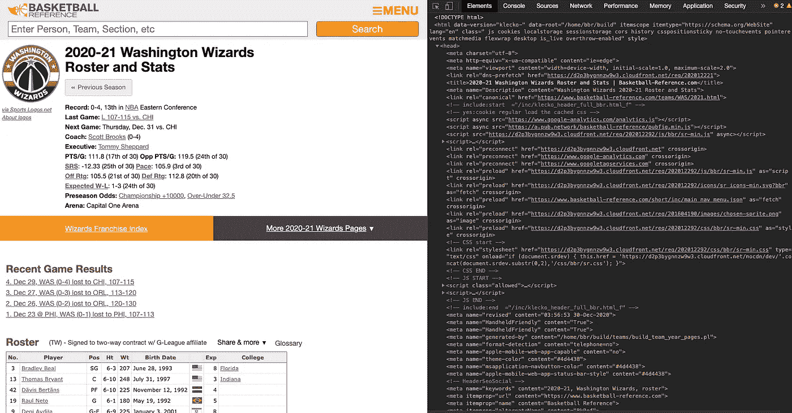
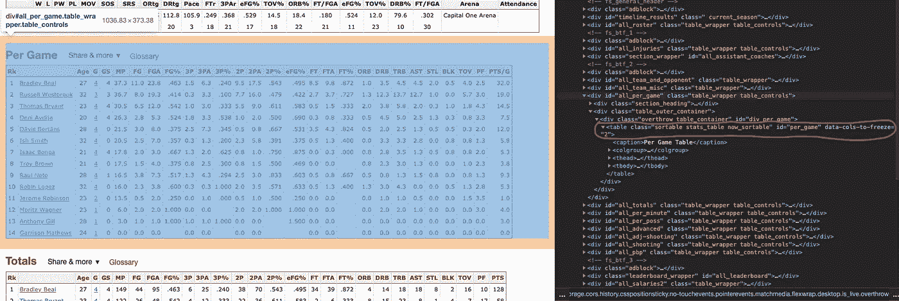
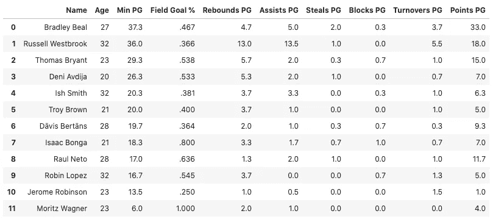
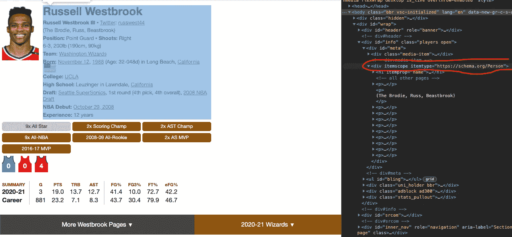
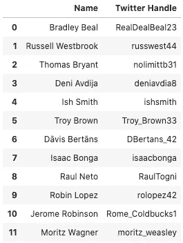
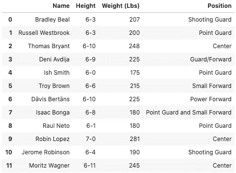
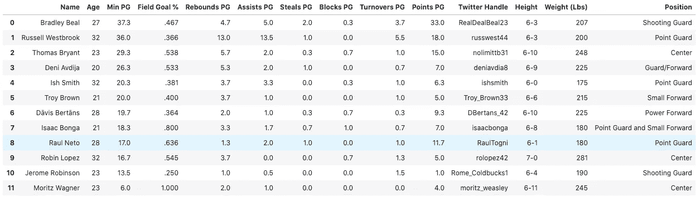

# 用熊猫、BeautifulSoup 和 RegEx (Pt。1)

> 原文：<https://medium.com/analytics-vidhya/web-scraping-nba-data-with-pandas-beautifulsoup-and-regex-pt-1-e3d73679950a?source=collection_archive---------5----------------------->


2020-2021 NBA 赛季终于来临了！作为一名崭露头角的数据科学家和长期的 NBA 粉丝，为了庆祝这一重大时刻，我认为从 [Basketball-Reference](https://www.basketball-reference.com/) 网站收集数据将是一个有趣的做法，该网站拥有所有职业篮球的统计数据，从 NBA 到 WNBA 和 G 联赛。因为我支持华盛顿奇才队(是的，到目前为止这里很艰难，但我们必须保持忠诚😤)，这篇文章的重点将是提取每个奇才球员 2020-2021 年每场比赛的统计数据，以及其他一些个人信息。

对于门外汉来说，网络抓取是从网站中提取和重组数据的过程，通常是为了进行某种最终分析。在这种情况下，我将利用`requests`和`BeautifulSoup`，这两个 Python 库用于访问网站和解析 HTML (Graham Cox 在这里给出了解析[的精彩解释)，以及`pandas`，这是一个 Python 库，允许将信息组织成可操作的数据帧。最后，我将使用`re` Python 库，它为在 Python 中使用](https://qr.ae/pNJYGd)[正则表达式](https://www.tutorialspoint.com/python/python_reg_expressions.htm)提供支持。我将使用正则表达式从每个球员的个人网页 HTML 中提取他们的体重、身高和位置。

首先将这些库导入 Python

# 提取 2020-21 年奇才队每场比赛的统计数据

现在我已经导入了必要的库，下一步是使用`requests`从指定的 URL 获取数据，将其命名为`wiz_res:`

下面的截图显示了 URL 在前端的外观与在后端编写的 HTML 的对比——`wiz_res`的内容现在实际上是 HTML 文本。



然后，我将使用`BeautifulSoup`通过`lxml`解析器解析内容，将结果对象命名为`wiz_soup`。这将重新构造文本，以便我可以对它运行额外的编码命令。为了将搜索范围缩小到每场比赛的统计数据，我将使用 BeautifulSoup 的`.find()`方法来查找“table”标签，以及“per_game”的 id 属性。通过搜索网页的 HTML 并分析突出显示我感兴趣的表的文本，我找到了合适的标签和属性，如下所示。孤立的“每场比赛”表现在被命名为`wiz_per_game`。



# 为玩家统计创建一个熊猫数据框架

我将通过首先创建一个字典列表来创建这个熊猫数据框架，其中每个玩家都是一个字典，每个键代表一个统计类别，对应的值代表该玩家在该类别中的值。

每个玩家的统计数据在`wiz_per_game`表格中按行划分，如 HTML 中的`tr`(表格行)所示。在`tr`上使用`.find_all()`方法将从每个游戏表中返回所有行的列表。因此，我将在`wiz_per_game.find_all(‘tr’)[1:]`上做一个`for`循环来遍历每一行。循环从第二行开始，因为第一行包含标题。

在每次迭代中，我将创建一个`player`字典，并使用`.find()`来收集每个`player`的统计数据，例如姓名、年龄、每场比赛的时间、每场比赛的分数等...一旦添加了所有信息，循环将把`player`追加到`wiz_stats`列表，并迭代到表的下一行。在所有玩家都被添加后，我将把字典列表转换成熊猫数据帧。

运行上面的代码应该会输出以下内容:



# 为 Twitter 句柄创建一个熊猫数据框架

上面的数据框架看起来不错，但我还想包括只在每个球员的个人篮球参考网页上提供的信息。也就是说，我想要玩家的身高、体重、位置和 Twitter 句柄。幸运的是，每个玩家的个人页面的 URL 都包含在他的每场游戏表格的行中。

从 Twitter 开始，我将像以前一样制作相同的字典列表和`for`循环，只是这一次，每次迭代都将把球员的 URL 结尾追加到篮球参考基 URL，并为该球员的网页创建一个新的 GET request/BeautifulSoup 实例。一旦我访问了那个玩家的数据，我将把文本缩小到包含我所关心的信息的部分，并将那个变量命名为`player_info`。



这是我为每个玩家准备的部分

Twitter 句柄是超链接的一部分，如上面 russwest44 所示。在`for`循环中，我将使用`find_all()`和`a`来获取`player_info`中所有超链接部分的列表(`a`通常表示 HTML 中的超链接信息)，并将该部分的`href`(超链接的 URL)添加到一个名为`player_links`的新列表中。然后，由于 Twitter 帐户总是列在`player_links`中的第二个 URL，我将把那个 URL 分配给玩家，去掉`[https://twitter.com/](https://twitter.com/)`，这样只保留玩家的句柄。如果玩家没有列出 Twitter，他将得到一个值`Not Listed`。

生成的数据帧如下所示:



`for`循环从 12 个不同的 URL(每个玩家一个)自动化了 Twitter 抓取过程，非常简洁

很好，现在我可以轻松地跟踪我最喜欢的球员的社交媒体了！

# 为身高、体重和位置创建一个熊猫数据框架

最后，让我们使用正则表达式来获取身高、体重和位置。首先，我将制作另一个字典列表，并使用与上次相同的`for`循环和代码来获取`player_info`。

接下来，我将把来自`player_info`的所有段落`p`文本的字符串`str(player_info.find_all('p'))`赋值给变量`s`。`s`现在包含了具有所需高度、重量和位置的字符串。

在`s`上应用来自`re`的`.search()`和`.group()`方法允许我使用正则表达式代码根据 HTML 中的某些字符模式提取文本。在这种情况下，`.*`正则表达式允许从两个已知子字符串之间提取任何字符([除了换行符](https://www.rexegg.com/regex-quickstart.html#morechars))，其中子字符串放在`(.*)`的两边。

例如，我知道 HTML 中玩家的体重列在`\"weight\">`和`lb</span>`之间，如果仔细观察下面拉塞尔·维斯特布鲁克的`s`输出中的第 8 行，就可以看到这一点。

```
'[<p>\n<strong>\n<strong>Russell Westbrook III</strong>\n</strong>\n    \n  ▪\n  <a href="/friv/twitter.html">Twitter</a>:\n  <a href="[https://twitter.com/russwest44](https://twitter.com/russwest44)">russwest44</a>\n</p>, <p>\n(The Brodie, Russ, Beastbrook)\n</p>, <p>\n<strong>\n  Position:\n  </strong>\n  Point Guard\n\n\n  \n  ▪\n  \n  <strong>\n  Shoots:\n  </strong>\n  Right\n</p>, <p><span itemprop="height">6-3</span>,\xa0<span itemprop="weight">200lb</span>\xa0(190cm,\xa090kg) </p>, <p><strong>Team</strong>: <a href="/teams/WAS/2021.html">Washington Wizards</a></p>, <p>\n<strong>Born: </strong>\n<span data-birth="1988-11-12" id="necro-birth" itemprop="birthDate">\n<a href="/friv/birthdays.fcgi?month=11&amp;day=12">November 12</a>,\n            <a href="/friv/birthyears.fcgi?year=1988">1988</a>\n</span>\n<span itemprop="birthPlace">\n    in\xa0Long Beach,\xa0<a href="/friv/birthplaces.fcgi?country=US&amp;state=CA">California</a></span>\n<span class="f-i f-us">us</span>\n</p>, <p>\n<strong>\n    \n      College:\n    \n    </strong>\n<a href="/friv/colleges.fcgi?college=ucla">UCLA</a>\n</p>, <p>\n<strong>\n    \n      High School:\n    \n    </strong>\n    \n      Leuzinger in Lawndale, <a href="/friv/high_schools.fcgi?country=US&amp;state=CA">California</a>\n</p>, <p>\n<strong>\n  Draft:\n  </strong>\n<a href="/teams/OKC/draft.html">Seattle SuperSonics</a>, 1st round (4th pick, 4th overall), <a href="/draft/NBA_2008.html">2008 NBA Draft</a>\n</p>, <p>\n<strong>NBA Debut: </strong><a href="/boxscores/200810290OKC.html">October 29, 2008</a>\n</p>, <p>\n<strong>\n  Experience:\n  </strong>\n  12 years\n</p>]'
```

因此，`re.search(‘\”weight\”>(.*)lb</span>’, s).group(1)`将输出权重`200`(这里的`group(0)`将输出整个匹配，而不仅仅是`200`)。下面是查找所有巫师玩家的身高、体重和位置的代码:

下面是上面代码的输出:



# 将所有内容整合到一个熊猫数据框架中

本系列第 1 部分的最后一步是将我浏览过的所有代码合并成一个巨大的`for`循环，如下所示:

以下是最终的数据框架:



有了这个整洁的小数据框架，人们可以使用 pandas operations 来挖掘 2020-21 奇才队的深刻趋势和模式。然而，在进行数据分析之前，我们可以使这个项目更加健壮。即将推出—在本系列的第二部分，我将介绍以下内容:

*   扩大数据池，包括所有 NBA 球队的球员
*   创建一个函数，其中用户输入球队名称/年份，该函数输出该赛季特定球队在此帖子中创建的数据帧
*   玩探索性数据分析😎

如果你对我有任何问题，或者发现文章中的错误，请不要犹豫，随时联系我。感谢阅读！