# 使用 Python 和 Google 云服务提取 RSS 新闻提要

> 原文：<https://medium.com/analytics-vidhya/web-scraping-news-data-rss-feeds-python-and-google-cloud-platform-7a0df2bafe44?source=collection_archive---------0----------------------->

## web 抓取和无服务器云服务简介。


由[罗曼·卡夫](https://unsplash.com/@romankraft?utm_source=medium&utm_medium=referral)在 [Unsplash](https://unsplash.com?utm_source=medium&utm_medium=referral) 上拍摄的照片

> 本文的目的是介绍一种系统化的方法来读取 RSS 新闻提要，并将其内容处理成 web 抓取的新闻文章。挑战在于能够提取在不同网站上发布的文本文章，而不需要对网页结构有任何强有力的前提。

整体解决方案分三步描述:

1.  消息在云发布/订阅中发布，带有新闻 RSS 订阅源的 URL，
2.  第一个云功能由先前的消息触发。它提取 RSS 提要中的每篇文章，将其存储在云存储中，并在 Cloud Pub/Sub 中为每篇文章发布一条消息以供进一步使用，
3.  第二个云功能由之前的消息触发。它从网络上抓取文章页面，将结果文本存储在云存储中，并在云发布/订阅中发布消息以供进一步使用。

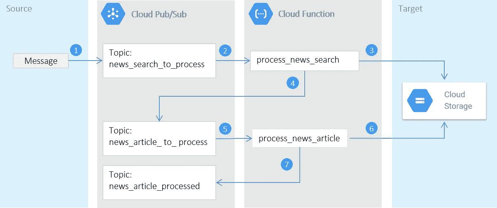

新闻 RSS 源网页抓取—解决方案图

# RSS 源数据处理

> 假设我们想听一个 RSS 新闻提要，并在每个链接上循环提取网页文章。

幸运的是，RSS 提要是用 XML 编写的，必须符合[规范](https://www.w3schools.com/xml/xml_rss.asp)。所以处理一个或多个 RSS 提要应该是一样的。下面是我搜索“苹果”相关文章时的一个 Google News RSS Feed 的例子。

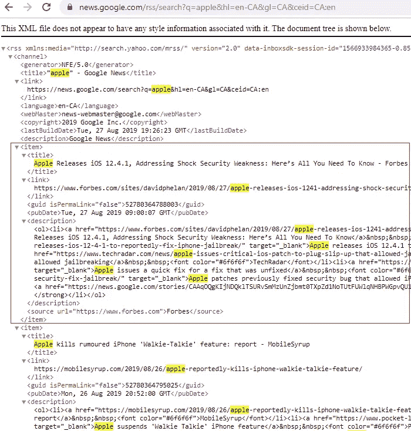

RSS 源示例— XML 文件

正如我们所看到的，每个条目都是由标题、原始网页链接、出版日期和描述摘要描述的文章。让我们看看如何使用 Python 来运行搜索，以及如何遍历每个项目来收集文章链接。

首先我们需要安装 **feedparser** 库来**解析** RSS 提要 xml 文件:

`pip install feed parser`

我们还需要安装 **pandas** 来使用**pandas . io . json . Json _ normalize**将 Json 数据展平到 pandas 数据表:`pip install pandas`

以下代码的输出是一组 URL，将在下一节中使用它们通过 web 抓取库提取文章。

RSS 提要数据解析器— Python 代码

# 网络抓取新闻文章

> 目标是从新闻网站中提取文章，而不强烈依赖于任何网页结构。

如果我们观察新闻网站的页面结构，我们会注意到主文章被一些像图像、广告、链接等噪音所包围。在提取过程中我们应该忽略。

以下是《卫报》网站上一篇文章的例子:

[](https://www.theguardian.com/technology/2019/aug/28/apple-ends-contracts-hundreds-workers-hired-to-listen-siri) [## 苹果终止了数百名受雇听 Siri 的工人的合同

### 欧洲数百名受雇检查 Siri 录音错误的苹果员工已经失业…

www.theguardian.com](https://www.theguardian.com/technology/2019/aug/28/apple-ends-contracts-hundreds-workers-hired-to-listen-siri) 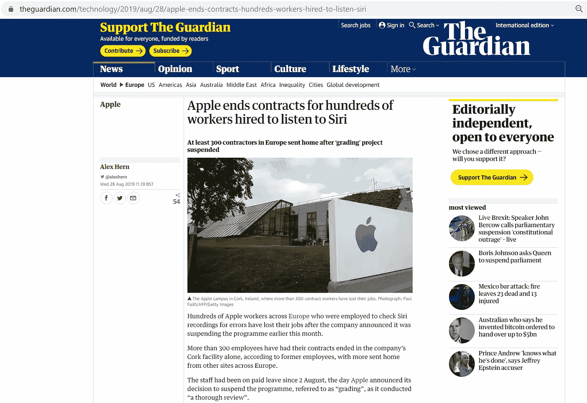

卫报示例—首页

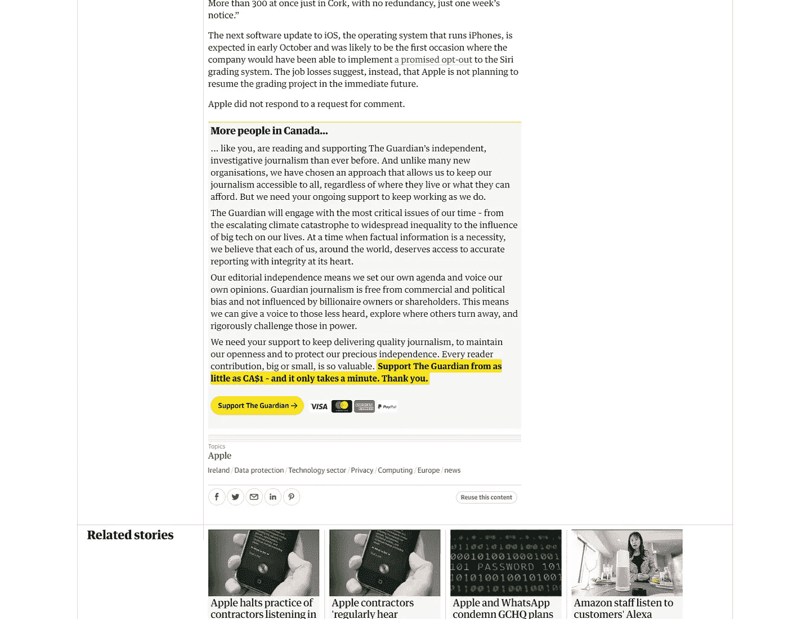

卫报示例—底部页面

如果我们查看下面的页面源代码，我们会注意到, [<文章>](https://www.w3schools.com/tags/tag_article.asp) HTML 元素用于自包含主要文本，该文本被分割在多个段落 [< p >](https://www.w3schools.com/tags/tag_p.asp) 上。这种结构常见于新闻网站。然而，也有一些例外，所以我们不想对页面结构做出强有力的假设，以便能够解析任何新闻网页。

> 我们要做的唯一假设是，一篇文章是一个或多个段落块的连接，每个网页包含一篇我们想要提取的主要文章。

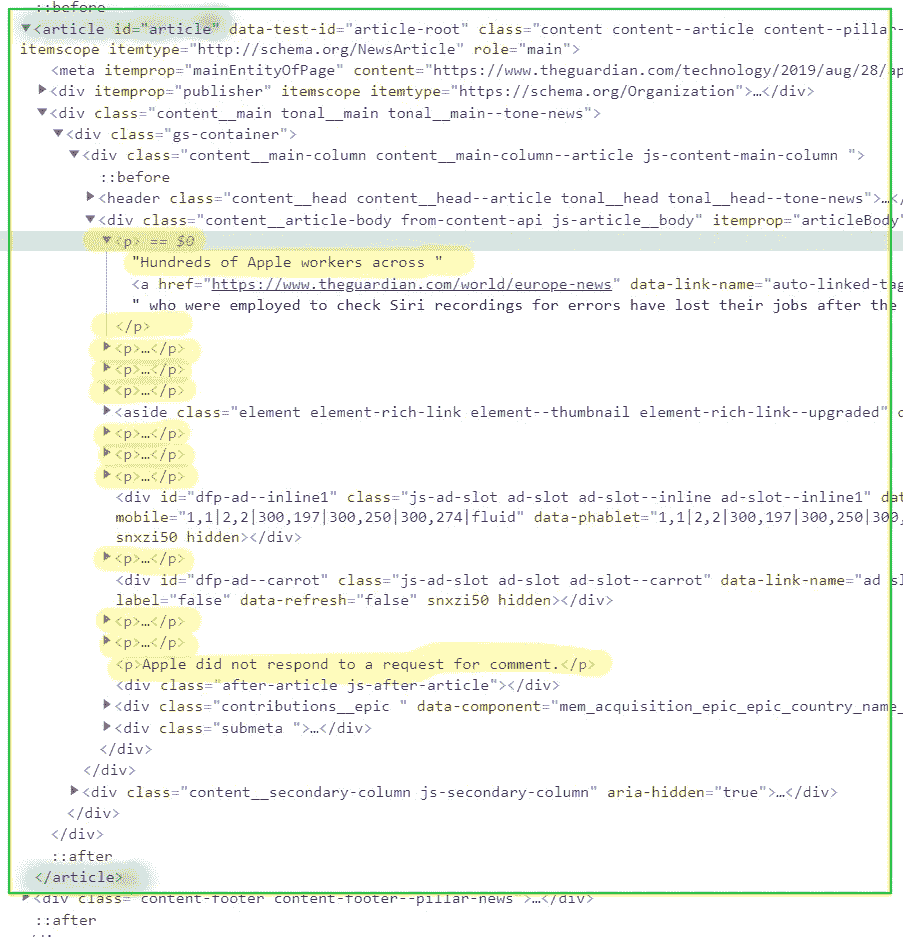

卫报示例—源代码

这是路透社网站的另一个例子，其中的

元素不用于独立的文章，但之前的假设仍然成立:

> 感兴趣的文章是段落块的连接，并且每个网页包含一篇主要文章。

我们从上一页源代码中注意到，元素`<div class=”ArticlePage_container>`用于对主要文章段落块进行分组，而不是使用<*文章* >元素。

 [## GlobalFoundries 起诉 TSMC，希望美国禁止某些产品的进口

### 上海(路透社)-合同芯片制造商 GlobalFoundries 因专利问题起诉更大的竞争对手和苹果供应商 TSMC

www.reuters.com](https://www.reuters.com/article/us-globalfoundries-tsmc-lawsuit/globalfoundries-sues-tsmc-wants-u-s-import-ban-on-some-products-idUSKCN1VH0E9) 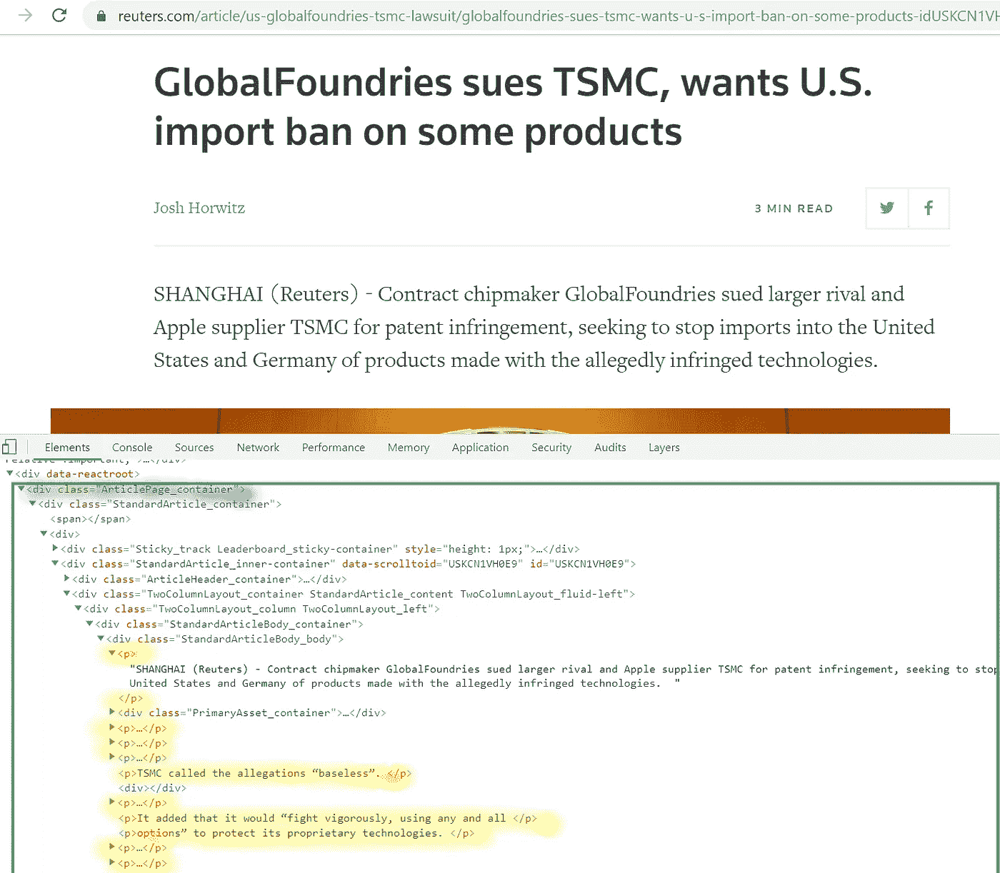

路透社示例—源代码

因此，我们可以考虑提取页面中的所有段落元素，并将它们连接成一篇文章。然而，并不是网页中的所有段落块都与主文章相关，所以我们应该找到一种方法，只连接感兴趣的段落。

所提出的解决方案易于实施，并不完美，但在不同网站上测试时效果良好:

1.  提取页面主体中的所有段落元素，
2.  对于每个段落，构建其专利元素层次结构，
3.  在同一父层次结构下连接段落，
4.  选择最长的段落作为主要文章。

> 假设主要文章应该代表最高的网页内容，而其他网页组件，如广告、图像、链接、推广文章摘要等。，应该是个别边缘的。

为了实现这个解决方案，让我们安装一些有用的库:

*   *请求*库将用于请求 http URL:`pip install requests`
*   *beautifulsoup4* 库将用于从 html 内容类型:`pip install beautifulsoup4`中提取数据
*   *熊猫*图书馆将用于收集数据帧格式的文章:`pip install pandas`

下面是处理一篇文章的 Python 实现:

网络抓取— Python 代码

所以现在我们可以循环遍历 RSS 提要结果中的每一项来提取所有文章。

# 使用谷歌云平台实现自动化

在本节中，我们将使用谷歌云平台(GCP)来构建一个可扩展的解决方案，用于搜索与关键字相关的任何新闻，提取新闻文章并存储它们以供将来处理:

1.  [Cloud Pub/Sub](https://cloud.google.com/pubsub/) 将用于构建一个事件驱动的解决方案来启动搜索和提取流程，
2.  [云函数](https://cloud.google.com/functions/)将用于使我们的 Python 代码作为服务可用，
3.  [云存储](https://cloud.google.com/storage/)将用于将结果文章持久化为 [Json](https://www.w3schools.com/js/js_json_intro.asp) 文件。

*您可以使用 Gmail 帐户开始免费使用*[*GCP*](https://cloud.google.com/free/)*。你可以获得 300 美元的免费信用，可以使用 12 个月。*

## 云发布/订阅

要开始使用云发布/订阅，我们应该创建一个主题。主题是对发布者和订阅者之间交换的相关消息进行分组的资源。

就我们的情况来说，我们将发布三个主题的消息:

1.  *news _ search _ to _ process:*本主题发布的消息会触发一个云函数来处理一个 RSS 提要，
2.  *news _ article _ to _ process:*本话题发布的消息会触发云功能对一个新闻网页进行 web 抓取，
3.  *news_article_processed* :本主题发布的消息会通知订阅者进行进一步处理。

我们可以使用 [Google Cloud console](https://console.cloud.google.com/) 来创建一个主题，或者我们可以使用命令行使用 [Google Cloud SDK](https://cloud.google.com/sdk/) 在我们的本地环境中安装和配置:

```
gcloud pubsub topics create news_search_to_process
gcloud pubsub topics create news_article_to_process
gcloud pubsub topics create news_article_processed
```

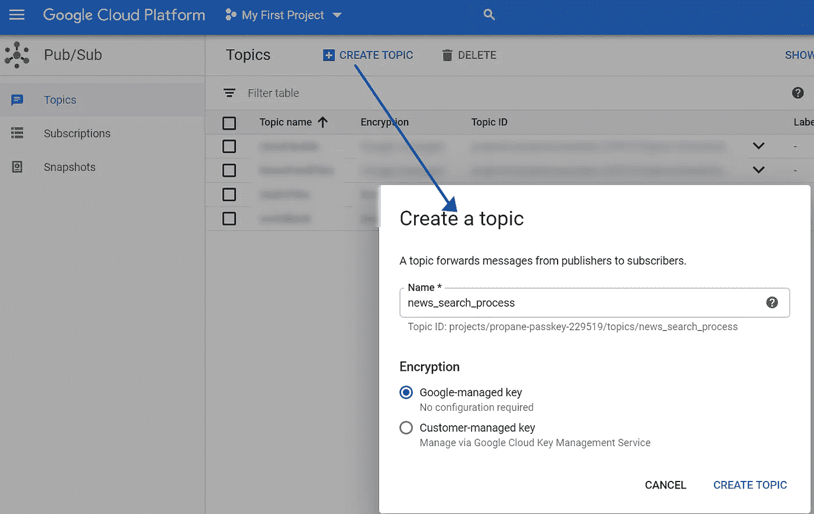

云发布/订阅—创建主题

我们还需要定义一条消息，以便能够针对不同的 RSS 提要或不同的关键字运行新闻搜索。

为了保持示例的简单性，让我们发布一个简单的 URL 作为消息属性，云函数将使用它来启动流程:

`url = '[https://news.google.com/rss/search?q=apple](https://news.google.com/rss/search?q=apple')'`

我们可以使用控制台手动将消息发布到某个主题:

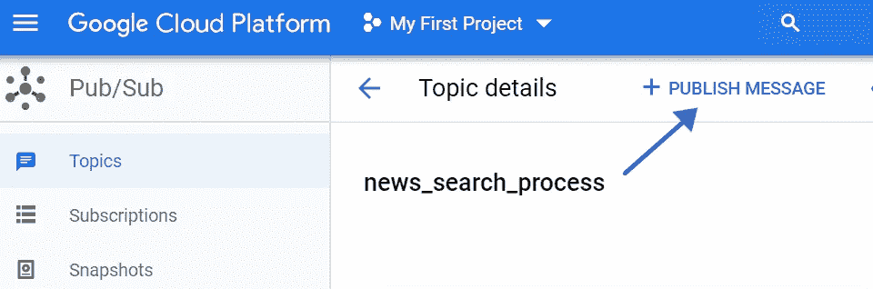

云发布/订阅—主题详细信息

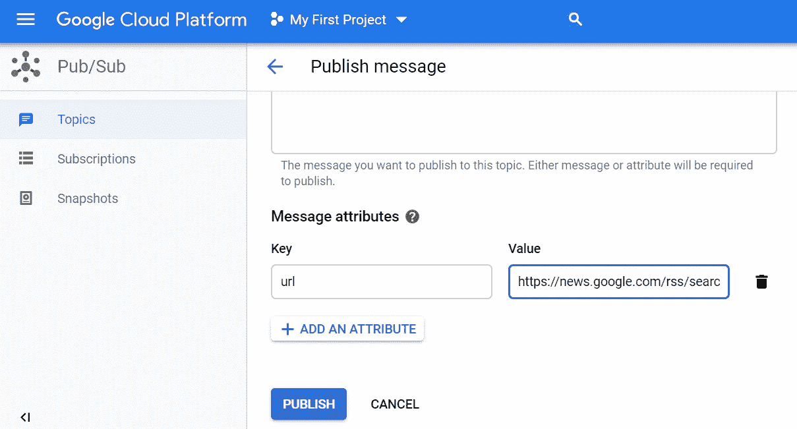

云发布/订阅—将消息发布到主题

## 云函数

为了为我们的解决方案部署云功能，我们需要创建这两个文件:

1.  *main.py* 文件包含我们的 python 函数，
2.  *requirements.txt* 文件列出了我们需要安装的 python 库。出于我们的目的，它将包含以下库:

```
google-cloud-storage
google-cloud-pubsub
pandas
feedparser
bs4
```

main.py 文件包含:

1.  *process _ RSS _ feed _ search()*:当我们发布消息到云发布/订阅主题 *news_search_to_process* 时，这个云函数会被触发。
2.  *process _ RSS _ feed _ article()*:当我们发布消息到云发布/订阅主题*news _ article _ to _ process*时，这个云函数会被触发。
3.  *news_feed_parser* :这个类用于解析 RSS 新闻源 URL，并抓取新闻网页。
4.  *gcp_cloud_util* :该类用于连接 Google 云平台，将 gcp 服务封装为云存储，本例中为云发布/订阅。

现在我们需要部署两个云函数，由发布到云发布/订阅主题的消息触发。我们可以使用 [Google Cloud SDK](https://cloud.google.com/sdk/) 执行命令行:

```
gcloud functions deploy process_rss_feed_search --runtime python37 --trigger-topic news_search_to_processgcloud functions deploy process_rss_feed_article --runtime python37 --trigger-topic news_article_to_process
```

我们现在准备通过发布消息到云发布/订阅主题*新闻 _ 搜索 _ 流程:*来测试我们的解决方案

*   `url = '[https://news.google.com/rss/search?q=apple](https://news.google.com/rss/search?q=apple)'`

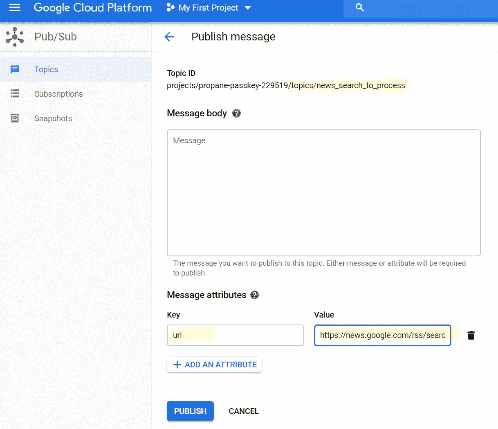

消息发布到主题:*新闻 _ 搜索 _ 流程*

云函数*process _ RSS _ Feed _ search()*运行成功，处理了从 google News RSS Feed 中提取的 100 篇文章:

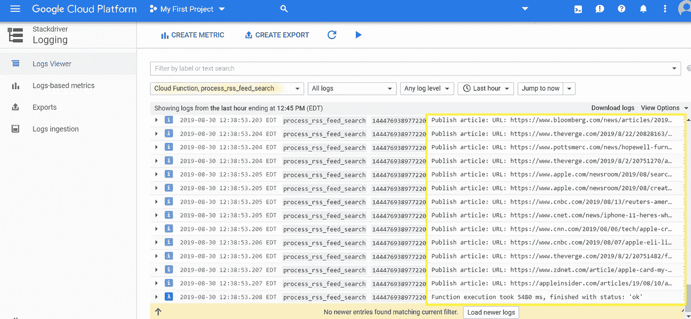

云函数 process_rss_feed_search()日志

云函数*process _ RSS _ feed _ article()*成功运行 100 次，处理发布的文章:

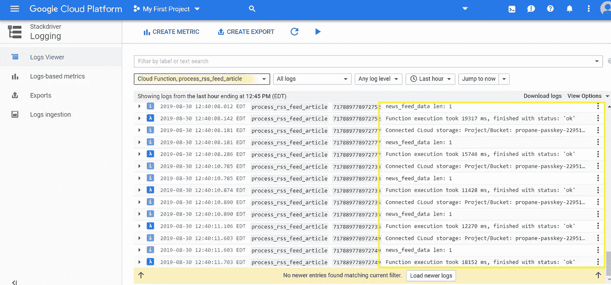

云函数 process_rss_feed_article()日志

从网页中提取了 100 篇新闻文章，并在云存储中创建了 Json 文件:

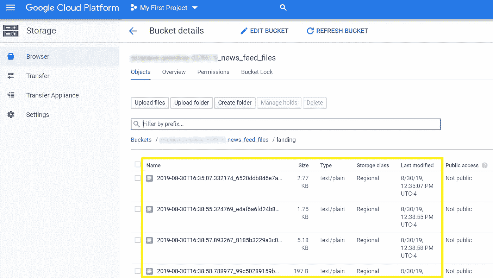

云存储—新闻文章 Json 文件

以下是生成的 Json 文件示例:

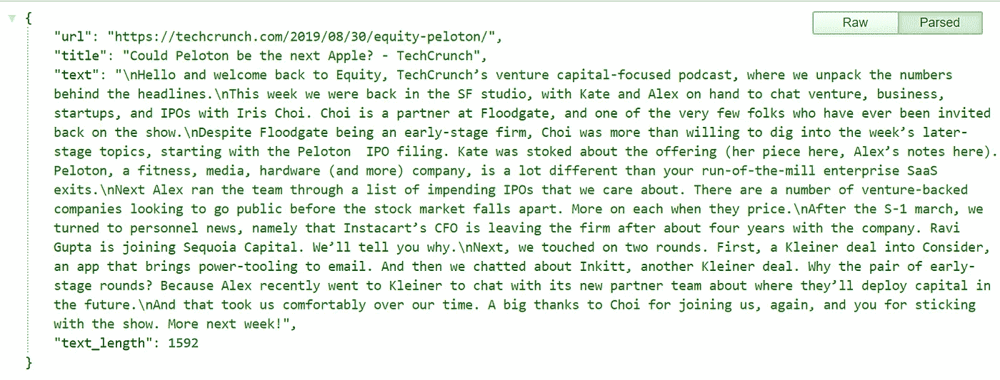

新闻文章— Json 文件示例

> 我希望你喜欢这篇关于 web 抓取和无服务器云服务的介绍。在以后的文章中，我将介绍如何使用 [Spacy python 包](https://spacy.io/)从新闻文章中提取实体的解决方案，以及如何使用[云端点](https://cloud.google.com/endpoints/)安全地公开 Web 服务。