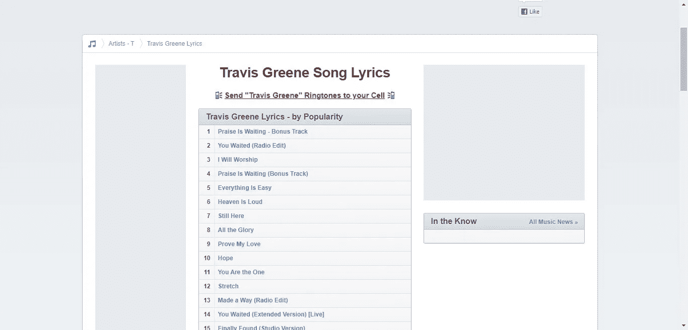
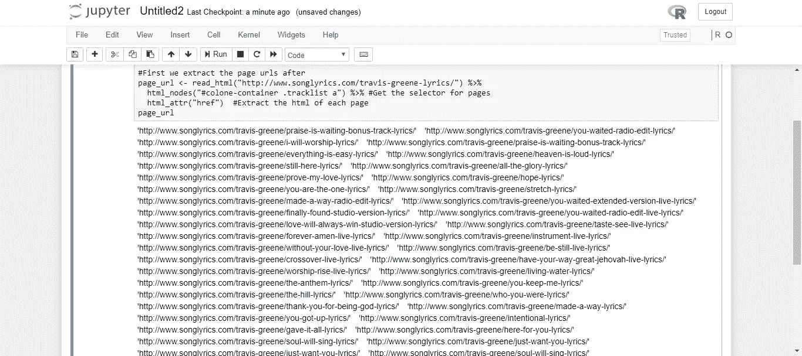
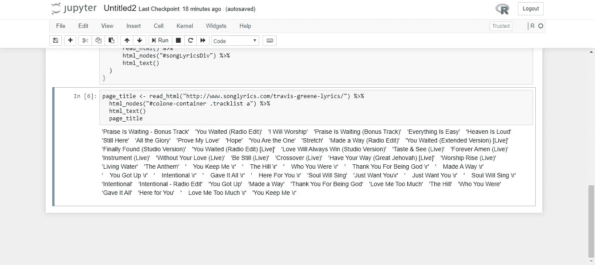
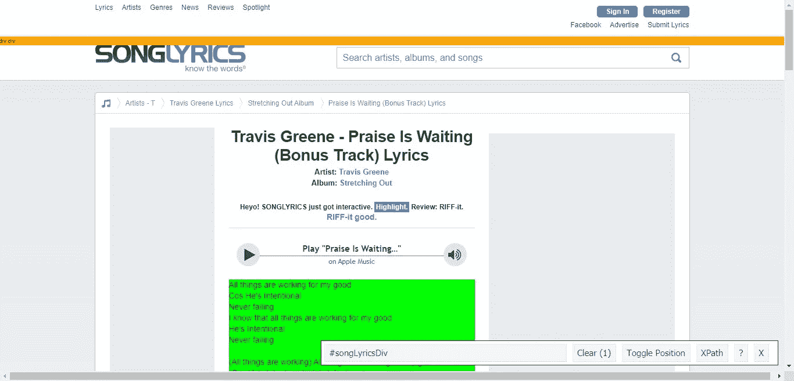
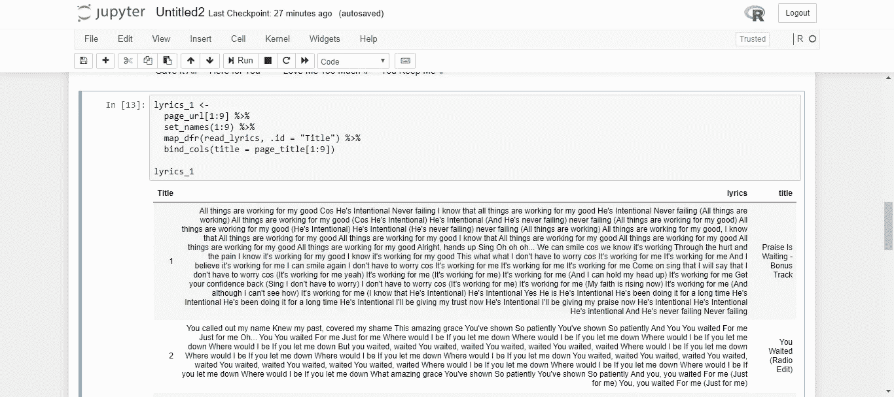

# 网页抓取—第 2 部分

> 原文：<https://medium.com/analytics-vidhya/web-scraping-part-2-2ccdd145e8cb?source=collection_archive---------7----------------------->

用 R 同时抓取多个网页


来源:Pixabay

这个简短的教程将介绍如何同时抓取网页上的多个页面。本教程假设您可以使用 google chrome css 选择器小工具。如果没有，请看第一部分[这里](/datadriveninvestor/web-scraping-crytocurrencies-with-r-a7ff07f135db)。

由于一些网页包含大量数据(或文本)，例如评论部分，评论通常会溢出到下一页。它也可以用于排序，无论是哪种情况，单独抓取每一页都非常困难。为此，我想到了创建一个可以轻松抓取多个页面的功能。

我将尝试刮一个艺术家(特拉维斯格林)的歌词，因为艺术家通常有相当多的歌曲在他们的投资组合，这将是极其艰巨的任务，试图刮个别网页。因此，让我们找出如何使刮这些页面变得容易。

```
#Lets load in the required packages
library(rvest)
library(tidyverse)
library(stringr)
```

现在，我们尝试使用 rvest 读取 url，并获取包含歌曲列表的 css 标签。



Songlyrics.com/Travis·格林

现在，我们使用包含歌词的选择器小工具来定位歌曲列表的 css 标签。

```
#load in the url and 
#First we extract the central page url
page_url <- read_html("[http://www.songlyrics.com/travis-greene-lyrics/](http://www.songlyrics.com/travis-greene-lyrics/)") %>% #Read the central url page containing lyrics listhtml_nodes("#colone-container .tracklist a") %>% #Get the css tag for the listed songs html_attr("href")  #Extract the url of each page from the css tagpage_url
```



歌词 Url

上图显示了上述代码的结果。我们拥有的是中央页面上列出的所有歌曲的 url(链接)。

接下来，我们提取所有歌词的歌词名称(或歌词标题)

```
page_title <- read_html("[http://www.songlyrics.com/travis-greene-lyrics/](http://www.songlyrics.com/travis-greene-lyrics/)") %>% 
  html_nodes("#colone-container .tracklist a") %>% 
  html_text()page_title
```



歌词名称

获得歌词名称后，接下来我们创建一个函数来读取各个 URL，然后在各个页面中加载歌词 css 选择器。别担心，我尽可能地简化了步骤。

1.  从上面获得的歌词 url 中找到 ***歌词*** 的 css 标签，只需点击其中一个歌词即可获得 css 标签。



歌词 css 选择器

我们现在可以看到#songLyricsDiv 是包含歌词的 css 标签。

2.现在让我们创建一个函数，它将进入页面，然后读取页面的 css 标签(在这个例子中是歌词)。

```
read_lyrics <- function(url) {
  tibble(
    lyrics = 
      url %>%
      read_html() %>% 
      html_nodes("#songLyricsDiv") %>%
      html_text() 
  )
}
```

记住以上是一个函数，我们必须应用它。要应用:

```
page_url[1:9] %>% #We select just nine urls already obtained as trial 
  set_names(1:9) %>%  #A column that indicates the postion of each url 
  map_dfr(read_lyrics, .id = "Title")  %>% 
  bind_cols(title = page_title[1:9]) #Bind the title of the first nine songs
```

从上面的第三行代码开始，我们使用前面定义的函数，然后使用 tidyverse 管道将每个 URL 传递给该函数。

发生的情况是，对于页面 url 中的每个单独的歌词，我们定义的函数进入传递给它的 url，然后获取函数中定义的 css 标签，并返回抓取的歌词。它迭代地做这件事。

在最后一行代码中发生的是，因为我们已经获得了存储在 ***page_title，*** 中的歌曲的标题，我们提取前九首歌曲，然后与提取的歌词进行列绑定，因为我们也只处理前九个 URL。



歌词和标题

上面的图像应该是你的结果。

## 结论

我们已经简要地探讨了如何抓取多个页面，当然，不同的网站可能需要您稍微调整一下上面的代码，但它确实可以完成工作。在这里找到本教程[的完整脚本。](https://github.com/simmieyungie/Webscraping-/blob/master/Scraping%20Multiple%20pages.R)