# 网页抓取项目:创建一个美丽的汤& Python 工作板

> 原文：<https://medium.com/analytics-vidhya/web-scraping-project-create-a-job-board-with-beautiful-soup-65d4b1a498fb?source=collection_archive---------3----------------------->

图片来自 [Pixabay](https://pixabay.com/es/photos/sopa-plato-los-alimentos-5690827/) 的 [RitaE](https://pixabay.com/es/users/ritae-19628/)

# 介绍

> T4:互联网上数量惊人的数据对任何研究领域或个人兴趣来说都是丰富的资源。通过使用自动化过程有效地收集数据被称为**网络搜集**。

假设我们想从一个或多个网页中获取一些内容。 **Beautiful Soup** 帮助你从网页中提取特定内容，移除 HTML 标记，并保存信息。它是一个网络抓取工具，可以帮助你清理和解析从网上下载的文档。

# 数据

对于这个项目，我不会使用任何。csv 或。xlsx 数据文件，正如我在以前的数据科学项目中所做的那样。这次我将收集我感兴趣的数据，并创建我自己的个人数据集。

从那时起，我们只需要使用 Pandas 创建一个数据框架，并利用这些数据提取一些有用的见解。

# 方法学

首先，让我们从陈述该项目的**目标**开始:创建一个工作公告板，上面有出现在互联网上的工作机会信息。

为了便于讨论，假设我对日本的“数据分析”工作感兴趣，我想从两个不同的已知工作网站获取数据。

我想获得什么样的数据？简单点:标题、网址、更新日期、地点、薪水、工作类型、经验和技能要求。

*免责声明*:本文中的任何网站名称和网址均属虚构。

## **导入库**

用美汤进行网页抓取时需要两个主要的库:

1.  **请求**
2.  **Bs4** (美汤)

其他有用的库包括:

3. **Urllib.parse** (将“相对 url”与“基本 url”连接起来，以创建一个“完整 URL”)

4.**时间**(在短时间内请求大量信息不是一个好的做法，因为这会损害网站。我们使用这个库来确保请求之间有一段时间间隔)

5.熊猫 & **Numpy** (为了摆弄我们从网站上删掉的数据)

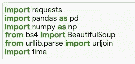

网页抓取时有用的库

## 项目概述

首先，我们创建一个**字典**，其中包含我们在日本搜索数据分析工作机会后感兴趣的两个网站:

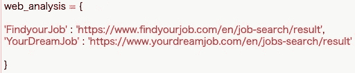

包含我们想要从中删除数据的网站的字典

总体概念是**循环遍历**字典的值。通过使用每个值，我将提出我的请求。在请求中，甚至可以指定我们要从中获取数据的页码。

如果一切顺利(请求值为 200)，我们将从该请求的内容中获取 HTML。从那时起，我们可以使用漂亮的汤来解析 HTML，以便从中提取信息。

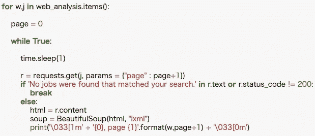

项目的 For 循环大纲

因此，如果通过搜索“数据分析”，我们得到 70 个结果，分成每页 10 个结果(总共 7 页)，我们将阅读每一页并移动到下一页，直到最后到达第 7 页。

但是 for 循环不会就此停止，会继续到第 8 页。这时，循环的最后一部分就派上用场了。由于不会有更多的结果，请求的值将是一个错误(很可能是 400)。然后，for 循环将会中断，并移动到字典的下一个值。

## 存储数据

提取出我们感兴趣的数据后，比如说“标题”,我们需要一个地方来存储它:空列表。

我将在不同的空列表中存储每个数据，一旦所有的提取完成，它们将被用来创建一个数据框，在那里最终的工作板将被可视化。

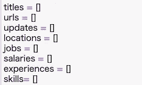

存储提取数据的空列表

## **提取数据**

按照前面的例子，让我们假设我们的搜索结果是 7 页，每页 10 份工作机会(总共 70 份工作机会)。

为了提取相关数据，步骤如下:

1.  获取页面中每个职位的标题。
2.  深入这 10 份工作中的每一份，获取更具体的数据，比如所需的技能类型。
3.  如前所述，借助 for 循环(也称为*分页*)进入下一页。

现在让我们进入**第一步**！

请记住，我将使用在项目开始时创建的变量“soup ”,它包含已解析的网页 HTML。我们想获得的信息就在那里。

此外，由于大部分内核是列表理解格式，可能很难理解，所以我将一步一步地回顾它。

**标题**

1.  要获得标题，我们使用“find_all”命令，让我们选择与所选类相关的所有“a”标签(超链接)。结果以列表格式出现。
2.  因为我们得到了一个列表作为输出，所以我们用“t”循环第一步得到的每个结果。
3.  对于“t”的每个值，我们希望得到它的“文本”,这将是我们正在寻找的“标题”字符串。我们还可以去掉任何前导或尾随空格，最后替换出现的“\n”字符，以保持“Title”字符串完全干净。
4.  请注意，所有内容都在括号内，因此我们需要另一个 for 循环(这就是 lambda 函数的用武之地)来获取第三步的每个结果，并将其添加到我们之前创建的空列表中。

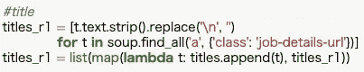

提取每个职位的标题

**网址**

1.  与我们查找“标题”时的步骤相同，但参数不同。结果以列表格式出现，因为它是“find_all”命令的结果。
2.  因为我们得到了一个列表作为输出，所以我们用“l”循环第一步得到的每个结果。
3.  从“l”的每个值中，我们希望获得包含相对 URL 的“href”标记，并将其放在括号中。
4.  我们用“r”对第三步的结果进行最后一次循环，并使用导入库时引入的“urljoin”函数。其思想是将每个相对 URL 与基本 URL(字典中的值)连接起来，创建一个完整的 URL。
5.  这就是我们想要的 URL，因为如果我们点击该 URL，我们将被重定向到工作机会的特定网页。
6.  最后，就像标题一样，我们将它添加到我们预先创建的空列表中。

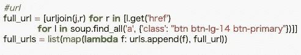

提取每个职位发布的完整网址

**抓取剩余信息:第二个 For 循环**

现在进入**第二步**！

我们从前面的步骤中获得了前 10 个完整 URL 的列表。现在，我们希望进入这些完整的 URL 中的每一个，并继续收集我们想要的数据。我们如何做到这一点？答案是:另一个 For 循环。

对于每个完整的 URL，我们将发出一个请求，然后从该请求的内容中获取 HTML。而且，就像我们以前做的那样，从那时起我们可以使用漂亮的 Soup 来解析 HTML。

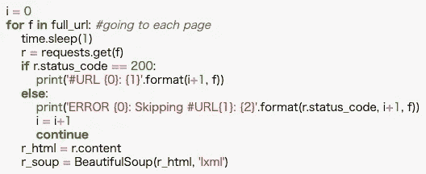

For 循环进入每个招聘职位

**更新日期/地点/薪资/经历**

由于这四种类型的信息与 scrape 非常相似，我将它们组合在一起进行解释:

1.  请记住，我们现在是在第二个 For 循环中，所以我们将不会使用“soup”变量，而是使用我们之前刚刚创建的“r_soup”。
2.  由于我们现在是从每个工作机会单独刮，我们正在寻找一个“更新日期”的结果，一个“位置”的结果，等等。这就是为什么即使我们在这个例子中使用了“find_all ”,我们也可以使用“find”。如果我们使用“find ”,它只会给出第一个结果，但这就足够了。此外，输出不会包含在列表中，因此更容易获得我们想要的文本格式。
3.  无论如何，我们在使用“find_all”后得到了列表中的结果。我们只有一个结果，所以不能使用 For 循环。由于“text”命令只对字符串有效，我们需要首先获取列表中的数据([0])，然后获取文本并去掉任何前导或尾随空格。
4.  最后，像往常一样，我们将第三步得到的结果添加到预先创建的空列表中。

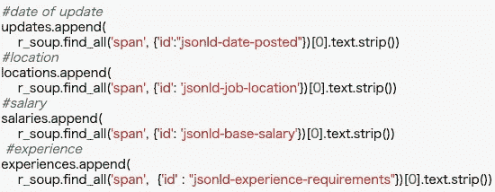

从招聘信息中提取几个数据

**工作类型**

这是一个棘手的问题，因为有时没有可用的信息，当我们试图抓取它时会得到一个 IndexError。

为了让我们的内核即使在出现错误时也能正常运行，我们使用了异常处理。

也就是说，我们使用一个“try”语句，告诉程序放弃我们想要的东西。这里有两种可能的结果:要么发生 IndexError，因此我们创建一个“异常”,并在空列表中追加一个 NaN 值；或者没有出现 IndexError，我们只是将抓取的数据添加到空列表中。

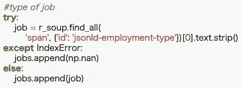

提取职务待遇公告的职务类型

**工作要求**

现在进入最后一个要废弃的数据！这是最难提取的，因为我们想要的不是某个特定的类，而是一个段落。

最重要的是，招聘信息中有几个段落，只有一个段落符合工作要求。

1.  通常，职位发布的格式是一个大表格，里面有每种信息的标题。标题后面自然会有各自的内容。在我们的例子中，我们正在寻找“工作要求”,所以我们将从寻找那个标题开始。
2.  我们首先得到一个完整的表，其中包含了工作机会的所有内容。如果“工作要求”标题在其中，那么我们要寻找的数据也应该在那里。如果标题不是，那么相关的信息就不存在，所以我们只需将一个 NaN 值追加到我们创建的空列表中。
3.  假设“工作要求”标题在表格中。下一步是找到表中的所有行(“tr”标记)，并检查这些行中的哪一行有“Job Requirements”。
4.  一旦我们发现哪一行有“Job Requirements”标题，我们就进入包含相关信息的单元格(“td”标记)。现在唯一剩下的事情就是像往常一样获取文本，去掉空格，去掉任何可能妨碍内容可读性的字符。
5.  一旦我们得到了最终数据，就该关闭 For 循环了。我们有两个元素需要注意:“I”(这样就有可能检查每个完整的 URL 来删除我们想要的内容)和“page”(在删除每个作业结果页面的数据后，当一个页面完成时，我们转到下一个页面，以此类推)。

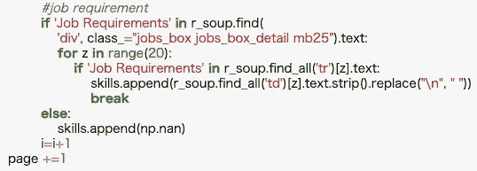

提取数据并结束循环

# 结果

到目前为止，我已经一步一步地被解释了如何对网站中的某个搜索结果进行抓取，分页是如何工作的，以及如何从每个工作机会中单独获得我们想要的数据。不仅如此，还描述了 big first For 循环在我们想要从中抓取数据的两个网站上循环的功能。

由于作案手法大同小异，所以对于第二个网站的结果，我就不深究刮痧方法了。如果你有兴趣，请在本文末尾的 ***查看我的 GitHub*** 页面，找到该项目的完整内核。

现在是时候给我们收集的数据一个形状了，这是通过把它们放在一个数据帧中实现的。这样，我们将创建最终的**工作板**。

另外，如果我们真的喜欢一份工作的条件，我们想了解更多，或者甚至申请它，那该怎么办？复制粘贴网址会很累吧？我们甚至可以**用“style.format”函数让它变成可点击的**！

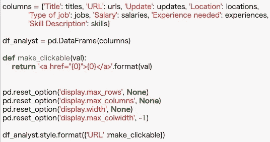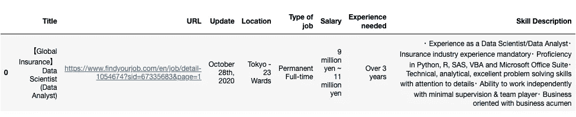

用我们收集的数据创建一个数据框

# 结论

网络抓取的合法性处于“灰色”区域，因此，它取决于我们如何使用手头的工具。

非法网络抓取的一个很好的例子是当你试图抓取私人用户数据时。私人数据通常不是每个人都可以访问的，例如，一些例子涉及从社交媒体上的个人账户获得的数据。

我将在这里戴上“白帽子”，并强调你应该总是首先检查你行为的合法性。

在参与或建立这样的企业之前，了解法律问题是至关重要的。只有这样，你才能避免陷入可制裁的活动或成为其受害者。

关于这个项目内核的更多信息，请访问:[https://github.com/josem-gp](https://github.com/josem-gp)

此外，我可能会继续张贴这个领域，这次做的项目与 API，Scrapy 和硒。敬请期待！