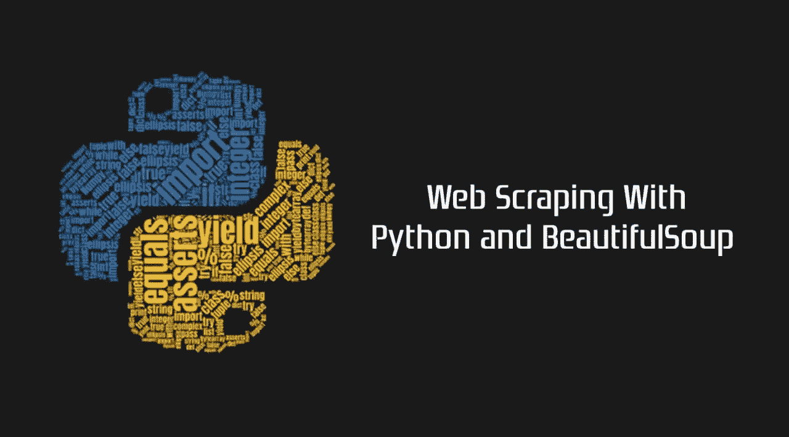
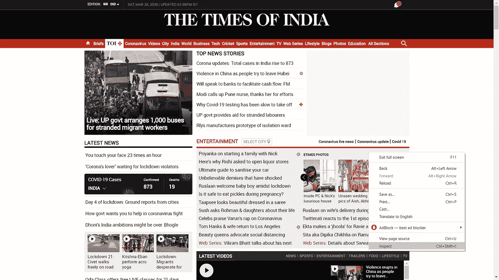
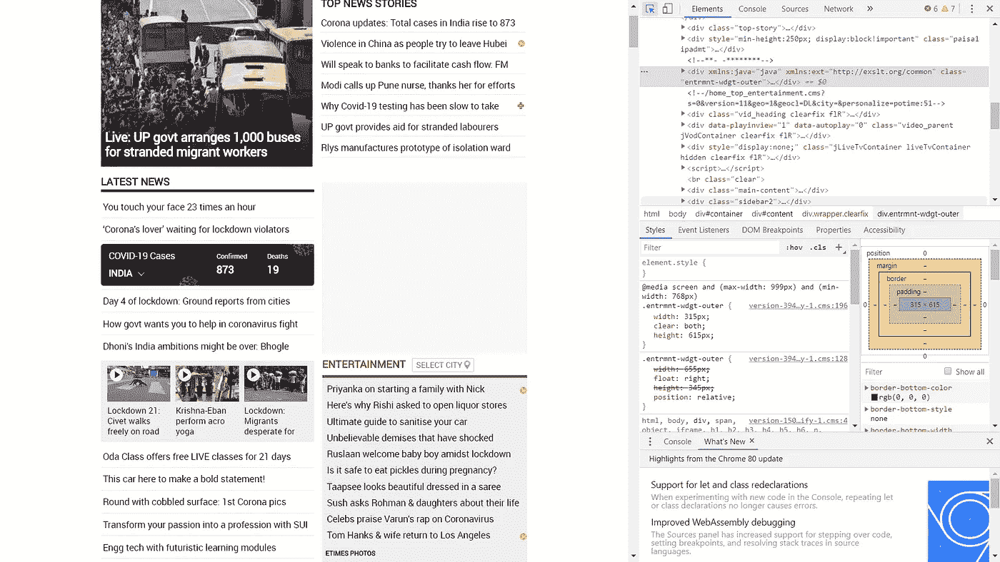
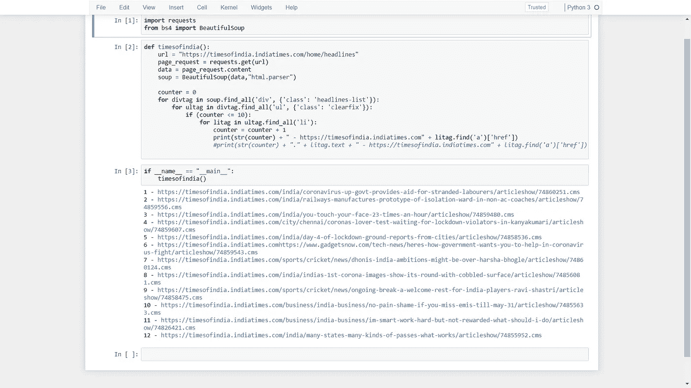

# 用 Python 和 Beautifulsoup4 实现印度的网络抓取时代

> 原文：<https://medium.com/analytics-vidhya/web-scraping-times-of-india-with-python-and-beautifulsoup4-2829c75f4d4b?source=collection_archive---------7----------------------->

在这篇文章中，我们将回顾我在 2019 年 11 月做的一个例子，但我现在与大家分享它。考虑到全球目前的形势，由于冠状病毒已经让世界陷入瘫痪，许多企业已经关闭，跨国公司建议在家工作。考虑到这种情况，许多报社已经停止在印度发行报纸。没有 IT 背景的人也在网上阅读它，但是这篇文章主要关注的是提高他们在 Python 和网络搜集方面的技能。任何一个业内人士或者有 Python 基础知识的人，都可以借助 Python 和 BeautifulSoup4 库来抓取任何网站。

但是在我们深入研究这个程序之前，让我给你一个关于网络抓取的简单概念。

**网页抓取**是一种从网站上自动获取和提取大量信息的技术，可以节省大量的时间和精力。

**网页抓取器是如何工作的？**

自动化 web 抓取器的工作方式相当简单，但也很复杂。毕竟网站是给人类看懂的，不是给机器看的。

首先，在抓取之前，web 抓取器将被给予一个或多个要加载的 URL。然后，scraper 加载相关页面的整个 HTML 代码。更高级的抓取器会渲染整个网站，包括 CSS 和 Javascript 元素。

然后，scraper 将在项目运行之前提取页面上的所有数据或用户选择的特定数据。

理想情况下，用户将经历从页面中选择他们想要的特定数据的过程。例如，您可能想在亚马逊产品页面上搜索价格和型号，但不一定对产品评论感兴趣。

最后，web scraper 会将收集到的所有数据输出为对用户更有用的格式。

大多数 web 抓取器将数据输出到 CSV 或 Excel 电子表格，而更高级的抓取器将支持其他格式，如可用于 API 的 JSON。

这是一个信息丰富的练习，适合正在寻找如何抓取网站的初学者。我将教程分解成更小的部分，这样你可以更好地理解每一步。

**先决条件:** Python3，BeautifulSoup4。

> 我假设您的机器上已经安装了 python。如果不是，请从[https://www.python.org/downloads/](https://www.python.org/downloads/)安装 beautifulsoup4 库类型- *pip 安装 beautifulsoup4*

**Beautiful Soup:**Beautiful Soup 是一个库，可以很容易的从网页中抓取信息。它位于 HTML 或 XML 解析器之上，为迭代、搜索和修改解析树提供了 Pythonic 习惯用法。

**我想给我的同事们一些建议:**

1.  阅读网站的条款和条件，了解如何合法使用他们的数据。大多数网站禁止你将数据用于商业目的。
2.  请确保您不要快速下载他们的数据，因为这可能会破坏网站，可能会使您被阻止！

**视察网站**

我们需要做的第一件事是找出在多层 HTML 标签中我们可以在哪里找到我们想要下载的文件的链接。简而言之，网站页面上有大量代码，我们希望找到包含我们数据的相关代码。如果你不熟悉 HTML 标签，参考 [W3Schools 教程](https://www.w3schools.com/)。理解 HTML 的基础知识对于成功抓取网页是很重要的。

在网站上，右键点击“检查”。这可以让你看到网站背后的原始代码。

单击“Inspect”后，您应该会看到此控制台弹出。

注意，在控制台的左上角有一个箭头符号。

如果您单击箭头符号，然后单击站点本身的某个区域，该特定项目的代码将在控制台中突出显示。或者你可以直接去[网站](https://timesofindia.indiatimes.com/home/headlines)然后执行这些任务。

终点站！**Python 代码**

成功访问 URL 后，我们用 BeautifulSoup 解析 HTML，这样我们就可以使用可管理的 BeautifulSoup 数据结构。Beautifulsoup 是一个多功能的库，我强烈推荐你去看看他们的文档。然后我们使用了这个方法。findAll()来定位我们所有的

标签，使用的技术与我们使用的方法相同。findAll()来定位 divtags 中的所有

*   标签，并打印出前 10 个标题的列表。

结果如下:-

今天有 12 个头条新闻，而不是 10 个！

作为一个 Pythonista，你的网络抓取之旅才刚刚开始，还有其他的网络抓取库。我建议你学习 Scrapy，因为它比 BeautifulSoup 更高级。你可以在我的 Github 上找到我的 Jupyter 笔记本。

或者，你也可以得到一份 [**用 Python**](https://amzn.to/3K6HiCu) 进行网页抓取的副本，深入了解使用 beautifulsoup4 和 scrapy 进行网页抓取。

更多关于这本书的信息，请点击:[https://amzn.to/3K6HiCu](https://amzn.to/3K6HiCu)

感谢您的阅读，祝您网游愉快！