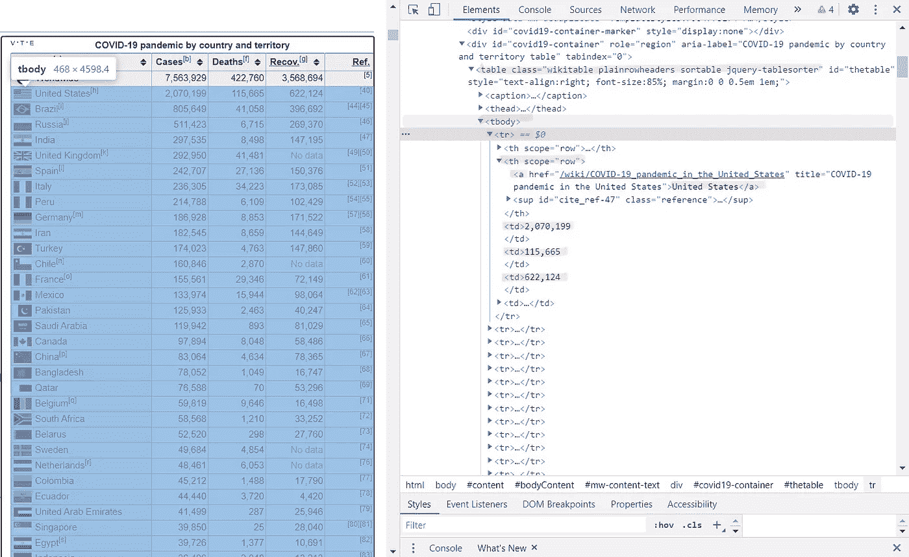
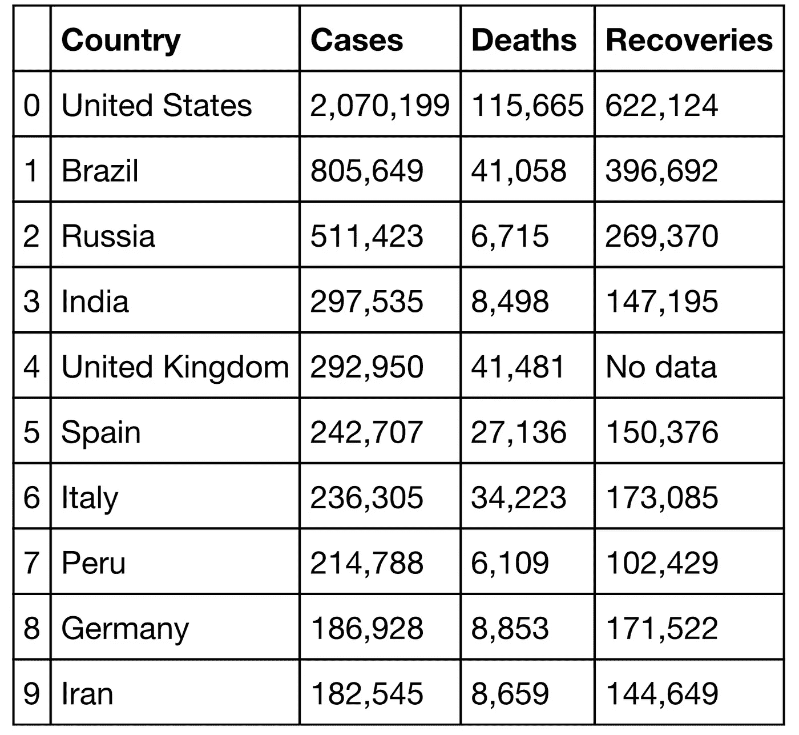

# 使用 BeautifulSoup-新冠肺炎数据的网络抓取

> 原文：<https://medium.com/analytics-vidhya/web-scraping-using-beautifulsoup-covid-19-data-44da0c702a62?source=collection_archive---------10----------------------->


马丁·桑切斯在 [Unsplash](https://unsplash.com?utm_source=medium&utm_medium=referral) 上的照片

*网络抓取是从网站中提取大量的非结构化数据，并以结构化的格式存储在所需的文件/数据库中。我们将在这篇博客中看到它是如何实现的。*

那么你如何从网上搜集数据呢？

你有没有从网站上复制粘贴过信息？如果是的话，我会说你在某种程度上已经完成了网络搜集。但是你不能复制粘贴大约 100 次甚至更多，你能吗？

因此，让我们看看 Python 如何借助它的一个包—***beautiful soup***来帮助我们做同样的事情。

*   **第 1 步-找到包含您所需信息的网站。**

一些网站，如 Twitter 和脸书，提供了 API 以方便连接和访问他们的数据。但是有些没有，所以你必须写一个代码来导航和提取它的内容。

请记住，并不是每个网站都对你抓取他们的内容不感兴趣。所以确保你了解网站的条款和条件。

> 你可以通过在网址后面加上“/robots.txt”来查看网站的权限。
> **robots.txt** 文件被称为 robots 排除协议。

> 我们先刮-
> *各个国家的新冠肺炎病例数-* 从 https://en.wikipedia.org/wiki/COVID-19_pandemic[**到**](https://en.wikipedia.org/wiki/COVID-19_pandemic)**。**

*   *第二步——检查网站。*

*了解网站的结构以提取你感兴趣的信息是很重要的。找出需要抓取的数据所在的 html 标签。
右击网站，然后点击检查。*

> *为了理解和检查内容，您需要知道一些常用的 HTML 标签。
> <标题>标题| < p >段落
> < a >超链接| < div >页面上的分部
> <表格>表格| < th >表格标题
> < tr >表格行| < tr >表格单元格
> 这些标签还可以有 class、id、src、title 等属性。*

**

*检查前面提到的网站，用粉色突出显示的是我们将从中提取数据的标签。*

*   *第三步——在你的 Python 脚本中获取网站的 HTML 代码。*

*我们将使用 ***请求*** 库向网站发送一个 HTTP 请求。服务器将以页面的 HTML 内容作为响应。*

```
*import requests response = requests.get("[https://en.wikipedia.org/wiki/COVID-19_pandemic](https://en.wikipedia.org/wiki/COVID-19_pandemic)")*
```

*让我们检查请求是否成功。*

```
*response.status_code*
```

> ***输出-** 200*

*以 2 开头的状态代码通常表示成功，以 4 或 5 开头的代码表示错误。*

```
*response.content*
```

*获得的响应将类似于您检查的 HTML 内容。*

*   ***第四步——用 BeautifulSoup 解析 HTML 数据***

*由于嵌套标签和多个属性，HTML 内容看起来复杂而混乱。我们现在需要美丽的声音来简化我们的任务。
BeautifulSoup 是一个解析 HTML 和 XML 文档的 python 包。它创建解析树并使提取数据变得容易。*

*让我们首先导入 BeautifulSoup 包并创建它的对象‘soup’。*

```
*from bs4 import BeautifulSoup
soup = BeautifulSoup(response.content, 'html.parser')
soup.prettify()*
```

****【pretify()****函数帮助我们查看标签嵌套的方式。**

*   ****步骤 5-使用 soup 过滤出所需的数据。****

```
**print(soup.title.text)**
```

> ****输出-** 新冠肺炎·疫情-维基百科**

**我们现在将提取国家的名称和病例数，死亡人数和康复人数。**

```
**table= soup.find('table', attrs={"class" : "wikitable"})Country = []
Cases = []
Deaths = []
Recoveries = []trs = table.select("tbody tr")[2:230]for tr in trs:
    Country.append(tr.find_all("th", attrs = {'scope' : 'row'})[1].find('a').text) 

    tds = tr.find_all("td")
    Cases.append(tds[0].text.replace("\n", "").strip())
    Deaths.append(tds[1].text.replace("\n", "").strip())
    Recoveries.append(tds[2].text.replace("\n", "").strip())**
```

**上面代码中使用的一些 BeautifulSoup 函数:
***select()***帮助导航嵌套的 HTML 标签，并最终找到所需标签的出现。**

*****find()*** 从网页响应中返回第一次出现的被传递标签*。* ***【find _ all()***返回我们作为参数传递的标签的所有出现次数。find()和 find_all()都接受特定的属性作为它们的第二个参数。**

*****text***attribute*帮助我们从上述任一函数返回的标签中获取内容。***

*   *****步骤 6-存储提取的数据。*****

***现在让我们将这些数据存储在一个[***pandas***](https://link.medium.com/sRvo73oMh7)data frame 中，以便于进一步的分析。***

```
***import pandas as pd
data = list(zip(Country, Cases, Deaths, Recoveries))
COVID_data = pd.DataFrame(data, columns=['Country', 'Cases', 'Deaths', 'Recoveries'])
COVID_data.head(10)***
```

> *****输出-*****

******

*****病例数最多的前 10 个国家。*****

****注意-该数据由网站持续更新。所以当你读的时候，这些值会不一样。****

******感谢阅读！你自己去试试！******

*****代码:**[*https://github . com/aksha da 30/新冠肺炎-数据/blob/master/新冠肺炎% 20 Data % 20 scraping . ipynb*](https://github.com/akshada30/COVID-19-Data/blob/master/COVID-19%20Data%20Scraping.ipynb)***

*****领英:**[*https://www.linkedin.com/in/akshada-gaonkar-9b8886189/*](https://www.linkedin.com/in/akshada-gaonkar-9b8886189/)***