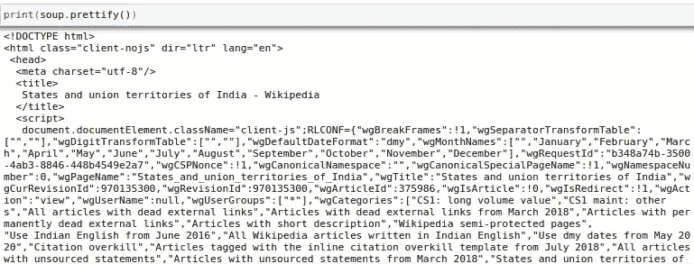
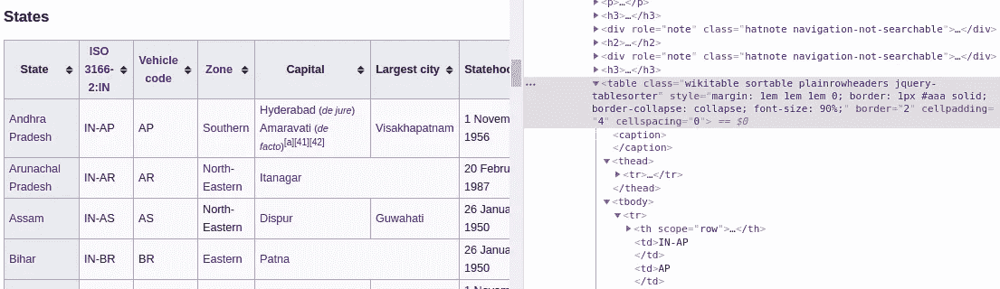
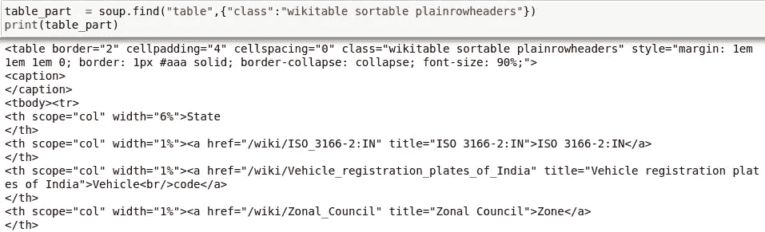
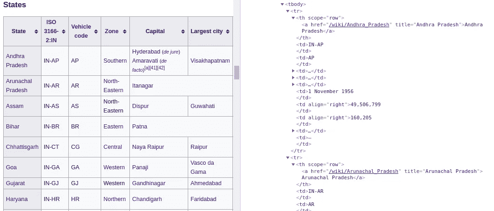
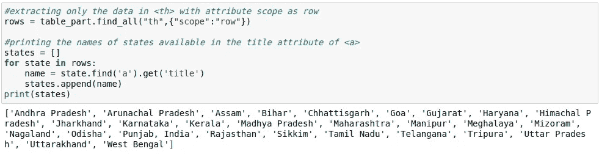

# 使用 BeautifulSoup 进行网页抓取

> 原文：<https://medium.com/analytics-vidhya/web-scraping-using-beautifulsoup-f0c0c46c2421?source=collection_archive---------25----------------------->

在当今世界，有很多网站可用，如果没有有效的方法，分析其中的数据会变得很困难。这就是网络报废发挥作用的地方。Web 抓取是以快速有效的方式自动从网站提取数据的过程。在可用于网络抓取的各种 python 库中，BeautifulSoup 就是其中之一。


BeautifulSoup 是一个用于解析 HTML 和 XML 文档的库，创建了一个解析树，从而允许我们提取和分析数据。

**安装美汤**

可以使用使用 Python 包管理器 pip 安装的 Beautifulsoup 来安装 BeautifulSoup。

```
pip install BeautifulSoup4
```

也可以使用 anaconda 包管理器来安装它。

```
conda install beautifulsoup4
```

**让我们来看一个废弃提取印度各州名称的维基百科的例子**

要访问网页的 HTML 内容，
1。导入 python 的请求和 BeautifulSoup 库
2。提供抓取
3 所需的网址。通过对指定的 URL 执行 HTTP 请求来获取 HTML 数据，并将响应存储在对象中

```
from bs4 import BeautifulSoup
import requests
url='[https://en.wikipedia.org/wiki/States_and_union_territories_of_India'](https://en.wikipedia.org/wiki/States_and_union_territories_of_India')
response = requests.get(url)
```

接下来，通过传递要解析的文档并将解析器的类型指定为参数来创建一个 BeautifulSoup 对象。BeautifulSoup 支持 html.parser、lxml、html5lib 等解析器。它将使用 HTML 解析器，除非特别提到使用 XML 解析器。默认情况下，Beautiful Soup 支持包含在 Python 标准库中的 HTML 解析器。

```
soup = BeautifulSoup(response.text,'html.parser')
```

prettify()是一个函数，使我们能够查看标签是如何嵌套在文档中的。



现在让我们检查 HTML 脚本，在这个脚本中，获取州名的数据位于带有 wiki table sortable plain row headers 类的表下。



现在，我们只想提取 State 列下的州名，该列在中找到，在检索到的表下 scope 属性为“row”。最后，我们可以打印出在的 title 属性中找到的所有州的名称。



我希望这篇文章有助于了解如何使用 BeautifulSoup 以一种快速简单的方式进行 web 报废。感谢阅读！！！