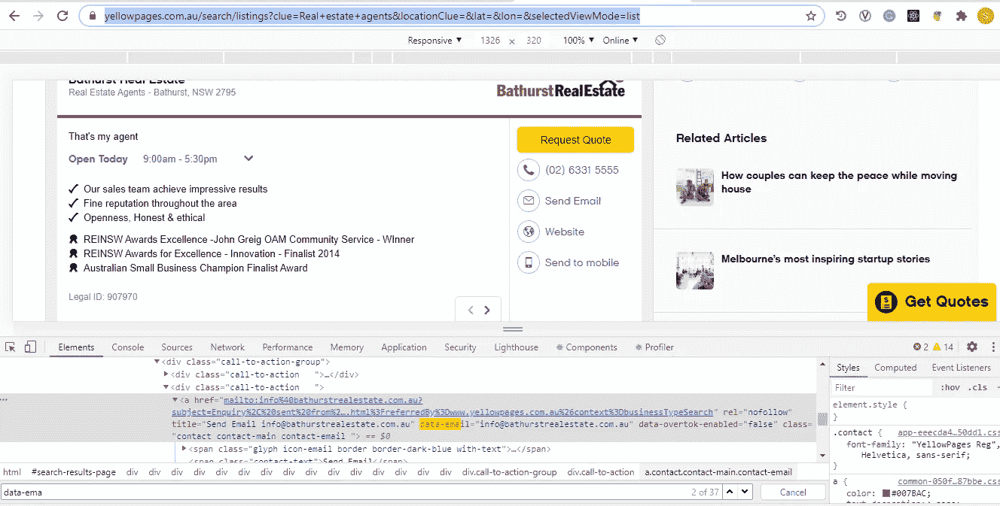

# 使用 Python 进行 Web 抓取

> 原文：<https://medium.com/analytics-vidhya/web-scraping-using-python-981c75b9672e?source=collection_archive---------11----------------------->


有没有想过从一些网站获取一些数据，或者想为一些数据科学问题或训练机器学习模型等创建一个结构化数据集…..如果是，那么这就是我为你准备的解决方案…

解决方案是**网页抓取**也称为**网页采集**或**网页数据提取**是从网站中提取数据的工具。我们从网络抓取中获得的数据是一种**结构化的**数据格式。

**web scraping** 是一种工具，用于将 **web** 上的非结构化**数据**转换为机器可读的结构化**数据**，以备分析。

**网络爬虫**与**网络刮刀**的区别:

网络爬虫:网络爬虫，我们一般称之为“蜘蛛”，是一种人工智能，它通过跟随链接和探索来浏览互联网以索引和搜索内容，就像一个有太多时间的人。

web scraper:web scraper 是一个专门的工具，用于准确快速地从网页中提取数据。根据项目的不同，Web scrapers 在设计和复杂性上有很大的不同。

有时在一些网站上，**数据保护**是存在的，使用正常的方式你将无法从网站上获取数据，所以我将给出解决这个问题的方法

例如，让我向您展示我第一次使用的程序，我得到了预期的响应，但是第二次当我试图使用相同的代码从相同的网站提取更多的数据时，我得到了以下错误


数据保护问题

我为此编写的程序如下:

导入库

```
from urllib.request import urlopen
from bs4 import BeautifulSoup
```

Beautifulsoup4: Beautiful Soup 是一个库，可以很容易地从网页中抓取信息。它位于 HTML 或 XML 解析器之上，为迭代、搜索和修改解析树提供了 Pythonic 习惯用法。

urllib . request:[urllib . request](https://docs.python.org/3/library/urllib.request.html#module-urllib.request)模块定义了一些函数和类，这些函数和类有助于在复杂的世界中打开 URL(主要是 HTTP)——基本和摘要认证、重定向、cookies 等等。

要做网页抓取，打开你想执行抓取的网站，进入开发者选项，你会看到 HTML 代码



网页开发者选项

```
url = "[https://www.yellowpages.com.au/search/listings?clue=Real+estate+agents&locationClue=&lat=&lon=&selectedViewMode=list](https://www.yellowpages.com.au/search/listings?clue=Real+estate+agents&locationClue=&lat=&lon=&selectedViewMode=list)"
html = urlopen(url)
soup = BeautifulSoup(html, 'lxml')
type(soup)
title = soup.title
print(title)
# Print out the text
text = soup.get_text()
print(soup.text)
all_links = soup.find_all(“a”)
for link in all_links:
 if (link.get(“data-email”) == None):
 continue
 print(link.get(“data-email”))
```

当我们执行上面的代码时，标题会打印在控制台中，第一次点击代码时，我们会得到预期的响应，但同样，当我们尝试执行第二次以获取更多数据时，我会得到数据保护消息

现在假设，你得到了这个错误，你仍然想获取数据。你怎么能这样做

这里是使用 selenium 工具从网站获取电子邮件地址的 python 代码。我使用过与上面相同的网站

Selenium Python 绑定提供了一个简单的 API 来使用 Selenium WebDriver 编写功能/验收测试。通过 Selenium Python API，您可以以直观的方式访问 Selenium WebDriver 的所有功能。

Selenium Python 绑定提供了一个方便的 API 来访问 Selenium WebDrivers，如 Firefox、Ie、Chrome、Remote 等。目前支持的 Python 版本为 2.7、3.5 及以上版本。

在这个程序中，我使用了 chrome 网络驱动程序

此代码的输出:


让我展示一些从 Flipkart 网站获取数据的更复杂的例子。为此，请打开 Flipkart 网页，并打开开发者工具。检查您想要获取的 div 参数，并相应地在代码中定义它。


查看代码以提取 excel 文件中的名称、价格和规格

导入库

```
from selenium import webdriver
from bs4 import BeautifulSoup
import pandas as pd
```

**pandas** 是一个快速、强大、灵活且易于使用的开源数据分析和操作工具，构建在 [Python](https://www.python.org/) 编程语言之上。

```
driver = webdriver.Chrome(“C:\chromedriver_win32/chromedriver”)
products=[] #List to store name of the product
prices=[] #List to store price of the product
ratings=[] #List to store rating of the product
specs=[]#List to get the specs
driver.get(“[https://www.flipkart.com/laptops/pr?sid=6bo%2Fb5g&p%5B%5D=facets.offer_type%255B%255D%3DExchange%2BOffer&wid=12.productCard.PMU_V2_8](https://www.flipkart.com/laptops/pr?sid=6bo%2Fb5g&p%5B%5D=facets.offer_type%255B%255D%3DExchange%2BOffer&wid=12.productCard.PMU_V2_8)")
content = driver.page_source
soup = BeautifulSoup(content)
for a in soup.findAll(‘a’,href=True, attrs={‘class’:’_31qSD5'}):
 name=a.find(‘div’, attrs={‘class’:’_3wU53n’})
 price=a.find(‘div’, attrs={‘class’:’_1vC4OE _2rQ-NK’})
 rating=a.find(‘div’, attrs={‘class’:’hGSR34'})
 spec = a.find(‘div’, attrs={‘class’:’_3ULzGw’})
 products.append(name.text)
 prices.append(price.text)
 ratings.append(rating) 
 specs.append(spec.text)
```

要以 excel 格式保存数据，请参见下面的代码片段

```
df = pd.DataFrame({‘Product Name’:products,’Price’:prices,’Specification’:specs}) 
df.to_csv(‘products1.csv’, index=False, encoding=’utf-8')
```

运行代码后，会生成一个包含所需信息的 excel 表


上面代码的输出

还有更多的操作可以使用 web 抓取来执行，例如从网站上的一些表格中获取信息，然后绘制这些信息，以图形表示的方式将其可视化

我希望这篇文章能给你一些关于网络抓取的小提示

我仅出于学习目的使用了上述网站。