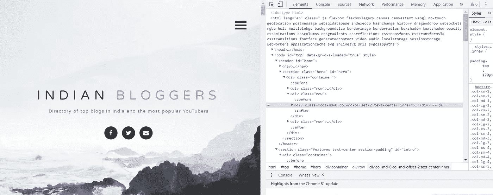
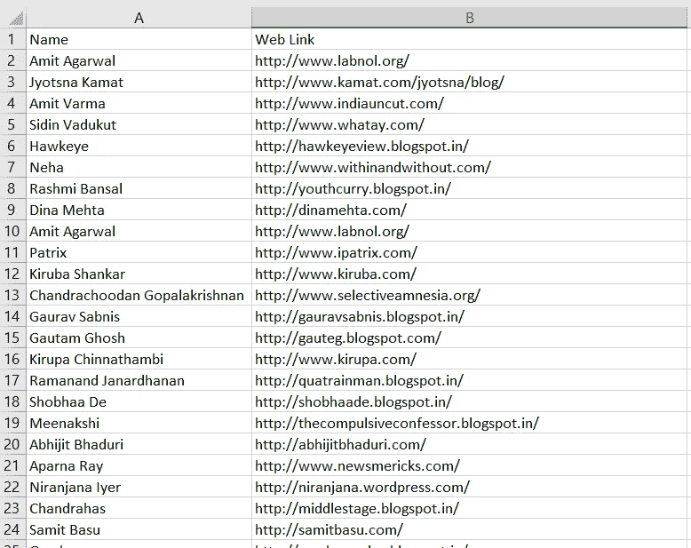

# 用美汤刮网

> 原文：<https://medium.com/analytics-vidhya/web-scraping-using-python-and-beautiful-soup-d3d29bf5b7e9?source=collection_archive---------13----------------------->


图片来源:【https://hackernoon.com/web-scraping-bf2d814cc572 

**网页抓取**或**网页数据提取**用于自动化从网站提取数据的过程。Web scraping 省去了手动下载或复制任何数据的麻烦。

在这篇文章中，我们将直接跳到代码。关于网页抓取的更多信息和应用，请看这篇 [**文章**](https://towardsdatascience.com/https-medium-com-hiren787-patel-web-scraping-applications-a6f370d316f4) 。

我们准备从这个 [**站点**](https://indianbloggers.org/) **中提取博主的姓名和网址链接。**

在开始编码之前，我们需要去我们想要抓取的站点。**开发者工具**可以帮助你了解一个网站的结构。您也可以通过在页面上点击右键并选择 chrome 中的*检查*选项来访问它们。这将显示页面的 HTML 内容。



网站网址:[https://indianbloggers.org/](https://indianbloggers.org/)

**步骤 1** :导入需要的库。

```
import requests
from bs4 import BeautifulSoup, Comment
import pandas as pd
import csv
import re
```

**第二步**:用[美汤](https://www.crummy.com/software/BeautifulSoup/bs4/doc/)解析 HTML 代码

```
url=’https://indianbloggers.org/'
content = requests.get(url).text
soup = BeautifulSoup(content, ‘html.parser’)
```

**第三步**:查找元素

您可以使用 ID 或 HTML 类名通过`soup.find()`和`soup.find_all()`属性找到元素。在这里，我将提取的数据保存在标题为“名称”和“网络链接”的 *blog_list.csv* 文件中。

```
with open(‘Blog_list.csv’,’w’,newline=’’) as file:

 fieldnames = [‘name’,’web link’] 
 writer = csv.DictWriter(file, fieldnames=fieldnames)
 writer.writeheader()   for link in soup.find_all(‘a’,):    if (len(link.text.strip()) > 1 and  
   bool(re.match(‘^http’,link[‘href’])) and not 
   bool(re.search(‘indianbloggers|twitter|facebook’,link[‘href’])): data[‘title’].append(link.text)
    data[‘links’].append(link[‘href’])
    writer.writerow({‘name’:data[‘title’], ‘link’:data[‘links’]}) 
    #finding type of blog 
    if re.search(‘blogspot’,link[‘href’]): 
     poll[‘blogspot’]+=1 
    elif re.search(‘wordpress’,link[‘href’]): 
     poll[‘wordpress’]+=1 
    else: 
     poll[‘others’]+=1 blog_list = pd.DataFrame(data).set_index(‘title’)
print(blog_list.head())
blog_list.to_csv(‘blog_list.csv’, encoding=’utf-8')
print(str(len(blog_list.index))+’ rows written’)
print(poll)
```

这里是 *blog_list.csv* 文件的快照。



你也可以在找到[这个](https://www.simplyrecipes.com/?s)网站的网页抓取，收集配方名称、配料和配方链接[。](https://github.com/shwetapardeshi1/Web-Scraping)

这篇文章由 Sameer Ahire 合著。

## 参考

[](https://realpython.com/beautiful-soup-web-scraper-python/) [## 美丽的汤:用 Python 构建一个 Web 刮刀——真正的 Python

### 在本教程中，你将走过网页抓取过程的主要步骤。你将学习如何写剧本…

realpython.com](https://realpython.com/beautiful-soup-web-scraper-python/) [](https://www.simplyrecipes.com/?s) [## |搜索结果| SimplyRecipes.com |第 1 页

### 井然有序的厨房不一定要超简约；它只需要运行良好。这些编辑认可的厨房…

www.simplyrecipes.com](https://www.simplyrecipes.com/?s) [](https://towardsdatascience.com/https-medium-com-hiren787-patel-web-scraping-applications-a6f370d316f4) [## 网络抓取是如何通过它的应用改变世界的

### 猜猜看，设想新公司的企业家、财富 500 强公司的首席执行官、股票分析师…

towardsdatascience.com](https://towardsdatascience.com/https-medium-com-hiren787-patel-web-scraping-applications-a6f370d316f4) [](https://indianbloggers.org/) [## 最好的印度博客

### 印度最受欢迎的博客目录。你可以在这里认识一些最好的印度博主，甚至添加你自己的博客…

indianbloggers.org](https://indianbloggers.org/) [](https://www.datacamp.com/community/tutorials/web-scraping-using-python) [## 使用 Python 进行 Web 抓取

### 网络抓取是一个术语，用来描述使用程序或算法来提取和处理大量数据…

www.datacamp.com](https://www.datacamp.com/community/tutorials/web-scraping-using-python)