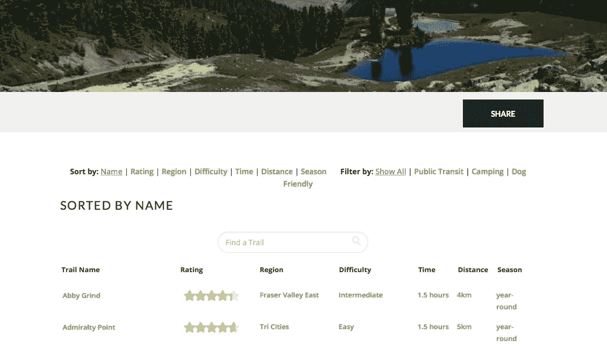
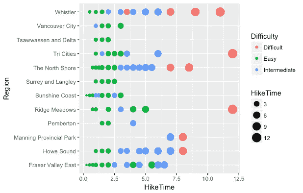
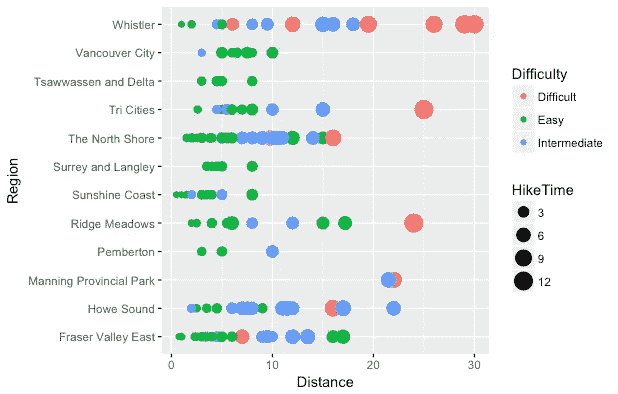
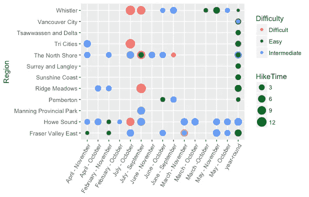

# 使用 R 的网页抓取

> 原文：<https://medium.com/analytics-vidhya/web-scraping-using-r-f256da5db50c?source=collection_archive---------1----------------------->

这是我记录我使用 R 或 Python 解决数据分析/数据科学问题的小实验系列的一部分。这些实验可能是多余的，可能已经被不同的人写在博客上了，但这更多的是个人日记和我个人的学习过程。并且，在这个过程中，我希望我能吸引和激励任何和我经历相同过程的人。如果一个比我更有见识的人偶然发现了这个博客，并认为有一种更好的方式来做事情，或者我在某些地方出错了，请随时分享反馈，不仅帮助我，也帮助每个人作为一个社区一起成长。



**前兆:**我最近搬到了加拿大的温哥华，我想在夏天让位于秋天，然后是冬天之前，尽可能多地徒步旅行。我谷歌了一下温哥华周围的小路，发现了一个整洁的网站【www.vancouvertrails.com 。然后我想，也许为什么不做一个谷歌表来跟踪这些轨迹，当我完成它们并记下我的经历。我本可以将这些数据复制粘贴到 google sheet 中，然后继续前进，但那样就没什么意思了，所以我想，为什么不写一个 R 代码来抓取网站数据并导出为 csv 格式，然后我会上传到我的 google sheet 中。(是的，我喜欢让事情变得尽可能有趣)

**目标**:抓取网站数据并导出为 csv 文件，当我在做的时候，使用 ggplot 做一些有趣的数据分析。(足够简单)

**库:**我开始在 R 库的文档中寻找要使用的库和要使用的函数，在谷歌搜索了大约 15 分钟后，我找到了我喜欢的库“rvest”。

**第一步:读取网址**

有一个函数“read_html”，我们将使用它来读取给定网页上的 html。

```
url <- “[https://www.vancouvertrails.com/trails/?details=&sort=#list](https://www.vancouvertrails.com/trails/?details=&sort=#list)"
trails_webpage <- read_html(url)
```

如果你访问过上面的网址，你会看到它列出了温哥华及其周边的所有路线(准确地说是 167 条)

**第二步:抓取需要的数据**

现在， *rvest* 库最好的部分是你可以从 html 节点中提取数据，这意味着你可以直接选择带有 id 或 css 类的节点，并从 html 标签中提取文本。所以我去了我的网址，启动了浏览器上的“firebug”，很快就发现远足的名字已经被封装在*中了。trailname"* css 类，使用这个 css 类我可以提取网页上所有的踪迹名称。

这里我们将使用两个函数:

1.  html_nodes:使用这个函数提取我们喜欢的节点(在这个例子中，节点带有“.trailname "作为 css 类
2.  html_text:使用这个函数提取 html 节点之间的文本(在本例中是我们的线索名称)

```
#Scraping Trail Names using css class ‘trailname’trail_names_html <-html_nodes(trails_webpage, ‘.trailname’)
trail_names <- html_text(trail_names_html)
head(trail_names)**Output:** [1] “Abby Grind” “Admiralty Point” 
[3] “Al’s Habrich Ridge Trail” “Aldergrove Regional Park”
[5] “Alice Lake” “Ancient Cedars Trail”
```

类似地，现在我将对每条路线的所有其他属性也这样做:地区、难度、时间、距离、季节。每个属性都有自己的 css 类:名称、时间、难度、距离和时间表

```
#Trail Regiontrail_region_html <-html_nodes(trails_webpage, '.i-name')
trail_region <- html_text(trail_region_html)
head(trail_region)**Output:** [1] "Fraser Valley East" "Tri Cities"         "Howe Sound"        
[4] "Surrey and Langley" "Howe Sound"         "Whistler"#Trail Difficultytrail_diff_html <-html_nodes(trails_webpage, '.i-difficulty')
trail_diff <- html_text(trail_diff_html)
head(trail_diff)**Output:** [1] "Intermediate" "Easy"   "Intermediate" "Easy"         "Easy"        
[6] "Intermediate"#Trail Seasontrail_season_html <-html_nodes(trails_webpage, '.i-schedule')
trail_season <- html_text(trail_season_html)
head(trail_season)**Output:**
[1] "year-round"  "year-round"   "July - October"   "year-round"      
[5] "April - November" "June - October"  
>
```

有一点要注意，当我们提取时间时，它是以一个字符的形式出现的:*例如:1.5 小时，3 小时。*我们希望它是数字形式，为了将它转换成数字形式，使用了库: *Stringr* 和函数:` str_extract '

逻辑是我使用正则表达式来匹配模式，并从 html 文本中提取相同的内容。正则表达式帮助，可以参考这里 *的` stringr` [*的 cheatsheet。*](http://edrub.in/CheatSheets/cheatSheetStringr.pdf)*

这就是我把它转换成数字形式的方法:

```
#Extracting Trail Times:trail_time_html <-html_nodes(trails_webpage, '.i-time')
trail_time <- html_text(trail_time_html)
head(trail_time)#"1.5 hours" "1.5 hours" "5 hours"   "2 hours" #Extracted data is in the form of character, we need to extract digits and convert it into numeric formattrail_time <- as.numeric(str_extract(trail_time,pattern = "\\-*\\d+\\.*\\d*"))head(trail_time,25)**Output:** [1]  1.50  1.50  5.00  2.00  2.00  2.00  3.50  5.00
[9]  5.00  1.50  1.00  5.00 11.00  3.00  1.00  2.00
[17]  1.50  1.00  0.50  3.50  0.25  5.00  4.00  2.00
[25]  3.50
```

类似地，对轨迹距离做了同样的事情，因为信息是字符形式的，例如:4 公里:

```
#Trail Distancetrail_dist_html <-html_nodes(trails_webpage, '.i-distance')
trail_dist <- html_text(trail_dist_html)
head(trail_dist)trail_dist <- as.numeric(str_extract(trail_dist,pattern = "\\-*\\d+\\.*\\d*"))head(trail_dist,25)**Output:** [1]  4.0  5.0  7.0  5.0  6.0  5.0  6.1 12.0 10.0  3.0  2.6 10.0 29.0  8.0  2.5
[16]  5.0  4.0  4.2  1.0  6.0  0.8  7.5  7.0  8.0 10.0
```

**步骤 3:** 现在我们已经有了所有的信息，让我们将其整理成一个数据帧并导出到。csv 文件。为了能够做到这一点，我们使用了库`readr`中的函数`write_csv`

```
library(readr)#Combining all the extracted features of the trailstrails_df <- data.frame(
  Name =trail_names,
  Region = trail_region,
  Difficulty=trail_diff,
  Distance=trail_dist,
  HikeTime = trail_time,
  Season = trail_season
  )
str(trails_df)

write_csv(trails_df, "vancouver_trails.csv")
```

**第四步:数据分析**

对于这一部分，使用库 ggplot2 来可视化数据



地区与徒步时间和难度



区域与距离和难度



地区与季节，难度与徒步时间