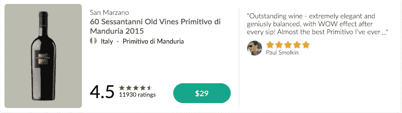
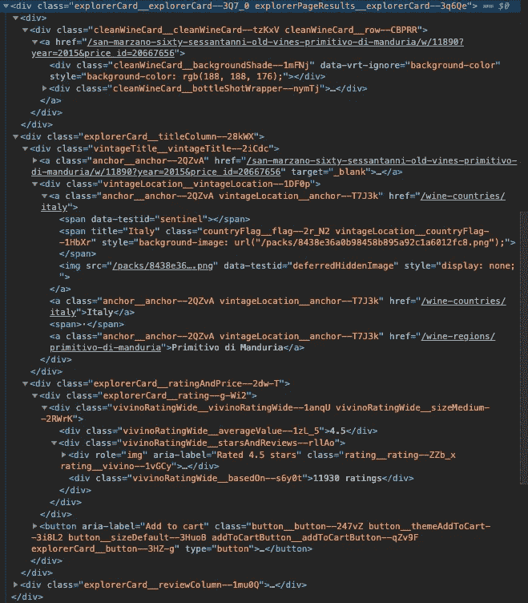

# 使用硒的网刮，美丽的 Soup

> 原文：<https://medium.com/analytics-vidhya/web-scraping-using-selenium-beautifulsoup-a0bd87762a2c?source=collection_archive---------16----------------------->


由 [Marvin Meyer](https://unsplash.com/@marvelous?utm_source=medium&utm_medium=referral) 在 [Unsplash](https://unsplash.com?utm_source=medium&utm_medium=referral) 上拍摄的照片

作为一名数据科学家，收集数据是工作的一部分。

有几种方法可以获得数据。如果你能从 [Kaggle](https://www.kaggle.com/) 得到一个数据集，那太好了！然而，有时数据并不是你想要的。数据可能在网站上，而你想要得到网站上的信息——介绍网络搜集！

Web 抓取是从 HTML 页面获取内容的过程。我们正在使用的工具是 **Selenium** ，它将打开一个浏览器并模拟 javascript 事件，例如点击事件、延迟加载等。

**设置**

1.  **安装硒**

`pip3 install selenium`

或者

`conda install selenium`在 Jupyter 笔记本上

2.**下载网络驱动**

根据您想要使用的浏览器，您可以下载合适的 web 驱动程序。在本教程中，我将使用 Chrome。因此，我下载了 [chrome 网络驱动。](https://chromedriver.chromium.org/)

3.**从硒库进口**

```
from selenium import webdriver
from selenium.webdriver.common.keys import Keys
from selenium.webdriver.chrome.options import Options
from selenium.webdriver.support.ui import WebDriverWait as wait
from selenium.common.exceptions import TimeoutException
```

4.**设置驱动程序以打开浏览器**

在这个例子中，我将从一个流行的葡萄酒评论网站 Vivino 上抓取。

```
url = '[https://www.vivino.com/explore?e=eJwdyjkKgDAURdHdvFKMQ_k6dyBWIvKNMQSMShIcdq_Y3NNcH1hmNbzbqHJ4uVnl0A-7FvpLg4MKduEpwZkkK_aJQZLbbBzlNEGswc7ZRI0r9cM3_xSI1PICdrAezQ==](https://www.vivino.com/explore?e=eJwdyjkKgDAURdHdvFKMQ_k6dyBWIvKNMQSMShIcdq_Y3NNcH1hmNbzbqHJ4uVnl0A-7FvpLg4MKduEpwZkkK_aJQZLbbBzlNEGswc7ZRI0r9cM3_xSI1PICdrAezQ==)'path = r'path of where the driver is located'
driver = webdriver.Chrome(executable_path = path)
driver.get(url)
```

运行该程序将打开一个使用 web 驱动程序的浏览器。现在，您可以通过查看页面上的 HTML 来收集数据。



**美丽的风景**

BeautifulSoup 是一个解析 HTML 数据的 Python 库。

```
import copy
from bs4 import BeautifulSouphtml = BeautifulSoup(driver.page_source, 'lxml')
div = html.find("div", {"class": "explorerPage__results--3wqLw"})
rows = html.find_all("div", {"class": "explorerCard__explorerCard--3Q7_0"})all_rows = []# Let's store each row as a dictionary 
empty_row = {
    "title": None, "location": None, "price": 0.0, "type": None, "ratings": None, "num_ratings": None, "reviews": None, "url": None
}for row in rows:
    new_row = copy.copy(empty_row)
    # A list of all the entries in the row.
    new_row['title'] = row.find("span", {"class": "vintageTitle__wine--U7t9G"}).text
    location = row.find("div", {"class": "vintageLocation__vintageLocation--1DF0p"})
    new_row['location'] = location.findChildren()[-1].text
    price_button = row.find("button", {"class": "addToCartButton__addToCartButton--qZv9F"})
    if price_button:
        new_row['price'] = (float(price_button.find("span").text.replace("$", "")))
    new_row['type'] = 'Rosé'
    new_row['ratings'] = row.find("div", {"class": "vivinoRatingWide__averageValue--1zL_5"}).text
    new_row['num_ratings'] = int(row.find("div", {"class": "vivinoRatingWide__basedOn--s6y0t"}).text.split()[0])
    review_div = row.find("div", {"class": "review__note--2b2DB"})
    if review_div:
        new_row['reviews'] = review_div.text
    clean_div = row.find("div", {"class": "cleanWineCard__cleanWineCard--tzKxV cleanWineCard__row--CBPRR"})
    if clean_div:
        new_row['url'] = '[https://www.vivino.com'](https://www.vivino.com') + clean_div.find("a")['href']
    all_rows.append(new_row)
```

以下是结果子集的示例:

```
[{'title': 'Estate Pinot Noir 2016',
  'location': 'Willamette Valley',
  'price': 38.95,
  'type': 'Rosé',
  'ratings': '4.6',
  'num_ratings': 37,
  'reviews': None,
  'url': 'https://www.vivino.com/shea-wine-cellars-estate-pinot-noir/w/12513?year=2016&price_id=20572438'},
 {'title': 'Petite Sirah 2016',
  'location': 'Paso Robles',
  'price': 39.95,
  'type': 'Rosé',
  'ratings': '4.6',
  'num_ratings': 25,
  'reviews': '“So smooth and a little brighter than I was expecting, but nonetheless wonderful.  Not overpowering and pretty much made for food.”',
  'url': 'https://www.vivino.com/aaron-petite-sirah/w/1207985?year=2016&price_id=20183451'},
 {'title': 'Las Alturas Vineyard Pinot Noir 2014',
  'location': 'Santa Lucia Highlands',
  'price': 36.99,
  'type': 'Rosé',
  'ratings': '4.5',
  'num_ratings': 4516,
  'reviews': '“Very very good. Almost like an Orrin swift take on Pinot. Intense sweet fruit. Quite dark for a Pinot and absolutely delicious ”',
  'url': 'https://www.vivino.com/belle-glos-las-alturas-vineyard-pinot-noir/w/15239?year=2014&price_id=20092711'},
 {'title': 'Clio 2017',
  'location': 'Jumilla',
  'price': 36.85,
  'type': 'Rosé',
  'ratings': '4.5',
  'num_ratings': 569,
  'reviews': '“A savory Spanish blend of 70% Monastrell and 30% Cab that’s spectacular!\nIntoxicating nose of blueberry, forest floor, plum and menthol. Flavor packed mouth of ripe berries, cherry pie, black licorice, and juicy plum.\nSmooth tannins for a youngster with a delicate brambly finish after a 30 minute decant.\nPairs great with Manchego cheese.\nA 4.3 rating from me but this will be special for years to come.\nEs el mejor mis amigos!!!”',
  'url': 'https://www.vivino.com/el-nido-clio/w/1219218?year=2017&price_id=20240187'},
 {'title': 'Cabernet Sauvignon 2018',
  'location': 'Paso Robles',
  'price': 39.89,
  'type': 'Rosé',
  'ratings': '4.5',
  'num_ratings': 539,
  'reviews': None,
  'url': 'https://www.vivino.com/austin-hope-cabernet-sauvignon-paso-robles/w/5866389?year=2018&price_id=20557366'},
 {'title': 'Las Alturas Vineyard Pinot Noir 2018',
  'location': 'Santa Lucia Highlands',
  'price': 34.99,
  'type': 'Rosé',
  'ratings': '4.5',
  'num_ratings': 444,
  'reviews': None,
  'url': 'https://www.vivino.com/belle-glos-las-alturas-vineyard-pinot-noir/w/15239?year=2018&price_id=20711583'},
 {'title': 'Dairyman Vineyard Pinot Noir 2018',
  'location': 'Russian River Valley',
  'price': 34.99,
  'type': 'Rosé',
  'ratings': '4.5',
  'num_ratings': 203,
  'reviews': None,
  'url': 'https://www.vivino.com/belle-glos-dairyman-vineyard-pinot-noir/w/1561411?year=2018&price_id=20468469'},
 {'title': "Zinfandel (Michael's Estate Vineyard) 2017",
  'location': 'Paso Robles',
  'price': 29.99,
  'type': 'Rosé',
  'ratings': '4.5',
  'num_ratings': 39,
  'reviews': None,
  'url': 'https://www.vivino.com/adelaida-cellars-zinfandel-michael-s-estate-vineyard/w/2601471?year=2017&price_id=20646768'}]
```

让我们试着分解一下:

```
import copy
from bs4 import BeautifulSoup
```

*   我正在导入图书馆副本和 BeautifulSoup

```
html = BeautifulSoup(driver.page_source, 'lxml')
```

*   这里我将页面源代码转换成一个 html 字符串

```
div = html.find("div", {"class": "explorerPage__results--3wqLw"})
rows = html.find_all("div", {"class": "explorerCard__explorerCard--3Q7_0"})
```

*   我从 html 中抓取 div 并保存到变量中。

```
rows = html.find_all("div", {"class": "explorerCard__explorerCard--3Q7_0"})
```

在这个代码片段中，我查找所有具有类“explorer card _ _ explorer card—3q 7 _ 0”的 div，并将其保存到一个变量行中。它将返回一个所有 div 的列表，这些 div 的类别为` explorer card _ _ explorer card—3q 7 _ 0 '

```
all_rows = []# Let's store each row as a dictionary 
empty_row = {
    "title": None, "location": None, "price": 0.0, "type": None, "ratings": None, "num_ratings": None, "reviews": None, "url": None, "vintage": ""
}
```

*   初始化一个空列表`all_rows`和一个空字典`empty_row`，引用字符串作为关键字，值为 None。

```
for row in rows:
    new_row = copy.copy(empty_row)
    # A list of all the entries in the row.
    new_row['title'] = row.find("span", {"class": "vintageTitle__wine--U7t9G"}).text
    location = row.find("div", {"class": "vintageLocation__vintageLocation--1DF0p"})
    new_row['location'] = location.findChildren()[-1].text
    price_button = row.find("button", {"class": "addToCartButton__addToCartButton--qZv9F"})
    if price_button:
        new_row['price'] = (float(price_button.find("span").text.replace("$", "")))
    new_row['type'] = 'Rosé'
    new_row['ratings'] = row.find("div", {"class": "vivinoRatingWide__averageValue--1zL_5"}).text
    new_row['num_ratings'] = int(row.find("div", {"class": "vivinoRatingWide__basedOn--s6y0t"}).text.split()[0])
    review_div = row.find("div", {"class": "review__note--2b2DB"})
    if review_div:
        new_row['reviews'] = review_div.text
    clean_div = row.find("div", {"class": "cleanWineCard__cleanWineCard--tzKxV cleanWineCard__row--CBPRR"})
    if clean_div:
        new_row['url'] = '[https://www.vivino.com'](https://www.vivino.com') + clean_div.find("a")['href']
    all_rows.append(new_row)
```

在这个代码片段中，我们正在遍历 rows 变量(list)。对于每次迭代，我们将创建一个空字典的副本。对于代码片段的其余部分，我们寻找各自的 div，获取文本并将其保存到字典的键值中。然后我们将它添加到我们的主列表`all_rows`。

以下是代码组合:

```
conda install selenium
from selenium import webdriver
from selenium.webdriver.common.keys import Keys
from selenium.webdriver.chrome.options import Options
from selenium.webdriver.support.ui import WebDriverWait as wait
from selenium.common.exceptions import TimeoutExceptionurl = '[https://www.vivino.com/explore?e=eJwdyjkKgDAURdHdvFKMQ_k6dyBWIvKNMQSMShIcdq_Y3NNcH1hmNbzbqHJ4uVnl0A-7FvpLg4MKduEpwZkkK_aJQZLbbBzlNEGswc7ZRI0r9cM3_xSI1PICdrAezQ=='](https://www.vivino.com/explore?e=eJwdyjkKgDAURdHdvFKMQ_k6dyBWIvKNMQSMShIcdq_Y3NNcH1hmNbzbqHJ4uVnl0A-7FvpLg4MKduEpwZkkK_aJQZLbbBzlNEGswc7ZRI0r9cM3_xSI1PICdrAezQ==')
path = r'/Users/#{user}/Desktop/chromedriver' (where the driver is located)
driver = webdriver.Chrome(executable_path = path)
driver.get(url)import copy
from bs4 import BeautifulSoup
html = BeautifulSoup(driver.page_source, 'lxml')
div = html.find("div", {"class": "explorerPage__results--3wqLw"})
rows = html.find_all("div", {"class": "explorerCard__explorerCard--3Q7_0"})
all_rows = []
# Let's store each row as a dictionary 
empty_row = {
    "title": None, "location": None, "price": 0.0, "type": None, "ratings": None, "num_ratings": None, "reviews": None, "url": None
}
for row in rows:
    new_row = copy.copy(empty_row)
    # A list of all the entries in the row.
    new_row['title'] = row.find("span", {"class": "vintageTitle__wine--U7t9G"}).text
    location = row.find("div", {"class": "vintageLocation__vintageLocation--1DF0p"})
    new_row['location'] = location.findChildren()[-1].text
    price_button = row.find("button", {"class": "addToCartButton__addToCartButton--qZv9F"})
    if price_button:
        new_row['price'] = (float(price_button.find("span").text.replace("$", "")))
    new_row['type'] = 'Rosé'
    new_row['ratings'] = row.find("div", {"class": "vivinoRatingWide__averageValue--1zL_5"}).text
    new_row['num_ratings'] = int(row.find("div", {"class": "vivinoRatingWide__basedOn--s6y0t"}).text.split()[0])
    review_div = row.find("div", {"class": "review__note--2b2DB"})
    if review_div:
        new_row['reviews'] = review_div.text
    clean_div = row.find("div", {"class": "cleanWineCard__cleanWineCard--tzKxV cleanWineCard__row--CBPRR"})
    if clean_div:
        new_row['url'] = '[https://www.vivino.com'](https://www.vivino.com') + clean_div.find("a")['href']
    all_rows.append(new_row)
```

**注:**

大多数网站都警惕机器人抓取他们的网站内容，所以在使用 Selenium 时要小心。如果你不小心，你的 IP 地址将被禁止。

这就对了。你可以用 Selenium 来清理一个网站！