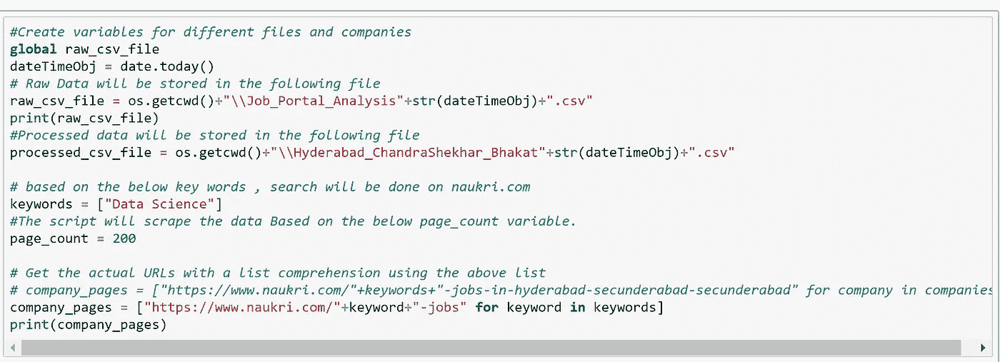
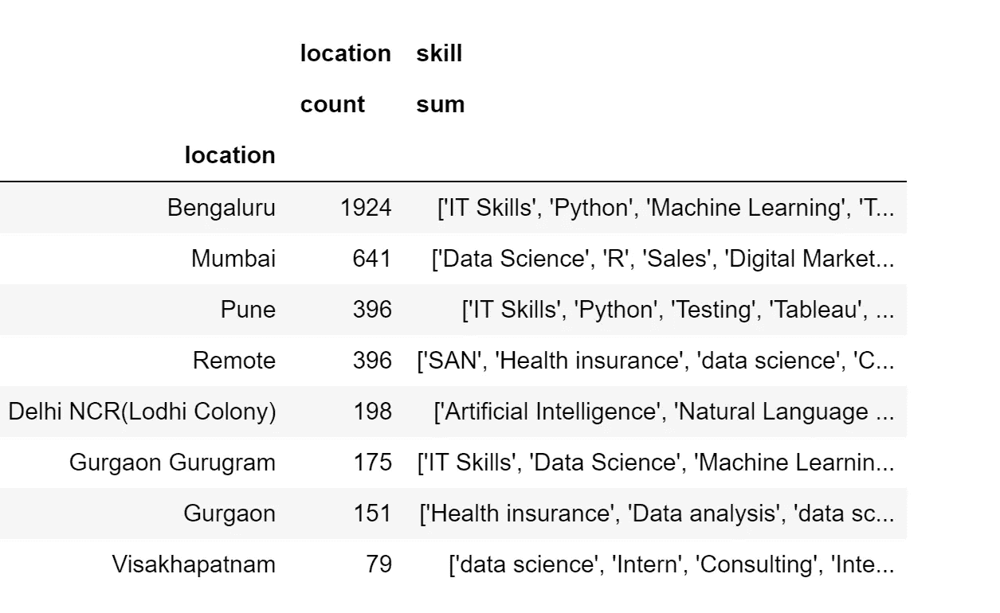
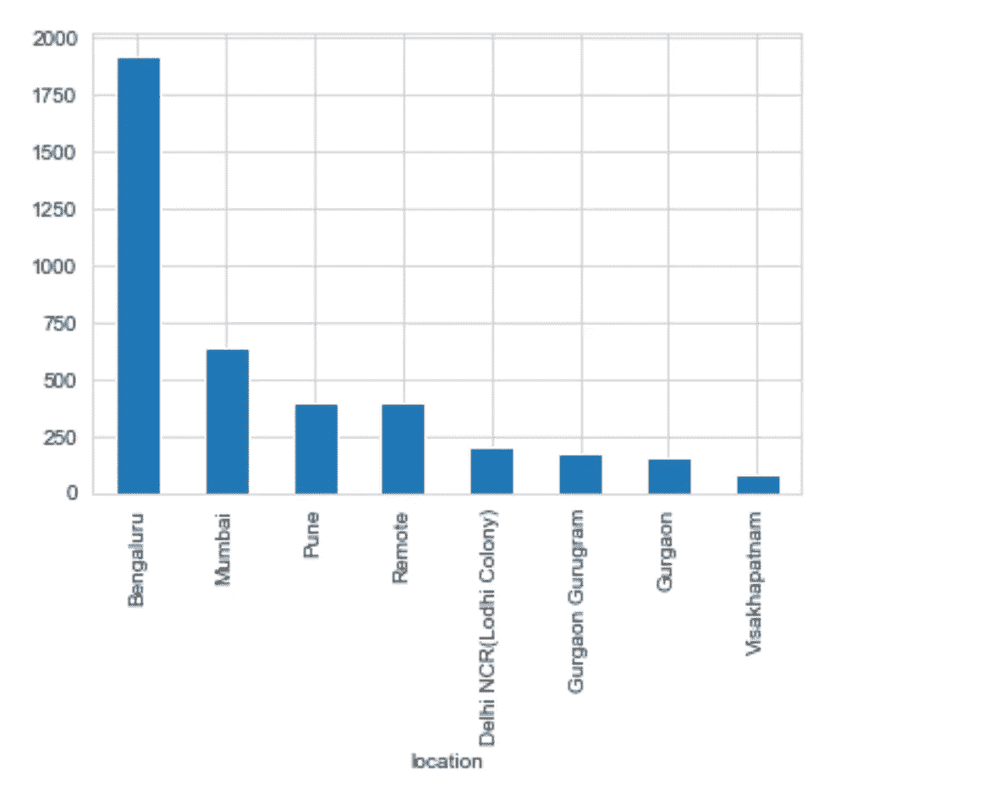
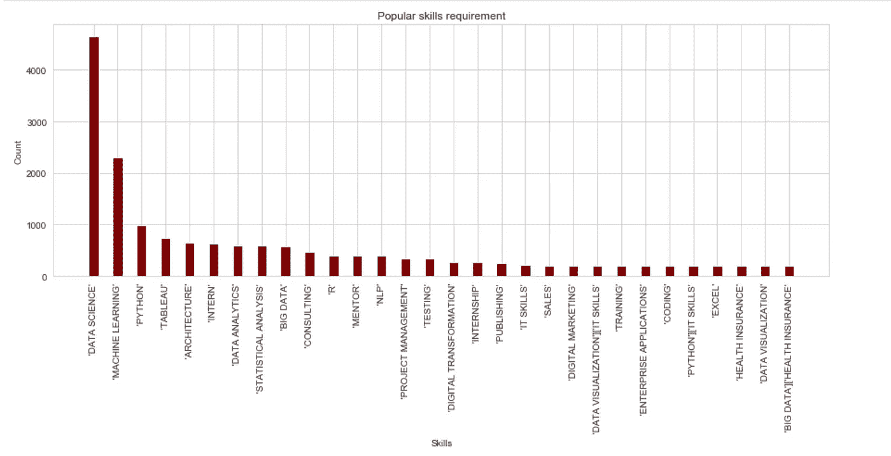
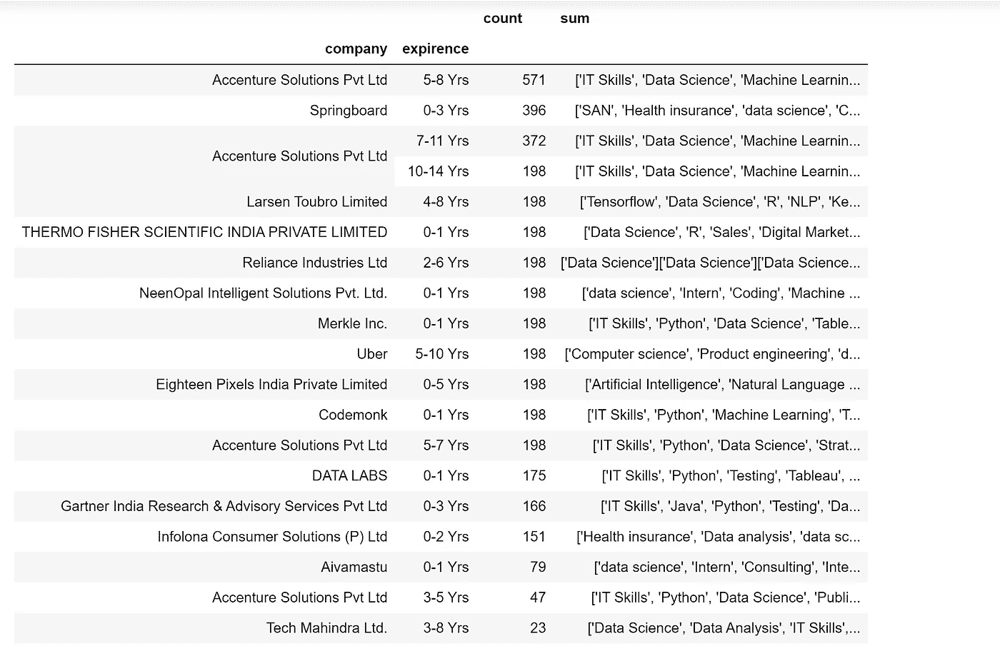
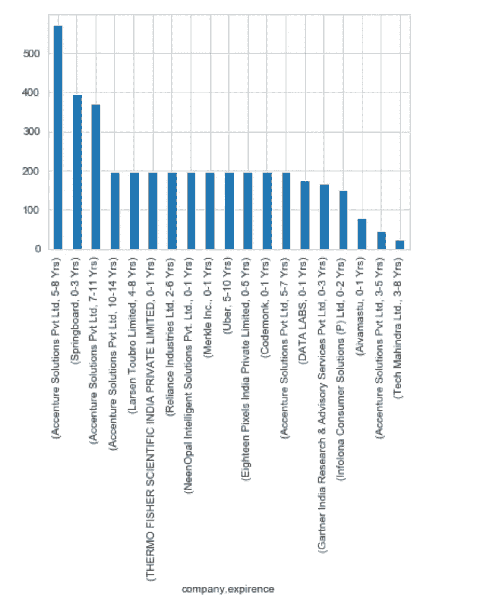

# 使用 Selenium 为工作门户进行 Web 抓取

> 原文：<https://medium.com/analytics-vidhya/web-scraping-using-selenium-for-a-job-portal-37d0b454fb52?source=collection_archive---------12----------------------->

本文将向您介绍如何使用 selenium 进行 web 抓取。

在这里，我们将从求职门户网站——naukri.com 搜集数据。

**目标**:

1.  收集所有必要的职位空缺信息，并从中获得真知灼见。
2.  我们要收集哪些信息？职位名称、雇主姓名、职位所需经验、工资、地点、所需技能以及职位发布时间。
3.  我们将从这些数据中得到什么启示？—根据每个雇主提供的空缺数量，雇主需要的重要技能是什么？基于每个城市的空缺数量。
4.  为什么我们要使用硒？—基本上，Selenium 是一个测试自动化工具，但是我们也可以将它用作 web 数据 scarping 工具。Selenium 非常有助于从动态页面收集数据。另一方面，像美人汤这样的数据抓取工具无法从动态页面中抓取数据..Beautiful soup 主要用于从网页中收集静态内容。根据我的分析，现在几乎所有的门户网站都在以这样或那样的方式使用动态内容。因此，与硒搭配是有益的。

**代号**:

为了使用这个脚本，理解下面的代码很重要。这些只是控制脚本的变量-

上面的代码将搜索数据科学工作(在“关键字”变量中提到)。在这里，我没有提到任何位置，这意味着，脚本将在印度各地搜索数据科学工作。如果您愿意，也可以在请求 URL 中提到任何特定的位置。你也可以提到机器学习、商业分析等多个关键词。脚本将一次获取一个关键字，遍历 200 页(查看 page_count 变量)。也就是说，如果一个页面发布了 20 个职位，那么它会给你 200*20=2K 个职位信息。如果你提到 3 个关键词，它会给你 6K 个工作机会。不要担心，完整的代码可以在下面的 github repo 中找到-

 [## csbhakat/data collection _ Selenium _ nau kri

### 在 GitHub 上创建一个帐户，为 csbhakat/data collection _ Selenium _ nau kri 开发做贡献。

github.com](https://github.com/csbhakat/DataCollection_Selenium_naukri) 

**见解**:

不用说，我们收集数据是为了从中获得一些见解。

通过运行上述代码，您将获得全印度 2K 的数据科学工作信息。

1.  我们可以了解哪个位置有最多的空缺-

有趣的是，大约有 396 个远程工作的职位空缺。这可能是因为持续的 Covid19 情况。

2.了解雇主希望数据科学专业人员具备哪些顶级技能也是一个好主意？下面的条形图将帮助您理解-

3.根据候选人的经验了解职位空缺的数量也很重要。我们可以这样得到它-

仅此而已。这是我的一点小小努力，以帮助您了解如何使用 selenium 从网页中收集数据，以及我们可以从中获得哪些见解。

请让我知道你可能想用这些数据做的其他见解/分析。

谢谢你。