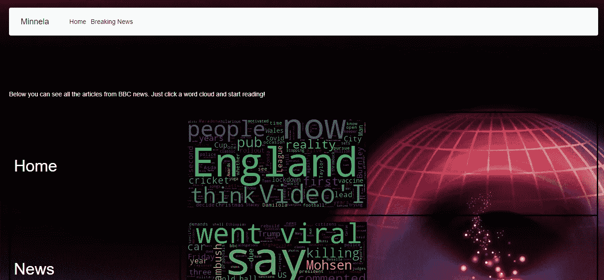
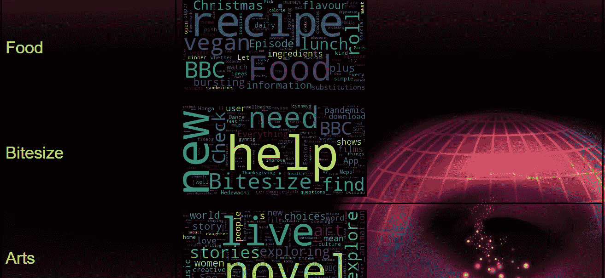

# Python Flask 中使用线程的 Web 抓取

> 原文：<https://medium.com/analytics-vidhya/web-scraping-using-threading-in-python-flask-aad43edb44a8?source=collection_archive---------2----------------------->


你好！在这篇文章中，我将向您展示如何使用 Python 从文本中抓取和创建单词云。我将创建一个简单的 Python Flask 项目。

> 你可以在这里找到完整的代码:[https://github.com/minnela/WebScrapingAndThreading](https://github.com/minnela/WebScrapingAndThreading)

我们将去 BBC 新闻网站，删除该网站的所有新闻类别(体育，健康，艺术等。).然后，我们深入到每个类别，并获得它们的文本和内容。我们将所有类别的内容转换成文字云，并显示在我们的网页上。当你点击“云”这个词时，它会引导你进入该类别的网站。

**词云:** As 谷歌称词云是“由特定文本或主题中使用的词组成的图像，其中每个词的大小表明其频率或重要性。”

# **设置我们的环境**

我将在这个项目中使用 Pycharm IDE。打开 Pycharm 并创建一个 Flask 项目:

文件→新项目→烧瓶→创建

创建新的 flask 项目后，我们将导入 **request** 和 **BeautifulSoup** 库。**请求**模块允许你使用 Python 发送 HTTP 请求。 **BeautifulSoup** 是用来从 HTML 文档中提取数据的库。

首先，我们将获得网站的 html 内容:

```
import requests
from  bs4 import BeautifulSoupdef getContentOfSite(url):
    response = requests.get(url= url)
    soup = BeautifulSoup(response.text, 'html.parser')
    return soup
```

然后我们将在 home()函数中使用 BBC home 网站创建 categorySoup:

```
@app.route('/')
def home():
    i = 0
    clouds=[]
    categoriesSoup = getContentOfSite("https://www.bbc.com/")
```

现在我们有了 BBC 新闻网站的内容。我们需要废弃所有类别，并创建一个类别链接列表和类别标题列表。要做到这一点，我们将去英国广播公司的网站，并做右键单击，检查网站。我们将在这里找到类别 html 部分。每个零件都有一个 id。我们需要找到类别部分的 id:


检查完 HTML 代码后，可以看到所有类别都定义在 **<一个>** 标签中。所以我们需要通过类别**<>**id 找到所有**<>**元素。在找到所有 **<一个>** 元素后，我们需要提取类别 url。为此，我们将所有**<>**元素的 **href** 属性，并创建一个通用函数:

```
def getCategoryAndTitleList(categoriesSoup, id):
    categoryList= []
    categoryTitleList=[]
    allCategories = categoriesSoup.find(id=id).find_all("a")
    for category in allCategories:
       categoryTitleList.append(category.string)
       categoryList.append(category['href'])
    return categoryList, categoryTitleList
```

现在我们有了所有类别的 url 列表和它们的标题列表。我们需要去每个类别的网址，并获得他们的网站内容。为此，我们需要提取 HTML 内容中的 **< p >** 元素，然后将它们返回到文本中:

```
def parse_article(article_url):
    print("Downloading {}".format(article_url))
    soup= getContentOfSite(article_url)
    ps=soup.find_all('p')
    text= "\n".join(p.get_text() for p in ps)
    return text
```

在得到所有类别的文本后，我们需要将文本转化为词云。为此，我们使用 python 的 **WordCloud** 库。要在访问者的浏览器中直接显示单词云图像，并作为 HTML 响应的一部分返回，我们可以使用 **base64** 库。我们还将使用**字节数**对象在内存中保存图像:

```
from wordcloud import WordCloud
import base64
import iodef get_wordcloud(text):
    pil_img = WordCloud()
    wordCloud=pil_img.generate(text=text).to_image()
    img= io.BytesIO()
    wordCloud.save(img,"PNG")
    img.seek(0)
    img_b64=base64.b64encode(img.getvalue()).decode()
    return img_b64
```

现在我们有了一个通用的 word cloud 返回函数，我们可以完成我们的 home 函数，如下所示:

```
@app.route('/')
def home():
    clouds=[]
    categoriesSoup = getContentOfSite("https://www.bbc.com/")
    categoryList, categoryTitleList = getCategoryAndTitleList(categoriesSoup,"orb-nav-links")

    for categoryLink in categoryList:
        text = parse_article(categoryLink)
        if(text != ''):
           cloud = get_wordcloud(text)
           clouds.append(cloud) return render_template('home.html', clouds=clouds,
categoryList=categoryList, categoryTitleList=categoryTitleList)
```

我们想返回一个 HTML 页面。我们将在我们的**home.html**中使用 **Jinja** 模板来编写 python 代码。我们将展示类别标题、它们的文字云以及它们在文字云中的链接:

```
<p style="color:white;">Below you can see all the articles from BBC news. Just click a word cloud and start reading!</p>
   <table>
   <td>

   
       <tr>
           <th> <h1 style="color:white;">{{ categoryTitleList[i.value] }}</h1>
               </th>
           <td>
       <a href="{{categoryList[i.value]}}"></a>
        </td>
       </tr>
       
    
   </td>
</table>
```

现在，我们准备运行我们的代码。但是当我们运行我们的代码时，我们会看到下载时间是如此之慢。提取网址并把它们变成图片需要一点时间。为了解决这个问题，我们将在 python 中使用**线程**。

# 穿线

线程化使多项工作能够在同一个处理环境中几乎同时完成。它是并行编程方法之一。线程通过缩短加载时间为我们提供了方便。

根据线程的工作逻辑，文字云和 url 链接可以混合定位。为了避免这种情况，我们将创建以下全局词典和列表。云词典会将每个云及其 url 保存在一起。类别字典将保留类别名称及其所属的 url:

```
categoryList= []
categoryListInThreadOrder=[]
categoryTitleListInThreadOrder=[]
cloudListInThreadOrder=[]
categorydict={}
cloudDict ={}
texts = []
wordClouds = []
```

现在我们将修改**getcategoryandtitllist()**、 **parse_article()** 和 **get_wordcloud()** 函数，如下所示:

```
def getCategoryAndTitleList(categoriesSoup, id):
    allCategories = categoriesSoup.find(id=id).find_all("a")
    for category in allCategories:
            categoryTitleList.append(category.string)
            categoryList.append(category['href'])
            categorydict[category['href']]= category.string
    return categoryList, categoryTitleListdef parse_article(url):
    categoryListInThreadOrder.append(url)
    print("Downloading {}".format(url))
    soup= getContentOfSite(url)
    ps=soup.find_all('p')
    text= "\n".join(p.get_text() for p in ps)
    texts.append(text)
    get_wordcloud(text,url)def get_wordcloud(text,url):
      print(' Turning into word cloud')
      pil_img = WordCloud()
      wordCloud=pil_img.generate(text=text).to_image()
      img= io.BytesIO()
      wordCloud.save(img,"PNG")
      img.seek(0)
      img_b64=base64.b64encode(img.getvalue()).decode()
      cloudDict[url] = img_b64
      wordClouds.append(img_b64)
```

现在我们将导入**线程**库，转到 **home()** 函数并创建我们的线程:

```
import threading
import time@app.route('/')
def home():
    categoriesSoup = getContentOfSite("https://www.bbc.com/")
    categoryList, categoryTitleList = getCategoryAndTitleList(categoriesSoup,"orb-nav-links")

    start = time.time()
    threads = [threading.Thread(target=parse_article, args=(url,)) for url in categoryList]
    for thread in threads:
        thread.start()
    for thread in threads:
        thread.join()
print("Elapsed Time: %s" % (time.time() - start))
```

我们为两个重要的函数创建了两个线程列表。我们把我们的目标函数，我们开始一个接一个的线程。

让我们进行最后一步，给我们的 home.html 打电话。我们需要给我们的云，网址和标题排序，所以我们在 **home()** 函数中填充我们的线程列表。我们将按主题顺序获取 URL，然后从字典中提取 URL 的云和标题:

```
for categoryLink in categoryListInThreadOrder:
  try:
       categoryTitle = list(categorydict.values())[list(categorydict.keys()).index(categoryLink)]
       cloud = list(cloudDict.values())[list(cloudDict.keys()).index(categoryLink)]
       categoryTitleListInThreadOrder.append(categoryTitle)
       cloudListInThreadOrder.append(cloud)
  except:
      print(categoryLink, " is not in List.")return render_template('home.html', clouds=cloudListInThreadOrder, categoryList=categoryListInThreadOrder, categoryTitleList=categoryTitleListInThreadOrder)
```

现在我们的应用程序变得更快了。让我们运行代码:



**感谢阅读:)**