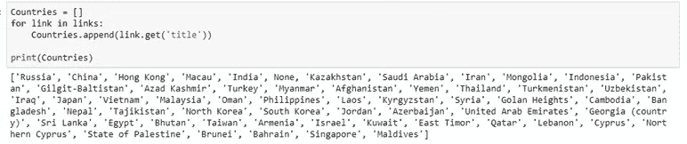

# 使用 BeautifulSoup 和 Python 对维基百科表格进行网络抓取

> 原文：<https://medium.com/analytics-vidhya/web-scraping-wiki-tables-using-beautifulsoup-and-python-6b9ea26d8722?source=collection_archive---------0----------------------->

资料来源:SixFeetUp

# *‘数据是新油’*

作为一名有抱负的数据科学家，我做了很多涉及从各种网站收集数据的项目。一些像 Twitter 这样的公司确实提供了 API 来以一种更有组织的方式获取他们的信息，而我们不得不从其他网站获取结构化格式的数据。

web 抓取背后的一般思想是检索网站上存在的数据，并将其转换成可用于分析的格式。在本教程中，我将详细而简单地解释如何使用 [BeautifulSoup](https://www.crummy.com/software/BeautifulSoup/) 在 Python 中抓取数据。我将搜索[维基百科](https://en.wikipedia.org/wiki/List_of_Asian_countries_by_area)来找出亚洲所有的国家。

维基上的亚洲国家名称表

首先，我们将**导入请求**库。Requests 允许你发送 *organic，grass-feed*HTTP/1.1 请求，不需要手工劳动。

导入请求

现在我们分配我们将要抓取数据的网站的链接，并将其分配给名为 **website_url** 的变量。

**requests.get(网址)。text** 将 ping 一个网站并返回该网站的 HTML。

> website _ URL = requests . get('[https://en . Wikipedia . org/wiki/List _ of _ Asian _ countries _ by _ area](https://en.wikipedia.org/wiki/List_of_Asian_countries_by_area)[')。正文](https://en.wikipedia.org/wiki/Premier_League).text)

我们首先读取给定网页的源代码，并使用 [BeautifulSoup](https://www.crummy.com/software/BeautifulSoup/bs4/doc/) 函数创建一个 BeautifulSoup (soup)对象。Beautiful Soup 是一个用于解析 HTML 和 XML 文档的 Python 包。它为解析过的页面创建了一个解析树，可以用来从 HTML 中提取数据，这对 web 抓取很有用。BeautifulSoup 中的 Prettify()函数将使我们能够查看标签是如何嵌套在文档中的。

> 从 bs4 导入 beautiful soup
> soup = beautiful soup(website _ URL，' lxml ')
> print(soup . pretify())

如果你仔细检查 HTML 脚本，所有的表格内容，也就是我们想要提取的国家名称，都在 Wikitable 类下。

所以我们的第一个任务是在 HTML 脚本中找到类‘wiki table sortable’。

> My_table = soup.find('table '，{'class':'wikitable sortable'})

在表格类“wikitable sortable”下，我们有以国家名称作为标题的链接。

现在提取中的所有链接，我们将使用 **find_all()。**

从链接中，我们必须提取标题，即国家的名称。

为此，我们创建了一个列表 **Countries** ，这样我们就可以从链接中提取国家的名称，并将其附加到列表 Countries 中。

将列表国家转换为熊猫数据框架，以便在 python 中工作。

感谢您阅读我的第一篇关于媒体的文章。我会坚持定期写下我的数据科学之旅。再次感谢您选择在这里度过您的时间——这意味着整个世界。

你可以在 [Github](https://github.com/stewync/Web-Scraping-Wiki-tables-using-BeautifulSoup-and-Python/blob/master/Scraping%2BWiki%2Btable%2Busing%2BPython%2Band%2BBeautifulSoup.ipynb) 上找到我的代码。