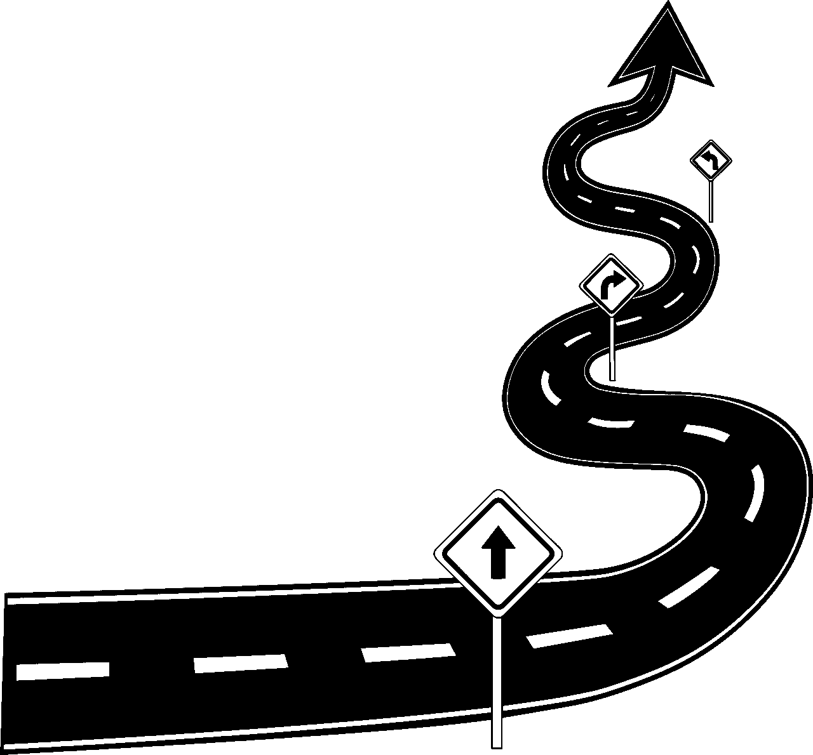
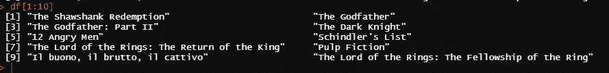
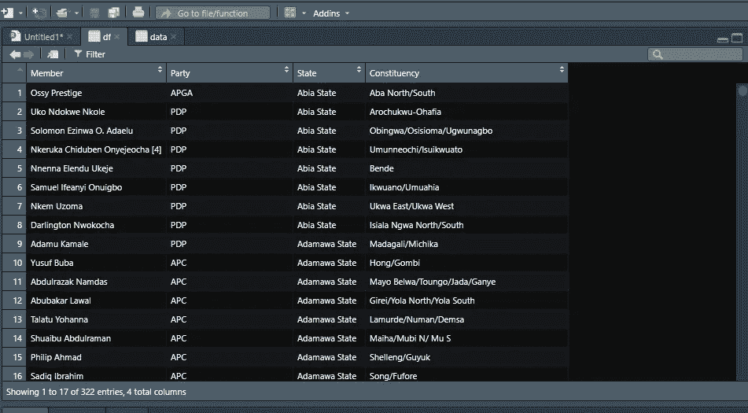
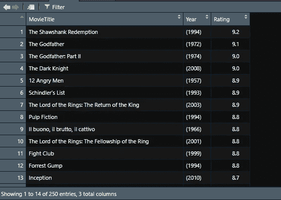
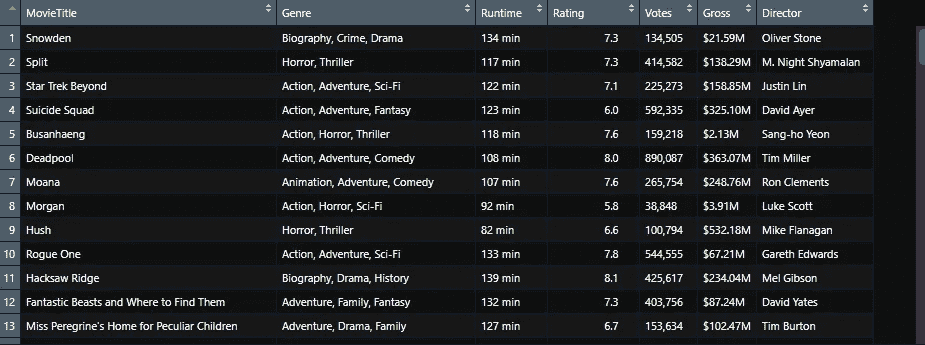

# 完全轻松地进行网页抓取

> 原文：<https://medium.com/analytics-vidhya/web-scraping-with-complete-ease-ee77bd605ba3?source=collection_archive---------16----------------------->

Ralger 包让网页抓取变得再简单不过了


来源:Pixabay

如果你像我一样，需要经常上网，那你就有得吃了。作为一名数据科学家，你将经常负责数据集的创建，因此网络抓取是你工具箱中一项非常重要的技能。在这里，我不会深入讨论这么多关于网络抓取的理论，你可能需要看看我写的这篇文章。你还应该学习如何在我的文章中详细描述的 chromium 浏览器中使用 [SelectorGadget](https://chrome.google.com/webstore/detail/selectorgadget/mhjhnkcfbdhnjickkkdbjoemdmbfginb?hl=en) 。

这个 **Ralger** 软件包是由 Fodil 开发的，他是经济学博士候选人，也是一个狂热的 R 开发者。你也可以在 Twitter 上关注他。我将带你了解这个令人敬畏的软件包是如何极大地简化你的网页抓取过程的。



来源:Pixabay

## **报废()**

我要介绍的第一个函数是 **scrap()** 函数。我将为此使用 [IMDB](https://www.imdb.com/chart/top/) 页面以及其他几个页面。我想删除电影标题，但是，我将与 rvest 包(这可能是 R 中最流行的 web 抓取包)进行比较；

```
#With Rvest
"[https://www.imdb.com/chart/top/](https://www.imdb.com/chart/top/)" %>% 
  read_html() %>% 
  html_nodes(".titleColumn a") %>% 
  html_text()#with Ralger
df <- scrap(link = "[https://www.imdb.com/chart/top/](https://www.imdb.com/chart/top/)", node =  ".titleColumn a")#Examine the first 10 values
df[1:10]
```



使用 **scrap()** 函数，一行代码(链接和节点)就可以从页面中提取感兴趣的内容。

## **table_scrap()**

table_scrap()函数可以帮助你用一行代码提取页面中的任何表格。看看这个[维基百科链接](https://en.wikipedia.org/wiki/List_of_members_of_the_House_of_Representatives_of_Nigeria,_2015%E2%80%932019)中的表格，比较一下 Ralger 包是如何无缝提取的。

```
df <-table_scrap("[https://en.wikipedia.org/wiki/List_of_members_of_the_House_of_Representatives_of_Nigeria,_2015%E2%80%932019](https://en.wikipedia.org/wiki/List_of_members_of_the_House_of_Representatives_of_Nigeria,_2015%E2%80%932019)")head(df)
```



对我来说，使用这个函数的最大好处是我不需要重建任何节点。它只是进入 web 链接并提取表格。万一页面上有多个表格，您可以通过函数中的**选择**选项来指定提取哪个表格。

## tidy_scrap()

您是否一直希望废弃多个节点，然后自动将它们全部合并到一个数据帧中，这个函数使其易于无缝执行。从 IMDB 页面中，我想提取电影名称、等级、年份以及等级等，然后将其全部转换为数据帧。

```
#Save the link in a veriable
link <- "[https://www.imdb.com/chart/top/](https://www.imdb.com/chart/top/)"#Specify all the nodes you want to extract
nodes <- c(".titleColumn a", #Movie title node
           ".secondaryInfo", #Year node
           ".imdbRating") #Ratings node#Specify column names for each nodes to be extracted
columns <- c("MovieTitle", "Year", "Rating") #Use the tidy_scrap function for this. 
df <- tidy_scrap(link = link,nodes = nodes, colnames = columns)
```



注意，函数中有**节点**，这意味着您可以根据需要指定任意多的节点。

最终展示这个 R 包的全部威力。查看这篇 R 教程[这里](https://www.analyticsvidhya.com/blog/2017/03/beginners-guide-on-web-scraping-in-r-using-rvest-with-hands-on-knowledge/)，注意完全删除所有需要的信息需要多少行代码。我将尝试对 Ralger 包做同样的事情。

```
#All nodes needed
m_nodes <- c(".lister-item-header a", #Title Node
  ".genre", #Genre node
  ".runtime", #Runtime Node
  ".ratings-imdb-rating", #Rating Node
  ".sort-num_votes-visible span:nth-child(2)", #Votes node
  ".ghost~ .text-muted+ span", #Gross node
  ".text-muted+ p a:nth-child(1)") #Director node#Column names
columns <- c("MovieTitle", "Genre", "Runtime", "Rating", "Votes", "Gross", 
             "Director")#Scrap function
df <- tidy_scrap("[https://www.imdb.com/search/title/?count=100&release_date=2016,2016&title_type=feature](https://www.imdb.com/search/title/?count=100&release_date=2016,2016&title_type=feature)",
      nodes = m_nodes, colnames = columns )
```



毫无疑问，这是一个非常酷的工具！


资料来源:Giphy

您可以探索的另一个特性是`askRobot = T`询问`robots.txt`文件是否允许抓取特定的网页。它存在于所有的功能中，你可以快速检查你是否被允许废弃一个网站。很酷是吗？？

## 结论

这无疑是您希望在数据科学武库中拥有的一件武器。您可以在[这里](https://github.com/feddelegrand7/ralger)进一步查看，因为您可以找到更多对您的用例有用的功能。