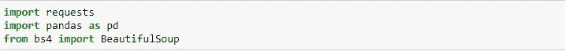
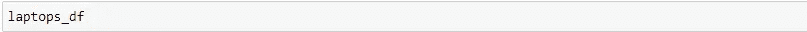
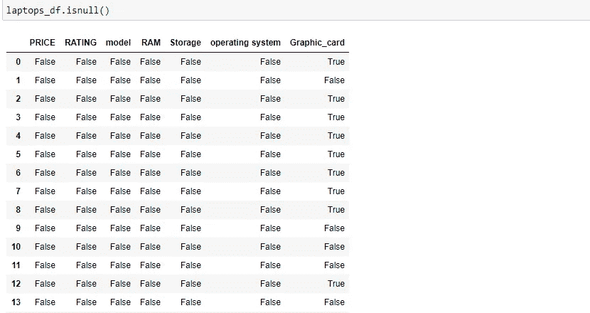
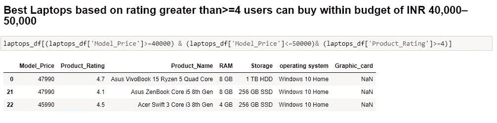
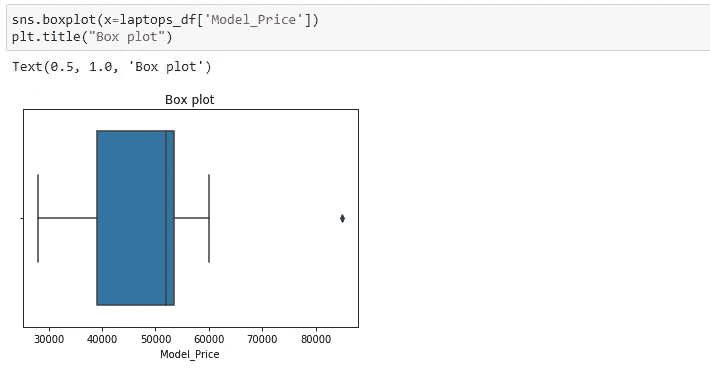

# 使用 EDA 的 Web 抓取和使用 Python 的可视化

> 原文：<https://medium.com/analytics-vidhya/web-scraping-with-eda-and-visualization-using-python-a496ddf5f98e?source=collection_archive---------3----------------------->

# 了解如何用 Python 抓取网站

**什么是网页抓取？**

Web 抓取是一个术语，用于描述使用程序或算法从 web 中提取和处理大量数据。

无论您是数据科学家、工程师，还是分析大量数据集的任何人，从 web 上抓取数据的能力都是一项有用的技能。

假设您从 web 上找到数据，但没有直接的方法下载它，使用 Python 的 web scraping 是一种技能，您可以使用它将数据提取为可以导入的有用形式。

简单来说，网络抓取指的是从一个网站中提取数据。收集这些信息，然后将其导出为对用户更有用的格式。

Web 抓取有助于收集这些非结构化数据，并以结构化形式存储。有不同的方法来抓取网站，如在线服务、API 或编写自己的代码。在本文中，我们将看到如何用 python 实现 web 抓取。

# 为什么是网络抓取？

网络抓取用于从网站上收集大量信息。但是为什么一定要有人从网站上收集这么大的数据呢？为了了解这一点，让我们来看看网络抓取的应用:

***但是为什么有人要从网站上收集这么大的数据呢？***

***价格比较:***parse hub 等服务使用 web scraping 从在线购物网站收集数据，并使用它来比较产品的价格。

***邮件地址收集:*** 很多以邮件为媒介进行营销的公司，都是使用网络抓取收集邮件 ID，然后群发邮件。

***社交媒体抓取:*** 网络抓取用于从 Twitter 等社交媒体网站收集数据，以了解流行趋势。

***研发:*** 网页抓取用于收集大量数据(统计、通用信息、温度等。)从网站上下载，分析后用于调查或研发。

***职位列表:*** 有关职位空缺、面试的详细信息从不同的网站收集，然后在一个地方列出，以便用户可以轻松访问。

# 网页抓取是如何工作的？

当您运行 web 抓取代码时，会向您提到的 URL 发送一个请求。作为对请求的响应，服务器发送数据并允许您读取 HTML 或 XML 页面。然后，代码解析 HTML 或 XML 页面，找到数据并提取出来。

要通过 python 使用 web 抓取来提取数据，您需要遵循以下基本步骤:

1.  找到您想要抓取的 URL
2.  检查页面
3.  查找要提取的数据
4.  写代码
5.  运行代码并提取数据
6.  以要求的格式存储数据

现在让我们看看如何使用 Python 从 Flipkart 网站提取数据。

## 什么是数据抓取？

数据抓取是一种从互联网上检索大量数据的技术。这种技巧在**竞争** **定价**中非常有用。为了确定我们产品的最佳价格，我们可以比较市场上的类似产品。这些价格变化很大。因此，在这篇博客中，我将展示我们如何丢弃关于特定产品的数据。

有不同的数据废弃技术，如 Scrappy、BeautifulSoup 等。最常见的技术是使用 BeautifulSoup。它提取任何网站上的 Html 页面。web 报废存储的数据是非结构化格式。我们将非结构化数据转换为结构化数据，用于数据分析和探索。

# 用于网页抓取的库

众所周知，Python 被用于各种应用，并且有不同的库用于不同的目的。在我们的进一步演示中，我们将使用以下库:

*   **Beautiful Soup**:Beautiful Soup 是一个解析 HTML 和 XML 文档的 Python 包。它创建有助于轻松提取数据的解析树。
*   Pandas 是一个用于数据操作和分析的库。它用于提取数据并以所需的格式存储数据。
*   使用 **matplotlib** 和 **seaborn** 进行数据可视化

# 从 Flipkart 网站废弃的数据，这里我拿了笔记本电脑产品

为了确定我们产品的最佳价格，这些价格可能会有很大差异。因此，在这篇博客中，我将展示我们如何丢弃关于某个特定产品(笔记本电脑)的数据。

首先，让我们导入所有必需的库:

打开 python 文件导入库

我们提取的数据是非结构化数据。所以我们将创建空列表，以结构化的形式存储它们，

# 第一步:找到你想要抓取的网址

对于这个例子，我们将抓取 **Flipkart** 网站来提取笔记本电脑的名称、价格和评级。本页面的网址为[https://www.flipkart.com/search?q=laptops&otracker = search&otracker 1 = search&market place = FLIPKART&as-show = on&as = off&as-pos = 1&as-type = HISTORY](https://www.flipkart.com/search?q=laptops&otracker=search&otracker1=search&marketplace=FLIPKART&as-show=on&as=off&as-pos=1&as-type=HISTORY)。

使用上述代码检查 URL 的响应。

# 步骤 2:检查页面

数据通常嵌套在标签中。因此，我们检查页面，看看我们想要抓取的数据嵌套在哪个标签下。要检查页面，只需右键单击元素，然后单击“检查”。

当你点击“检查”标签，你会看到一个“浏览器检查框”打开。

# 步骤 3:找到您想要提取的数据

让我们分别提取嵌套在“div”标签中的名称、价格和评级。

通常，我们会弄不清需要为这台笔记本电脑复制哪个标签，我们可以使用 https://webformatter.com/[的](https://webformatter.com/)来过滤标签的名称、价格和评级，并使用该工具轻松复制。

现在我们已经编写了打开 URL 的代码，是时候从网站中提取数据了。如前所述，我们想要提取的数据嵌套在

标签中。因此，我将找到具有相应类名的 div 标记，提取数据，并将数据存储在一个变量中。请参考下面的代码:

我们需要使用 find_all 来提取笔记本电脑的所有细节并复制标签代码

检查代码的长度

24 是该特定页面中的项目数

# 步骤 5:运行代码并提取数据

我们需要从我们使用的文本价格列中删除'₹'符号。替换命令从列中删除该符号

以数据框(df)格式保存数据列表

# 步骤 6:以所需的格式存储数据

提取数据后，您可能希望以某种格式存储它。这种格式根据您的要求而有所不同。在本例中，我们将以 CSV(逗号分隔值)格式存储提取的数据。为此，我将在代码中添加以下代码行:

现在，我来运行代码。

创建一个文件名“laptops.csv ”,该文件包含提取的数据。

现在，我将为这台笔记本电脑进行 EDA 和可视化

首先，我们需要打开一个新的 python 文件

在这里导入。CSV 文件从驱动器的位置

我在价格 47，990 中的数字后加上千= '，'

行数和列数

数据类型

我想拆分标题，因为所有规格和笔记本电脑名称都在一行中。

我将使用 split()选项分别拆分到不同的列

我们使用这个拆分“-”选项从标题中分离出来，并创建一个单独的列作为模型和规范，并删除标题

这里我们使用 split '('选项来删除开括号

这里我们使用 split ' /'选项从硬盘中分离出来

像这样，我们需要为每个型号、ram、存储、操作系统、显卡创建一个单独的列

我们可以重命名这些列

# 识别缺失值

方法`isnull()`和`notnull()`是识别缺失值的最常见方法。

处理缺失数据时，首先需要识别包含缺失值的行和列，计算缺失值的数量，然后决定如何处理它们。

重要的是**您要分别处理每列中的缺失值**，而不是对所有列实施单一解决方案(例如，用列的平均值替换 NaNs)。

`isnull()`返回一个布尔值(真/假),该值可用于查找包含缺失值的行或列。

true 表示该行中缺少值

# 识别列中缺少的值

让我们首先计算数据框中缺失值的总数。您可以通过`df.isnull().sum()`计算每列中缺失值的数量

在这个图形卡列中，缺少 15 个项目

列的索引

经过数据清理和处理后，最终列表是

现在我们需要从列表中筛选出具有良好规格、价格和评级的最佳笔记本电脑

**柱状图价格对比评级**

从这里我们可以得出结论，价格越高的产品，一定程度上收视率越高。

**绘制价格箱线图**

正如我们所看到的，有一个异常值，价格范围非常高。

我们总结了以下几点:

*   根据上面的可视化，我的分析是，产品在 4.1、4.5、4.8 评级内可用，价格约束为 40，000 到 60，000。

**项目成果**

在这里，我的目标是，通过使用 Python 的 Web scraping，通过考虑关键因素，如 40，000-60，000 卢比的预算金额和用户产品评级，找出最好的笔记本电脑。以上是客户可以考虑的产品。

谢谢大家，希望这篇博客能帮助你们从网站上了解如何“废弃网页”,并对“EDA”和“可视化”有一个清晰的认识。