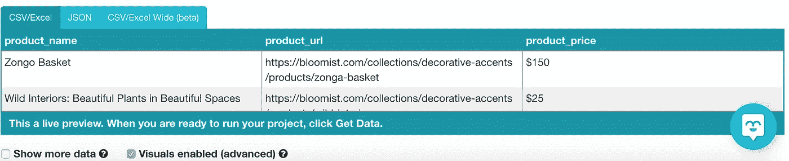

# 使用 ParseHub 的网页抓取:一个示例项目

> 原文：<https://medium.com/analytics-vidhya/web-scraping-with-parsehub-an-example-project-a245b338c632?source=collection_archive---------6----------------------->

*ParseHub 是一个免费的、易于使用的网页抓取工具。一旦作为应用程序下载到桌面上，就可以从网站中提取数据进行分析。*

为什么要使用刮网工具，而不是手动刮网方法？

*   **速度。**这些工具比传统的网页抓取方法要快得多，在传统的网页抓取方法中，检查每个命令的页面会变得乏味和困难。
*   **可视化、界面友好。**例如，当 ParseHub“看到”数据时，ParseHub 会调出网站本身，突出显示网站上的相关位置供您参考。当选择网页上要删除的元素时，文本上方会出现一个框。这有助于跟踪程序中正在发生的事情，而不是试图跟踪长行代码。
*   **易于遵循的命令列表。**可以对每个命令进行添加、修改和删除。他们也可以被重命名，只需点击这个单词并输入新的名字。
*   **需要很少或没有编码知识**。这对于小型企业来说是件好事，他们可能想要从网络上获取信息，而不必雇用专业人员、试图在没有多少编码知识的情况下识别趋势的研究人员，或者任何想获取数据进行探索的人。

打开时 ParseHub 桌面应用程序可能是什么样子。

ParseHub 的许多优点之一是，当您下载应用程序后第一次打开它时，教程会自动开始。这为初次接触的用户省去了自己尝试理解界面的麻烦，并提供了一个示例网站，以便在演练继续时从其中获取数据。虽然界面相当直观，但为了成功地导航到不同的页面来抓取数据，必须学习一些术语。在教程的最后，您可以实际运行该项目，它将以易于下载的格式提供数据。

虽然从教程中可以学到很多东西，但在网站上看到更实际的附加项目演练通常很有帮助。本演练的网站将是电子商务网站 [Bloomist](https://bloomist.com/) 。我们的目标是从每种产品中提取产品、链接、价格和评论，并将它们组织成一个数据框架供以后分析。

产品数据是一种有用的工具，尤其是在尝试比较类似的业务时。

第一步是打开一个新项目。点击新项目按钮后，ParseHub 会要求提供它将要抓取的网站，并且 URL 可以被复制进来。在 ParseHub 的主窗口中，将出现该网站。

ParseHub 中的命令非常直观，指示从网站中抓取什么数据只需将鼠标悬停在要抓取的元素上并单击它。为了确保它“看到”正确的数据，用户必须确认一个模式，因此 ParseHub 将在页面上建议可能符合该模式的第二个元素。例如，如果我想从站点中抓取所有的产品名称，我必须在 ParseHub 识别模式的其余部分之前单击两个产品名称。一旦这样做了，绿框将出现在网站上所有匹配该模式的内容上。

ParseHub 现在知道这个网站上产品名称的格式，并且能够识别所有这些名称。这些方块让用户知道并确认 ParseHub 的模式是否正确！

从那里，我们想要为 web scraper 选择一个新元素来识别。在我们的例子中，这就是价格。重要的是，我们将产品名称和价格联系在一起，这样数据就会很清楚。ParseHub 通过相对选择工具简化了这一过程。首先，点击其中一个绿色的产品名称框，然后可以选择下面的价格，它将这两个元素联系起来。手动完成两次后，图案将再次被识别，并出现在整个页面上。

箭头图标清楚地指示了相关的内容。

在这个选择过程进行的同时，ParseHub 界面中的另一个可视化工具正在发生变化，在选择不同的项目时向 dataframe 添加行。ParseHub 能够自动将链接添加到我们添加到 dataframe 的产品中，并包括我们前面提到的价格。这种数据预览是有帮助的，因为它提供了最终产品(数据本身)的一瞥。但是，除非勾选了包含更多数据的复选框，否则只会显示前几行。显示太多数据的预览会降低应用程序的速度，所以坚持显示前几行通常是个好主意。

位于 ParseHub 界面底部的实时数据预览。

我们想从这个网站上了解的另一件事是每个产品的评论数量。这不是我们可以在网站主页上看到的东西——它需要实际导航到每个产品的页面并向下滚动才能看到评论号。如果没有 web 抓取工具，这是一项单调乏味的任务，但这对 ParseHub 来说并不难！

“Click”命令将告诉 ParseHub 导航到一个新的页面，并启动一个新的模板从该板上收集数据。在此页面上，创建命令的方式与创建主页命令的方式相同，并且它再次自动将网页与某些产品分组。

现在我们知道 ParseHub 正在“查看”与每个产品相关的评论，并且知道记录它。

假设有太多的产品放在一个页面上，所以网站把它们分成了多个页面。通过选择下一页按钮，并指示在新的结果页上继续相同的命令，我们仍然可以很容易地从下一页获得数据。这意味着只运行一次就可以找到很多产品。

如果需要更改，可以很容易地查看和更改以前的命令。它们也可以被重命名和重新组织。项目的完整命令列表可能如下所示:

通过缩进和颜色，可以清楚地知道 ParseHub 正在收集什么以及以什么顺序收集。也很清楚刮的是哪一页。当一个完整的命令列表和数据预览看起来好像所有的数据都会被找到时，一个测试运行是一个很好的方式来查看正在进行的抓取。为此，单击绿色的“获取数据”按钮，并从选项中选择“测试运行”。这将在收集数据时突出显示命令，因此如果出现问题，很容易判断哪个命令有问题。这也确保了您不必花费时间多次运行 scraper，特别是因为如果有大量数据，这个过程可能需要一段时间。

测试运行完成后(或者如果你觉得大胆)，点击“运行”按钮将在 ParseHub 的服务器上运行程序。虽然它可能需要几分钟才能完全运行，但您可以获得 CSV 或 JSON 格式的网站数据，并将其下载到您的计算机上进行进一步分析。

数据可能是这样的！空单元格意味着没有检测到评论。

总的来说，这个网页抓取工具是容易使用和有效的！对于像我这样的视觉人员来说，实时看到 ParseHub“看到”的内容对于理解数据结构和创建工作程序非常有帮助。