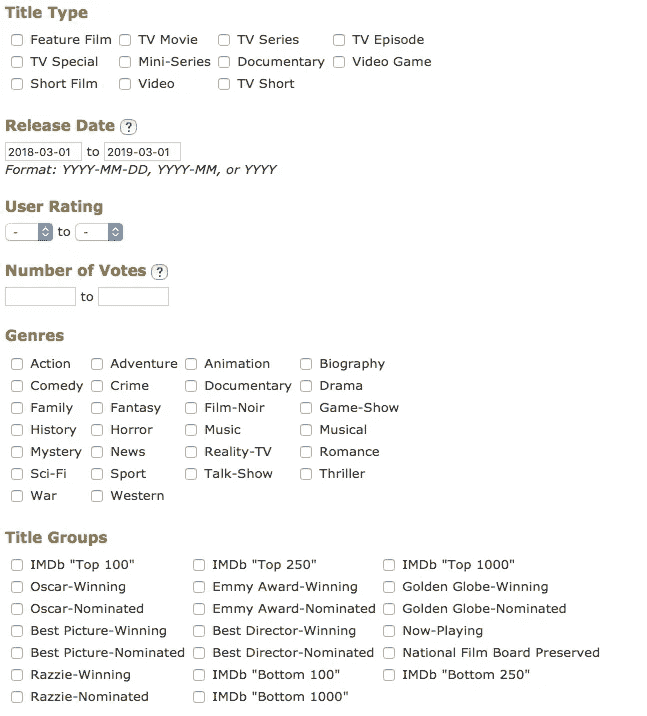

# 我如何使用 Python 从 IMDB 中删除前 50 部电影推荐

> 原文：<https://medium.com/analytics-vidhya/web-scraping-with-python-using-beautiful-soup-or-how-i-scrapped-top-50-movie-recommendations-from-94c49d9d8cf8?source=collection_archive---------1----------------------->

## 或者一个非技术性的使用美汤进行网络抓取的指南。


丹尼斯·简斯在 [Unsplash](https://unsplash.com?utm_source=medium&utm_medium=referral) 拍摄的照片

# 解释如何抓取网页的非技术性指南

真的很抱歉这个长标题，但是由于我从一个非技术背景的人到现在写脚本和代码，我觉得我应该做一些落后于某些人的事情。

我意识到作为一名开发人员，所有的焦点是写一个更好的代码，但是文档是非常必要的。

在我开始向你解释做什么和如何做之前，让我们回到我们正在做什么，这样你就可以使用算法来完成类似的任务。

我的目标是**使用任何库从 python 中的任何网站提取任何信息。**

我选择 Beautiful soup 是因为它是一个非常简单的库，只需要很少的代码就可以完成很多工作。

美汤或 Soup 是一个可以一步步解析 XML、JSON 和 HTML、HTML5 内容的库。

我的意思是看看下面的 HTML 代码，用漂亮的汤下面的代码看起来像。

www.imdb.com[的 HTML 代码](http://www.imdb.com)

> <TD><input id = " title _ type-1 " type = " checkbox " name = " title _ type " value = " Feature "><label for = " title _ type-1 ">故事片</label></TD>
> <TD><input id = " title _ type-2 " type = " checkbox " name = " title _ type " value = " TV <label for = " title _ type-4 ">电视剧集</label></TD>
> </tr>
> <tr>

汤能为你制作出多么漂亮的 html

> 第一个 tr 标签
> 
> 第一个 td 标签
> 
> {在第一个 td 内部，第一个输入函数，其属性 id = " title _ type-1 " type = " checkbox " name = " title _ type " value = " feature " >…。

基本上使用漂亮的 soup，其中 xml 或 html 具有重复的 div 标签、h3 标签等模式，这样就可以使用循环来提取所有类型的模式。

Beautiful soup 使您能够使用 html 标记名、您给定的 id = '名称、您给定的' class = '名称来访问 html 的每个元素。

你可以访问 html 页面上的每一个元素/内容/文本，并使用 beautiful soup 循环解析它。

在这里阅读更多内容—[https://medium . freecodecamp . org/how-to-scrape-websites-with-python-and-beautiful soup-5946935 d93fe](https://medium.freecodecamp.org/how-to-scrape-websites-with-python-and-beautifulsoup-5946935d93fe)

为了完成我的目标，我需要—

1.  要废弃的网站
2.  一个有解析器的库

我选择的网站是 IMDB.com，我想找到两个日期之间的前 50 个节目，查看这个页面

[](https://www.imdb.com/search/title?release_date=) [## IMDb:高级标题搜索

### IMDb 的高级搜索允许你对数据库中的所有人和头衔进行极其强大的查询。查找…

www.imdb.com](https://www.imdb.com/search/title?release_date=) 

IMDB 有很多你可以在代码中使用的过滤器，比如**流派——**动作/冒险或者**用户评级**或者**日期**往返。

我使用了日期过滤器，但是你也可以使用你自己的过滤器，我会告诉你如何使用页面上的任何东西。

我将去掉两个日期的 URL 变成—

[https://www.imdb.com/search/title?发布日期=2018-03-01，2019-03-01](https://www.imdb.com/search/title?release_date=2018-03-01,2019-03-01)

来自[https://www.imdb.com/search/title?](https://www.imdb.com/search/title?release_date=2018-03-01,2019-03-01)

我只是将两个日期作为输入，并将其添加到下面代码中的 URL 中

```
date_entry = input(‘Enter From date in YYYY-MM-DD format : ‘)
year, month, day = map(int, date_entry.split(‘-’))
date1 = datetime.date(year, month, day)date_entry = input(‘Enter To date in YYYY-MM-DD format : ‘)
year, month, day = map(int, date_entry.split(‘-’))
date2 = datetime.date(year, month, day)
```

使用日期 1 和日期 2 向用户请求日期 2，然后将其添加到 URL 变量中，即

```
URL=”[http://www.imdb.com/search/title?release_date=](http://www.imdb.com/search/title?release_date=)" + str(date1) + “,” + str(date2)
```

一旦我读到这一页—[https://www.imdb.com/search/title?release_date=2018-03-01，2019-03-01](https://www.imdb.com/search/title?release_date=2018-03-01,2019-03-01)

我现在有 50 个节目的列表，我想用美丽的汤来阅读。

```
r = requests.get(URL) 

soup = BeautifulSoup(r.content, ‘html5lib’)
```

我简单地使用**调用整个网站。get** 其中 url 是添加了日期的 URL。然后，我使用漂亮的 soup 库创建一个包含 r.content 的 soup 类型对象(http 格式的我的网站数据，“html 5 lib”——我将用来解析 imdb 页面的解析器类型，对于 xml 可以是“lxml ”,对于 json 也是如此。)

现在我们在我的解析器中有了所有来自网站的数据，接下来我需要定位列表在我的网站中的确切位置，这只是一个观察 HTML 标签模式的练习。

就去 https://www.imdb.com/search/title?吧 release_date=2018-03-01，2019-03-01 点击检查并查看哪些确切的标签包含我试图获取的节目名称。

因为我已经做了这个练习，我将粘贴我的代码-

> `table = soup.find(‘div’, attrs = {‘class’:’lister-list’})`

这就形成了一个变量表，它类似于我的通用数据集数据的样本集数据，存储在 soup 对象中，也就是说，表在数据方面是 soup 的一部分。表中有来自 div 标签列表的数据，这是我们在这里作为参数传递的，这可以是任何其他标签，如

、

### 等，也可以是任何其他类、id 等。

一旦我有了提取节目名称的样本数据，我就简单地创建一个循环，并要求该循环覆盖**表**中特定代码区域的内容。

```
for row2 in table.findAll(‘h3’, attrs = {‘class’:’lister-item-header’}):
 print(row2.span.text,row2.a.text)
```

FindAll 类似于 Ctrl + F，它使用类 lister-item-header 查找所有出现的 h3 标签，这些标签在节目的每个名称周围重复出现。

一旦我的循环知道了要执行哪些标签，我就简单地让我的循环覆盖某些标签，如上面的和  来打印节目的排名和节目的名称。

如果您想运行该脚本，可以从这里下载该脚本，

[](https://github.com/rmadan16/Beautiful-Soup-IMDB-top-50-shows-in-python) [## RMA Dan 16/Beautiful-Soup-IMD b-top-50-shows-in-python

### 这个 python 程序将找出两个日期之间的前 50 个节目。该程序要求用户输入日期并打印前 50 名…

github.com](https://github.com/rmadan16/Beautiful-Soup-IMDB-top-50-shows-in-python) 

你只需要 python 3.x 来运行它，或者你可以将代码复制粘贴到 https://colab.research.google.com 的笔记本上。

愿原力与你同在。