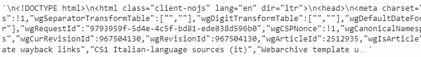
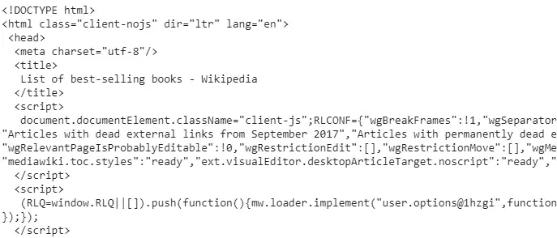
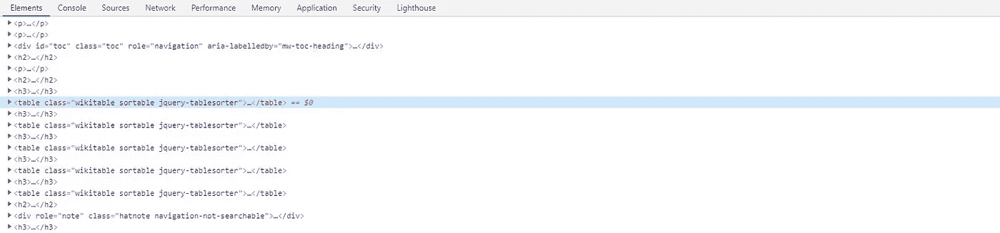
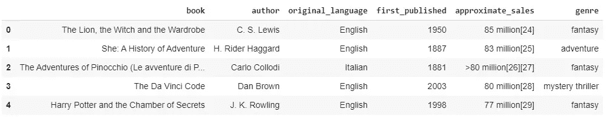

# 使用 Python 和 BeautifulSoup 进行网页抓取

> 原文：<https://medium.com/analytics-vidhya/web-scraping-with-python-using-beautifulsoup-69b8bc07ff43?source=collection_archive---------6----------------------->

照片由 [Clément H](https://unsplash.com/@clemhlrdt) 在 [Unsplash](https://unsplash.com/) 上拍摄

## 如何用简单的步骤从 HTML 文档中解析和提取数据

当开始一个新项目时，我们主要关心的问题之一是如何获得我们将要处理的数据。例如，像 Airbnb 和 Twitter 这样的公司通过提供 API 来简化这项任务，这样我们就可以有组织地汇编信息。在其他情况下，我们可以下载已经清理好并准备使用的结构化数据集，如在一些 Kaggle 比赛中。然而，我们需要探索网络来找到并提取我们想要的数据，这种情况并不少见。

这时**网页抓取**就派上用场了。这个想法是从一个网站中提取信息，并将其转换为实际分析。虽然有几个工具可用于此目的，但在本文中，我们将使用 [BeautifulSoup](https://www.crummy.com/software/BeautifulSoup/) ，这是一个 **Python** 库，旨在轻松地从 HTML 和 XML 文件中提取数据。

在这里，我们将访问这个[维基百科页面](https://en.wikipedia.org/wiki/List_of_best-selling_books)，其中包含几个畅销书列表，并提取第二个表格，其中包含销量在 5000 万到 1 亿册之间的书籍。

# 所需的库

我们只需要 2 个包来处理 HTML 文件。我们还将使用**熊猫**从提取的数据中创建一个数据框:

*   `requests` -允许我们发送 HTTP 请求并从网页下载 HTML 代码；
*   `beautifulsoup` -用于从原始 HTML 文件中提取数据；
*   `pandas` -用于数据操作的 Python 库。我们将使用它来创建数据框。

# 提取 HTML 文件

要提取原始 HTML 文件，我们只需将网站 URL 传递给`request.get()`函数。

我们现在有一个非结构化的文本文件，包含从我们传递的 URL 路径中提取的 HTML 代码。

让我们来看看:

从网页中提取的 HTML 代码

`requests`交付 HTML 代码输出的方式对于分析来说相当混乱。这时我们可以从 BeautifulSoup 那里得到帮助。

# 创建一个 BeautifulSoup 对象

现在，我们可以开始使用 BeautifulSoup 了。让我们生成一个名为`soup`的 BeautifulSoup 对象，传递上面创建的`html_text`文件。

接下来，我们可以使用一个名为`prettify()`的函数以结构化的格式来塑造对象。

请注意，与我们第一次生成原始的`html_text`文件时相比，格式化后的文件更容易阅读和操作。

结构化美丽组对象

# 检查维基百科页面

在[维基百科页面](https://en.wikipedia.org/wiki/List_of_best-selling_books)上，我们来考察一下网页的元素。(在 Windows 中，按 **Ctrl + Shift + I** 。在 Mac 中，按下 **Cmd + Opt + I**

检查网页的元素

注意，所有的表都有一个类`wikitable sortable`。我们可以利用这一点来选择 HTML 文件中的所有表格。

# 提取表格

我们将表格保存在一个名为`wiki_tables`的变量中，使用方法`find_all()`来搜索所有的 HTML `table`标签，使用一个类`wikitable sortable`。

因为我们想要页面上的第二个表(5000 万到 1 亿份)，所以让我们将搜索范围缩小到第二个`wiki_tables`元素。让我们提取表中的每一行`tr`。

现在，我们将创建一个名为`table_list`的空列表，并将每个表格单元格`td`的元素追加到`table_list`中。

我们已经成功地将网站上的第二个表提取到一个列表中，我们已经准备好开始分析数据了。

# 创建熊猫数据框架

最后，我们可以简单地将列表转换成一个 **Pandas DataFrame** 来可视化我们从维基百科中提取的数据。

根据维基百科表格创建的熊猫数据框架

就是这样！通过几个步骤和几行代码，我们现在有了一个从 HTML 表中提取的数据框，可以进行分析了。嗯，仍然可以做一些调整，比如删除`approximate sales`列中的方括号引用，但是网页抓取已经完成了！

完整代码请参考[笔记本](https://github.com/rmpbastos/data_science/blob/master/Web_Scraping_with_Python_using_BeautifulSoup.ipynb)。