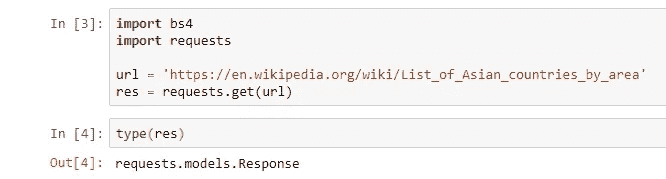
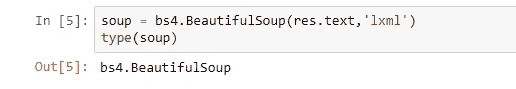
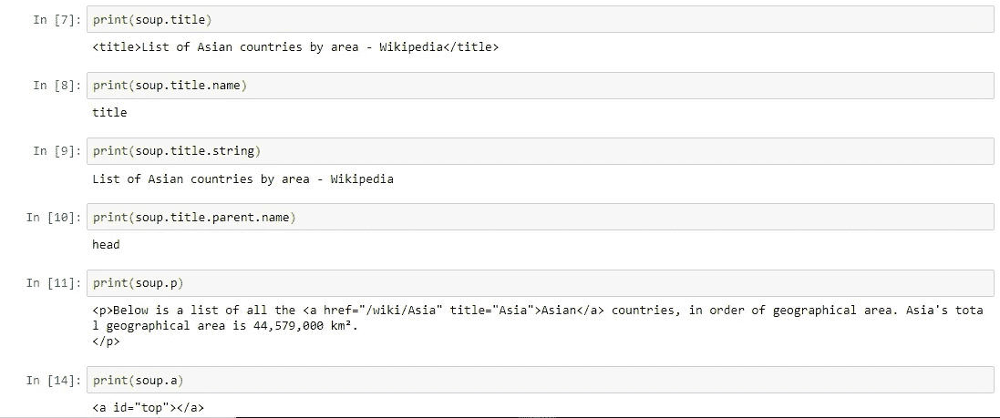
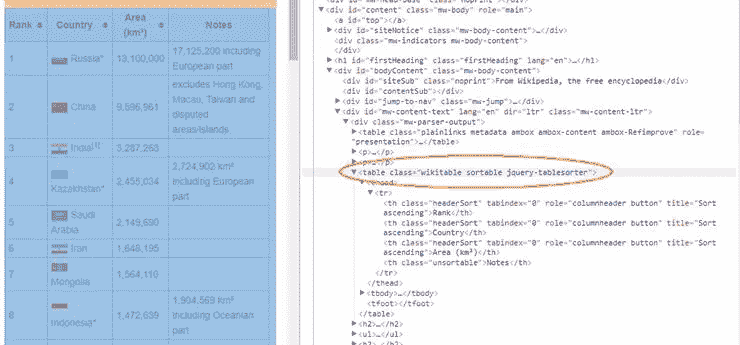
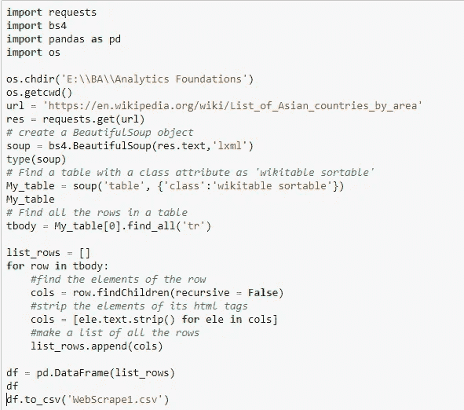
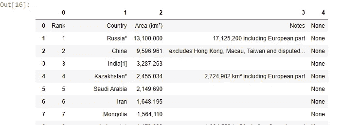
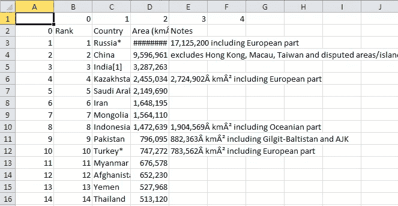

# 使用 python 和 BeautifulSoup 进行网页抓取

> 原文：<https://medium.com/analytics-vidhya/web-scraping-with-python-using-beautifulsoup-b6e16850c268?source=collection_archive---------18----------------------->

## 网页抓取简介

网络抓取是一种用于从网站提取大量数据的技术，通过这种技术，数据被提取并以表格(电子表格)格式保存到您计算机中的本地文件或数据库中。这种技术主要关注于将 web 上的非结构化数据(HTML 格式)转换成结构化数据(数据库或电子表格)。网页抓取也称为屏幕抓取、网页采集或网页数据提取。

大多数网站显示的数据只能使用网络浏览器查看。它们不提供保存该数据的副本以供个人使用的功能。唯一的选择是手动复制和粘贴数据，这是一项非常繁琐的工作，可能需要几个小时甚至几天才能完成。网络抓取是自动化这一过程的技术，因此网络抓取程序将在很短的时间内执行相同的任务，而不是手动从网站复制数据。

一个网页抓取程序会根据你的要求自动从网站的多个页面加载和提取数据。它可以是为特定网站定制的，也可以配置为适用于任何网站。只需点击一个按钮，您就可以轻松地将网站中的数据保存到您电脑中的文件中。一旦收集并以结构化且有意义的格式存储，这些数据可用于执行分析并获得有意义的见解。

## 刮擦规则

1.  在你刮之前，你应该检查网站的条款和条件。请仔细阅读关于合法使用数据的声明。通常情况下，你搜集的数据不应该用于商业目的。
2.  不要用你的程序过于激进地从网站请求数据(也称为垃圾邮件)，因为这可能会破坏网站。确保你的程序以合理的方式运行(比如像人一样运行)。每秒请求一个网页是一个好习惯。
3.  网站的布局可能会不时改变，所以请确保重新访问该网站，并根据需要重写您的代码。

## 抓取网页前要做的一些检查

在我们抓取一个网站之前，我们需要看一下他们的 robots.txt，这个文件告诉我们网站是否允许抓取。要找到 robots.txt，请键入基本 URL 并添加“/robots.txt”。例如，如果我们想抓取 apartments.com，在网址框中输入[https://www.apartments.com/robots.txt](https://www.apartments.com/robots.txt)。如果 robots.txt 允许完全访问，则如下所示:

**用户代理:*
不允许:**

如果 robots.txt 阻止所有访问，则它包含以下内容:

**用户代理:*
不允许:/**

如果 robots.txt 提供了部分访问权限，则它包含以下内容，其中 section 代表不被爬网的部分:

**用户代理:*
不允许:/section/**

在 apartments.com 的情况下，robots.txt 包含以下内容，截至今天:#确保 UTF-8 无签名-无 BOM

**用户代理:*
不允许:/services/**

网站地图:[【https://www.apartments.com/sitemapindex.xml.gz】T4](https://www.apartments.com/sitemapindex.xml.gz)

这意味着我们可以抓取网站上的所有部分，除了网址中有 apartments.com/services/的部分。

## HTML 基础

在开始编写代码之前，让我们先了解 HTML 的基础知识。

< html >
<头></头>
<体>
< h1 >首刮</h1>

Hello World

<体>
< /html >

这是 HTML 网页的基本语法。每个<tag>服务网页内的一个块:</tag>

1.  : HTML 文档必须以类型声明开头。
2.  HTML 文档包含在和之间。
3.  HTML 文档的元和脚本声明在和之间。
4.  HTML 文档的可见部分在和标签之间。
5.  标题由

    # 到

    ###### 标签定义。

6.  段落由

    标签定义。其他有用的标签包括用于超链接的，用于表格的

    ，用于表格行的，以及用于表格列的

    | 。 |

此外，HTML 标签有时带有 id 或 class 属性。“id”属性为 HTML 标记指定唯一的 id，并且该值在 HTML 文档中必须是唯一的。“class”属性用于为具有相同类的 HTML 标记定义相同的样式。我们可以利用这些 id 和类来帮助我们定位我们想要的数据。

## 使用的包和工具

web 抓取没有通用的解决方案，因为每个网站上存储数据的方式通常是特定于该网站的。事实上，如果你想收集数据，你需要了解网站的结构，或者构建自己的解决方案，或者使用高度可定制的解决方案。然而，有许多软件包为您做了最多的工作。根据您的编程技能和您的预期用例，您可能会发现不同的包或多或少有些用处。

**美丽的声音和请求**

**BeautifulSoup** 是一个 Python 库，用于从 HTML 和 XML 文件中提取数据。它与您喜欢的解析器一起工作，提供导航、搜索和修改解析树的惯用方式。它通常为程序员节省数小时或数天的工作。除此之外，您还需要一个请求库来获取 URL 的内容。

【BeautifulSoup 是如何工作的？

首先，我们使用请求库获取 URL 的内容。它返回一个类型为**‘requests . models . response’**的对象

现在，我们将把这个类型为**‘requests . models . response’**的对象转换成一个**‘beautiful soup’**对象。

以下是导航该数据结构的一些简单方法:

## 使用 Python 对表进行 Web 抓取的示例

**使用请求和美化组**

1.  首先，我们将导入请求库。
2.  然后，我们分配网站的链接，通过该链接我们将抓取数据，并将其分配给名为“url”的变量。
3.  **请求获取(网址)。text** 将 ping 一个网站并返回该网站的 HTML。
4.  我们首先读取给定网页的源代码，并使用“BeautifulSoup”函数创建一个 BeautifulSoup (soup)对象。
5.  然后，我们检查所有表格内容的 HTML 脚本，即我们打算在类“Wikitable Sortable”下提取的国家名称。

6.然后，我们在表的所有行上迭代一个循环，去掉 html 标记的元素，并将其转换为表中所有行的列表。

7.然后，我们使用 **pandas** 库将这个列表转换成数据帧。

8.最后，我们将这个数据帧输出到一个 CSV 文件中。

**刮码**

**数据帧**

**CSV 文件**

