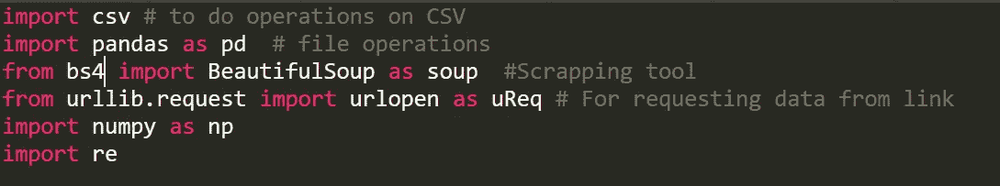
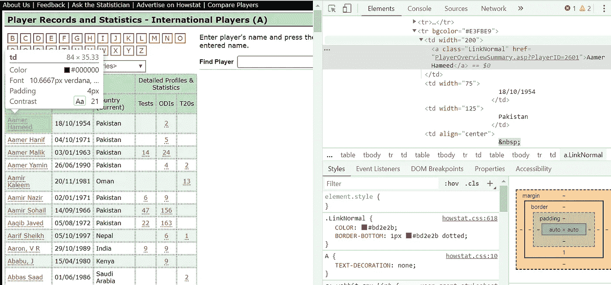
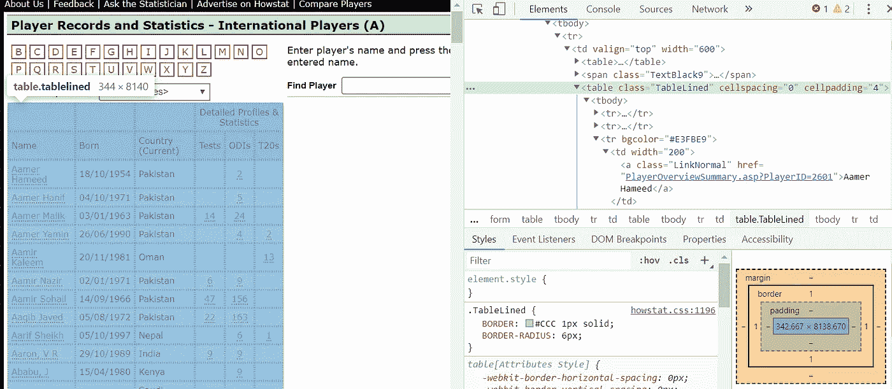
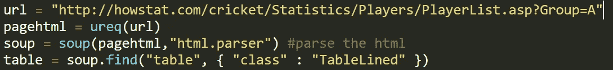
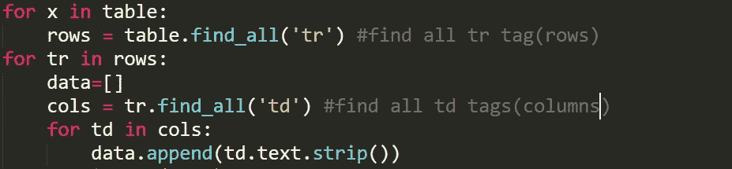
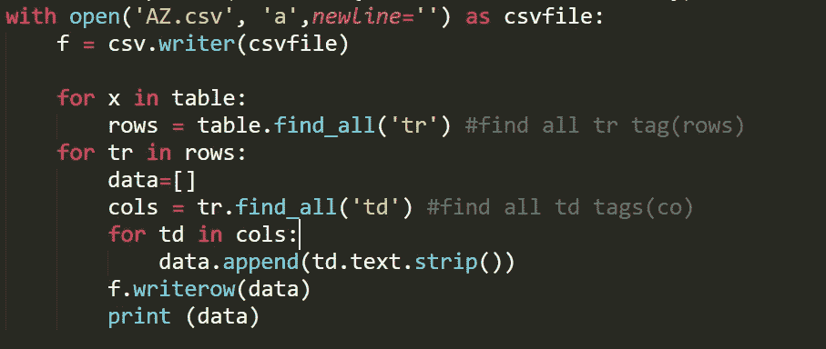
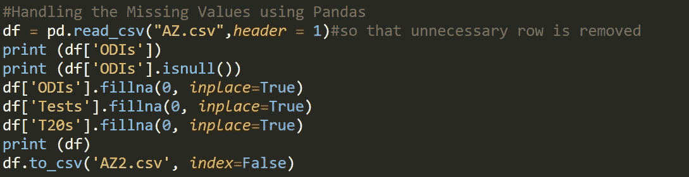

# Web 废弃来自 HowStat 的 Cricket ODI 数据并预处理数据第 1 部分

> 原文：<https://medium.com/analytics-vidhya/web-scrapping-cricket-odi-data-from-howstat-and-preprocessing-the-data-part-1-a0353fc1bf3b?source=collection_archive---------0----------------------->


C 佝偻病是我最喜欢的运动之一(虽然我不能玩它来保命)。由于**世界杯**日益临近，我相信数百万板球球迷正试图预测谁将把板球的荣耀带回家。我曾为在 iplpredictormatches.pythonanywhere.com**举行的[**印度 20 板球联赛 IPL 进行过一些预测。我也希望为世界杯制造类似的预测机。而且，本文涵盖了这一过程的第一步—数据收集阶段。**](http://iplpredictormatches.pythonanywhere.com)**

> 数据收集阶段是一项任务，可能会占用任何项目总时间的 70%到 80%。为了收集数据，我将使用网络抓取，因为所有主要的板球数据都在网上，我们可以很容易地通过网络抓取来访问它。HowStat 是一个优秀的结构化板球统计网站，我将在本文中使用它。另一个很好的选择是 espncricinfo.com。

对于这篇文章，我将只执行两个任务 **—**

1.  **查找所有参加过 ODI 比赛的玩家**
2.  找出所有球员在每一年的分数，以及他们在那一年打了多少场比赛。

让我们从第一个任务开始。对于 web 报废，我们需要首先导入以下基本库:

文件名:scrapping.py



```
import pandas as pd  # file operations
from bs4 import BeautifulSoup as soup  #Scrapping tool
from urllib.request import urlopen as ureq # For requesting data from link
import numpy as np
import re
```

接下来，我们将使用 Beautiful Soup 编写 web 抓取代码:

对于 URL，我去了 HowStat 网站，并决定首先获取从 A 开始的带有字母表的球员的数据——因为他们提供了不同组的球员的名字的起始字符。为简单起见，我们先取字符 a。

于是，网站网址为[http://howstat . com/cricket/Statistics/Players/player list . ASP？Country=ALL & Group=A](http://howstat.com/cricket/Statistics/Players/PlayerList.asp?Country=ALL&Group=A) 。转到这个网站链接，按 Ctrl+Shift+I 检查 HTML 代码。通过这个，你就可以了解所需数据在 HTML 代码中的位置。这一点很重要，因为我们将通过 HTML 代码进行处理。接下来，由于我们需要所有可见玩家的数据，我们有两个选择。

1.  单独获取每个数据。
2.  拿走整张桌子。

显然，第二个想法更有吸引力，需要的代码也更少。



为此，我们需要在 HTML 代码中查看该表，并找到 class 属性的内容，以便我们的代码可以唯一地找到它。



上图中的 table.tablelined 显示，对于 table 标签，我们将 class 属性值设置为 tablelined。

因此，我们的代码变成了:



```
url = "[http://howstat.com/cricket/Statistics/Players/PlayerList.asp?Group=](http://howstat.com/cricket/Statistics/Players/PlayerList.asp?Group={)A"
pagehtml = ureq(url) #opening the URL
soup = soup(pagehtml,"html.parser") #parse the html
table = soup.find("table", { "class" : "TableLined" })
```

现在，我们需要访问 Table 变量中这个表的各个单元格。我们需要两个 for 循环—一个遍历行，另一个遍历列。我们将把这些数据存储在新的变量数据中。



```
for x in table:
    rows = table.find_all('tr') #find all tr tag(rows)
for tr in rows:
    data=[]
    cols = tr.find_all('td') #find all td tags(columns)
    for td in cols:
        data.append(td.text.strip()) 
```

让我们将这些数据保存在 CSV 文件中。所以，我们对代码的修改产生了:



```
with open('AZ.csv', 'a',newline='') as csvfile:
    f = csv.writer(csvfile)for x in table:
        rows = table.find_all('tr') #find all tr tag(rows)
    for tr in rows:
        data=[]
        cols = tr.find_all('td') #find all td tags(co)
        for td in cols:
            data.append(td.text.strip()) 
        f.writerow(data)
        print (data)
```

注意:这里我们使用了 append，即“a”作为操作符，这样每当我们需要添加新数据时，我们以前的数据不会被删除。

如果您检查创建的 CSV 文件，您将从表中获得所有数据。

接下来，让我们对这些数据进行预处理。

如果您观察 CSV 文件，在应该出现“0”或“null”的区域，我们什么也没有。

因此，让我们用“0”替换丢失的值。为此，我们使用熊猫图书馆。

在这种情况下，我们首先读取 csv 文件，然后使用 isNull()方法获取所有缺失的位置。True 意味着该值为 Null。

之后，我们简单地用“0”替换空值。

代码如下:



```
df = pd.read_csv("AZ.csv",header = 1)
# Header is 1 so that unnecessary row is removed
print (df['ODIs'])
print (df['ODIs'].isnull())
df['ODIs'].fillna(0, inplace=True)
df['Tests'].fillna(0, inplace=True)
df['T20s'].fillna(0, inplace=True)
print (df)
df.to_csv('AZ2.csv', index=False)
```

现在我们只为字母表 A 的玩家编写了这段代码。

让我们也遵循其他玩家的代码。代码中唯一的变化是在 URL 中，组标识符变成了 A，B，C…z。

因此，我们现在将把整个代码放在一个函数中，使用字母的 ASCII 值，并把它放在 URL 中。

例如，A 为 65，B 为 66，C 为 67 等等。

查看新代码:

```
import csv # to do operations on CSV
import pandas as pd  # file operations
from bs4 import BeautifulSoup as soup  #Scrapping tool
from urllib.request import urlopen as ureq # For requesting data from link
import numpy as np
import redef scrap(x):
    global soup
    x = chr(x)#to change integer into characterurl = "[http://howstat.com/cricket/Statistics/Players/PlayerList.asp?Group=](http://howstat.com/cricket/Statistics/Players/PlayerList.asp?Group=A){}".format(x)
    pagehtml = ureq(url)
    soup = soup(pagehtml,"html.parser") #parse the html
    table = soup.find("table", { "class" : "TableLined" })
    with open('AZ.csv', 'a',newline='') as csvfile:
        f = csv.writer(csvfile)for x in table:
            rows = table.find_all('tr') #find all tr tag(rows)
        for tr in rows:
            data=[]
            cols = tr.find_all('td') #find all td tags(columns)
            for td in cols:
                data.append(td.text.strip()) 
            f.writerow(data)
            print (data)#Handling the Missing Values using Pandas
    df = pd.read_csv("AZ.csv",header = 1)#so that unnecessary row is removed
    print (df['ODIs'])
    print (df['ODIs'].isnull())
    df['ODIs'].fillna(0, inplace=True)
    df['Tests'].fillna(0, inplace=True)
    df['T20s'].fillna(0, inplace=True)
    print (df)
    df.to_csv('AZ2.csv', index=False)
```

现在，我们将通过给定值来调用 **scrap()** 函数。

例如，让玩家使用字母 B:

```
scrap(66)
```

随后，我们可以对所有的字母进行这样的操作，球员数据将被附加到 CSV 文件中。

注意:我们有两个 CSV 文件—

1.  AZ.csv —包含原始数据。
2.  AZ2.csv 包含预处理和清理的数据。

现在让我们找出至少参加过一次 ODI 比赛的球员。

同样，对于测试和其他格式也可以这样做。

代码如下:

4539 是玩家总数。

文件名:odiplayers.csv

```
import csv
with open('AZ2.csv') as csvDataFile:
    data=list(csv.reader(csvDataFile))
#converting the data to list so we can access it easily
    print ("The Players who Played ODI and the no. of times they played are:")
    print("-------------------------------------------------------")
    for i in range(1,4539):

      if data[i][4]!= "0.0":
        print(data[i][0],data[i][4])
```

在第二部分，我将解决第二个问题，即**找到所有球员每年的分数，以及他们在那一年打了多少场比赛。**