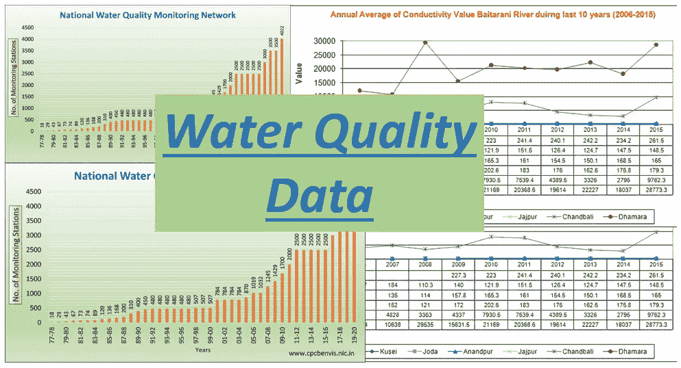

# 收集水质数据的网页抓取工具

> 原文：<https://medium.com/analytics-vidhya/web-scrapping-tool-to-collect-water-quality-data-3591fe8bc8bc?source=collection_archive---------10----------------------->



数据收集是数据分析过程中的第一步，也是最重要的一步。很多时候，人们会问收集的数据是第一手的还是第二手的。术语“原始数据”是指您自己收集的数据，而不是您在另一方最初记录后收集的数据。原始数据是直接从来源获得的信息。你将会是第一个使用这些数据的人。

从根本上说，收集不同类型的数据有不同的技术。但总的来说，大多数时候，遵循以下五个步骤。

1.确定你想收集什么信息
2。设定数据收集的时间表
3。确定你的数据收集方法
4。收集数据
5。分析数据并实施您的发现

在我的工作中，我一直在寻找印度班加罗尔市某个地表水体的水质数据。对于原始数据收集，第一步是确定水质参数，然后建立 IOT 系统。这个故事不是为了收集原始数据。在我继续收集二次数据之前，请观看下面的视频，它解释了基于 IOT 的气象监测系统。同样，对于水质监测，可以使用 arduino、ESP 8266 和传感器(如 PH 值、温度、溶解氧、超声波传感器)构建 IOT 系统。

对于次要数据收集，我使用 python 脚本从主要来源获取数据。卡纳塔克邦污染控制委员会监测卡纳塔克邦的空气、水和环境。主要城市收集的数据公布在他们的网站上。历史数据也可以从电路板上收集。

1.  导入必要的 python 库。

```
import os.path
from requests import get
from requests.exceptions import RequestException
from contextlib import closing
import time
import re
```

2.为错误记录、评估 URL 的连接性以及重试连接定义函数。

```
def log_error(e):
    print(e)

def is_good_response(resp):
    content_type = resp.headers['Content-Type'].lower()
    return (resp.status_code == 200 and content_type is not None and content_type.find('html') > -1)def retry(url) :
    cont = None
    for i in range(1,4) :
        time.sleep(10)
        try:
            with closing(get(url, stream=True)) as resp:
                if is_good_response(resp):
                    print(i," Retrying - Connected - ",url)
                    cont = resp.content
                    break
        except RequestException as e:
            log_error('Error during requests to {0} : {1}'.format(url, str(e)))
    return cont
```

3.一旦与 URL 的连接正常，就可以访问网页的完整内容。这可以如下实现。

```
def get_url_content(url):
    try:
        with closing(get(url, stream=True)) as resp:
            if is_good_response(resp):
                print("Connected - ",url)
                return resp.content
            else:
                cont = retry(url)
                return cont
    except RequestException as e:
        log_error('Error during requests to {0} : {1}'.format(url, str(e)))
        return retry(url)
```

4.现在，我需要一个函数，以便在获取和处理数据后写入 csv 文件。下面的函数是一个通用的函数，可以用来在附加模式下向文件中写入文本。

```
def write_file(text):
    try :
        f = open(datafile,'a')
        f.write(text)
    except :
        log_error('Error during writing to a file')
        time.sleep(10)
        try :
            f = open(datafile,'a')
            f.write(text)
        except :
            log_error('Second time - Error during writing to a file')
    finally :
        f.close
```

5.下面的代码通过调用上面定义的函数来完成剩下的工作，比如获取数据、处理内容和写入文件。从网站上获取的内容将是字节类型的，它需要解码为文本。内容包括各种水质参数和各种站点的数据。以下代码仅考虑 17519 站的数据。

```
datafile = "water_quality_data.csv"
url = "[http://bwssb.aaxisnano.com/services/getBwssbStationData.aspx](http://bwssb.aaxisnano.com/services/getBwssbStationData.aspx)"    content = get_url_content(url)data = content.decode()
data_1 = extract_between('[',']',data)lakes = data_1.split('{"dt_timestamp":')
flag = 0
for lake in lakes :
    parameterText = lake.split(',')
    waterqualitylake = ""
    for i, paraText in enumerate(parameterText) :
        if i == 0 and len(paraText) > 0 :
            datetext = re.findall('"([^"]*)"',paraText)
        elif i == 1:
            values = paraText.split(':')
            stationid = values[1:]
            if stationid != ['17519'] :
                flag = 1
                break
            else:
                waterqualitylake += str(datetext) + ","
                flag = 0
        elif i > 1 and flag == 0 :
            print(i,paraText)
            values = paraText.split(':')
            value = values[1:]
            waterqualitylake += str(value) + ","
    if flag == 0 and len(parameterText) > 1:
        waterqualitylake += "\n"
        write_file(waterqualitylake)
```

上述脚本必须计划定期运行。这可以通过各种方式实现，这里我提供两种方法

1.  在服务器上复制脚本，并计划 cron 作业或通过 windows 计划程序。详情请参考这篇文章。

[](https://datatofish.com/python-script-windows-scheduler/) [## 如何使用 Windows 调度程序调度 Python 脚本

### 在本教程中，我将向您展示使用 Windows 调度程序调度 Python 脚本的步骤。这种类型的运动是…

datatofish.com](https://datatofish.com/python-script-windows-scheduler/) 

2.在 pythonanywhere 上安排 python 脚本。使用免费的 pythonanywhere 帐户，无法从其环境访问外部网站。所以需要最低限度的付费订阅。

[](https://pythonhow.com/how-schedule-python-task-pythonanywhere/) [## 在 PythonAnywhere - PythonHow 上调度 Python 任务

### 你有没有想过如何让 Python 脚本在每天睡觉的特定时间运行？也许你…

pythonhow.com](https://pythonhow.com/how-schedule-python-task-pythonanywhere/) 

感谢您的阅读。