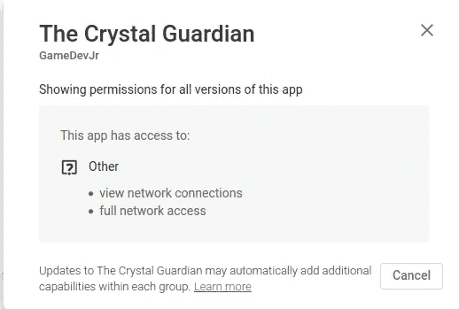
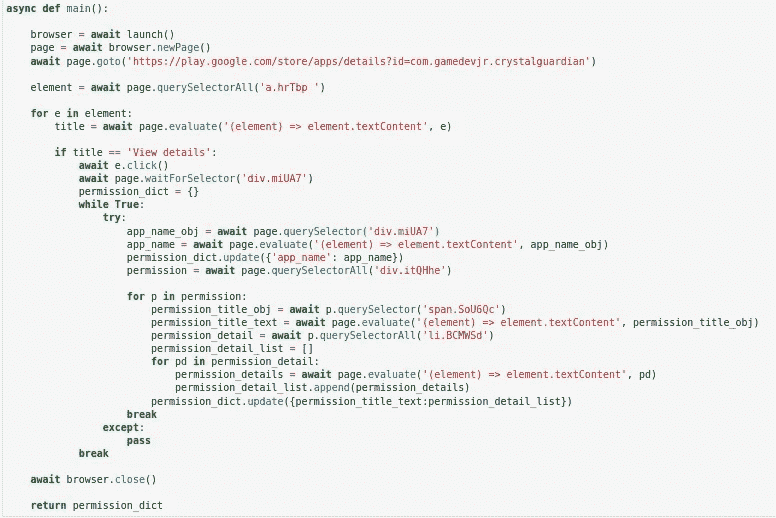
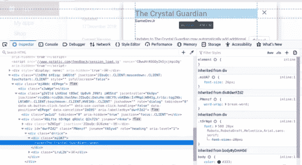
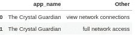

# 使用 pyppeteer 进行网页抓取(playstore 权限)

> 原文：<https://medium.com/analytics-vidhya/web-scrapping-using-pyppeteer-and-jupyter-notebook-69b07a6f914c?source=collection_archive---------2----------------------->

> “得到你想要的一切。保证 100%满意。从任何**网站**抓取并提取数据

作为数据爱好者，有时我们需要一些数据集，其中的信息来自网站页面并对其进行分析，这种需求的一个答案是 web 抓取。网络抓取是关于创造一个脚本，从你想要的网站上 100%检索你需要的信息。

我通常使用 Python 来转换和分析数据，我认为使用这种语言对我来说更舒服。BeautifulSoup 是我用来抓取网页的框架之一，所有的信息都包含在 HTML 页面中。遗憾的是，当我在网页上点击按钮后需要信息时，该页面会打开一个模式，例如，play store 应用程序页面上的权限模式，这种情况无法解决。



Cyrstal Guardian (Playstore 应用程序)—许可模式

在这篇文章中，我将给出一个简单的教程，如何使用 pyppeteer([https://github.com/miyakogi/pyppeteer](https://github.com/miyakogi/pyppeteer))在 play store(水晶卫士 app)抓取权限模式

Pyppeteer 是来自 puppeteer 的 python 版本，puppet eer 是 Google 开发的用于 Chrome / Chromium 的控制和自动化的 javascript 库。Pyppeteer 的一些特性允许我们几乎完全控制一个 Chrome/Chrome；实时 DOM 分析、打开标签、连接到正在运行的浏览器、执行 Javascript 和下载 Chromium。

# **安装**

使用画中画:

```
python3 -m pip install pyppeteer
```

从 github 安装:

`python3 -m pip install -U git+https://github.com/miyakogi/pyppeteer.git@dev`

# 库导入

```
import asyncio
from pyppeteer import launch
import pandas as pd
```

# 刮擦功能



python 中的抓取函数代码

这段代码打开 playstore 应用程序页面到我们已经定义的 url，然后我抓取元素以找到“hrTbp”类，这是 play store 的一个框附加信息，当元素文本内容是“查看详细信息”时，它将单击它以打开模式，并使用查找标题元素等待模式完全打开，然后执行下一段代码。

函数 *querySelector()* 和 *querySelectorAll()* 是 pyppeteer 的 page 类的一部分，用于从页面中检索元素，从该元素中获取文本。我们使用 *element.textContent.* 我通常会检查页面中的元素，以了解类名和元素，例如 **div.miUA7** 是“水晶守护者”标题元素。



权限模式下应用程序标题的 HTML 元素

使用这段代码调用函数，它将返回一个字典。你也可以在得到结果后将其转换成数据帧。

```
result = await main()
```



结果的数据框架

# 结论

Web 抓取并不是一件困难的事情，它是一种创造性的活动，你可以尝试混合和匹配有效和正确的代码，并在 HTML 页面代码中找到一个元素和类来获取信息，当你需要很多信息并需要自动化时，这真的很有帮助。Pyppeteer 有 api 参考，你可以在[https://miyakogi.github.io/pyppeteer/reference.html](https://miyakogi.github.io/pyppeteer/reference.html)获得本教程之外的更多信息。本教程只展示了如何使用一个打开的浏览器进行抓取，但是 Pyppeteer 还支持另一种方式来使用 pydash 进行多进程抓取和分块。

我要感谢 pyppeteer 的作者，他们用 python 实现了抓取，还要感谢我的学妹允许我用他们的应用程序(Crystal Guardian)做一个例子。